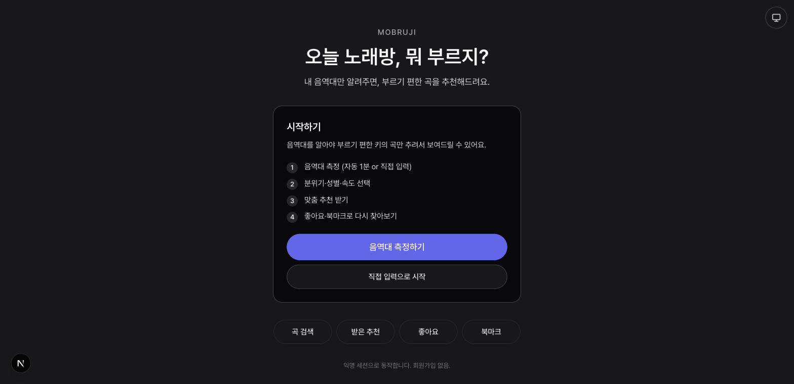

# 모부르지 (mobruji)

노래방에서 부를 곡을 음역대와 성별, 분위기로 추천해 주는 서비스입니다. 다만 이 저장소를 만든 이유는 서비스 자체보다 **개발 방식**에 있습니다.

**3주 반 동안 PR 1,069건 중 99.1%를 AI 에이전트가 작성했고, 사람은 릴리스 승인만 맡았습니다.** 에이전트에게 실제 제품 개발을 맡기려면 무엇이 필요한지 직접 만들어 보고 싶어서 시작한 프로젝트입니다.



## 무엇을 만들었나요

사람이 매번 지시하는 대신, 오케스트레이터 세션 하나가 역할별 서브에이전트에게 작업을 위임하고 PR 머지까지 무인으로 도는 구조를 만들었습니다. **사람이 승인하는 지점은 릴리스 하나만 남겨 두었습니다.** 사람 리뷰를 없앤 것이 아니라, 사람의 역할을 코드 검토에서 규칙 설계와 게이트 검증으로 옮겨 보는 실험이었습니다.

```
지시 투입(Discord) → 우선순위 큐 적재 → dispatcher가 유휴 사이클에 배정
  → 역할 서브에이전트(be / fe / rev / plan / infra)가 각자 git worktree에서 작업
  → PR 생성 → 훅이 리뷰 대상으로 자동 등록
  → rev 에이전트 리뷰 → reviewed:claude 라벨
  → CI required check 통과 → 자동 squash merge
```

역할마다 작업할 수 있는 파일 경로와 손대면 안 되는 영역, 통과해야 할 품질 게이트를 정해 두었습니다. 예를 들어 `be` 에이전트는 백엔드 구현만 맡고 문서와 인프라는 건드리지 않으며, 푸시 전에 `checkstyleMain spotlessCheck test`를 통과해야 합니다. `rev` 에이전트는 리뷰만 하고 구현은 하지 않습니다.

## 이렇게 돌았습니다

| 항목 | 값 |
| --- | --- |
| 기간 | 2026.05.20 ~ 2026.06.12 |
| PR | 1,069건 (머지 1,038건) |
| 에이전트가 작성한 PR | 1,059건 (99.1%) |
| 리뷰 게이트 통과 | 746건 (머지분의 71.9%) |
| 릴리스 | 태그 20개 |
| 문서 | 187개 39,355줄 (ADR 29건, Feature Spec 127건) |
| 하네스 코드 | 오케스트레이터, Discord 데몬, 큐, 상태 관리 등 12종 |

## 여기서 배운 것

**규칙을 문서에 적어 두는 방식에는 한계가 있었습니다.** 사고가 날 때마다 규칙을 덧붙였는데도 같은 위반이 계속 반복됐습니다. 직접 세어 보니 최근 50커밋 가운데 32%가 앞선 문제를 뒤늦게 메우는 커밋이었고, 서브에이전트가 작업 라벨을 제대로 붙인 경우는 43건 중 7건에 그쳤습니다.

그래서 핵심 규칙 20개를 놓고 지금 무엇이 강제하고 있는지, 얼마나 중요한지를 하나씩 대조해 보았습니다. 그 결과 30%가 여전히 모델의 기억에만 기대고 있다는 것을 확인했습니다. 이후에는 강제 수단을 아래 순서로 세우고, **같은 규칙을 두 번 정정하게 되면 코드 강제로 올리는 기준**을 두었습니다.

```
system prompt → 훅 → wrapper 스크립트 → CI workflow → cron 가시화 → 메모리
```

기억에 기대던 규칙을 훅과 스크립트, CI처럼 실제로 실행되는 장치로 옮긴 사례입니다.

| 반복되던 문제 | 옮긴 곳 |
| --- | --- |
| 완료 통지를 받고도 다음 작업을 위임하지 않음 | `agent-launch-wrapper.sh`로 한 명령에 묶음 |
| 프롬프트에 있어야 할 식별자를 지어냄 | 파일로 전달해 모델이 만들 여지를 없앰 |
| 작업 도중 사용자 입력을 기다리며 멈춤 | 에이전트 정의에 명시하고 system prompt로도 주입 |
| 리뷰 게이트를 우회한 머지 | CI required check |
| 상태 파일을 손으로 고치다 생긴 손상 | 원자적 쓰기 헬퍼와 검증 스크립트 |
| PR을 만들고 리뷰 등록을 빠뜨림 | PostToolUse 훅 |

판단 근거는 ADR 29건으로 남겨 두었습니다. 여기서 얻은 결론을 처음부터 적용해 다시 만든 것이 **[도치](https://github.com/goohong/dochi)** 입니다. 규칙 문서를 4,343줄에서 968줄로 줄였고, 리뷰 게이트 통과율은 71.9%에서 95.7%로 올랐습니다.

## 구조

```
mobruji/
├── backend/          Spring Boot
├── web/              Next.js
├── tools/            하네스 (오케스트레이터, Discord 데몬, 큐, 상태 관리)
├── docs/
│   ├── ai-harness/   에이전트 작업 규칙과 운영 런북
│   ├── decisions/    ADR
│   └── features/     Feature Spec
├── .claude/agents/   역할별 서브에이전트 정의
└── CLAUDE.md         세션 시작 시 자동으로 읽히는 레포 룰
```

하네스가 궁금하시다면 이 세 문서를 먼저 보시면 좋습니다.

- [`docs/ai-harness/01-harness-spec.md`](./docs/ai-harness/01-harness-spec.md) 전체 구조
- [`docs/ai-harness/13-memory-and-enforcement.md`](./docs/ai-harness/13-memory-and-enforcement.md) 강제 수단의 순서와 승격 기준
- [`docs/ai-harness/03-quality-gates.md`](./docs/ai-harness/03-quality-gates.md) 품질 게이트

## 현재 상태

운영은 2026.06.12에 멈췄습니다. 워크플로 24개는 [`.github/workflows_archive/`](./.github/workflows_archive)에 그대로 보존해 두었습니다. 백엔드 설계 판단이 궁금하시면 ADR [0008(계층 검증)](./docs/decisions/0008-archunit-layer-verification.md), [0011(세션 인증 정책)](./docs/decisions/0011-session-bound-auth-policy.md), [0013(세션 식별자 TTL 회전)](./docs/decisions/0013-sessionid-ttl-rotation.md)을 보시면 좋습니다.

## 스택

Spring Boot 3.5.12 / Java 21 / Gradle, Next.js App Router / TypeScript / Tailwind, MySQL 8.4

## 로컬 개발

```bash
docker compose up -d                                     # MySQL
cd backend && ./gradlew bootRun --args='--spring.profiles.active=local'
cd web && npm install && npm run dev
```

## License

[GNU Affero General Public License v3.0 or later](./LICENSE)
