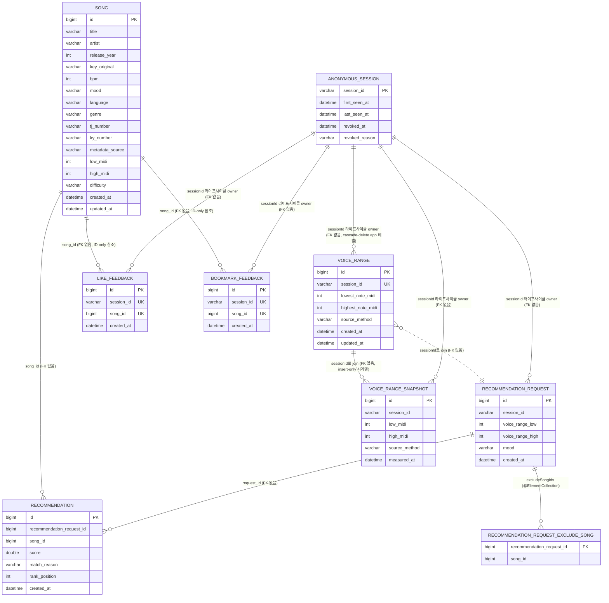

# Domain Model

> ⚠️ 현재 **스켈레톤**입니다. 도메인이 확정되면 §4 유비쿼터스 랭귀지부터 채워 넣고, 엔티티·ERD는 첫 구현 PR과 함께 같이 갱신합니다.

## 1) 목적
- mobruji 도메인의 **공통 어휘**와 **불변식**을 한 곳에 정의해 코드·문서·UX 사이의 용어 불일치를 줄인다.
- 새 기능 구현 전 반드시 이 문서를 먼저 갱신한다 (`01-harness-spec.md §5`).

## 2) 범위 가설 (초기)
- **사용자(User)** — 노래방에서 부를 곡을 찾는 사람
- **음역대(VoiceRange)** — 사용자의 음역 (최저·최고 음 또는 옥타브 기반 분류)
- **곡(Song)** — 추천 대상 단위. 메타데이터(키, 음역, 장르, BPM, 분위기, 출시 연도, 노래방 곡번호 등)
- **추천 요청(RecommendationRequest)** — 사용자가 입력하는 컨텍스트 (음역대, 성별, 분위기, 상황)
- **추천 결과(Recommendation)** — 요청에 대한 곡 리스트와 매칭 근거

## 3) 바운디드 컨텍스트 가설

| 컨텍스트 | 책임 |
|---|---|
| `user` | 회원, 인증, 사용자 프로필 |
| `voice` | 음역대 진단, 음역 데이터 관리 |
| `song` | 곡 카탈로그, 메타데이터, 외부 음원 API 연동 |
| `recommendation` | 추천 알고리즘, 요청→결과 변환 |
| `feedback` | 사용자 시그널(Like/Bookmark) 수집. v0.2에서는 추천 가중치에 영향 없음 (recommendation-history-and-feedback.md PR B) |

> 1차 PoC는 user + voice + song + recommendation + feedback을 한 백엔드 모놀리스로 구현. 분리는 트래픽/팀 성장 시점에 재논의.
> `feedback`은 Like/Bookmark가 추천과 별도 관심사이고 v0.3+에 ML 시그널 소스로 확장될 여지가 있어 BC를 분리했다 (spec §5-1에서는 recommendation context에 두는 안도 검토했으나 분리 선택, 결정 로그는 본 PR).

## 4) 유비쿼터스 랭귀지 (Ubiquitous Language)

| 한국어 | 영어 (코드) | 정의 |
|---|---|---|
| 음역대 | VoiceRange | 사용자가 부를 수 있는 음의 최저~최고 범위 (현재 값) |
| 음역 스냅샷 | VoiceRangeSnapshot | 음역 측정 시계열 행 (insert-only). voice-range-progress spec — "발전 인지" 위해 변경 이력 누적. 결정성 영향 없음 (추천 입력 미사용) |
| 키 | Key | 곡의 조성 (예: C, G, Am) |
| 곡 음역 | SongRange | 곡 자체의 음역 범위 |
| 추천 | Recommendation | 사용자 컨텍스트 기반 곡 매칭 결과 |
| 분위기 | Mood | 추천 입력 중 정성적 요소 (예: 신남, 잔잔함) |
| 가창 난이도 | Difficulty | 곡을 부르기 어려운 정도 (EASY/NORMAL/HARD). 곡 음역(`lowMidi`/`highMidi`)으로 자동 분류 (PR #96, 이슈 #77) |
| 음표명 | NoteName | MIDI note number의 과학적 음표 표기 (예: 60 → "C4"). fe `web/lib/notes.ts`와 동일 컨벤션 (sharp 표기) |
| 좋아요 | Like | 사용자가 곡에 남긴 긍정 시그널. sessionId 단위 toggle. **v0.2에서는 추천 가중치 비영향** (가중치 도입은 v0.3+ 별도 ADR) |
| 북마크 | Bookmark | 사용자가 곡을 다시 찾고 싶어 별도 큐에 담은 행위. Like와 분리 유지 (spec Q1 결정) |
| 익명 세션 | AnonymousSession | 익명 사용자의 sessionId 라이프사이클(최초/최근 활동, TTL 만료, revoke) 을 관리하는 엔티티. ADR-0013 + anonymous-session-lifecycle.md |
| 세션 회수 | SessionRevocation | sessionId 를 revoke 처리한 사실(시점 + 사유). reason enum: `TTL` / `USER_ROTATE` / `ACCOUNT_MERGE` |
| 세션 회전 | SessionRotation | 사용자가 명시적으로 현재 sessionId 를 폐기하고 새 sessionId 를 발급받는 행위. `POST /api/v1/sessions/rotate` |
| 계정 머지 | AccountMerge | v0.4 OAuth 로그인 시 익명 sessionId 의 누적 데이터(좋아요/북마크/음역대)를 가입 user 로 owner 치환하는 트랜잭션 (v0.4 spec 에서 정식 명세) |
| 사이클 launch thread id | CycleLaunchThreadId | sub-agent launch 시 `tools/agent-launch-wrapper.sh` 가 cycle forum 채널 (be/fe/rev/plan) 에 신설 또는 재사용하는 thread 의 Discord snowflake (18-20자리 정수 문자열). sub-agent 의 모든 진행 / 결과 push 의 단일 대상 (별 thread 생성 금지 — `actors/sub-agent.md §1-11` STRICT). 출처: cycle-forum-operation.md §5-3·§5-4 |
| launch thread 캐시 파일 | LaunchThreadCacheFile | wrapper ↔ nmae ↔ sub-agent 간 `CycleLaunchThreadId` 인계 채널. 파일 경로 = `~/.mobruji/last-launch-thread.txt`. wrapper 가 atomic write, sub-agent (`--auto-thread`) 가 read. 출처: cycle-forum-placeholder-guard.md (PR #1306) |
| placeholder thread id | PlaceholderThreadId | 정상 snowflake 가 아닌 임시값 (예: `99999`). 주로 테스트 fixture 가 fake curl mock 으로 박은 값이 production 파일에 오염되어 발생. `validate_snowflake` reject 대상 — `LaunchThreadCacheFile` 에 진입 시 sub-agent push 사일런스 사고 (4 갈래 가드 spec: cycle-forum-placeholder-guard.md F-1~F-6). 출처: PR #1306 |
| PR 격리 dev URL | DevPrIsolatedUrl (`dev_pr_isolated_url`) | PR 브랜치별 격리된 dev 환경 URL (ngrok / fly.io PR app / Vercel preview / 사내 reverse proxy path-based). 단일 NCP dev 서버 (`http://101.79.20.94/`) 에 develop tip 자동 deploy 하는 현 구조의 동시 deploy race 사고를 해소하기 위한 후보 인프라. 후보 spec `dev-pr-branch-deploy-isolation` (rev-direct-qa-extension.md §3 후보 A 단계 1 PR branch deploy 인프라 분리 후보). 격리 URL = rev 단계 1 e2e (PR 머지 전) 의 외부 검증 entrypoint. 출처: `docs/features/rev-direct-qa-extension.md §3 후보 A` + §8 Q2 |
| visual baseline | VisualBaseline | Playwright screenshot 의 reference 이미지 (`.png`). 페이지 × viewport × colorScheme (light/dark) 조합당 1 파일. CI 가 PR push 시 현재 화면을 캡처해 본 baseline 과 pixelmatch — diff > threshold (proposed 0.1%) 시 fail. 저장 매체 1차 도입 = git 직접 commit (누적 100 MB 도달 시 별 마이그레이션 ADR 트리거 LFS 전환). 갱신은 `npx playwright test --update-snapshots` 명시 PR 만 + PR body `## visual baseline update` 섹션 의무 (ADR-0026 §Decision 2 후보 a). 출처: `docs/features/visual-regression-ci.md §3-2` + ADR-0026 |
| baseline drift | BaselineDrift | `VisualBaseline` 의 의도된 또는 비의도된 변경. 의도된 drift (ADR-0018 swap / spec 화면 변경) 는 fe sub-agent 가 PR body `## visual baseline update` 섹션에 N 페이지 / 사유 명시 + baseline 갱신 commit. 비의도된 drift (회귀) 는 PR body 섹션 부재 + CI diff > 0.1% — rev sub-agent 가 `rev단계1: 🔴 시각 회귀 의심` 코멘트 + `reviewed:claude` 라벨 부착 차단. rev 자율 판단 표: `visual-regression-ci.md §3-4` SoT. 출처: `docs/features/visual-regression-ci.md §3-3·§3-4` + ADR-0026 §Decision 후보 (a) |
| admin 우회 머지 | AdminOverrideMerge | repo admin (owner) 이 `rev-gate` check 결과 / `reviewed:claude` 라벨 부재와 무관하게 GitHub branch protection 의 `enforce_admins: false` 또는 `main` branch protection 부재를 이용해 직접 머지하는 우회 경로. 2026-05-29 rev round 31 (PR #1318 사고 회고) 에서 노출 — 라벨 게이트가 prose 만으로 강제되어 admin 권한 사용 시 사후 정렬 가능했으나 머지 시점 evidence 가 0건. 차단 spec: `docs/features/rev-gate-required-check-enforcement.md §3-1` (gh API 로 `enforce_admins: true` 전환 + `main` branch protection 신설). 합법 우회 경로 = `EmergencyHotfixLabel` / `type:release` whitelist 만 허용. 출처: `docs/features/rev-gate-required-check-enforcement.md §1·§2-2` |
| rev-gate audit check | RevGateAuditCheck | 머지 commit 에 부착되는 post-merge audit check-run (`rev-gate-audit`). 신설 workflow `rev-gate-audit.yml` 가 `pull_request_target: types: [closed]` + `if: merged == true` trigger 로 실행하여 (a) `reviewed:claude` 라벨 부착 시각 ≤ mergedAt, (b) 통과 코멘트 (`✅ rev e2e PR pass` / `📝 rev no-op pass`) ≤ mergedAt, (c) `type:release` / `type:emergency-hotfix` whitelist 부착 — 셋 중 하나 만족 시 green, 셋 다 실패 시 failure + 사후 가시화 (DIGEST + issue + rev 단계 2 trigger). prose 머지 게이트가 admin override 로 우회됐을 때 evidence 박제 + 자동 follow-up 강제 메커니즘. 출처: `docs/features/rev-gate-required-check-enforcement.md §3-3` (workflow 본문 SoT 는 향후 별 spec `rev-gate-audit-workflow.md` 예정) |
| 우회 audit 이슈 | BypassAuditIssue | `RevGateAuditCheck` 가 failure 분류 시 자동 신설되는 GitHub issue (`audit:rev-gate-bypass` 라벨). issue body 박제 항목 = 머지된 PR 링크 / mergedAt / mergedBy / merge commit SHA / 부재했던 evidence 항목 (라벨 / 코멘트 / whitelist). nmae 가 다음 사이클 안에 본 issue queue 처리 — rev 단계 2 launch + 통과 시 issue close, 실패 시 revert PR 생성. `EmergencyHotfixFollowupIssue` 와 라벨이 다르다 (전자 = 합법 우회 사후 회귀, 후자 = 비합법 우회 evidence 부재). 출처: `docs/features/rev-gate-required-check-enforcement.md §3-3` |
| emergency-hotfix 후속 이슈 | EmergencyHotfixFollowupIssue | `EmergencyHotfixLabel` 부착 PR 이 머지된 직후 `RevGateAuditCheck` 의 whitelist pass 분기에서 자동 신설되는 GitHub issue (`audit:emergency-hotfix-followup` 라벨). issue body 박제 항목 = PR 링크 / mergedAt / mergedBy / merge commit SHA / PR body `## emergency-hotfix 사유` 섹션 grep 결과 / 사후 rev 단계 2 절차 cross-ref. nmae 가 다음 사이클 안에 rev 단계 2 launch → 통과 시 issue close + `rev-post-merge-pass` 라벨 부착, 실패 시 즉시 revert PR + 사용자 DIGEST + `regression:dev` 라벨. emergency-hotfix 가 rev 사이클 우회 후 회귀 미발견으로 production 사고 확대되는 경로 차단. 출처: `docs/features/emergency-hotfix-flow.md §3-3` + §5-4 시퀀스 [4]~[7] |
| emergency-hotfix 라벨 | EmergencyHotfixLabel | GitHub 라벨 `type:emergency-hotfix` (색상 `#D73A4A`). production endpoint 5xx / down 즉시 복구 / security 사고 (시크릿 유출 / 인증 우회 / XSS / CSRF / sandbox escape) 즉시 패치 / data integrity 사고 즉시 revert / CI build infra down 즉시 복구 — 4 가지 정당 사유 한정. 부착 시 `rev-gate.yml` whitelist 매칭 → workflow skip → 즉시 머지 가능. 부적합 사유 (단순 rev 대기 throughput / docs spec 만 / "내가 직접 검토했으니 충분") 사용 금지 — 라벨 부착 후 머지 시 audit hook 이 사용 빈도 카운트 → 월 임계치 초과 시 자동 회고 spec 트리거. PR body `## emergency-hotfix 사유` 섹션 의무 (사고 분류 / 시작 시각 / 사용자 impact 범위 / root cause 추정 / rollback 가능성 / 사후 rev 단계 2 실행 사이클). 출처: `docs/features/emergency-hotfix-flow.md §3-1·§3-2·§3-4` |
| emergency-hotfix 심각도 | EmergencyHotfixSeverity | `EmergencyHotfixLabel` 부착 PR body `## emergency-hotfix 사유` 섹션 의 사고 분류 enum — `production-down` / `security` / `data-integrity` / `ci-down` 4 값. 사후 audit issue body grep 대상 + 월간 사용 빈도 메트릭 분류 차원. `security` 분류는 추가 절차 (별 disclosure spec 후보) cross-ref. **본 spec scope 안 표현이 P0/P1/P2 가 아닌 4 분류 enum 임을 명시** — 사용자 명시 (P0/P1/P2 분류) 와 spec 본문 (`production-down` / `security` / `data-integrity` / `ci-down`) 차이는 `emergency-hotfix-flow.md §8 오픈 질문` 으로 추가 박제 후보 (severity 차원과 분류 차원 분리 필요 여부). 출처: `docs/features/emergency-hotfix-flow.md §3-4` PR body 섹션 enum |

> 코드/PR/문서에서 위 한국어 ↔ 영어 매핑을 일관 사용. 신규 용어는 이 표에 먼저 추가한 뒤 코드에 도입.

## 5) 엔티티

> 각 PR에서 신규 엔티티 도입 시 본 섹션과 §6 ERD를 같이 갱신한다.

### 5-1) `VoiceRange` (PR #16, voice-range-input.md)
| 필드 | 타입 | 제약 | 설명 |
|---|---|---|---|
| `id` | Long | PK, autoIncrement | 내부 식별자 |
| `sessionId` | String(64) | unique, not null | 익명 세션 식별자 (PoC 시 클라이언트 생성) |
| `lowestNoteMidi` | int | not null, 12~119 | 사용자 최저음 MIDI |
| `highestNoteMidi` | int | not null, 12~119, ≥ lowestNoteMidi | 사용자 최고음 MIDI |
| `sourceMethod` | enum | not null | `SELF_REPORT` / `OCTAVE_PICK` / `MIC_MEASURE` |
| `createdAt` | LocalDateTime | not null | |
| `updatedAt` | LocalDateTime | not null | |

- 불변식: `lowestNoteMidi ≤ highestNoteMidi`, MIDI 범위 [12, 119].
- 도메인 메서드: `static create(...)`, `updateRange(...)`.
- voice-range-input.md Q4 결정에 따라 sessionId 당 **최신 1건만** 보관(unique 제약 + service에서 createOrReplace).

### 5-2) `Song` (PR #17, song-metadata-source.md)
| 필드 | 타입 | 제약 | 설명 |
|---|---|---|---|
| `id` | Long | PK, autoIncrement | |
| `title` | String(200) | not null, not blank | |
| `artist` | String(200) | not null, not blank | |
| `releaseYear` | Integer | nullable | 출시 연도 |
| `keyOriginal` | enum `MusicalKey` | not null | 메이저 12 + 마이너 12 + UNKNOWN |
| `bpm` | Integer | nullable, 30~300 | |
| `mood` | enum `Mood` | nullable | 단일 (v1). 다중은 v2 |
| `language` | String(32) | nullable | ko/en/... |
| `genre` | String(32) | nullable | |
| `tjNumber` | String(16) | nullable | TJ 노래방 번호 |
| `kyNumber` | String(16) | nullable | 금영 노래방 번호 |
| `metadataSource` | enum `MetadataSource` | not null | MANUAL_SEED/EXTERNAL_API/USER_CONTRIBUTION/INFERRED |
| `lowMidi` | Integer | nullable | 곡 보컬 멜로디 최저음 (MIDI). 시드부터 적재. PR #96 |
| `highMidi` | Integer | nullable | 곡 보컬 멜로디 최고음 (MIDI). 시드부터 적재. PR #96 |
| `difficulty` | enum `Difficulty` | nullable | EASY/NORMAL/HARD. `lowMidi`/`highMidi` 둘 다 있으면 `Song.create()`에서 자동 분류. PR #96 |
| `createdAt`, `updatedAt` | LocalDateTime | not null | |

- 도메인 메서드: `Song.builder()` static factory (필드 다수로 빌더 사용).
- `Song.deriveDifficulty(int lowMidi, int highMidi)` static — fe `web/lib/difficulty.ts`와 1:1 룰 (HARD: high≥76 또는 span≥17, NORMAL: 71~75, EASY: <71).
- 시드: `classpath:/songs-seed.json` 30곡, `SongSeedLoader`(`@Profile("!test")`)가 부팅 시 idempotent 적재. 시드 각 곡에 `lowMidi`/`highMidi`가 채워져 있어 적재 시 difficulty 자동 분류된다.
- `SongRange`는 별 VO로 두지 않고 `Song` 엔티티의 `lowMidi`/`highMidi` 두 필드로 단순화 (spec Q3 보류 결정의 후속 진전).

### 5-3) `RecommendationRequestEntity`, `Recommendation` (PR #19, recommendation-algorithm-v1.md)

**`RecommendationRequestEntity`** — 추천 요청 영속화 단위.
| 필드 | 타입 | 제약 | 설명 |
|---|---|---|---|
| `id` | Long | PK | |
| `sessionId` | String(64) | not null | 익명 사용자 식별자 (VoiceRange와 동일) |
| `voiceRangeLow`, `voiceRangeHigh` | int | not null | MIDI [12, 119] |
| `mood` | enum `Mood` | nullable | 선택 |
| `excludeSongIds` | List&lt;Long&gt; | nullable→[] 정규화 | 사용자가 "이미 들었어요"로 제외한 곡 ID. 별 join table `recommendation_request_exclude_song(recommendation_request_id, song_id)`에 영속 (`@ElementCollection`) |
| `createdAt` | LocalDateTime | not null | |

**`Recommendation`** — 한 요청에 대한 결과 행. 요청 1 : N 행.
| 필드 | 타입 | 제약 | 설명 |
|---|---|---|---|
| `id` | Long | PK | |
| `recommendationRequestId` | Long | not null | FK 없음(application 레벨) |
| `songId` | Long | not null | FK 없음 |
| `score` | double | not null | 최종 점수 |
| `matchReason` | String(200) | not null | 한국어 매칭 근거 |
| `rankPosition` | int | not null, ≥ 1 | 결과 내 순위 |
| `createdAt` | LocalDateTime | not null | |

- 인덱스: `(recommendation_request_id, rank_position)`로 페치 최적화.
- 점수 함수는 `RecommendationScorer` (순수 함수). `voiceRangeFit` = 곡 키 음역(root±7 semitones) 와 사용자 음역 overlap 비율.

### 5-4) `Like`, `Bookmark` (PR #179, recommendation-history-and-feedback.md PR B)

`feedback` BC. Song aggregate 참조는 ID-only(ADR 0005 §A-7). 같은 `(sessionId, songId)` 토글 시 기존 행이 삭제된다.

**`Like`** — 사용자가 곡에 남긴 긍정 시그널.
| 필드 | 타입 | 제약 | 설명 |
|---|---|---|---|
| `id` | Long | PK, autoIncrement | |
| `sessionId` | String(64) | not null, UK(`session_id, song_id`) | 익명 사용자 식별자 |
| `songId` | Long | not null, UK | FK 없음(application 레벨) |
| `createdAt` | LocalDateTime | not null | |

**`Bookmark`** — 동일 스키마, 의미만 분리(다시 찾을 큐).

- 테이블명: `like_feedback`, `bookmark_feedback` (MySQL 예약어 회피 + BC 의미 가시화).
- 인덱스: `(session_id, created_at)` — 세션별 최신순 조회용.
- 도메인 메서드: `static create(sessionId, songId)`. toggle 로직은 `LikeService`/`BookmarkService`에 위치.
- **v0.2 비영향 약속**: 추천 알고리즘 입력에 포함되지 않는다 (`RecommendationService` 어떤 코드도 `LikeRepository`/`BookmarkRepository`를 의존하지 않음).
- **조회 응답 형태** (PR F, #256): `GET /api/v1/sessions/{id}/likes`, `/bookmarks` 는 곡 메타데이터 join + offset 페이지네이션 + `SessionAuthGuard` 적용. application 레이어가 `SongRepository.findAllById(songIds)` batch lookup 으로 N+1 회피, 컨트롤러는 `LikeWithSongResponse(id, song, likedAt)` / `BookmarkWithSongResponse` 로 합쳐 `LikeListResponse(responses, page, size, totalCount, hasNext)` wrapper 로 응답 (Spring Data `Page<>` 직접 노출은 직렬화 안정성 위해 피함). 곡이 삭제된 orphan songId 는 응답에서 제외하되 `totalCount` 는 count 기준이라 차이날 수 있다.

### 5-5) `VoiceRangeSnapshot` (PR #231, voice-range-progress.md PR A)

음역 측정 시계열. `VoiceRange` 가 "현재 값"을 담당하는 반면 본 엔티티는 "변경 이력"을 담당하는 CQRS-라이트 분리. **insert-only / immutable**. `VoiceRangeService.createOrReplace` / `updateBySessionId` 흐름에서 동일 트랜잭션에 1행씩 누적된다. 추천 입력에 영향 없음(결정성 회귀 가드).

| 필드 | 타입 | 제약 | 설명 |
|---|---|---|---|
| `id` | Long | PK, autoIncrement | 내부 식별자 |
| `sessionId` | String(64) | not null, index | 익명 세션 식별자 (`VoiceRange.sessionId`와 ID-only 참조) |
| `lowMidi` | int | not null, 12~119 | 측정 시점 최저음 MIDI |
| `highMidi` | int | not null, 12~119, ≥ lowMidi | 측정 시점 최고음 MIDI |
| `sourceMethod` | enum `VoiceRangeSourceMethod` | not null | `SELF_REPORT` / `OCTAVE_PICK` / `MIC_MEASURE` — VoiceRange 와 동일 enum 재사용 |
| `measuredAt` | LocalDateTime | not null | 측정/insert 시각 |

- 인덱스: `(session_id, measured_at)` — 시계열 조회 정렬용.
- 도메인 메서드: `static create(...)`, `static fromVoiceRange(VoiceRange)` (편의 팩토리).
- Repository: `findBySessionIdOrderByMeasuredAtDesc(sessionId)`, `findBySessionIdOrderByMeasuredAtAsc(sessionId)`.
- update 메서드 없음 (불변).

### 5-6) `AnonymousSession` (PR #913, anonymous-session-lifecycle.md PR 2)

익명 sessionId 의 라이프사이클(최초/최근 활동, TTL 만료, revoke 사유)을 관리하는 엔티티. ADR-0013 단일 진실. 다른 sessionId-bound 엔티티(`VoiceRange`, `VoiceRangeSnapshot`, `Like`, `Bookmark`, `Recommendation` 등)는 FK 없이 application 레벨에서만 join — cascade-delete 는 `AnonymousSessionTtlCleanup` 가 명시적 DELETE 로 수행.

| 필드 | 타입 | 제약 | 설명 |
|---|---|---|---|
| `sessionId` | String(64) | PK | 외부 노출 식별자 (client 발급 UUIDv4) |
| `firstSeenAt` | LocalDateTime | not null | 최초 등록 시각 |
| `lastSeenAt` | LocalDateTime | not null, index | 최근 활동 시각. `SessionActivityTracker` 5분 윈도우 캐시 → batch flush |
| `revokedAt` | LocalDateTime | nullable, index | revoke 시각 (NULL = 활성) |
| `revokedReason` | enum `SessionRevocationReason` | nullable | `TTL` / `USER_ROTATE` / `ACCOUNT_MERGE` |

- 불변식: `firstSeenAt ≤ lastSeenAt`, `revokedAt != null ↔ revokedReason != null`.
- 도메인 메서드: `static create(sessionId)`, `markSeen(now)`, `revoke(now, reason)`.
- TTL 정책: `lastSeenAt + ${mobruji.session.ttl-days:180} < now()` AND `revokedAt IS NULL` → `AnonymousSessionTtlCleanup` 가 일별 batch revoke + cascade-delete.
- Repository: `findBySessionId(sessionId)`, `findIdsByLastSeenBeforeAndRevokedAtIsNull(cutoff, limit)`.
- 회전: `SessionRotationService` 가 현재 sessionId 를 `USER_ROTATE` 로 revoke + cascade-delete + 새 sessionId 발급.
- 머지 (v0.4): account merge 시 `ACCOUNT_MERGE` 로 revoke + 데이터를 user 로 owner 치환.

## 6) Mermaid ERD

- 현재 구현: `VoiceRange`, `VoiceRangeSnapshot`, `Song`, `RecommendationRequest`, `Recommendation`, `Like`, `Bookmark`, `AnonymousSession` — 8개 엔티티.
- 익명 세션 모델에서 sessionId가 사실상의 user 식별자. FK 제약 없이 application 레벨에서만 join. `AnonymousSession` 이 sessionId 라이프사이클(TTL 만료 / 회전 / 머지) 의 단일 owner — cascade-delete 는 `AnonymousSessionTtlCleanup` / `SessionRotationService` 가 application 레벨에서 명시적 DELETE.

## 7) 오픈 이슈

| # | 주제 | 상태 |
|---|---|---|
| D1 | 음역대 입력 UX — 사용자가 자기 음역을 모르는 경우 어떻게 진단? (마이크 실측? 자가 진단 곡? 옥타브 분류 선택?) | 미정 |
| D2 | 곡 메타데이터 출처 — 직접 입력 / 음원 API 연동 / 크롤링 중 선택 (법적 리스크 검토 필요) | 미정 |
| D3 | 추천 알고리즘 1차 형태 — 규칙 기반 / 임베딩 검색 / LLM 호출 중 선택 | 미정 |
| D4 | 사용자 회원가입 필수 vs 익명 시작 | 미정 |

## 8) 참고
- 코드 컨벤션: `08-code-conventions.md`
- 테스트 정책: `07-testing-guide.md`
- 의사결정 기록: `docs/decisions/`
