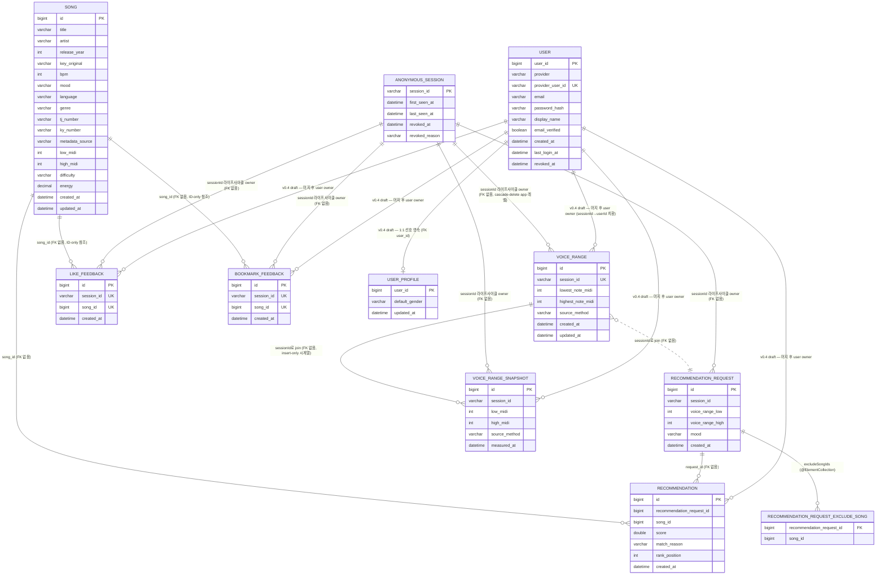

# Domain Model

> §4 유비쿼터스 랭귀지가 도메인 용어 single source of truth — §4-1 제품 도메인은 코드 패키지(`user`/`voice`/`song`/`recommendation`/`feedback`)와 1:1, §4-2 하네스/운영 용어, §4-3 사용자 표현↔내부 식별자 매핑표로 나뉜다. 신규 용어는 §4 에 먼저 등재한 뒤 코드 도입. 엔티티(§5)·ERD(§6)는 엔티티 도입 PR과 같은 PR에서 갱신한다.

## 1) 목적
- mobruji 도메인의 **공통 어휘**와 **불변식**을 한 곳에 정의해 코드·문서·UX 사이의 용어 불일치를 줄인다.
- 새 기능 구현 전 반드시 이 문서를 먼저 갱신한다 (`01-harness-spec.md §5`).

## 2) 범위 가설 (초기)
- **사용자(User)** — 노래방에서 부를 곡을 찾는 사람
- **음역대(VoiceRange)** — 사용자의 음역 (최저·최고 음 또는 옥타브 기반 분류)
- **곡(Song)** — 추천 대상 단위. 메타데이터(키, 음역, 장르, BPM, 분위기, 출시 연도, 노래방 곡번호 등)
- **추천 요청(RecommendationRequest)** — 사용자가 입력하는 컨텍스트 (음역대, 성별, 분위기, 상황)
- **추천 결과(Recommendation)** — 요청에 대한 곡 리스트와 매칭 근거

## 3) 바운디드 컨텍스트 가설

| 컨텍스트 | 책임 |
|---|---|
| `user` | 회원, 인증, 사용자 프로필 |
| `voice` | 음역대 진단, 음역 데이터 관리 |
| `song` | 곡 카탈로그, 메타데이터, 외부 음원 API 연동 |
| `recommendation` | 추천 알고리즘, 요청→결과 변환 |
| `feedback` | 사용자 시그널(Like/Bookmark) 수집. v0.2에서는 추천 가중치에 영향 없음 (recommendation-history-and-feedback.md PR B) |

> 1차 PoC는 user + voice + song + recommendation + feedback을 한 백엔드 모놀리스로 구현. 분리는 트래픽/팀 성장 시점에 재논의.
> `feedback`은 Like/Bookmark가 추천과 별도 관심사이고 v0.3+에 ML 시그널 소스로 확장될 여지가 있어 BC를 분리했다 (spec §5-1에서는 recommendation context에 두는 안도 검토했으나 분리 선택, 결정 로그는 본 PR).

## 4) 유비쿼터스 랭귀지 (Ubiquitous Language)

> 본 절은 세 하위 표로 나뉜다. **§4-1 제품 도메인** = 곡 추천 서비스의 코드 패키지(`user`/`voice`/`song`/`recommendation`/`feedback`)와 1:1 정렬되는 비즈니스 어휘 — 이 절이 도메인 용어 single source of truth. **§4-2 하네스 / 운영 용어** = 사이클 오케스트레이션·rev 게이트·보안 운영 등 *제품 도메인이 아닌* 운영 인프라 어휘 (코드·spec 에서 식별자로 사용). **§4-3 사용자 표현 ↔ 내부 식별자** = Discord 응답·문서에서 쓰는 한국어 표현과 내부 코드 식별자의 대응. (이전에는 §4 단일 표에 제품 도메인 + 운영 어휘가 뒤섞여 드리프트가 있었다 — 2026-05-31 plan 라운드에서 분리. 모든 `06-domain-model.md §4` cross-ref 는 본 절 전체를 가리키므로 유효.)

### 4-1) 제품 도메인 유비쿼터스 랭귀지

> 곡 추천 서비스 비즈니스 어휘. 코드 패키지와 1:1. 신규 도메인 용어는 이 표에 먼저 추가한 뒤 코드에 도입한다.

| 한국어 | 영어 (코드) | 패키지 | 정의 |
|---|---|---|---|
| 음역대 | VoiceRange | `voice` | 사용자가 부를 수 있는 음의 최저~최고 범위 (현재 값). 엔티티 §5-1 |
| 음역 스냅샷 | VoiceRangeSnapshot | `voice` | 음역 측정 시계열 행 (insert-only). voice-range-progress spec — "발전 인지" 위해 변경 이력 누적. 결정성 영향 없음 (추천 입력 미사용). 엔티티 §5-5 |
| 음역 MIDI 범위 | MidiRange | `voice` | MIDI note number 허용 닫힌 구간 [12(C0), 119(B8)] 상수 VO. `VoiceRange`/`VoiceRangeSnapshot`/DTO 가 중복 보유하던 `@Min`/`@Max` 리터럴을 단일 출처로 모아 drift 제거 |
| 음역 측정 출처 | VoiceRangeSourceMethod | `voice` | 음역 값의 측정 방법 enum — `SELF_REPORT` / `OCTAVE_PICK` / `MIC_MEASURE`. `VoiceRange` 와 `VoiceRangeSnapshot` 이 동일 enum 재사용 |
| 곡 | Song | `song` | 추천 대상 단위. 메타데이터(제목/아티스트/키/음역/장르/BPM/분위기/출시연도/노래방 곡번호 등). 엔티티 §5-2 |
| 키 | MusicalKey | `song` | 곡의 원곡 조성 enum — 메이저 12 + 마이너 12 + `UNKNOWN`. (기존 표현 "Key" 를 코드 enum 명 `MusicalKey` 로 정렬 — 2026-05-31) |
| 곡 음역 | (Song.lowMidi/highMidi) | `song` | 곡 자체의 보컬 멜로디 음역 범위. 별도 `SongRange` VO 없이 `Song` 두 필드로 단순화 (spec Q3 보류 결정의 후속 진전). §5-2 |
| 분위기 | Mood | `song` | 추천 입력 중 정성적 요소 (예: 신남, 잔잔함) enum |
| 가창 난이도 | Difficulty | `song` | 곡을 부르기 어려운 정도 (EASY/NORMAL/HARD). 곡 음역(`lowMidi`/`highMidi`)으로 자동 분류 (PR #96, 이슈 #77) |
| 음표명 | NoteName | `song` | MIDI note number의 과학적 음표 표기 (예: 60 → "C4"). fe `web/lib/notes.ts`와 동일 컨벤션 (sharp 표기) |
| 메타데이터 출처 | MetadataSource | `song` | 곡 메타데이터의 출처 enum — `MANUAL_SEED` / `EXTERNAL_API` / `USER_CONTRIBUTION` / `INFERRED` / `AUDIO_ANALYSIS`(analyze.py 산출, audio-tooling-bootstrap.md PR C) |
| 오디오 분석 결과 | AudioAnalysisResult | `song` | Python audio analysis tool (`tools/audio-analysis/analyze.py`) 산출물 record — `lowMidi`/`highMidi`/`key`/`tempo`/`durationSec`/`confidence`/`toolingVersion`. audio-tooling-bootstrap.md §3 |
| 에너지 | Energy (Song.energy) | `song` | 곡의 음향 에너지/강렬함 정도 0.0~1.0 (nullable). 추천 mood 변별·곡 유사도 신호로 소비. 산출 출처는 미정 — 1차는 수기/시드 적재, 자동화(Spotify valence·energy fallback 또는 librosa MFCC)는 후속 결정. song-analysis-data-and-consumers.md §5-1·§8 + song-self-analysis-pipeline.md §10-9 cross-ref |
| 곡 분석 프로파일 | SongAnalysisProfile | `song` | 곡 1건의 분석 파생 속성 묶음 read-model — `lowMidi`/`highMidi`/`keyOriginal`/`difficulty`/`mood`/`energy`/`metadataConfidence`. 추천(voiceFit/mood/next-song)·연습·트렌딩 소비자가 읽는 단일 계약 표면. 영속 엔티티 아님(`Song` 컬럼들의 view). song-analysis-data-and-consumers.md §5-1·§5-3 |
| 곡 후보 풀 | SongCandidatePool | `song` | 추천/검색/카탈로그가 매칭 대상으로 삼는 곡 집합 — 큐레이션 곡(`MANUAL_SEED`) + 임포트 곡(`EXTERNAL_API`) 합집합. 규모 확장(30→100→수백)의 단위. 영속 엔티티 아님 — `Song` 행 전체의 개념 라벨. song-catalog-expansion.md §5-1 |
| 메타-only 임포트 | MetadataOnlyImport | `song` | 외부 CC0 출처(MusicBrainz)에서 메타데이터(제목/아티스트/연도/장르/식별자)만 가져와 `Song` 으로 upsert 하는 배치(`MetadataOnlyImportCommand`, `--mobruji.import-catalog`). 음역대/key/tempo 미설정 — 자체 분석(#1490)이 후속. `metadataSource=EXTERNAL_API` + 낮은 confidence. (title, artist)·ISRC 멱등. song-catalog-expansion.md §5-1 |
| 추천 요청 | RecommendationRequest (엔티티 `RecommendationRequestEntity`) | `recommendation` | 사용자가 입력하는 추천 컨텍스트 (음역대, 분위기, 제외 곡, 선호 BPM, 연령대). 영속 단위. 엔티티 §5-3 |
| 연령대 | AgeGroup | `recommendation` | 추천 요청 선택 입력 enum (`TEENS`/`TWENTIES`/`THIRTIES`/`FORTIES`/`FIFTIES`/`SIXTIES_PLUS`). 세대별 대표 발매 시기(`application.yml` `recommendation.generation.representative-year`)와의 거리로 `generationFit` 신호 산출 (#1487). null 이면 랭킹 무영향 (하위호환) |
| 추천 | Recommendation | `recommendation` | 사용자 컨텍스트 기반 곡 매칭 결과 (영속 행). 요청 1 : N 행. 엔티티 §5-3 |
| 추천 결과 | RecommendationResult | `recommendation` | 추천 요청 1건의 최종 결과 컨테이너 (요청 ID + 정렬·다양성 후처리 마친 `ScoredRecommendation` 리스트). application 이 `api.dto` 에 의존하지 않도록 domain 레이어에 둔 결과 표현 (ADR-0005 §A-7) |
| 채점된 추천 | ScoredRecommendation | `recommendation` | 추천 결과 1건 값 객체 (곡 + 점수 + 매칭 사유 + 랭킹 + `ScoreBreakdown`). 영속 엔티티 `Recommendation` 와 응답 DTO 를 잇는 중간 표현. 과거 추천 재조회 경로에서는 `breakdown` 이 null. 설명 가능성(#1484)용 파생값 `voiceFit`(0~1, = `rangeFit` 신호) + `voiceFitReason`(짧은 한국어 사유), 분위기 변별력(#1485)용 `moodFit`(0~1, = `moodMatch` 신호) + `moodFitReason` 노출 — breakdown null 경로에서는 모두 null. 연습형 페르소나(P-A, #1494)용 `practiceDifficulty`(= 곡 `difficulty`) + `practiceDifficultyReason`(최고음+난이도 한국어 사유) — 곡 속성 파생이라 재조회 경로에서도 채워지고, 음역 미보유 곡은 난이도 null + graceful "정보 없음" 사유. 연습형(P-A, #1544)용 `suggestedTranspose`(반음 수) + `transposedVoiceFit`(0~1) + `suggestedTransposeReason`(한국어 사유) — voiceFit 낮은 곡에만 채워지고, 조옮김 불요·키 UNKNOWN·재조회 경로에서는 모두 null |
| 점수 분해 | ScoreBreakdown | `recommendation` | 추천 점수 신호 분해 — 가중치 적용 전 raw 값(0~1) 7종 (`keyMatch`/`rangeFit`/`genreMatch`/`moodMatch`/`popularity`/`tempoMatch`/`generationFit`). "Why this song?" 설명 가능성 확보용 (P2). `moodMatch` 는 #1485 에서 이진(1.0/0.0)에서 분위기 `(energy, brightness)` 좌표 거리 기반 연속 유사도로 확장 — 정확 일치 1.0, 미입력·곡 mood 부재 0.0, 그 외 0~1 |
| 세대 적합도 | generationFit | `recommendation` | `ScoreBreakdown` raw 신호 — 곡 발매 연도와 요청 `ageGroup` 의 대표 시기 거리를 선형 감쇠(`1 - min(1, 거리/허용오차)`)로 환산 (#1487). ageGroup/발매연도 null 또는 미등재 세대면 0.0 (랭킹 무영향) |
| 키 조옮김 제안 | TransposeSuggestion | `recommendation` | voiceFit(rangeFit) 낮은 곡(< 0.4)에 대해 카라오케 통상 범위 ±6 반음 안에서 음역 적합도를 가장 끌어올리는 권장 조옮김량(`semitones`, 양수=올림/음수=내림)과 조옮김 적용 후 재계산한 `transposedVoiceFit`(0~1, voiceFit 과 동일 산식이라 비교 가능)을 담는 값 객체 (#1544). 키 root MIDI 에 반음을 더해 같은 `voiceRangeFit` 산식을 재사용. 곡 키 UNKNOWN(산정 근거 없음)·원곡 그대로 무난(≥ 0.4)·±범위 내 개선 없음이면 제안 없음(null). 연습형 페르소나(P-A) |
| 트렌딩 | TrendingSong | `recommendation` | 다른 사용자 추천 히스토리를 기간별 집계한 인기곡 1건 read-model (곡 + 순위 + 등장 횟수 + 인기도). 영속 엔티티 아님 — `Recommendation`×`RecommendationRequestEntity` 집계 view. 노래방 일반 차트와 달리 분위기/음역대 결합 조회 (#1488). trending-recommendation.md |
| 인기도 | popularityScore (TrendingSong) | `recommendation` | 트렌딩 정렬 신호 — 곡이 추천 결과에 등장할 때마다 `1.0 / rankPosition` 을 더한 rank 감쇠 합. 상위 노출(rank 1)일수록 큰 가중. 추천 점수(`ScoreBreakdown.popularity`)와 별개 — 조회 전용 집계값으로 알고리즘 결정성 무관 |
| 트렌딩 조회 조건 | TrendingQuery | `recommendation` | 트렌딩 집계 입력 커맨드 — 기간(`periodDays`)/분위기(`mood`, nullable)/음역대 overlap(`voiceRangeLow`,`voiceRangeHigh`, both-or-neither)/`limit`. api.dto 의존 없는 application 입력 모델 (ADR-0005 §A-7) |
| 스와이프 반응 | SwipeReaction / SessionFeedback | `recommendation` | 스와이프 덱에서 곡당 1건 남기는 like/pass 반응. songId당 최신 1건 upsert(재스와이프 시 덮어쓰기). 현재 클라이언트 localStorage(`web/store/swipeReactions.ts`)만, **설계 단계** 로 서버 영속(`session_feedback`) + 추천 결합 신호화 — recommendation-feedback-loop.md (#1489 UX / #1486 부른곡 모드 결합) |
| 세션 선호 프로필 | SessionPreferenceProfile | `recommendation` | **설계 단계** 값 객체 — 세션 스와이프 좋아요 곡 + 부른곡 시드를 합친 선호 중심(음역대/분위기/BPM)과 패스 곡 회피 집합. `next` 추천 시 1회 도출해 재정렬에 사용. recommendation-feedback-loop.md |
| 선호 적합도 / 회피 패널티 | preferenceFit / avoidancePenalty | `recommendation` | **설계 단계** `ScoreBreakdown` raw 신호 — `preferenceFit`(후보와 선호 중심 근접도 0~1, 가산) / `avoidancePenalty`(패스 곡 근접도 0~1, 감산). 콜드스타트(신호 0건)면 기여 0. recommendation-feedback-loop.md |
| 분위기 프리셋 | MoodPreset | `recommendation` | **설계 단계** 페르소나 B(분위기 메이커, F3) 가 온보딩 MOOD 경로에서 고르는 의도 그룹 — `PARTY`(회식 띄우기) / `SINGALONG`(떼창) / `EMOTIONAL`(감성) / `ICEBREAKER`(도입). **신규 `Mood` enum 값이 아니라** 기존 `Mood`(UPBEAT/CALM/EMOTIONAL/POWERFUL/GROOVY/NOSTALGIC) + `preferredBpm`(moodBpm 매핑) 위에 얹는 사용자-페이싱 view. 추천 호출 시 `mood`/`preferredBpm` 으로 풀어 보내 기존 `moodMatch`/`tempoMatch` 신호 재사용 — 추천 알고리즘 무변경. mood-mode.md §5-1·§5-3 |
| 청중 프로필 | AudienceProfile | `recommendation` | **설계 단계** 분위기 메이커가 선택하는 청중 연령대 컨텍스트 (예: 또래 / 윗세대 혼합 / 가족). 영속 형태(한 세션 옵션 vs 익명 세션 필드)는 미정 — mood-mode.md §8 Q3. PoC 1차는 클라이언트 세션 옵션으로만 보관, 추천 신호화는 후속(요청 `ageGroup` = 본인 세대와 별 차원). mood-mode.md §5-1 |
| 선호 학습 프로필 | LearnedPreferenceProfile | `recommendation` | **설계 단계** 익명 sessionId 단위로 **영속·누적**되는 선호 프로필 — 장르/분위기/아티스트 차원별 affinity 가중 벡터. 휘발성 `SessionPreferenceProfile`(한 `next` 호출 즉석 재계산)과 달리 implicit 신호(좋아요/패스/부른곡 시드/추천 노출)를 시간 감쇠로 누적해 **재방문 첫 요청부터** 추천 baseline 을 개인화. ADR-0013 sessionId 수명(180일) 내 한정, v0.4 계정 전환 시 owner sessionId→userId 치환. preference-learning-personalization.md |
| 선호 affinity | PreferenceAffinity | `recommendation` | **설계 단계** `LearnedPreferenceProfile` 의 한 차원·한 키 가중 1건 — `(dimension∈{GENRE,MOOD,ARTIST}, key, weight 0~1, signalCount, updatedAt)`. 시간 감쇠 후 정규화. 영속 단위(`preference_affinity` 행). preference-learning-personalization.md |
| 선호 신호 | PreferenceSignal | `recommendation` | **설계 단계** 학습 프로필을 갱신하는 implicit 이벤트 — 좋아요(+) / 패스(−) / 부른곡 시드(+) / 추천 노출(약 신호). 기존 `SessionFeedback`·`Recommendation` 행에서 파생, **원문 식별자 미보관**. 신호별 가중·감쇠 계수는 `application.yml` 단일 진실(spec 미러). preference-learning-personalization.md |
| 학습 적합도 | learnedAffinity | `recommendation` | **설계 단계** `ScoreBreakdown` raw 신호 — 후보 곡의 장르/분위기/아티스트와 `LearnedPreferenceProfile` top affinity 의 가중 일치도(0~1, 가산). warm-up 임계 미달(누적 신호 < N)·opt-out·콜드스타트면 기여 0(중립, 하위호환). preference-learning-personalization.md |
| 좋아요 | Like | `feedback` | 사용자가 곡에 남긴 긍정 시그널. sessionId 단위 toggle. **v0.2에서는 추천 가중치 비영향** (가중치 도입은 v0.3+ 별도 ADR). 엔티티 §5-4 |
| 북마크 | Bookmark | `feedback` | 사용자가 곡을 다시 찾고 싶어 별도 큐에 담은 행위. Like와 분리 유지 (spec Q1 결정). 엔티티 §5-4 |
| 익명 세션 | AnonymousSession | `user` | 익명 사용자의 sessionId 라이프사이클(최초/최근 활동, TTL 만료, revoke) 을 관리하는 엔티티. ADR-0013 + anonymous-session-lifecycle.md. 엔티티 §5-6 |
| 세션 회수 | SessionRevocation (enum `RevokedReason`) | `user` | sessionId 를 revoke 처리한 사실(시점 + 사유). 사유 enum `RevokedReason`: `TTL` / `USER_ROTATE` / `ACCOUNT_MERGE` (Micrometer 라벨은 lowercase) |
| 세션 회전 | SessionRotation | `user` | 사용자가 명시적으로 현재 sessionId 를 폐기하고 새 sessionId 를 발급받는 행위. `POST /api/v1/sessions/rotate` |
| 계정 머지 | AccountMerge | `user` | v0.4 OAuth 로그인 시 익명 sessionId 의 누적 데이터(좋아요/북마크/음역대)를 가입 user 로 owner 치환하는 트랜잭션 (v0.4 spec 에서 정식 명세) |
| 사용자 | User | `user` | v0.4 정식 회원 — 소셜(카카오/구글) 또는 이메일 인증으로 식별되는 영속 계정. `(provider, providerUserId)` unique. 익명 sessionId 와 달리 디바이스 간 동기화 + 프로필 영속의 owner. 엔티티 §5-7. 인증 메커니즘 SoT = user-authentication-and-profile.md, 전환 정책/머지 = anonymous-to-account-conversion.md |
| 인증 제공자 | OAuthProvider | `user` | 회원 인증 출처 enum — `KAKAO` / `GOOGLE` / `EMAIL`. `User.provider` 필드. OAuth 2종은 Authorization Code Flow, `EMAIL` 은 비밀번호 해시 + 이메일 인증 |
| 사용자 프로필 | UserProfile | `user` | 회원의 재방문 prefill 용 선호 영속 (선호 장르 다중 / 선호 분위기 다중 `Mood` / 기본 성별 nullable). `User` 1:1. **음역대는 중복 저장하지 않고** 기존 `VoiceRange`/`VoiceRangeSnapshot` 을 userId owner 로 재사용. 추천 폼 prefill (`GET /users/me/profile`) 로 "재방문 시 재입력 불필요" 보장 (#1491). 엔티티 §5-8 |
| 회원 인증 가드 | UserAuthGuard | `user` | 회원 전용 endpoint 의 토큰 인증 컴포넌트 (신설). 익명 sessionId 용 `SessionAuthGuard` (ADR-0011) 와 **별 트랙 공존** — 한 endpoint 가 두 인증을 동시에 요구하지 않음. 미인증 호출 시 401. user-authentication-and-profile.md §5-2 |
| 온보딩 | Onboarding | `user` (web) | 신규(첫 진입) 사용자가 진입부터 **첫 추천 도달**까지 거치는 안내 흐름. 신규 BE 엔티티 없이 기존 `VoiceRange`/`RecommendationRequest`/`AnonymousSession` 을 재사용하고, 완료 여부는 클라이언트(localStorage) 상태로만 추적 (PoC). first-user-onboarding-flow.md |
| 페르소나 진입 경로 | PersonaEntryPath | `user` (web) | 온보딩 첫 화면에서 사용자가 선택하는 의도별 분기 — `BEGINNER`(입문, P-C) / `PRACTICE`(연습, P-A) / `MOOD`(분위기, P-B). 각 경로가 자식 spec(F1 가이드 측정 / F2 고음 뚫기 / F3 분위기 모드)으로 연결. 페르소나 정의 SoT = user-persona-and-pain-points.md §2. first-user-onboarding-flow.md |
| 음역 분류 | VocalRegister | `voice` | **설계 단계** 음역대(low/high MIDI)를 절대 음역 밴드로 분류한 라벨. 비전문 사용자 친화 — 1차는 정식 성악 명칭(테너/소프라노 등) 대신 일상어 밴드(낮은/중간/높은/넓은 음역). 영속 엔티티 아님(`VoiceRange` 파생). 추천 결정성 무영향. voice-range-intuitive-display.md §5-1 |
| 음역 벤치마크 | VoiceRangeBenchmark | `voice` | **설계 단계** 상대 음역 설명·시각화 비교 기준이 되는 평균 음역 reference. 성별 중립 기본(일반 성인 A2~C4 시드) + 선택적 성별 분기(성별 신호 확보 시 — 현재 미수집). 시드값, 검증·튜닝 대상. voice-range-intuitive-display.md §5-1 |
| 상대 음역 설명 | RelativeRangeDescriptor | `voice` | **설계 단계** 사용자 음역대를 `VoiceRangeBenchmark` 와 비교해 생성하는 짧은 한국어 설명("고음이 평균보다 약간 높아요"). 고음/저음/음역폭 3축 차이를 버킷(≤2 비슷 / 3~5 약간 / ≥6 훨씬)으로 환산. 1차 FE 파생, BE enrichment 는 재사용 수요 확정 시 후속. voice-range-intuitive-display.md §5-1 |

> 코드/PR/문서에서 위 한국어 ↔ 영어 매핑을 일관 사용. 신규 도메인 용어는 이 표에 먼저 추가한 뒤 코드에 도입.

### 4-2) 하네스 / 운영 용어

> 제품 도메인이 아닌 운영 인프라 어휘 — 사이클 오케스트레이션, rev 게이트, 보안 disclosure, forum 운영 등. 코드·spec·jsonl 에서 식별자로 쓰이며, 사용자 가시 표현은 §4-3 매핑표를 따른다.

| 한국어 | 영어 (코드) | 정의 |
|---|---|---|
| 사이클 launch thread id | CycleLaunchThreadId | sub-agent launch 시 `tools/agent-launch-wrapper.sh` 가 cycle forum 채널 (be/fe/rev/plan) 에 신설 또는 재사용하는 thread 의 Discord snowflake (18-20자리 정수 문자열). sub-agent 의 모든 진행 / 결과 push 의 단일 대상 (별 thread 생성 금지 — `actors/sub-agent.md §1-11` STRICT). 출처: cycle-forum-operation.md §5-3·§5-4 |
| launch thread 캐시 파일 | LaunchThreadCacheFile | wrapper ↔ nmae ↔ sub-agent 간 `CycleLaunchThreadId` 인계 채널. 파일 경로 = `~/.mobruji/last-launch-thread.txt`. wrapper 가 atomic write, sub-agent (`--auto-thread`) 가 read. 출처: cycle-forum-placeholder-guard.md (PR #1306) |
| placeholder thread id | PlaceholderThreadId | 정상 snowflake 가 아닌 임시값 (예: `99999`). 주로 테스트 fixture 가 fake curl mock 으로 박은 값이 production 파일에 오염되어 발생. `validate_snowflake` reject 대상 — `LaunchThreadCacheFile` 에 진입 시 sub-agent push 사일런스 사고 (4 갈래 가드 spec: cycle-forum-placeholder-guard.md F-1~F-6). 출처: PR #1306 |
| PR 격리 dev URL | DevPrIsolatedUrl (`dev_pr_isolated_url`) | PR 브랜치별 격리된 dev 환경 URL (ngrok / fly.io PR app / Vercel preview / 사내 reverse proxy path-based). 단일 NCP dev 서버 (`http://101.79.20.94/`) 에 develop tip 자동 deploy 하는 현 구조의 동시 deploy race 사고를 해소하기 위한 후보 인프라. 후보 spec `dev-pr-branch-deploy-isolation` (rev-direct-qa-extension.md §3 후보 A 단계 1 PR branch deploy 인프라 분리 후보). 격리 URL = rev 단계 1 e2e (PR 머지 전) 의 외부 검증 entrypoint. 출처: `docs/features/rev-direct-qa-extension.md §3 후보 A` + §8 Q2 |
| visual baseline | VisualBaseline | Playwright screenshot 의 reference 이미지 (`.png`). 페이지 × viewport × colorScheme (light/dark) 조합당 1 파일. CI 가 PR push 시 현재 화면을 캡처해 본 baseline 과 pixelmatch — diff > threshold (proposed 0.1%) 시 fail. 저장 매체 1차 도입 = git 직접 commit (누적 100 MB 도달 시 별 마이그레이션 ADR 트리거 LFS 전환). 갱신은 `npx playwright test --update-snapshots` 명시 PR 만 + PR body `## visual baseline update` 섹션 의무 (ADR-0026 §Decision 2 후보 a). 출처: `docs/features/visual-regression-ci.md §3-2` + ADR-0026 |
| baseline drift | BaselineDrift | `VisualBaseline` 의 의도된 또는 비의도된 변경. 의도된 drift (ADR-0018 swap / spec 화면 변경) 는 fe sub-agent 가 PR body `## visual baseline update` 섹션에 N 페이지 / 사유 명시 + baseline 갱신 commit. 비의도된 drift (회귀) 는 PR body 섹션 부재 + CI diff > 0.1% — rev sub-agent 가 `rev단계1: 🔴 시각 회귀 의심` 코멘트 + `reviewed:claude` 라벨 부착 차단. rev 자율 판단 표: `visual-regression-ci.md §3-4` SoT. 출처: `docs/features/visual-regression-ci.md §3-3·§3-4` + ADR-0026 §Decision 후보 (a) |
| admin 우회 머지 | AdminOverrideMerge | repo admin (owner) 이 `rev-gate` check 결과 / `reviewed:claude` 라벨 부재와 무관하게 GitHub branch protection 의 `enforce_admins: false` 또는 `main` branch protection 부재를 이용해 직접 머지하는 우회 경로. 2026-05-29 rev round 31 (PR #1318 사고 회고) 에서 노출 — 라벨 게이트가 prose 만으로 강제되어 admin 권한 사용 시 사후 정렬 가능했으나 머지 시점 evidence 가 0건. 차단 spec: `docs/features/rev-gate-required-check-enforcement.md §3-1` (gh API 로 `enforce_admins: true` 전환 + `main` branch protection 신설). 합법 우회 경로 = `EmergencyHotfixLabel` / `type:release` whitelist 만 허용. 출처: `docs/features/rev-gate-required-check-enforcement.md §1·§2-2` |
| rev-gate audit check | RevGateAuditCheck | 머지 commit 에 부착되는 post-merge audit check-run (`rev-gate-audit`). 신설 workflow `rev-gate-audit.yml` 가 `pull_request_target: types: [closed]` + `if: merged == true` trigger 로 실행하여 (a) `reviewed:claude` 라벨 부착 시각 ≤ mergedAt, (b) 통과 코멘트 (`✅ rev e2e PR pass` / `📝 rev no-op pass`) ≤ mergedAt, (c) `type:release` / `type:emergency-hotfix` whitelist 부착 — 셋 중 하나 만족 시 green, 셋 다 실패 시 failure + 사후 가시화 (DIGEST + issue + rev 단계 2 trigger). prose 머지 게이트가 admin override 로 우회됐을 때 evidence 박제 + 자동 follow-up 강제 메커니즘. 출처: `docs/features/rev-gate-required-check-enforcement.md §3-3` (workflow 본문 SoT 는 향후 별 spec `rev-gate-audit-workflow.md` 예정) |
| 우회 audit 이슈 | BypassAuditIssue | `RevGateAuditCheck` 가 failure 분류 시 자동 신설되는 GitHub issue (`audit:rev-gate-bypass` 라벨). issue body 박제 항목 = 머지된 PR 링크 / mergedAt / mergedBy / merge commit SHA / 부재했던 evidence 항목 (라벨 / 코멘트 / whitelist). nmae 가 다음 사이클 안에 본 issue queue 처리 — rev 단계 2 launch + 통과 시 issue close, 실패 시 revert PR 생성. `EmergencyHotfixFollowupIssue` 와 라벨이 다르다 (전자 = 합법 우회 사후 회귀, 후자 = 비합법 우회 evidence 부재). 출처: `docs/features/rev-gate-required-check-enforcement.md §3-3` |
| emergency-hotfix 후속 이슈 | EmergencyHotfixFollowupIssue | `EmergencyHotfixLabel` 부착 PR 이 머지된 직후 `RevGateAuditCheck` 의 whitelist pass 분기에서 자동 신설되는 GitHub issue (`audit:emergency-hotfix-followup` 라벨). issue body 박제 항목 = PR 링크 / mergedAt / mergedBy / merge commit SHA / PR body `## emergency-hotfix 사유` 섹션 grep 결과 / 사후 rev 단계 2 절차 cross-ref. nmae 가 다음 사이클 안에 rev 단계 2 launch → 통과 시 issue close + `rev-post-merge-pass` 라벨 부착, 실패 시 즉시 revert PR + 사용자 DIGEST + `regression:dev` 라벨. emergency-hotfix 가 rev 사이클 우회 후 회귀 미발견으로 production 사고 확대되는 경로 차단. 출처: `docs/features/emergency-hotfix-flow.md §3-3` + §5-4 시퀀스 [4]~[7] |
| emergency-hotfix 라벨 | EmergencyHotfixLabel | GitHub 라벨 `type:emergency-hotfix` (색상 `#D73A4A`). production endpoint 5xx / down 즉시 복구 / security 사고 (시크릿 유출 / 인증 우회 / XSS / CSRF / sandbox escape) 즉시 패치 / data integrity 사고 즉시 revert / CI build infra down 즉시 복구 — 4 가지 정당 사유 한정. 부착 시 `rev-gate.yml` whitelist 매칭 → workflow skip → 즉시 머지 가능. 부적합 사유 (단순 rev 대기 throughput / docs spec 만 / "내가 직접 검토했으니 충분") 사용 금지 — 라벨 부착 후 머지 시 audit hook 이 사용 빈도 카운트 → 월 임계치 초과 시 자동 회고 spec 트리거. PR body `## emergency-hotfix 사유` 섹션 의무 (사고 분류 / 시작 시각 / 사용자 impact 범위 / root cause 추정 / rollback 가능성 / 사후 rev 단계 2 실행 사이클). 출처: `docs/features/emergency-hotfix-flow.md §3-1·§3-2·§3-4` |
| emergency-hotfix 심각도 | EmergencyHotfixSeverity | `EmergencyHotfixLabel` 부착 PR body `## emergency-hotfix 사유` 섹션 의 사고 분류 enum — `production-down` / `security` / `data-integrity` / `ci-down` 4 값. 사후 audit issue body grep 대상 + 월간 사용 빈도 메트릭 분류 차원. `security` 분류는 추가 절차 (별 disclosure spec 후보) cross-ref. **본 spec scope 안 표현이 P0/P1/P2 가 아닌 4 분류 enum 임을 명시** — 사용자 명시 (P0/P1/P2 분류) 와 spec 본문 (`production-down` / `security` / `data-integrity` / `ci-down`) 차이는 `emergency-hotfix-flow.md §8 오픈 질문` 으로 추가 박제 후보 (severity 차원과 분류 차원 분리 필요 여부). 출처: `docs/features/emergency-hotfix-flow.md §3-4` PR body 섹션 enum |
| security advisory | SecurityAdvisory | GitHub Security Advisory (private repo report) entity — `gh api repos/<owner>/<repo>/security-advisories` 또는 GitHub UI (Security tab) 로 draft 생성. security 사고 발견 즉시 비공개 draft 작성 의무, public publish 는 패치 머지 후 `RevGateAuditCheck` whitelist pass + 사후 rev 단계 2 통과 시점에. 박제 항목 = `SecurityDisclosureCategory` / 영향 받은 데이터 종류 / 패치 commit SHA / 사용자 통보 시각 / CVE 신청 여부 (🔴 분류 한정). public 가시화 전까지 `type:emergency-hotfix` + body `security` 키워드 PR / `EmergencyHotfixFollowupIssue` 와 cross-ref 만 유지. **2026-05-29 (plan round 12)**: `SecurityDisclosureCategory` cross-ref 정렬 (이전 표현 `DisclosureSeverity` → SoT 통일). 출처: `docs/features/security-disclosure-flow.md §3-1` 절차 1~7 단계 + §3-2 분류 매트릭스 + §5-1 도메인 모델 |
| disclosure 카테고리 | SecurityDisclosureCategory | security 사고 disclosure 분류 enum — `critical-public` / `high-internal` / `medium-poc` / `low-theoretical` 4 값. PR body `## emergency-hotfix 사유` 섹션 `사용자 impact 범위` 한 줄에 🔴/🟠/🟡/🟢 prefix 강제 표기. 사용자 통보 의무 / CVE 신청 의무 / `SecurityAdvisory` publish 시점 / rev 단계 2 SLA 등급 분기 결정 기준. `EmergencyHotfixSeverity = security` 4 분류 enum 과 다른 차원 (전자 = 사고 카테고리, 후자 = 외부 노출 위험). 🔴 critical-public = production 가시 endpoint 가 사용자 데이터 / 시크릿 노출 중, 🟠 high-internal = production 시크릿이 git history / log 에 노출 (외부 미가시), 🟡 medium-poc = 비-production 환경 시크릿 노출 또는 PoC 단계 취약점, 🟢 low-theoretical = 이론적 취약점 / 미악용 가능. **2026-05-29 (plan round 12)**: 이름 정렬 — 기존 `DisclosureSeverity` (#1330 등재) 을 spec SoT (`security-disclosure-flow.md §5-1` / §6 PR 4 후보 list) 의 `SecurityDisclosureCategory` 로 rename. 한국어 표현 "심각도" → "카테고리" 로 동시 정렬 (의미 = severity 가 아닌 외부 노출 카테고리, `EmergencyHotfixSeverity` severity 차원과 분리). `SecurityAdvisory` / `RevSlaTarget` / `SecretScanningHook` 본문 cross-ref 도 같은 commit 안에서 일괄 정렬. 출처: `docs/features/security-disclosure-flow.md §3-2·§5-1·§6 PR 4` |
| rev SLA 목표값 | RevSlaTarget | rev sub-agent 🟡 Pre-merge review (단계 1) / 🔵 dev 배포 E2E 검증 (단계 2) 응답 시간의 PR 분류별 목표값. 정규 type:* 단계 1 = 30분 / 단계 2 = 24시간. `type:release` 단계 1 = 면제. `type:emergency-hotfix` (정규) 단계 1 = 면제, 단계 2 = 30분. `type:emergency-hotfix` + body `security` (🔴 `SecurityDisclosureCategory = critical-public`) 단계 2 = 15분. `type:docs` (no-op pass) 단계 1 = 5분. **차단이 아니라 목표값** — 미달성 ≠ fail. 미달성 시 `RevSlaEscalation` 분기 trigger. 측정 시작 (T0) = nmae 가 rev sub-agent launch 큐 등록 시점 (`rev-queue.sh register <PR>` 호출 또는 wrapper launch 시점), 측정 종료 = `reviewed:claude` 라벨 + 통과 코멘트 (✅/📝/❌) 부착 시각 중 늦은 쪽. (단계 3 SLA 폐기 2026-05-30 — `rev-e2e-2-stages.md §1-1`, 향후 production 환경 신설 시 부활 — `[[project_rev_stage_3_prod_revival]]`). 출처: `docs/features/rev-sla.md §3-1·§3-2` |
| rev SLA escalation | RevSlaEscalation | `RevSlaTarget` 미달성 PR 에 대한 nmae 강제 escalation 분기 매트릭스. 정규 단계 1/2 + `type:docs` 단계 1 = DIGEST push + nmae 별 rev sub-agent parallel launch. security 🔴 단계 2 = DIGEST + Discord 본 채널 (`MOBRUJI_CHANNEL_ID`) + 사용자 reply 3 채널 동시 push + nmae 최우선 큐 head 재배치. 멱등성 가드 — `~/.mobruji/rev-sla-metrics.jsonl` 의 `escalated=true` flag 로 1회만 발사 (같은 PR / 같은 단계). 강제 머지 / 강제 회수 X (sub-agent 자율 평가 유지). (단계 3 escalation 폐기 2026-05-30). 출처: `docs/features/rev-sla.md §3-4·§3-5` |
| rev SLA watchdog | RevSlaWatchdog | bot.py 신설 loop `watchdog_rev_sla_loop` (1분 polling) — `RevSlaTarget` 매트릭스 자동 적용 + 미달성 detect + `RevSlaEscalation` trigger. `nmae-cycle-watchdog.md §5-7` 4중 안전망의 **5번째 layer** (확장). 매 polling: (1) `gh pr list --base develop --state open --label "type:*" --json number,labels,createdAt,comments` read, (2) 각 PR 분류 → §3-1 매트릭스 SLA 적용, (3) T0 부터 elapsed 계산 → SLA 초과 PR 추출, (4) `rev-sla-metrics.jsonl` 의 `escalated=true` flag 있으면 skip (멱등), (5) 미달성 PR 발견 → §3-4 escalation 분기. 학습 의존 ↓ — sub-agent 가 자기 PR 의 SLA 시각을 계산하지 않아도 자동 escalation. 출처: `docs/features/rev-sla.md §3-3` + `docs/features/nmae-cycle-watchdog.md §5-7` (5중으로 확장) |
| secret scanning hook | SecretScanningHook | 시크릿 commit / push 방지 강제 메커니즘 2 layer. layer 1 = pre-commit hook (`.git/hooks/pre-commit` 또는 `pre-commit` framework) — 로컬 commit 직전 시크릿 패턴 (AWS access key / GitHub PAT / OAuth client secret / DB password / 사내 API key 정규식) 감지 시 commit reject. layer 2 = CI secret scanning workflow (`.github/workflows/secret-scan.yml`) — push / PR 시 truffleHog 또는 gitleaks 로 diff + git history 스캔, `SecretScanFinding` ≥ 1 시 fail + PR 머지 차단. layer 1 우회 (`--no-verify`) 가능성 가드 = layer 2 가 server-side 강제. security 사고 (`SecurityAdvisory` 🟠 high-internal `SecurityDisclosureCategory`) 회귀 방지 가드 (`security-disclosure-flow.md §3-3` 4 항목 중 4번째). 출처: `docs/features/secret-scanning-hook.md §3-1·§3-2` + `docs/features/security-disclosure-flow.md §3-3` |
| secret scan finding | SecretScanFinding | `SecretScanningHook` layer 1 / layer 2 가 감지한 시크릿 1건 entry. 박제 항목 = 매칭 패턴명 (`aws-access-key-id` / `github-pat` / `oauth-client-secret` / 등) / 파일 경로 / 라인 번호 / commit SHA / 감지 시각 / layer (1 = pre-commit, 2 = CI). layer 1 감지 시 commit reject + stderr 출력 (file 박제 X). layer 2 감지 시 `~/.mobruji/secret-scan-findings.jsonl` append + PR check fail + 자동 issue 신설 (`audit:secret-scan-finding` 라벨, body 에 commit SHA + 파일 + 라인 + 회전 권고 cross-ref). false positive 는 `.gitleaksignore` 또는 `.trufflehog-ignore` 패턴 추가로 해소 — 본 spec scope. 출처: `docs/features/secret-scanning-hook.md §3-3·§3-4` |
| security 사용자 통보 | SecurityUserNotification | 🔴 critical-public 분류 (`SecurityDisclosureCategory` enum 4 값 중 1) 의 security 사고 패치 머지 후 영향 받은 사용자 수 (sessionId 단위) ≥ 1 인 경우 동시 박제하는 4 채널 통보 evidence — (1) Discord 본 채널 (`#모부르지`) (2) DIGEST 채널 (`discord-reply.sh --digest`) (3) GitHub Release notes 의 `## Security` 섹션 (4) GitHub Security Advisory publish (`SecurityAdvisory` Security tab 가시화). 통보 본문 박제 항목 = 사고 발생 시각 (T0) / 패치 머지 시각 / 사용자 통보 시각 / 영향 받은 데이터 종류 (음역대 / Like / Bookmark / sessionId / 시크릿) / 영향 받은 사용자 수 / 사용자가 해야 할 action (예: sessionId rotation 권고 `POST /api/v1/sessions/rotate`). evidence 가 4 채널 중 1 곳에만 있는 사고 0건 (비기능 관측성 요구). `EmergencyHotfixFollowupIssue` 의 영향 받은 sessionId 수 박제 값이 본 통보의 발동 조건 — 0건이면 통보 생략 가능. `RevSlaTarget` security 🔴 (`SecurityDisclosureCategory = critical-public`) 단계 2 SLA (15분) 와 cross-ref — SLA 초과 시 `RevSlaEscalation` 의 3 채널 push 가 본 통보의 1·2·5 채널과 partial overlap (Discord 본 채널 + DIGEST + 사용자 reply). 출처: `docs/features/security-disclosure-flow.md §3-4` |
| forum starter template marker | ForumStarterTemplateMarker | `forum_edit_starter` 호출 body 가 directive / cycle forum 양식 임을 식별하는 markup 패턴 집합. 정규 marker = 📌 또는 🛠️ (title prefix), 💬 (본문 / 원본 섹션), 🆔 (id line), 📋 진행 (체크박스 섹션), 🔖 관련 (관련 섹션), `---` + `_갱신:` (footer). 총 6 marker. validation = N=6 중 ≥5 매칭 시 pass (graceful — 1 marker 누락 허용, backward compat). PR F (#1362) 의 `lib/forum_template_validator.py` SoT. 출처: `docs/features/forum-starter-template-guard.md §5-2` + `docs/features/directive-board-template-and-tags.md §5-2·§5-3` + `tools/agent-launch-wrapper.sh:_build_cycle_template_body` |
| 양식 위배 시도 | ForumTemplateViolationAttempt | `forum_edit_starter` 호출 body 가 `ForumStarterTemplateMarker` 매칭 실패한 PATCH 시도 1건. 박제 항목 = thread_id / cycle / actor / attempted_body_head (첫 80자) / matched count / missing marker list / ts. `~/.mobruji/forum-template-violations.jsonl` append. validation reject 후에도 sub-agent 가 재시도 가능 (학습 후 정상 PATCH 적용 기대). 같은 thread 1h 1회 alert debounce (`~/.mobruji/forum-template-violation-debounce.jsonl`). 출처: `docs/features/forum-starter-template-guard.md §5-3·§5-7` |
| template validation 모듈 | ForumTemplateValidator | `tools/discord-daemon/lib/forum_template_validator.py` 모듈. regex / marker count / pass-fail 판단 SoT. bot.py `_forum_edit_starter` + 단위 테스트 / 향후 nmae digest hook 공유. marker 집합 변경 시 모든 consumer 영향 분석 의무. 출처: `docs/features/forum-starter-template-guard.md §5-2·§5-8` |
| 합성 directive | SyntheticDirective | nmae 자율 흐름이 자동 생성하는 directive — id prefix `rev-pr-<N>` (sub-agent 완료 후 그 branch 의 열린 PR 을 rev 큐에 자동 적재, `tools_queue.enqueue_rev_for_pr_if_any`) / `pr-review-<N>` (pr-review forum 가시화용 `register_directive_pending(kind=pr_review)`). 사용자 채택 directive 와 달리 `thread_id=None` 으로 박히고 (대화 thread 부재) **자연 보고 채널 = 대상 PR**. work-queue 적재 시 cycle forum thread 는 best-effort 신설 — 신설 실패 시 `ThreadlessReportFallback` 진입. 출처: `docs/features/cycle-thread-launch-race-fix.md §1·§5-1` |
| threadless 보고 fallback | ThreadlessReportFallback | `SyntheticDirective` 가 cycle forum thread 도 dialogue thread 도 못 가진 상태(thread 신설 race / env 부재)에서, `launch_subagent` 가 pending thread 부재 ValueError 로 launch 를 막지 않고 **빈 pending thread 로 launch 진행 → sub-agent 가 대상 PR 코멘트(rev-gate 문자열 포함)로 보고**하는 경로. 사용자 채택(실) directive 는 본 fallback 대상 아님 — pending thread 누락 ValueError 가드(legacy 사고 fix) 유지. 출처: `docs/features/cycle-thread-launch-race-fix.md §5-2·§5-4` |

> 코드/PR/문서에서 위 한국어 ↔ 영어 매핑을 일관 사용. 신규 운영 용어는 이 표에 먼저 추가한 뒤 코드에 도입.

### 4-3) 사용자 표현 ↔ 내부 식별자 매핑표

> Discord 사용자 응답·문서 본문에서 쓰는 **한국어 표현**과 코드·jsonl·spec 의 **내부 식별자**의 대응. 원칙 (CLAUDE.md §4 "공통 행동 룰" / [[feedback-discord-tone-formal]] / `internal-label-scrub.md`): **사용자 가시 텍스트는 한국어 표현**(왼쪽 열), **코드·jsonl·로그·spec 의 식별자는 영어**(가운데 열) 를 쓴다. 예 — 사용자에게는 "지시를 받았습니다", jsonl 에는 `directive_id`. 내부 ID(`directive_id` snowflake, `[A1]`/`[D4]` 류 작업 분류 코드)는 사용자 가시 본문에 노출하지 않는다 (`internal-label-scrub.md` — paraphrase 만 노출). 영어 동사 push/post/send 도 사용자 응답에서 금지 — "메시지/알려 드리겠습니다" 로 표현.

| 사용자 표현 (한국어, 가시) | 내부 식별자 (코드/jsonl/spec) | 비고 |
|---|---|---|
| 지시 | directive / `directive_id` | 사용자가 #모부르지-지시 forum 에서 채택한 작업 단위. jsonl SoT `~/.mobruji/directive-board.jsonl` (필드 `directive_id`/`title`/`task`/`status`/`thread_id`/`priority`). 사용자 답엔 "지시", 코드/jsonl 엔 `directive` 유지 |
| 작업 분류 / 우선순위 | `[A1]`~`[D4]` 작업 ID · `priority` | 운영자(nmae) 전용 내부 tracking 코드. **사용자 가시 본문에서 제거** — `summary` paraphrase 만 노출 (`internal-label-scrub.md`) |
| 사이클 | cycle (`be` / `fe` / `rev` / `plan`) | 작업 트랙. 각 cycle = 1 sub-agent 역할 + 1 워크트리 + 1 forum 채널 매핑 (`(BE\|FE\|REV\|PLAN)_CHANNEL_ID`) |
| 워크트리 | worktree (`mobruji-be` / `mobruji-fe` / `mobruji-rev` / `mobruji-plan` / `mobruji-bridge`) | git worktree 경로. 한 워크트리 = 동시 sub-agent 1 ([[feedback-worktree-lock]]) |
| (지시) 포럼 thread / 글타래 | directive thread / forum thread (`thread_id`) | #모부르지-지시 forum 의 directive 별 thread. jsonl `thread_id` 필드. 사용자 가시 = "지시 글" / "thread" |
| 사이클 포럼 thread | CycleLaunchThreadId (§4-2) | sub-agent launch 별 cycle forum thread. 사용자 가시 표현 불요 (운영 내부). `~/.mobruji/last-launch-thread.txt` passthrough |
| 검토 / 코드 검토 | rev / review (`reviewed:claude` 라벨) | rev 사이클의 3단계(현 2단계) e2e 검사. 사용자 답엔 "검토", 코드/라벨 엔 `rev`/`reviewed:claude` |
| (작업) 완료 | merge / `status=completed` | PR squash merge + directive `status` `completed` 전이. 사용자 답엔 "완료", jsonl 엔 `completed` |
| (작업) 진행 중 | `status=in_progress` / dispatched | sub-agent launch 후. 사용자 답엔 "진행 중" |
| (작업) 대기 | `status=queued` | 큐 적재 후 launch 전 (`work_queue`). 사용자 답엔 "대기" |
| 알림 / 메시지 (보내다) | Discord push (`discord-reply.sh`) | **사용자 응답에서 영어 동사 push/post/send 금지** — "메시지를 보내 드리겠습니다 / 알려 드리겠습니다" 로 표현 ([[feedback-discord-tone-formal]]) |
| 다음 / 다음 한 수 | next action (cycle digest) | 사이클 보고의 후속 액션. 사용자 가시 = "다음" (영어 "next" 노출 금지) |
| mmae / nmae | mmae (mac maestro) / nmae (NCP maestro) | "maestro" 표현 사용 금지 — 약어만 ([[feedback-maestro-aliases]]) |

> 신규 사용자 표현 ↔ 식별자 쌍이 생기면 이 표에 추가한다. CLAUDE.md §4 공통 행동 룰 (정중체 / Maestro 약어) 과 모순 시 본 표를 CLAUDE.md 기준으로 정렬.

## 5) 엔티티

> 각 PR에서 신규 엔티티 도입 시 본 섹션과 §6 ERD를 같이 갱신한다.

### 5-1) `VoiceRange` (PR #16, voice-range-input.md)
| 필드 | 타입 | 제약 | 설명 |
|---|---|---|---|
| `id` | Long | PK, autoIncrement | 내부 식별자 |
| `sessionId` | String(64) | unique, not null | 익명 세션 식별자 (PoC 시 클라이언트 생성) |
| `lowestNoteMidi` | int | not null, 12~119 | 사용자 최저음 MIDI |
| `highestNoteMidi` | int | not null, 12~119, ≥ lowestNoteMidi | 사용자 최고음 MIDI |
| `sourceMethod` | enum | not null | `SELF_REPORT` / `OCTAVE_PICK` / `MIC_MEASURE` |
| `createdAt` | LocalDateTime | not null | |
| `updatedAt` | LocalDateTime | not null | |

- 불변식: `lowestNoteMidi ≤ highestNoteMidi`, MIDI 범위 [12, 119].
- 도메인 메서드: `static create(...)`, `updateRange(...)`.
- voice-range-input.md Q4 결정에 따라 sessionId 당 **최신 1건만** 보관(unique 제약 + service에서 createOrReplace).

### 5-2) `Song` (PR #17, song-metadata-source.md)
| 필드 | 타입 | 제약 | 설명 |
|---|---|---|---|
| `id` | Long | PK, autoIncrement | |
| `title` | String(200) | not null, not blank | |
| `artist` | String(200) | not null, not blank | |
| `releaseYear` | Integer | nullable | 출시 연도 |
| `keyOriginal` | enum `MusicalKey` | not null | 메이저 12 + 마이너 12 + UNKNOWN |
| `bpm` | Integer | nullable, 30~300 | |
| `mood` | enum `Mood` | nullable | 단일 (v1). 다중은 v2 |
| `language` | String(32) | nullable | ko/en/... |
| `genre` | String(32) | nullable | |
| `tjNumber` | String(16) | nullable | TJ 노래방 번호 |
| `kyNumber` | String(16) | nullable | 금영 노래방 번호 |
| `metadataSource` | enum `MetadataSource` | not null | MANUAL_SEED/EXTERNAL_API/USER_CONTRIBUTION/INFERRED |
| `lowMidi` | Integer | nullable | 곡 보컬 멜로디 최저음 (MIDI). 시드부터 적재. PR #96 |
| `highMidi` | Integer | nullable | 곡 보컬 멜로디 최고음 (MIDI). 시드부터 적재. PR #96 |
| `difficulty` | enum `Difficulty` | nullable | EASY/NORMAL/HARD. `lowMidi`/`highMidi` 둘 다 있으면 `Song.create()`에서 자동 분류. PR #96 |
| `energy` | Float | nullable, 0.0~1.0 | 곡 음향 에너지/강렬함. 1차 수기/시드 적재, 자동 산출 후속(§8 Q2). 추천 점수 입력 아님 — null 곡은 소비자 graceful degrade. song-analysis-data-and-consumers.md §5-1, #1490 |
| `createdAt`, `updatedAt` | LocalDateTime | not null | |

- 도메인 메서드: `Song.builder()` static factory (필드 다수로 빌더 사용).
- `Song.deriveDifficulty(int lowMidi, int highMidi)` static — fe `web/lib/difficulty.ts`와 1:1 룰 (HARD: high≥76 또는 span≥17, NORMAL: 71~75, EASY: <71).
- 시드: `classpath:/songs-seed.json` 30곡, `SongSeedLoader`(`@Profile("!test")`)가 부팅 시 idempotent 적재. 시드 각 곡에 `lowMidi`/`highMidi`가 채워져 있어 적재 시 difficulty 자동 분류된다.
- `SongRange`는 별 VO로 두지 않고 `Song` 엔티티의 `lowMidi`/`highMidi` 두 필드로 단순화 (spec Q3 보류 결정의 후속 진전).

### 5-3) `RecommendationRequestEntity`, `Recommendation` (PR #19, recommendation-algorithm-v1.md)

**`RecommendationRequestEntity`** — 추천 요청 영속화 단위.
| 필드 | 타입 | 제약 | 설명 |
|---|---|---|---|
| `id` | Long | PK | |
| `sessionId` | String(64) | not null | 익명 사용자 식별자 (VoiceRange와 동일) |
| `voiceRangeLow`, `voiceRangeHigh` | int | not null | MIDI [12, 119] |
| `mood` | enum `Mood` | nullable | 선택 |
| `ageGroup` | enum `AgeGroup` | nullable | 선택 입력. `age_group VARCHAR(16)` 컬럼(V9 마이그레이션). null 이면 `generationFit` 신호 0.0 → 랭킹 무영향 (#1487) |
| `excludeSongIds` | List&lt;Long&gt; | nullable→[] 정규화 | 사용자가 "이미 들었어요"로 제외한 곡 ID. 별 join table `recommendation_request_exclude_song(recommendation_request_id, song_id)`에 영속 (`@ElementCollection`) |
| `createdAt` | LocalDateTime | not null | |

**`Recommendation`** — 한 요청에 대한 결과 행. 요청 1 : N 행.
| 필드 | 타입 | 제약 | 설명 |
|---|---|---|---|
| `id` | Long | PK | |
| `recommendationRequestId` | Long | not null | FK 없음(application 레벨) |
| `songId` | Long | not null | FK 없음 |
| `score` | double | not null | 최종 점수 |
| `matchReason` | String(200) | not null | 한국어 매칭 근거 |
| `rankPosition` | int | not null, ≥ 1 | 결과 내 순위 |
| `createdAt` | LocalDateTime | not null | |

- 인덱스: `(recommendation_request_id, rank_position)`로 페치 최적화.
- 점수 함수는 `RecommendationScorer` (순수 함수). `voiceRangeFit` = 곡 키 음역(root±7 semitones) 와 사용자 음역 overlap 비율.

### 5-4) `Like`, `Bookmark` (PR #179, recommendation-history-and-feedback.md PR B)

`feedback` BC. Song aggregate 참조는 ID-only(ADR 0005 §A-7). 같은 `(sessionId, songId)` 토글 시 기존 행이 삭제된다.

**`Like`** — 사용자가 곡에 남긴 긍정 시그널.
| 필드 | 타입 | 제약 | 설명 |
|---|---|---|---|
| `id` | Long | PK, autoIncrement | |
| `sessionId` | String(64) | not null, UK(`session_id, song_id`) | 익명 사용자 식별자 |
| `songId` | Long | not null, UK | FK 없음(application 레벨) |
| `createdAt` | LocalDateTime | not null | |

**`Bookmark`** — 동일 스키마, 의미만 분리(다시 찾을 큐).

- 테이블명: `like_feedback`, `bookmark_feedback` (MySQL 예약어 회피 + BC 의미 가시화).
- 인덱스: `(session_id, created_at)` — 세션별 최신순 조회용.
- 도메인 메서드: `static create(sessionId, songId)`. toggle 로직은 `LikeService`/`BookmarkService`에 위치.
- **v0.2 비영향 약속**: 추천 알고리즘 입력에 포함되지 않는다 (`RecommendationService` 어떤 코드도 `LikeRepository`/`BookmarkRepository`를 의존하지 않음).
- **조회 응답 형태** (PR F, #256): `GET /api/v1/sessions/{id}/likes`, `/bookmarks` 는 곡 메타데이터 join + offset 페이지네이션 + `SessionAuthGuard` 적용. application 레이어가 `SongRepository.findAllById(songIds)` batch lookup 으로 N+1 회피, 컨트롤러는 `LikeWithSongResponse(id, song, likedAt)` / `BookmarkWithSongResponse` 로 합쳐 `LikeListResponse(responses, page, size, totalCount, hasNext)` wrapper 로 응답 (Spring Data `Page<>` 직접 노출은 직렬화 안정성 위해 피함). 곡이 삭제된 orphan songId 는 응답에서 제외하되 `totalCount` 는 count 기준이라 차이날 수 있다.

### 5-5) `VoiceRangeSnapshot` (PR #231, voice-range-progress.md PR A)

음역 측정 시계열. `VoiceRange` 가 "현재 값"을 담당하는 반면 본 엔티티는 "변경 이력"을 담당하는 CQRS-라이트 분리. **insert-only / immutable**. `VoiceRangeService.createOrReplace` / `updateBySessionId` 흐름에서 동일 트랜잭션에 1행씩 누적된다. 추천 입력에 영향 없음(결정성 회귀 가드).

| 필드 | 타입 | 제약 | 설명 |
|---|---|---|---|
| `id` | Long | PK, autoIncrement | 내부 식별자 |
| `sessionId` | String(64) | not null, index | 익명 세션 식별자 (`VoiceRange.sessionId`와 ID-only 참조) |
| `lowMidi` | int | not null, 12~119 | 측정 시점 최저음 MIDI |
| `highMidi` | int | not null, 12~119, ≥ lowMidi | 측정 시점 최고음 MIDI |
| `sourceMethod` | enum `VoiceRangeSourceMethod` | not null | `SELF_REPORT` / `OCTAVE_PICK` / `MIC_MEASURE` — VoiceRange 와 동일 enum 재사용 |
| `measuredAt` | LocalDateTime | not null | 측정/insert 시각 |

- 인덱스: `(session_id, measured_at)` — 시계열 조회 정렬용.
- 도메인 메서드: `static create(...)`, `static fromVoiceRange(VoiceRange)` (편의 팩토리).
- Repository: `findBySessionIdOrderByMeasuredAtDesc(sessionId)`, `findBySessionIdOrderByMeasuredAtAsc(sessionId)`.
- update 메서드 없음 (불변).

### 5-6) `AnonymousSession` (PR #913, anonymous-session-lifecycle.md PR 2)

익명 sessionId 의 라이프사이클(최초/최근 활동, TTL 만료, revoke 사유)을 관리하는 엔티티. ADR-0013 단일 진실. 다른 sessionId-bound 엔티티(`VoiceRange`, `VoiceRangeSnapshot`, `Like`, `Bookmark`, `Recommendation` 등)는 FK 없이 application 레벨에서만 join — cascade-delete 는 `AnonymousSessionTtlCleanup` 가 명시적 DELETE 로 수행.

| 필드 | 타입 | 제약 | 설명 |
|---|---|---|---|
| `sessionId` | String(64) | PK | 외부 노출 식별자 (client 발급 UUIDv4) |
| `firstSeenAt` | LocalDateTime | not null | 최초 등록 시각 |
| `lastSeenAt` | LocalDateTime | not null, index | 최근 활동 시각. `SessionActivityTracker` 5분 윈도우 캐시 → batch flush |
| `revokedAt` | LocalDateTime | nullable, index | revoke 시각 (NULL = 활성) |
| `revokedReason` | enum `SessionRevocationReason` | nullable | `TTL` / `USER_ROTATE` / `ACCOUNT_MERGE` |

- 불변식: `firstSeenAt ≤ lastSeenAt`, `revokedAt != null ↔ revokedReason != null`.
- 도메인 메서드: `static create(sessionId)`, `markSeen(now)`, `revoke(now, reason)`.
- TTL 정책: `lastSeenAt + ${mobruji.session.ttl-days:180} < now()` AND `revokedAt IS NULL` → `AnonymousSessionTtlCleanup` 가 일별 batch revoke + cascade-delete.
- Repository: `findBySessionId(sessionId)`, `findIdsByLastSeenBeforeAndRevokedAtIsNull(cutoff, limit)`.
- 회전: `SessionRotationService` 가 현재 sessionId 를 `USER_ROTATE` 로 revoke + cascade-delete + 새 sessionId 발급.
- 머지 (v0.4): account merge 시 `ACCOUNT_MERGE` 로 revoke + 데이터를 user 로 owner 치환.

### 5-7) `User` (v0.4, user-authentication-and-profile.md / anonymous-to-account-conversion.md)

> **draft (v0.4 미구현)**. 정식 회원 계정. 인증 메커니즘 SoT = `user-authentication-and-profile.md`, 전환 정책/머지 = `anonymous-to-account-conversion.md`. 머지 시 익명 sessionId 의 누적 데이터(`VoiceRange`/`VoiceRangeSnapshot`/`Like`/`Bookmark`/`Recommendation`)가 `userId` owner 로 치환된다 (FK 없이 application 레벨 owner 컬럼 — dual column 권장, `anonymous-to-account-conversion.md` §5-1).

| 필드 | 타입 | 제약 | 설명 |
|---|---|---|---|
| `userId` | Long | PK, autoIncrement | 내부 식별자 |
| `provider` | enum `OAuthProvider` | not null | `KAKAO` / `GOOGLE` / `EMAIL` |
| `providerUserId` | String(128) | not null, UK(`provider, provider_user_id`) | OAuth sub / 이메일이면 email |
| `email` | String(255) | nullable (`EMAIL` 이면 not null), index | |
| `passwordHash` | String(255) | nullable (`EMAIL` 한정) | BCrypt/Argon2 — 평문 저장 금지 |
| `displayName` | String(64) | nullable | |
| `emailVerified` | boolean | not null, default false | `EMAIL` 인증 상태 |
| `createdAt` | LocalDateTime | not null | |
| `lastLoginAt` | LocalDateTime | nullable | |
| `revokedAt` | LocalDateTime | nullable | 탈퇴 시 (v0.4 후속) |

- 불변식: `provider=EMAIL ↔ email not null`. `(provider, providerUserId)` 유일.
- 시크릿(`passwordHash`)·토큰·email 원문은 로그/예외/응답 비노출 (ADR-0011 계승, `04-security-policy.md`).

### 5-8) `UserProfile` (v0.4, user-authentication-and-profile.md)

> **draft (v0.4 미구현)**. 회원의 재방문 prefill 용 선호 영속 (#1491 "재방문 시 재입력 불필요"). `User` 와 1:1. **음역대는 본 엔티티에 저장하지 않고** 기존 `VoiceRange`(현재값)/`VoiceRangeSnapshot`(시계열)을 `userId` owner 로 재사용한다.

| 필드 | 타입 | 제약 | 설명 |
|---|---|---|---|
| `userId` | Long | PK, FK → `User.userId` | 1:1 |
| `preferredGenres` | List&lt;String&gt; | nullable→[] 정규화 | 선호 장르 다중. join table `user_preferred_genre` (`@ElementCollection`) |
| `preferredMoods` | List&lt;enum `Mood`&gt; | nullable→[] 정규화 | 선호 분위기 다중. join table `user_preferred_mood` |
| `defaultGender` | String(8) | nullable | 추천 입력 편의값 (추천이 gender 를 정식 입력으로 채택 시 활용 — §7 후보) |
| `updatedAt` | LocalDateTime | not null | |

- prefill: `GET /api/v1/users/me/profile` 가 최신 `VoiceRange(userId)` + `UserProfile(userId)` 를 합쳐 추천 폼에 채운다.
- 도메인 메서드: `static empty(userId)`, `updatePreferences(genres, moods, gender)`.

## 6) Mermaid ERD

- 현재 구현: `VoiceRange`, `VoiceRangeSnapshot`, `Song`, `RecommendationRequest`, `Recommendation`, `Like`, `Bookmark`, `AnonymousSession` — 8개 엔티티.
- v0.4 draft (미구현): `User`, `UserProfile` — 정식 회원 + 선호 프로필. 머지 시 sessionId-bound 엔티티의 owner 가 sessionId → userId 로 치환된다 (dual column 권장, FK 없이 application 레벨 owner). 인증 메커니즘 SoT = `user-authentication-and-profile.md`, 전환 정책/머지 = `anonymous-to-account-conversion.md`.
- 익명 세션 모델에서 sessionId가 사실상의 user 식별자. FK 제약 없이 application 레벨에서만 join. `AnonymousSession` 이 sessionId 라이프사이클(TTL 만료 / 회전 / 머지) 의 단일 owner — cascade-delete 는 `AnonymousSessionTtlCleanup` / `SessionRotationService` 가 application 레벨에서 명시적 DELETE.

## 7) 오픈 이슈

| # | 주제 | 상태 |
|---|---|---|
| D1 | 음역대 입력 UX — 사용자가 자기 음역을 모르는 경우 어떻게 진단? (마이크 실측? 자가 진단 곡? 옥타브 분류 선택?) | 미정 |
| D2 | 곡 메타데이터 출처 — 직접 입력 / 음원 API 연동 / 크롤링 중 선택 (법적 리스크 검토 필요) | 미정 |
| D3 | 추천 알고리즘 1차 형태 — 규칙 기반 / 임베딩 검색 / LLM 호출 중 선택 | 미정 |
| D4 | 사용자 회원가입 필수 vs 익명 시작 | 미정 |

## 8) 참고
- 코드 컨벤션: `08-code-conventions.md`
- 테스트 정책: `07-testing-guide.md`
- 의사결정 기록: `docs/decisions/`
