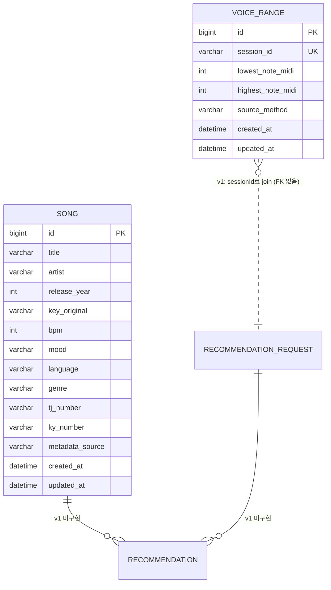

# Domain Model

> ⚠️ 현재 **스켈레톤**입니다. 도메인이 확정되면 §4 유비쿼터스 랭귀지부터 채워 넣고, 엔티티·ERD는 첫 구현 PR과 함께 같이 갱신합니다.

## 1) 목적
- mobruji 도메인의 **공통 어휘**와 **불변식**을 한 곳에 정의해 코드·문서·UX 사이의 용어 불일치를 줄인다.
- 새 기능 구현 전 반드시 이 문서를 먼저 갱신한다 (`01-harness-spec.md §5`).

## 2) 범위 가설 (초기)
- **사용자(User)** — 노래방에서 부를 곡을 찾는 사람
- **음역대(VoiceRange)** — 사용자의 음역 (최저·최고 음 또는 옥타브 기반 분류)
- **곡(Song)** — 추천 대상 단위. 메타데이터(키, 음역, 장르, BPM, 분위기, 출시 연도, 노래방 곡번호 등)
- **추천 요청(RecommendationRequest)** — 사용자가 입력하는 컨텍스트 (음역대, 성별, 분위기, 상황)
- **추천 결과(Recommendation)** — 요청에 대한 곡 리스트와 매칭 근거

## 3) 바운디드 컨텍스트 가설

| 컨텍스트 | 책임 |
|---|---|
| `user` | 회원, 인증, 사용자 프로필 |
| `voice` | 음역대 진단, 음역 데이터 관리 |
| `song` | 곡 카탈로그, 메타데이터, 외부 음원 API 연동 |
| `recommendation` | 추천 알고리즘, 요청→결과 변환 |

> 1차 PoC는 user + voice + song + recommendation을 한 백엔드 모놀리스로 구현. 분리는 트래픽/팀 성장 시점에 재논의.

## 4) 유비쿼터스 랭귀지 (Ubiquitous Language)

| 한국어 | 영어 (코드) | 정의 |
|---|---|---|
| 음역대 | VoiceRange | 사용자가 부를 수 있는 음의 최저~최고 범위 |
| 키 | Key | 곡의 조성 (예: C, G, Am) |
| 곡 음역 | SongRange | 곡 자체의 음역 범위 |
| 추천 | Recommendation | 사용자 컨텍스트 기반 곡 매칭 결과 |
| 분위기 | Mood | 추천 입력 중 정성적 요소 (예: 신남, 잔잔함) |

> 코드/PR/문서에서 위 한국어 ↔ 영어 매핑을 일관 사용. 신규 용어는 이 표에 먼저 추가한 뒤 코드에 도입.

## 5) 엔티티

> 각 PR에서 신규 엔티티 도입 시 본 섹션과 §6 ERD를 같이 갱신한다.

### 5-1) `VoiceRange` (PR #16, voice-range-input.md)
| 필드 | 타입 | 제약 | 설명 |
|---|---|---|---|
| `id` | Long | PK, autoIncrement | 내부 식별자 |
| `sessionId` | String(64) | unique, not null | 익명 세션 식별자 (PoC 시 클라이언트 생성) |
| `lowestNoteMidi` | int | not null, 12~119 | 사용자 최저음 MIDI |
| `highestNoteMidi` | int | not null, 12~119, ≥ lowestNoteMidi | 사용자 최고음 MIDI |
| `sourceMethod` | enum | not null | `SELF_REPORT` / `OCTAVE_PICK` / `MIC_MEASURE` |
| `createdAt` | LocalDateTime | not null | |
| `updatedAt` | LocalDateTime | not null | |

- 불변식: `lowestNoteMidi ≤ highestNoteMidi`, MIDI 범위 [12, 119].
- 도메인 메서드: `static create(...)`, `updateRange(...)`.
- voice-range-input.md Q4 결정에 따라 sessionId 당 **최신 1건만** 보관(unique 제약 + service에서 createOrReplace).

### 5-2) `Song` (PR #17, song-metadata-source.md)
| 필드 | 타입 | 제약 | 설명 |
|---|---|---|---|
| `id` | Long | PK, autoIncrement | |
| `title` | String(200) | not null, not blank | |
| `artist` | String(200) | not null, not blank | |
| `releaseYear` | Integer | nullable | 출시 연도 |
| `keyOriginal` | enum `MusicalKey` | not null | 메이저 12 + 마이너 12 + UNKNOWN |
| `bpm` | Integer | nullable, 30~300 | |
| `mood` | enum `Mood` | nullable | 단일 (v1). 다중은 v2 |
| `language` | String(32) | nullable | ko/en/... |
| `genre` | String(32) | nullable | |
| `tjNumber` | String(16) | nullable | TJ 노래방 번호 |
| `kyNumber` | String(16) | nullable | 금영 노래방 번호 |
| `metadataSource` | enum `MetadataSource` | not null | MANUAL_SEED/EXTERNAL_API/USER_CONTRIBUTION/INFERRED |
| `createdAt`, `updatedAt` | LocalDateTime | not null | |

- 도메인 메서드: `Song.builder()` static factory (필드 다수로 빌더 사용).
- 시드: `classpath:/songs-seed.json` 30곡, `SongSeedLoader`(`@Profile("!test")`)가 부팅 시 idempotent 적재.
- `SongRange`는 본 PR에 없음 (spec Q3 보류 결정).

## 6) Mermaid ERD

- 현재 구현: `VoiceRange`, `Song`. `RecommendationRequest`, `Recommendation`은 다음 PR.
- 익명 세션 모델에서 sessionId가 사실상의 user 식별자. FK 제약 없이 application 레벨에서만 join.

## 7) 오픈 이슈

| # | 주제 | 상태 |
|---|---|---|
| D1 | 음역대 입력 UX — 사용자가 자기 음역을 모르는 경우 어떻게 진단? (마이크 실측? 자가 진단 곡? 옥타브 분류 선택?) | 미정 |
| D2 | 곡 메타데이터 출처 — 직접 입력 / 음원 API 연동 / 크롤링 중 선택 (법적 리스크 검토 필요) | 미정 |
| D3 | 추천 알고리즘 1차 형태 — 규칙 기반 / 임베딩 검색 / LLM 호출 중 선택 | 미정 |
| D4 | 사용자 회원가입 필수 vs 익명 시작 | 미정 |

## 8) 참고
- 코드 컨벤션: `08-code-conventions.md`
- 테스트 정책: `07-testing-guide.md`
- 의사결정 기록: `docs/decisions/`
