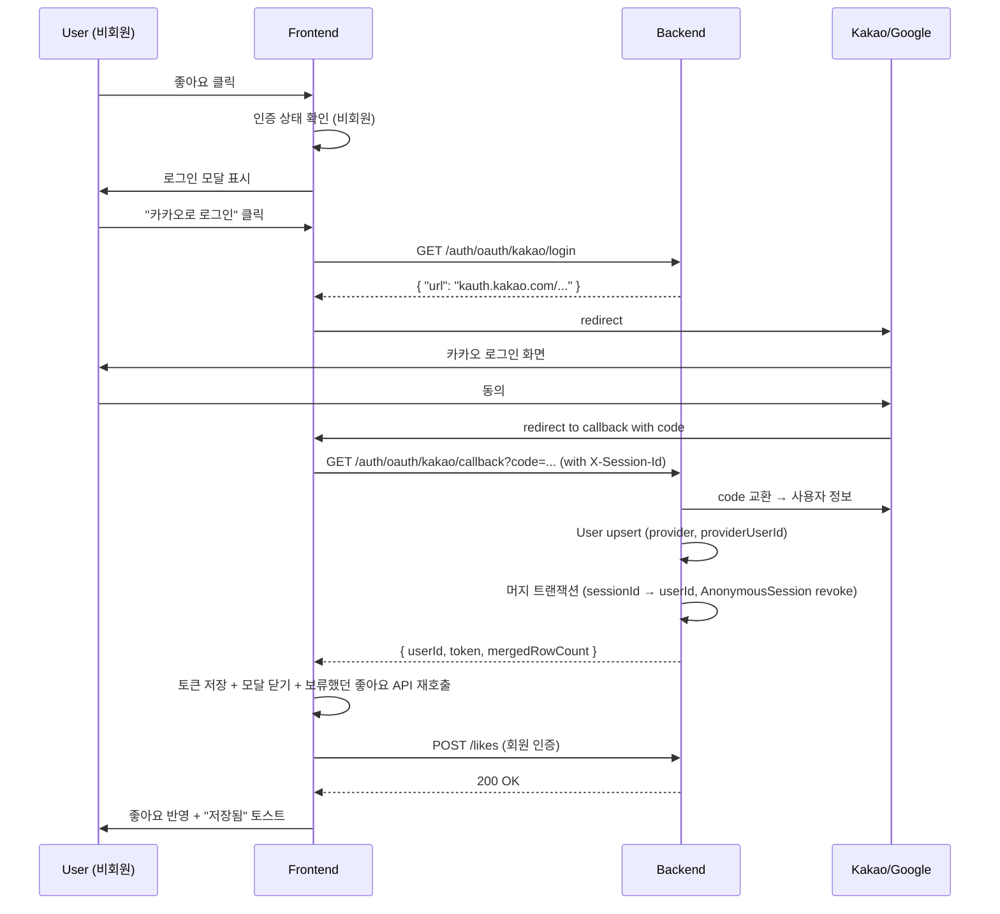

# 비회원/회원 흐름 정책 + 계정 전환 트리거 (v0.4)

## 1) 개요 (What / Why)

- v0.3 까지 모든 endpoint 는 익명 sessionId 위에서 동작했다 (ADR-0011 / ADR-0013). v0.4 에서 정식 계정 시스템(#243)을 도입할 때 **반드시 풀어야 할 정책 질문**은 "회원가입을 언제 / 왜 / 어떻게 강제하는가" 다.
- **본 spec 의 단일 진실**: **비회원(anonymous session)이 1순위 사용 흐름**이다. 음역 측정·추천·히스토리는 비회원 그대로 가능하고, 계정 가입은 **사용자 데이터 영속(좋아요/북마크) + 디바이스 간 동기화**가 필요한 시점에만 트리거된다.
- 대상 액터: 비회원 사용자 (대다수 — "벽" 없는 진입), 회원 사용자 (가치 명확한 액션 후 전환), be (auth 인프라), fe (모달 + 분기 UX).
- 이 결정의 근거: 사용자(@goohong) 판단 — "매번 음역대를 설정하는 것 자체는 자연스러운 루틴이지 벽이 아니다. 벽은 '회원가입을 먼저 하라' 다." → 가치 지점(좋아요/북마크)에서만 전환 유도.
- **경계 (SoT 분리)**: 본 spec = **전환 정책(WHEN/WHY) + sessionId→user 머지 알고리즘**. 인증 **메커니즘**(Spring Security/OAuth redirect/토큰 방식) + **영속 프로필**(음역대·선호 prefill, #1491)은 `user-authentication-and-profile.md` 가 SoT — 본 spec 의 Q2(토큰 방식)는 그 spec §8 Q3 와 단일 결정이다.

## 2) 사용자 시나리오

- **(S1) 비회원 첫 방문 → 추천까지 그대로**: 사용자 A 가 처음 접속 → 음역 측정(VOICE-RANGE) → 성별/분위기 입력 → 추천 5곡 받기. **회원가입/로그인 화면 전혀 노출 안 됨.** sessionId 쿠키만 발급되어 다음 방문 시 voice-range-history 도 보임 (ADR-0013 의 180일 TTL).

- **(S2) 비회원이 마음에 드는 곡에 좋아요 클릭 → 모달**: 사용자 A 가 추천 결과 카드의 좋아요 버튼 클릭 → fe 가 인증 상태 확인 → 비회원이므로 **로그인 모달** 표시 ("이 곡을 저장하려면 로그인하세요. 카카오 / Google / 이메일"). 사용자가 (a) 로그인하면 → 좋아요 즉시 반영 + sessionId 데이터 머지, (b) 닫으면 → 좋아요 미반영, 추천 결과는 그대로 유지(사용 흐름 차단 없음).

- **(S3) 비회원이 북마크 클릭 → 같은 모달**: S2 와 동일 패턴. 북마크는 "다음에 부르려고 저장" 의도이므로 회원 가치가 명확. 좋아요/북마크 두 액션 모두 같은 모달 컴포넌트 공유.

- **(S4) 회원이 다른 디바이스에서 로그인**: 사용자 B 가 집 PC 에서 로그인 → 휴대폰에서 같은 계정으로 로그인 → voice-range 시계열 + 좋아요/북마크 모두 동기화되어 표시. 음역 측정은 디바이스 마이크 차이로 다시 측정 권장 (UX 안내).

- **(S5) 비회원이 디바이스를 바꾸거나 쿠키 삭제 → 데이터 손실**: 사용자 C 가 6개월 후 새 휴대폰에서 접속 → 이전 sessionId 쿠키 없음 → 비회원 신규 진입. **이전 voice-range/history 모두 보이지 않음.** fe 가 "비회원은 디바이스 간 동기화가 안 됩니다. 데이터를 보존하려면 로그인하세요" 안내(상단 dismissible banner 1회).

- **(S6) 회원이 비회원 sessionId 로 사용 중 로그인**: 사용자 D 가 비회원으로 좋아요 미클릭 상태에서 사용 중 → 상단 "로그인" 버튼 클릭 → 로그인 완료 → 현재 sessionId 의 voice-range/history 데이터가 자동으로 user_id 로 머지 (ADR-0013 §D-4) → sessionId revoke.

## 3) 요구사항

### 기능 요구사항

#### A) 비회원/회원 매트릭스 (어떤 기능이 비회원/회원에게 어디까지 열리는가)

| 기능 | 비회원 | 회원 | 비고 |
|---|---|---|---|
| 음역 측정 (POST /voice-range) | OK | OK | sessionId/user_id 둘 다 owner 가능 |
| 추천 요청 (POST /recommendations) | OK | OK | 동일 |
| 추천 결과 조회 + YouTube 링크 | OK | OK | 인증 불요 (공개 데이터) |
| voice-range-history 조회 (GET /sessions/{id}/voice-range-history) | OK (자기 sessionId) | OK (자기 user) | session-bound 인증 (ADR-0011) |
| recommendation-history 조회 | OK (자기 sessionId) | OK (자기 user) | 동일 |
| **좋아요 (POST/DELETE /likes)** | **클릭 시 모달** | OK | 비회원은 모달 닫으면 미실행 |
| **북마크 (POST/DELETE /bookmarks)** | **클릭 시 모달** | OK | 동일 |
| 좋아요/북마크 목록 조회 (GET) | OK (자기 sessionId, 비어 있을 것) | OK (자기 user) | 비회원은 항상 빈 배열 (좋아요/북마크 자체가 안 만들어지므로) |
| **디바이스 간 동기화** | **NO** | **OK** | 회원 전환의 핵심 가치 |
| 세션 초기화 (POST /sessions/rotate) | OK | OK | ADR-0013 §D-2 |
| 계정 탈퇴 (POST /account/delete) | N/A | OK | 별 spec (v0.4 후속) |

- 비회원도 좋아요/북마크 **버튼 자체는 노출**한다 (회색 처리 등으로 비활성화 시각화 NOT 권장 — 클릭해야 가치 발견). 클릭 시점에 모달.
- 좋아요/북마크 외 다른 endpoint 에 **인증 모달 트리거 금지** — 사용 흐름이 모달로 끊기는 일은 좋아요/북마크 두 액션만.

#### B) 전환 트리거 정책

- **트리거 시점**: 좋아요/북마크 버튼 클릭 시 (fe 단에서 인증 상태 확인 → 비회원이면 모달 표시 + 원래 액션 보류).
- **트리거 금지 시점**:
  - 첫 방문, 음역 측정 직후, 추천 결과 표시 직후, history 페이지 진입 → **모달 노출 금지**.
  - 자동 popup / interstitial / 모달은 좋아요/북마크 클릭 이외에는 없다.
- **dismissible banner (선택)**: 상단에 "비회원은 디바이스 간 동기화가 안 됩니다 — 로그인하기" 1회 노출 후 사용자가 닫으면 sessionId 단위로 영구 dismiss (LocalStorage 저장). banner 는 friction 이 낮은 알림이라 허용하나, A/B test 로 효용 검증 권장 (§8 Q3).

#### C) 로그인 모달 UX

- **트리거**: 좋아요/북마크 버튼 클릭 (비회원 한정).
- **copy**: "이 곡을 저장하려면 로그인하세요" + "회원가입은 10초면 끝납니다" (의역). 한국어 first.
- **로그인 옵션**: (1) 카카오 OAuth, (2) Google OAuth, (3) 이메일/패스워드. 이메일은 v0.4 P1 에서는 후순위 — OAuth 두 개 먼저 (Q1 결정 따라).
- **회원가입 분리 X**: "로그인" 모달 안에 신규 가입도 한 흐름 — OAuth 라면 "처음 사용 시 자동 계정 생성" 명시. 이메일이면 "회원가입 → 인증 메일" 분기.
- **닫기 동작**: 모달 닫으면 좋아요/북마크 미실행 + 사용자 흐름 그대로 유지 (페이지 리로드 / redirect 금지). 토스트로 "로그인하지 않아 저장되지 않았습니다" 안내(선택).
- **모달 컴포넌트 1개 재사용**: 좋아요/북마크 두 트리거가 같은 모달 호출 — copy 의 "이 곡을" 부분만 액션 컨텍스트로 분기.

#### D) sessionId → user_id 데이터 인계 (ADR-0013 §D-4 상세화)

> ADR-0013 §D-4 는 "자동 머지 1회 수행" 까지 선언했다. 본 spec 은 **머지 알고리즘의 단계별 정합성**을 상세화한다.

머지 트리거: 사용자가 로그인 (OAuth 콜백 또는 이메일 로그인 성공) 시점에 다음을 수행 — 비동기 큐 NOT 권장 (UX 즉시성 우선, p95 ≤ 500ms 목표).

```
1. 인증 완료 직후, 클라이언트가 보유한 sessionId 를 X-Session-Id 헤더로 동봉.
2. 백엔드:
   a. sessionId 가 AnonymousSession 테이블에 존재 + revoked 가 아닌지 확인.
      → 없으면 머지 스킵 (그냥 로그인만 처리).
   b. sessionId 의 모든 데이터 owner 치환 (단일 트랜잭션):
      - voice_range.session_id  → user_id  (or dual column)
      - voice_range_snapshot.session_id  → user_id
      - like.session_id  → user_id      ※ 비회원은 like 가 없으므로 보통 0건
      - bookmark.session_id  → user_id  ※ 동일
      - recommendation.session_id  → user_id
      - recommendation_result_entry.session_id  → user_id
   c. AnonymousSession.revokedAt = now() + revokedReason = ACCOUNT_MERGE
   d. 메트릭 카운터 증분: mobruji.session.merged
3. 응답: { "userId": ..., "mergedSessionId": "<prefix-8-mask>...", "mergedRowCount": N }
```

**충돌 케이스 처리** (ADR-0013 §D-4 보강):

- **이미 같은 user 에 다른 sessionId 가 머지된 상태 + 신규 sessionId 추가 머지**: 데이터 owner 치환만 수행 (중복 user 생성 X). like/bookmark 의 unique 제약 `(user_id, song_id)` 위반 시 → **oldest createdAt 유지, 신규 row 무시** (ADR-0013 §D-4 룰 그대로).
- **같은 sessionId 로 두 user 가 동시에 로그인 시도** (희박 케이스 — 같은 디바이스에서 다른 계정 두 개): 두 번째 로그인 시 sessionId 가 이미 revoked → 머지 스킵, 두 번째 user 는 빈 상태로 진입.
- **머지 트랜잭션 실패 (DB 오류)**: 로그인 자체는 성공 처리 (인증 토큰 발급), 머지만 실패. 실패 메트릭 (`mobruji.session.merge.failed`) 증분 + Discord 알림. 수동 재시도는 별 endpoint (`POST /api/v1/account/merge-retry`) 로 처리 — v0.4 P2.

#### E) 비회원 사용 한도

- **한도 없음** (v0.4 진입 시점). 음역 측정 / 추천 요청 모두 sessionId 단위로 ADR-0013 의 TTL/rate-limit (별도 결정 — 본 spec 범위 외) 외 추가 한도 없음.
- **장기적 옵션**: 비회원 추천 횟수 제한 (예: 일 5회) → 회원 전환 유도. **v0.4 에는 도입 안 함** — 데이터 누적 후 사용자 흐름 측정 결과 보고 v0.5+ 에서 재검토. 본 spec §8 Q4.

#### F) 데이터 손실 시나리오 (사용자 안내)

비회원이 다음 상황에서 데이터를 잃는다 — fe 가 사전 안내 + 사후 복구 불가 명시:

| 상황 | 손실 데이터 | fe 안내 시점 |
|---|---|---|
| 쿠키 삭제 (브라우저 설정) | 전부 | 안내 불가 (사용자 직접 행위) |
| 디바이스 변경 (휴대폰 교체 등) | 전부 | 회원 전환 banner (3-B) |
| 시크릿 모드/InPrivate | 전부 | 안내 불가 (브라우저 자체) |
| 180일 미접속 (ADR-0013 TTL) | 전부 | TTL 임박 시 (예: 150일째) 알림 — v0.5 후보, v0.4 범위 외 |
| 명시적 세션 초기화 (POST /sessions/rotate) | 선택 (DELETE 모드) | rotate 호출 직전 confirm 모달 |

- fe 의 dismissible banner (3-B) 가 1차 안내. 추가 안내(매번 모달 등) 는 friction 만 늘림 → 도입 안 함.

### 비기능 요구사항

- **결정성**: 본 spec 의 모든 정책은 ADR-0013 §D-4 + 본 spec §3-D 단일 진실. 변경 시 두 문서 동시 갱신.
- **응답시간**: 로그인 + 머지 통합 p95 ≤ 500ms (OAuth 콜백 RTT 제외, 백엔드 처리만). 머지 트랜잭션 자체 p95 ≤ 100ms (행 수 ≤ 100 가정).
- **설정 외부화**: OAuth client id/secret, JWT secret, 토큰 만료 시간 모두 `application.yml` 외부화 (보호 영역 — `needs-human-review`).
- **관측성**: ADR-0013 §D-5 의 `mobruji.session.merged` 카운터 + 본 spec 신설 `mobruji.account.login{provider=kakao|google|email}`, `mobruji.account.signup{provider}`, `mobruji.session.merge.failed` (이상 신설은 observability-baseline.md §5-3 표 갱신 동반).
- **보안**: sessionId 원문 비노출(ADR-0011/0013), OAuth 토큰은 HttpOnly cookie 또는 Authorization header (fe 결정 — 별 ADR 후보). JWT 사용 시 short-lived access + refresh token 분리 (v0.4 정식 인증 ADR 에서 결정).
- **데이터 정합성**: 머지 트랜잭션은 단일 RDB 트랜잭션 — 부분 실패 시 전체 롤백.

## 4) 범위 / 비범위

### 포함

- 비회원/회원 기능 매트릭스 (§3-A)
- 전환 트리거 정책 (좋아요/북마크 = 모달, 그 외 = 비회원 OK) (§3-B)
- 로그인 모달 UX 사양 (copy/옵션/닫기 동작) (§3-C)
- sessionId → user_id 머지 알고리즘 + 충돌 케이스 (§3-D, ADR-0013 §D-4 상세화)
- 비회원 사용 한도 정책 결정 (한도 없음, §3-E)
- 데이터 손실 시나리오 사용자 안내 (§3-F)
- 구현 PR 분할 (PR A~F, §6)

### 제외 (Out of Scope)

- **OAuth provider 별 client 등록 절차** (카카오/Google 개발자 콘솔 셋업) — 운영 런북 별 spec 또는 PR A 안에서 처리.
- **이메일 인증 메일 인프라** (SES/SendGrid 등) — 이메일 로그인 활성화 시 별 ADR (Q1).
- **계정 탈퇴 / 비밀번호 재설정 / 이메일 변경** — v0.4 P2~P3 별 spec.
- **2FA / passkey / SSO** — v0.5 이후.
- **opt-in anonymize 옵션** (ADR-0013 §D-3) 의 상세 구현 — 본 spec 범위 외 (별 spec).
- **다중 디바이스 sessionId 동기화** (비회원이 sessionId 토큰 export/import) — Q5, default = 미지원.
- **소셜 친구 기능** (서로 좋아요 곡 공유 등) — recommendation-history-and-feedback spec §4 Out of Scope 그대로.
- **JWT vs session cookie 결정** — v0.4 정식 인증 ADR (Q2).

## 5) 설계

### 5-1) 도메인 모델

신규 엔티티 1개 (User), 기존 엔티티 (`voice_range`, `voice_range_snapshot`, `like`, `bookmark`, `recommendation`, `recommendation_result_entry`) 의 owner 컬럼 확장:

```
User
├─ userId           : BIGINT, PK, AUTO_INCREMENT
├─ provider         : VARCHAR(16) NOT NULL (KAKAO / GOOGLE / EMAIL)
├─ providerUserId   : VARCHAR(128) NOT NULL  (OAuth 의 sub / 이메일이면 email)
├─ email            : VARCHAR(255) NULL  (provider=EMAIL 이면 NOT NULL, OAuth 이면 optional)
├─ displayName      : VARCHAR(64) NULL
├─ createdAt        : TIMESTAMP NOT NULL
├─ lastLoginAt      : TIMESTAMP NULL
├─ revokedAt        : TIMESTAMP NULL  (탈퇴 시)
└─ UNIQUE (provider, providerUserId)
```

기존 엔티티 owner 확장 옵션:

- (a) **dual column** (sessionId nullable + userId nullable, 둘 중 하나 NOT NULL CHECK 제약). 머지 시 sessionId NULL + userId set.
- (b) **컬럼 이름 변경 (sessionId → ownerId + ownerType)**. 머지 시 ownerType 변경.

→ **권장 (a) dual column** — backward compatible, 마이그레이션 부담 최소. v0.4 PR B 가 결정 (Q6).

`06-domain-model.md` 갱신 필요 항목:
- §4 유비쿼터스 랭귀지: `User`, `OAuthProvider`, `AccountMerge`, `LoginModal`, `AccountConversionTrigger` 등재.
- §5 엔티티: `User` 행 추가, 기존 엔티티 owner 컬럼 표기 갱신.
- §6 Mermaid ERD: `User` 노드 + 기존 엔티티에서 sessionId/userId 둘 다 표기.

(§7 오픈 이슈는 손대지 않음 — feedback_domain_model_section_7 룰)

### 5-2) API 엔드포인트

| Method | Path | 설명 | 인증 | Req | Res |
|---|---|---|---|---|---|
| GET  | `/api/v1/auth/oauth/{provider}/login`    | OAuth 로그인 redirect URL 발급 | 불요 | provider path | `{ "url": "..." }` |
| GET  | `/api/v1/auth/oauth/{provider}/callback` | OAuth 콜백 + 자동 머지 | 불요 | code query | `{ "userId", "mergedSessionId" (마스킹), "mergedRowCount", "token" }` |
| POST | `/api/v1/auth/email/signup`              | 이메일 회원가입 + 인증 메일 발송 (Q1 결정 후) | 불요 | `{ email, password }` | `{ "userId", "verifyPending": true }` |
| POST | `/api/v1/auth/email/login`               | 이메일 로그인 + 자동 머지 | 불요 | `{ email, password }` | `{ "userId", "token", "mergedSessionId" (마스킹), "mergedRowCount" }` |
| POST | `/api/v1/auth/logout`                    | 로그아웃 (토큰 invalidate) | 회원 | — | 204 |
| GET  | `/api/v1/auth/me`                        | 현재 user 정보 조회 | 회원 | — | `{ "userId", "provider", "displayName" }` |
| POST | `/api/v1/sessions/merge-to-account`      | (수동 재시도용) sessionId → user 머지 | 회원 | `{ "sessionId" }` (헤더로도 가능) | `{ "mergedRowCount" }` |

- like/bookmark endpoint (`POST/DELETE /likes`, `POST/DELETE /bookmarks`) 는 v0.4 에서 **인증 필수 endpoint 로 변경** (현재는 sessionId 만으로 가능). fe 가 미인증 사용자에게 모달 표시하므로 호출 자체가 일어나지 않게 됨. 백엔드는 **회원 only** 로 게이트 — 비회원 호출 시 401. 게이트 컴포넌트는 `SessionAuthGuard` 대신 `UserAuthGuard` (신설) 사용.

### 5-3) 외부 연동

- **카카오 OAuth**: client id/secret 발급 (kauth.kakao.com). redirect URL 운영/dev 분리.
- **Google OAuth**: client id/secret 발급 (Google Cloud Console). 동일.
- **이메일 메일 발송** (Q1 결정 후): AWS SES / SendGrid / Resend 중 선택. 이메일 로그인 활성화 PR 에서 ADR 신설.
- 실패 처리: OAuth 콜백 실패 시 fe 가 "로그인에 실패했습니다. 다시 시도해주세요" 토스트 + 로그인 페이지 유지.

### 5-4) 데이터 흐름 / 시퀀스 (로그인 + 머지)



### 5-5) DB 마이그레이션 (Flyway)

```
V<next>__create_user.sql
  CREATE TABLE user (
    user_id           BIGINT       NOT NULL AUTO_INCREMENT PRIMARY KEY,
    provider          VARCHAR(16)  NOT NULL,
    provider_user_id  VARCHAR(128) NOT NULL,
    email             VARCHAR(255) NULL,
    display_name      VARCHAR(64)  NULL,
    created_at        TIMESTAMP    NOT NULL,
    last_login_at     TIMESTAMP    NULL,
    revoked_at        TIMESTAMP    NULL,
    UNIQUE KEY uq_provider_provider_user_id (provider, provider_user_id),
    INDEX idx_email (email)
  );

V<next+1>__add_user_id_to_owned_entities.sql
  ALTER TABLE voice_range            ADD COLUMN user_id BIGINT NULL, ADD INDEX idx_user_id (user_id);
  ALTER TABLE voice_range_snapshot   ADD COLUMN user_id BIGINT NULL, ADD INDEX idx_user_id (user_id);
  ALTER TABLE `like`                 ADD COLUMN user_id BIGINT NULL, ADD INDEX idx_user_id (user_id);
  ALTER TABLE bookmark               ADD COLUMN user_id BIGINT NULL, ADD INDEX idx_user_id (user_id);
  ALTER TABLE recommendation         ADD COLUMN user_id BIGINT NULL, ADD INDEX idx_user_id (user_id);
  ALTER TABLE recommendation_result_entry ADD COLUMN user_id BIGINT NULL, ADD INDEX idx_user_id (user_id);
  -- CHECK 제약 (session_id IS NOT NULL OR user_id IS NOT NULL) 은 MySQL 8.4 지원하나
  -- 운영 데이터 검증 후 별 PR 로 추가 (PR B 후속).
```

- 보호 영역(Flyway + application.yml + build.gradle 변경 가능성) → 해당 PR 들은 `needs-human-review` 라벨.

### 5-6) 프론트엔드 화면

- **로그인 모달 컴포넌트** (`web/components/auth/LoginModal.tsx`): 좋아요/북마크 두 트리거가 공유. props `actionContext: "like" | "bookmark"` 로 copy 분기.
- **로그인 페이지** (`web/app/(auth)/login/page.tsx`): 모달 외 직접 진입 경로 (상단 "로그인" 버튼). 모달과 같은 옵션.
- **OAuth 콜백 라우트** (`web/app/(auth)/auth/callback/[provider]/page.tsx`): backend 콜백 endpoint 호출 → token 저장 → 원래 페이지로 redirect.
- **인증 상태 관리**: React Query `useAuth()` hook + Zustand auth store (토큰 + user 정보). 토큰 만료 시 자동 logout + 로그인 모달 재표시.
- **좋아요/북마크 분기 로직**: 버튼 컴포넌트가 클릭 시 `useAuth().isAuthenticated` 확인 → 미인증 시 모달 open + 액션 보류 (`pendingAction` state). 로그인 성공 시 보류 액션 자동 실행.
- **dismissible banner**: 상단 layout 에 `<AccountConversionBanner />` — sessionId 단위 LocalStorage 키로 dismiss 영구 저장.

## 6) 작업 분할 (예상 PR 리스트)

> 본 spec(PR 0)은 plan 트랙. 구현은 v0.4 P0 P1 묶음.

- [ ] **PR 0 (현 PR, plan)**: 본 spec 신설 + ADR-0013 §D-4 갱신 (머지 알고리즘 상세화 참조) + #243 본문 갱신 (placeholder 였던 v0.4 사용자 계정 spec → 본 spec 으로 분기).

- [ ] **PR A (be, v0.4 P0)**: 인증 인프라 — Spring Security 도입 + JWT/session 결정 ADR 신설 (Q2) + OAuth client 설정 + `UserAuthGuard` 골격. 보호 영역(`application.yml` + `build.gradle`) → `needs-human-review`. ADR-0011 (session-bound) superseded 처리는 본 PR 또는 후속.

- [ ] **PR B (be, v0.4 P0)**: User 엔티티 + Flyway V<next> (create_user) + V<next+1> (add user_id 컬럼 6개 테이블). 보호 영역 → `needs-human-review`. dual column 결정 (Q6) 본 PR 에서 확정.

- [ ] **PR C (fe, v0.4 P0)**: 로그인 페이지 + LoginModal 컴포넌트 + OAuth 콜백 라우트 + `useAuth` hook + Zustand auth store. dismissible banner 포함.

- [ ] **PR D (fe, v0.4 P1)**: 좋아요/북마크 버튼 컴포넌트 클릭 시 인증 분기 (미인증 → 모달 + pendingAction). 모달 닫으면 미실행. 로그인 완료 후 pendingAction 자동 실행.

- [ ] **PR E (be, v0.4 P1)**: anonymous → user 자동 머지 트랜잭션 구현 (OAuth 콜백 + 이메일 로그인 endpoint 안에서 호출). ADR-0013 §D-4 + 본 spec §3-D 알고리즘 그대로. 메트릭 카운터 (`mobruji.session.merged`, `mobruji.account.login{provider}`) 신설. observability-baseline.md §5-3 표 갱신 동반.

- [ ] **PR F (be, v0.4 P2)**: 디바이스 간 동기화 — 로그인 시 user 의 모든 데이터 조회 endpoint (`GET /api/v1/users/{userId}/voice-range-history`, `/users/{userId}/recommendation-history`, `/users/{userId}/likes`, `/users/{userId}/bookmarks`). 기존 `/sessions/{id}/*` endpoint 와 패턴 동일하나 `UserAuthGuard` 사용. (또는 기존 endpoint 가 user-mode 분기를 흡수 — PR F 안에서 결정.)

- [ ] **PR G (be, v0.4 P2)**: 머지 실패 재시도 endpoint (`POST /api/v1/sessions/merge-to-account`) + Discord 알림 (`mobruji.session.merge.failed`). 회원이 별 디바이스에서 누적한 sessionId 를 수동으로 머지하는 경로도 겸함.

- [ ] **PR H (plan, v0.4 P2)**: 이메일 로그인 활성화 ADR (메일 발송 인프라 — SES/SendGrid 결정). PR I (이메일 로그인 구현) 가 후속.

- [ ] **PR I (be+infra, v0.4 P2/P3)**: 이메일 회원가입/로그인 endpoint + 인증 메일 발송 + 비밀번호 재설정. PR H ADR 결정 후.

## 7) 테스트 전략

- **단위**:
  - `UserAuthGuard` JWT 검증 / 만료 토큰 거부.
  - 머지 트랜잭션 — owner 치환 + AnonymousSession revoke + 카운터 증분.
  - 충돌 케이스: 같은 (user_id, song_id) 의 like 중복 시 oldest 유지.
  - 머지 실패 시 로그인 자체는 성공.

- **통합**:
  - Flyway V<next>/V<next+1> 마이그레이션 정합성.
  - OAuth 콜백 endpoint (provider mock) 호출 → User upsert + 머지 + 토큰 발급.
  - 비회원 like 호출 시 401 (UserAuthGuard 발동).

- **E2E (RestAssured)**:
  - OAuth 콜백 성공 케이스 — 머지 완료 + 토큰 발급 + like 호출 가능.
  - 머지 실패 시나리오 — 로그인은 성공, mergedRowCount=0.
  - 이메일 로그인 (PR I 단계).

- **fe**:
  - LoginModal 컴포넌트 렌더링 + 옵션 클릭.
  - 좋아요 버튼: 비회원 클릭 → 모달 / 회원 클릭 → 즉시 호출.
  - 모달 닫기 → pendingAction 미실행.
  - dismissible banner: 닫으면 LocalStorage 저장 + 재진입 시 미노출.

## 8) 오픈 질문

| # | 질문 | 선택지 | 담당/기한 |
|---|---|---|---|
| Q1 | OAuth provider 우선순위 + 이메일 활성화 시점 | (a) 카카오 + Google 우선, 이메일은 v0.4 P2 / (b) 셋 다 동시 / (c) 이메일 먼저 | @goohong / PR A |
| Q2 | 토큰 방식 — JWT vs session cookie | (a) JWT (Bearer header) / (b) session cookie (HttpOnly) / (c) hybrid | @goohong / PR A (별 ADR) |
| Q3 | dismissible banner 도입 여부 | (a) v0.4 P0 부터 노출 / (b) 도입 후 A/B test / (c) 도입 안 함 | @goohong / PR C |
| Q4 | 비회원 추천 횟수 제한 | (a) 한도 없음 (default) / (b) v0.5+ 데이터 본 후 결정 / (c) v0.4 부터 일 N회 | @goohong / 운영 데이터 측정 후 |
| Q5 | 비회원 sessionId 토큰 export/import 지원 (다른 디바이스로 인계) | (a) 미지원 (default) / (b) export-only / (c) 양방향 | @goohong / v0.5+ |
| Q6 | owner 컬럼 — dual column (sessionId + userId) vs ownerType 변환 | (a) dual column (default 권장) / (b) ownerType 컬럼 신설 | @goohong / PR B |
| Q7 | OAuth provider 별 displayName/email 자동 수집 범위 | (a) 최소 (provider sub 만) / (b) email + displayName 권장 / (c) profile 전체 | @goohong / PR A |
| Q8 | 머지 실패 시 사용자에게 알릴 것인가 | (a) 토스트로 "이전 데이터 가져오기 실패, 재시도 가능" / (b) silent + 운영 알림만 | @goohong / PR E |

## 9) 결정 로그

- **2026-05-22 (plan 38, 본 PR)**: 초안 작성 (status=draft).
  - **핵심 정책 결정**: 비회원이 1순위 사용 흐름. 음역 측정·추천·히스토리는 비회원 OK. 회원 전환 트리거는 좋아요/북마크 클릭 시점 (모달).
  - **근거**: 사용자(@goohong) 판단 — "매번 음역대 설정 자체는 자연스러운 routine, 벽이 아니다. 벽은 '회원가입 먼저'. 좋아요/북마크는 사용자 특정 가치 명확."
  - **머지 알고리즘 상세화**: ADR-0013 §D-4 의 "자동 머지 1회" 를 단계별로 명세 — sessionId 보유 → owner 치환 (6개 테이블) → AnonymousSession revoke → 카운터 증분. 충돌 케이스 (재머지 / 동일 sessionId 두 user) / 실패 처리 (로그인은 성공, 머지만 실패) 명문화.
  - **구현 PR 분할**: A (auth 인프라) → B (User 엔티티 + 마이그레이션) → C (로그인 페이지/모달) → D (좋아요/북마크 분기) → E (머지 구현) → F (디바이스 동기화) → G (재시도 endpoint) → H (이메일 ADR) → I (이메일 구현). 보호 영역(A/B) 는 `needs-human-review`.
  - **비회원 사용 한도 = 없음** (v0.4). 데이터 누적 후 v0.5+ 재검토.
  - **데이터 손실 안내**: dismissible banner 1회 노출 (sessionId 단위 영구 dismiss).
  - **like/bookmark endpoint 인증 변경**: v0.4 부터 회원 전용 (`UserAuthGuard`). 비회원 호출 시 401 — fe 단에서 모달이 호출 자체를 차단.
  - **#243 본문 갱신**: placeholder 였던 v0.4 사용자 계정 spec 의 단일 진실이 본 spec 으로 이관.
