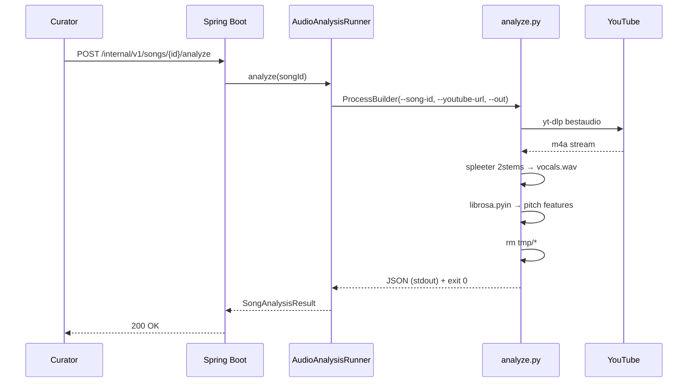

# Python 오디오 분석 툴링 부트스트랩

## 1) 개요 (What / Why)
- ADR 0006 (YouTube 기반 audio 추출) 및 ADR 0010 (Python worker 분리 결정)의 후속 구현 spec.
- 곡 메타데이터의 `audio_url` (YouTube)에서 음원을 추출하고 보컬 stem 분리 + pitch detection을 거쳐 곡의 음역대(min/max/median pitch)와 보컬 특성을 JSON으로 산출하는 **Python 분석 파이프라인 부트스트랩**.
- Spring Boot (Java 21) 본진은 분석 자체를 수행하지 않고 Python 워커를 호출(`ProcessBuilder` 또는 향후 HTTP)하여 결과를 수신한다.
- 대상 액터: 백엔드 (재추천 알고리즘이 사용할 곡 음역대 데이터의 공급원), 데이터 큐레이터 (시드 100곡 자동 분석).

## 2) 사용자 시나리오
- 큐레이터가 신규 곡을 등록하면, 백엔드가 `AudioAnalysisRunner.analyze(songId)`를 호출하고 곡의 보컬 음역대·중심 pitch를 DB에 기록한다.
- 시드 100곡 (`song-curation-seed-100.md`) 일괄 분석 시 Python CLI를 직접 batch 실행하여 JSON 결과를 DB에 적재한다.
- 분석 실패 시 (저작권 차단 / yt-dlp 실패 / spleeter OOM) fallback 정책에 따라 `analysis_status=FAILED`로 마킹하고 추천 후보에서 일시 제외한다.

## 3) 요구사항
### 기능 요구사항
- [ ] `tools/audio-analysis/requirements.txt` — `yt-dlp`, `spleeter`, `librosa`, `numpy` 핀 버전 고정
- [ ] `tools/audio-analysis/analyze.py` CLI:
  - 입력: `--song-id <id> --youtube-url <url> --out <path.json>`
  - 단계: (1) yt-dlp로 audio (m4a/webm) 추출 → 임시 디렉터리 (2) spleeter `2stems` 로 vocals.wav 분리 (3) librosa로 pitch detection (`pyin` 또는 `piptrack`) (4) min/max/median Hz + 표준편차 + 평균 RMS → JSON 출력 (5) 임시 audio 파일 즉시 삭제
- [ ] `tools/audio-analysis/Dockerfile` (옵션, 운영 환경 격리용) — Python 3.11 slim + ffmpeg
- [ ] `backend/.../application/AudioAnalysisRunner.java` — `ProcessBuilder` 기반 호출, stdout JSON 파싱, exit code/타임아웃 처리
- [ ] JSON 스키마: `{ songId, pitchMinHz, pitchMaxHz, pitchMedianHz, pitchStdHz, durationSec, analyzedAt, toolingVersion }`
- [ ] 분석 결과는 `song_analysis` 테이블에 upsert (`song-self-analysis-pipeline.md`와 정합)

### 비기능 요구사항
- 곡당 분석 시간 **30초 이내** (3~4분 곡 기준, 단일 코어)
- 임시 audio 파일은 **분석 종료 시 무조건 삭제** (저작권 — 영구 저장 금지)
- spleeter 모델은 컨테이너/워커 시작 시 1회 로드 (cold start 비용 회피)
- 실패 fallback: yt-dlp 실패 (HTTP 403/410), spleeter OOM, librosa NaN → `analysis_status=FAILED` + 재시도 큐 (최대 3회, 백오프)
- 로깅: `songId`, `step`, `elapsedMs`, `exitCode`만 남기고 URL 원문은 INFO 이상에서 마스킹
- 관측성: `audio_analysis_duration_seconds` 히스토그램 + `audio_analysis_failures_total{reason}` 카운터

## 4) 범위 / 비범위
### 포함
- Python CLI 파이프라인의 **부트스트랩 (디렉터리·의존성·analyze.py 골격)**
- Spring 측 `AudioAnalysisRunner` 인터페이스 + ProcessBuilder 구현
- 단일 곡 동기 호출 (CLI 직접)
- JSON 결과 스키마 v1 확정

### 제외 (Out of Scope)
- HTTP 기반 워커 서버화 (FastAPI 등) — 별도 spec
- 분산 큐 (Redis/SQS) 기반 비동기 batch — 운영 검증 후 별도 spec
- 보컬 외 stem 활용 (drum/bass/other)
- 자체 호스팅 오디오 mirror (저작권 이슈)
- Python 워커 K8s 배포 — infra spec에서

## 5) 설계
### 5-1) 도메인 모델
- `song`, `song_analysis` 컨텍스트. `docs/ai-harness/06-domain-model.md` §5 참조.
- `SongAnalysis` 엔티티: `songId`(FK), `pitchMinHz`, `pitchMaxHz`, `pitchMedianHz`, `pitchStdHz`, `durationSec`, `analyzedAt`, `toolingVersion`, `analysisStatus(SUCCESS|FAILED|PENDING)`

### 5-2) API 엔드포인트
| Method | Path | 설명 | 인증 | Req | Res |
|---|---|---|---|---|---|
| POST | /internal/v1/songs/{songId}/analyze | 단일 곡 분석 트리거 (관리자) | 관리자 | - | `SongAnalysisResponse` |

> 외부 공개 API 없음. 내부 호출 또는 큐레이터 CLI 위주.

### 5-3) 외부 연동
- **yt-dlp**: YouTube 음원 추출. UA/포맷 옵션 `bestaudio`. 차단 시 fallback 큐.
- **spleeter** (Deezer, MIT): 보컬 stem 분리. 사전학습 모델 `2stems-16kHz`.
- **librosa**: pitch detection. `librosa.pyin` (F0 추정).
- API 키 없음. 모든 의존성은 `requirements.txt` 핀.

### 5-4) 데이터 흐름 / 시퀀스

### 5-5) DB 마이그레이션
- `song_analysis` 테이블 신규 (`song-self-analysis-pipeline.md`와 동일 — 중복 정의 금지). 이 spec에서는 컬럼 추가만:
  - `tooling_version VARCHAR(32)` (예: `analyze-py-0.1.0`)
  - `pitch_std_hz DECIMAL(7,2)`

### 5-6) 프론트엔드 화면
- 해당 없음. 큐레이터 콘솔은 별도 spec.

## 6) 작업 분할 (예상 PR 리스트)
- [ ] **PR A** `feat(song): tools/audio-analysis 스캐폴딩` — requirements.txt, analyze.py hello-world, README
- [ ] **PR B** `feat(song): analyze.py yt-dlp+spleeter+librosa 파이프라인` — 실제 분석 로직 + JSON 스키마
- [ ] **PR C** `feat(song): AudioAnalysisRunner (ProcessBuilder)` — Spring 측 호출 어댑터 + 통합테스트(모킹)
- [ ] **PR D** `feat(song): /internal/v1/songs/{id}/analyze 엔드포인트 + song_analysis 마이그레이션`

## 7) 테스트 전략
- **Python**: `pytest` — 짧은 샘플 wav (저작권 free, 5초)로 pyin/spleeter 통합 테스트. yt-dlp는 mock(`responses` 또는 로컬 파일).
- **Spring 단위**: `AudioAnalysisRunner`는 ProcessBuilder를 stub(가짜 python 스크립트 실행). exit code/timeout/JSON 파싱 분기 검증.
- **E2E**: PR D에서 `/internal/v1/songs/{id}/analyze` RestAssured 성공 케이스 1건 (분석 결과는 stub Runner 주입).
- **수동**: 시드 곡 5곡으로 실제 분석 1회 수행 (PR B 머지 직후, 결과 spec에 첨부).

## 8) 오픈 질문

| # | 질문 | 선택지 | 담당/기한 |
|---|---|---|---|
| Q1 | spleeter는 TF 의존성이 무겁다. 대체 모델 (demucs, openunmix) 고려? | (a) spleeter 유지 (b) demucs 전환 (c) 둘 다 벤치 후 결정 | @goohong / 2026-05-28 |
| Q2 | yt-dlp 차단(403/age-gate) 비율이 높을 경우 fallback 소스? | (a) Spotify preview 30s (b) iTunes preview (c) 차단 곡은 후보 제외 | @goohong / 2026-06-04 |
| Q3 | ProcessBuilder vs HTTP 워커 전환 시점 기준은? | (a) 초당 분석 요청 N건 이상 (b) 분석 곡 누계 N건 (c) 비동기 큐 필요 시 즉시 | @goohong / TBD |

## 9) 결정 로그
- 2026-05-21: 초안 작성 (status=draft). ADR 0006/0010 후속 spec으로 정식 등재.
- 2026-05-22 (plan 33): CI 빌드 시간 모니터링 + librosa/spleeter 캐싱 + 대안 라이브러리 평가 트리거 조건은 별 spec `docs/features/librosa-ci-build-monitoring.md` (#209-B) 로 분리. 본 spec 의 §3 비기능 요구사항 (관측성 — `audio_analysis_duration_seconds`, `audio_analysis_failures_total{reason}`) 은 운영 메트릭 한정이며, CI 메트릭 (`audio_analysis_ci.*`) 은 librosa-ci-build-monitoring spec 이 단일 진실. Q1 (spleeter vs demucs 등 모델 대체) 의 트리거 일부도 본 신설 spec §5-7 에서 정량 조건으로 흡수.
