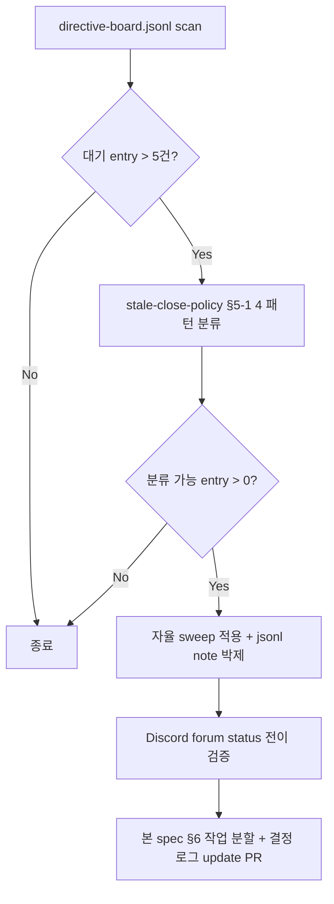

# 잔존 directive 정리 — 옵션 B (분류 기반 자율 sweep + 정책 영속화)

## 1) 개요 (What / Why)

`~/.mobruji/directive-board.jsonl` 의 `대기` status entry 가 운영 누적으로
stale 화 (의미상 완료 / 폐기 / 사용자 결정 보류) 되어, forum sidebar 백로그
가시화를 왜곡한다. 2026-05-28 14:24 KST 사용자 trigger 로 잔존 정리 옵션
A/B/C 를 비교한 결과 **옵션 B 채택** (2026-05-28 14:27 KST, directive
`1509427824803577936`).

본 spec = **옵션 B 의 의사결정 박제 + 실행 계획 + 운영 정책 cross-ref**.
옵션 B 의 운영 정책 본문 (4 패턴 분류 + close 액션 매핑 + 자율 vs 사용자
확인 분기) 은 [[directive-board-stale-close-policy]] 가 SoT —
본 spec 은 의사결정 (왜 B 인가) + 1회성 sweep 실행 (2026-05-28 7건) +
follow-up loop 에 집중.

ADR cross-ref: `docs/decisions/0025-directive-cleanup-option-b.md`.

대상 actor:

- **사용자** — 옵션 B 채택 사유 / trade-off 가 박제되어 후일 재검토 가능.
- **nmae** — 본 spec §5-3 sweep sequence 자율 실행 + §5-5 follow-up loop 운영.
- **helper** — 사용자 회고 시 옵션 B 의 의미 / 적용 범위 답변 가능.
- **plan sub-agent** — 후속 stale 패턴 발견 시 §5-4 갱신 루틴 적용.

## 2) 사용자 시나리오

- **시나리오 1 (옵션 B 채택 회고)**: 사용자가 "옵션 B 가 뭐였지" 라고 물을 때
  helper 가 본 spec §5-1 답변 — 옵션 A/B/C 비교 + B 의 핵심 차별점.
- **시나리오 2 (sweep 적용 직후 검증)**: nmae 가 §5-3 sweep sequence 적용 후
  `tail ~/.mobruji/directive-board.jsonl` 로 7 entry 의 status 전이 확인 +
  Discord forum sidebar 🟡 대기 filter 에서 7 entry 미표시 확인.
- **시나리오 3 (다음 stale 누적 발견)**: 1-2주 뒤 새 stale entry 가 누적되면
  nmae 가 본 spec §5-5 follow-up loop 적용 — [[directive-board-stale-close-policy]]
  §5-1 4 패턴 재적용 + 본 spec 갱신.
- **시나리오 4 (사용자 정정)**: 사용자가 sweep 후 "그 entry 살려 둬" 정정 시
  nmae 가 §5-3 표 안 재활성 명령 호출 → in_progress 전이.

## 3) 요구사항

### 기능 요구사항

- [ ] 옵션 B 채택 사유 박제 (§5-1) — 옵션 A/B/C 비교 + trade-off 명문화.
- [ ] 2026-05-28 시점 7건 sweep sequence 명시 (§5-3) — nmae 가 본 PR 머지 후 적용.
- [ ] [[directive-board-stale-close-policy]] cross-ref (§5-2) — 운영 정책 SoT
  분리 + 본 spec 의 의사결정 박제 역할 명시.
- [ ] follow-up loop 정의 (§5-5) — 새 stale 누적 시 재발동 조건 + nmae 자율 발동.
- [ ] ADR-0025 cross-ref (§5-6) — 의사결정 영속.

### 비기능 요구사항

- **idempotency**: 7건 sweep sequence 재 호출 시 `directive_status.sh` 멱등성
  활용 — 중복 transition 가드.
- **추적성**: 본 spec 머지 후 sweep 적용된 7 entry 의 jsonl `last_updated_kst`
  / forum tag 전이 → grep 으로 1년 후에도 검증 가능.
- **명시성**: sweep 자율 결정이라도 jsonl `note` (또는 forum thread message) 에
  사유 박제 — 사용자 회고 시 "왜 그 entry 가 dropped 됐지" 추적 가능.
- **공정성**: 자율 sweep 후에도 사용자 정정 path 보장 — `재활성` 액션 (§5-3 표).

## 4) 범위 / 비범위

### 포함

- 옵션 A/B/C 비교 + 옵션 B 채택 사유 (§5-1).
- 2026-05-28 시점 7건 1회성 sweep sequence (§5-3).
- [[directive-board-stale-close-policy]] 와의 책임 분리 명문화 (§5-2).
- follow-up loop 발동 조건 + 절차 (§5-5).
- ADR-0025 cross-ref + 결정 로그.

### 제외 (Out of Scope)

- 4 패턴 분류 기준 / 호출 명령 매핑 / 자율 분기 표 → [[directive-board-stale-close-policy]]
  §5-1, §5-2, §5-3 SoT. 본 spec 은 cross-ref 만.
- `directive_status.sh` 신규 액션 추가 / sweep mode bash 옵션 → 후속 PR
  (impl) 영역.
- 자동 sweep cron / GHA — 본 spec 은 manual sweep (nmae 자율). 자동화는
  [[directive-board-stale-close-policy]] §5-5 follow-up.
- 새 status (예: 🟣 결정 대기) 추가 → [[directive-board-template-and-tags]]
  §5-6 SoT.
- jsonl 스키마 변경 (`note` 필드 표준화 등) → 별도 spec.

## 5) 설계

### 5-1) 옵션 A/B/C 비교 + 옵션 B 채택 사유

2026-05-28 14:24 KST 사용자 trigger "잔존 작업들 어떻게 정리할래?? 좀 많이
남아있는데 싹 비우고 시작해야되지 않을까?" 에 대해 다음 3 옵션 제시.

| 옵션 | 설명 | 장점 | 단점 |
|---|---|---|---|
| **A. 전체 일괄 dropped** | 모든 `대기` entry 를 `dropped` 로 일괄 전환 후 새 entry 부터 깨끗 시작 | 즉시 0건 백로그 / 의사결정 부담 0 | 진짜 완료 entry 가 "폐기" 로 박제 → 회고 시 PR 추적 불가 / 진짜 backlog 도 사라짐 |
| **B. 분류 기반 자율 sweep** | 본 spec + [[directive-board-stale-close-policy]] §5-1 4 패턴 (`completed`/`dropped`/`deferred`/`재활성`) 적용 | 각 entry 의미 보존 / 회고 추적성 유지 / 사용자 정정 path 보장 | 사이클 1회 (~10분) 자율 작업 필요 / 분류 오판 risk (정정 가능) |
| **C. 수동 사용자 검토** | 사용자가 각 entry 별 close 액션 직접 결정 | 정확도 100% / 자율 risk 0 | 사용자 부담 큼 / 7+ entry 검토 시간 / 옵션 B 의 분류 명확 entry 에는 과잉 |

**채택: 옵션 B** (2026-05-28 14:27 KST, directive `1509427824803577936` "옵션 B 채택").

채택 사유:

1. **회고 추적성**: 진짜 완료 entry (PR 머지 / 결정 적용) 가 `completed` 로
   박제되면 후일 "그 작업 언제 했지" 검색 시 PR URL 즉시 확인. 옵션 A 는
   `dropped` 로 일소되어 PR 추적 불가.
2. **사용자 자율 default 일치**: 자율 default ([[feedback-autonomous-default]])
   원칙 + 분류 기준이 명확한 entry (4 패턴) 는 사용자 검토 불요. 옵션 C 는
   과잉.
3. **백로그 정합성 유지**: ⚪ 보류 (timeline 미정) 와 🔴 폐기를 분리 → forum
   sidebar 필터 시 의미 보존. 옵션 A 는 모두 🔴 폐기 단일 status 라 의미 손실.
4. **정정 path 보장**: 분류 오판 risk 는 `재활성` 액션 (§5-3) 으로 정정 가능
   → false-negative 비용 낮음.

### 5-2) [[directive-board-stale-close-policy]] 와의 책임 분리

본 spec 은 **의사결정 + 실행 박제**, 같은 PR 또는 인접 PR 의
[[directive-board-stale-close-policy]] spec 은 **운영 정책 SoT** 로 책임 분리.

| 항목 | 본 spec (옵션 B) | stale-close-policy spec |
|---|---|---|
| 옵션 비교 (A/B/C) + 채택 사유 | ✅ SoT (§5-1) | cross-ref |
| 4 패턴 분류 기준 | cross-ref | ✅ SoT (§5-1) |
| close 액션 매핑 (4 액션) | cross-ref | ✅ SoT (§5-2) |
| 2026-05-28 7건 sweep sequence | ✅ SoT (§5-3) | 권고 표 (§5-4) |
| 자율 vs 사용자 확인 분기 | cross-ref | ✅ SoT (§5-3) |
| follow-up loop 발동 조건 | ✅ SoT (§5-5) | 운영 정책 (§5-5) |
| ADR cross-ref | ✅ ADR-0025 | (없음) |

근거: 옵션 B 채택은 **1회성 의사결정** (2026-05-28). 정책 (4 패턴 / close 액션 /
자율 분기) 은 **반복 운영 SoT** 로 별도 분리 → 1년 뒤 정책 갱신 시 본 spec 은
변경 X, stale-close-policy 만 갱신.

### 5-3) 2026-05-28 7건 sweep sequence

본 PR 머지 후 nmae 가 자율 적용. 호출 명령 매핑은
[[directive-board-stale-close-policy]] §5-2 SoT.

```bash
# A 패턴 (PR 머지 완료)
bash ~/.mobruji/directive_status.sh 1508704649828368457 completed \
  https://github.com/goohong/mobruji/pull/1119  # discord-reply.sh 2000 chunk split
bash ~/.mobruji/directive_status.sh 1508703025114644602 completed \
  https://github.com/goohong/mobruji/pull/1129  # forum 상태 동기화 (event-driven redesign)
# ↑ 1508703025114644602 의 cross-ref PR 번호는 nmae 가 실제 검증 후 호출.
# event-driven redesign 적용 PR (#1129) 또는 다른 PR 일 수 있음.

# B 패턴 (의사 결정 적용 완료)
bash ~/.mobruji/directive_status.sh 1509427220802830336 completed  # 잔존 작업 정리 옵션
bash ~/.mobruji/directive_status.sh 1509427824803577936 completed  # 옵션 B 채택 (본 spec PR URL 박제)
bash ~/.mobruji/directive_status.sh 1509442749319872592 completed  # rev 만 재개

# C 패턴 (testing/no-op payload)
bash ~/.mobruji/directive_status.sh 1509456551520505978 dropped  # "그냥 테스트"

# D 패턴 (timeline 미정 — 사용자 명시 보류)
bash ~/.mobruji/directive_status.sh 1508670373473026350 deferred  # 서버 다운그레이드 (비용 절감 후)
```

**자율 정정 path**:

| 사용자 정정 신호 | nmae 액션 |
|---|---|
| "그 entry 살려 둬" / "다시 진행하자" | `directive_status.sh <id> in_progress` (재활성) |
| "그 entry 폐기해" | `directive_status.sh <id> dropped` |
| "이 entry 의 cross-ref PR 번호 다름" (A 패턴) | `directive_status.sh <id> completed <올바른_PR_URL>` 재호출 (멱등) |

### 5-4) 옵션 B 의 분류 적용 핵심 룰

본 spec § 변경 시 다음 룰 유지:

1. **분류 기준 변경**: 4 패턴 (A/B/C/D) 자체 변경은
   [[directive-board-stale-close-policy]] §5-1 갱신 → 본 spec 은 cross-ref 만
   업데이트.
2. **신규 옵션 (예: 옵션 D)**: 사용자가 다른 정리 옵션 채택 시 본 spec 신규 § 또는
   별도 spec `directive-cleanup-option-<x>.md` + ADR.
3. **회고 시 옵션 B 의미 변형**: 옵션 B 의 "분류 기반 자율 sweep" 이라는 정체성
   유지. 만약 자율 → 수동 전환되면 옵션 C 회귀 → 별도 spec.

### 5-5) follow-up loop (새 stale 누적 시)

nmae 가 매 사이클 idle 시 또는 사용자 trigger 시 다음 loop:



발동 조건 (둘 중 하나):

- 백로그 스캔 시 `대기` entry 6건 이상.
- 사용자 trigger "잔존 정리하자" / "스윕하자" / 유사.

발동 시 nmae 가 plan 사이클 위임 — 본 spec § 갱신 + sweep sequence 추가 PR.

### 5-6) ADR cross-ref

`docs/decisions/0025-directive-cleanup-option-b.md` — 옵션 B 채택의
short-form decision record. context / decision / consequences / alternatives
간략 박제. 본 spec 의 의사결정 trade-off (§5-1) 와 1:1 대응.

### 5-7) API / DB / FE

해당 없음. 운영 정책 + 1회성 sweep + ADR cross-ref 만.

## 6) 작업 분할 (예상 PR 리스트)

- [x] **PR docs (본 PR)**:
  - `docs/features/directive-cleanup-option-b.md` (신규)
  - `docs/features/directive-board-stale-close-policy.md` (신규 — untracked
    상태에서 동시 등록)
  - `docs/decisions/0025-directive-cleanup-option-b.md` (신규 ADR)
  - `docs/features/README.md` §9 인덱스 sync (2 entry 추가)
- [ ] **NMAE 후속 turn (코드 변경 X)**: 본 spec §5-3 의 7건 sweep sequence 자율
  적용 + jsonl / forum tag 검증.
- [ ] **PR follow-up (선택, 미래)**: `directive_status.sh` 의 sweep mode 추가
  (`bash directive_status.sh sweep` — 4 패턴 자동 분류 + 일괄 호출).
  impl 시점: manual sweep 1주 운영 검증 후.
- [ ] **PR follow-up (선택, 미래)**: 자동 sweep cron / GHA — PR 머지 webhook
  hook 으로 A 패턴 자동 close. impl 시점: 사용자 운영 피드백 후.

### 보호 영역 변경 여부 (필수 명시)

- 보호 영역 변경 여부: ☒ 없음 — docs only (`docs/features/**` +
  `docs/decisions/**` + `README.md` 인덱스).

## 7) 테스트 전략

### 단위

- 없음 — 본 PR docs only.

### 통합 (nmae sweep 후 검증)

본 PR 머지 후 nmae 가 §5-3 sweep sequence 적용 시 다음 검증:

- `tail ~/.mobruji/directive-board.jsonl` → 7 entry status 가 각각 `completed` /
  `dropped` / `deferred` 로 전이됐는지 확인.
- Discord `#모부르지-지시` forum sidebar 🟡 대기 filter → 7 entry 미표시 확인.
  ⚪ 보류 filter → 1 entry (1508670373473026350) 표시 확인.
- `directive_status.sh` 호출 후 forum tag 전이 (🟡 → 🟢/🔴/⚪) 시각 검증.
- A 패턴 entry 의 PR URL fragment 가 jsonl 안 박제됐는지 확인.

### 회귀

- 다음 사이클 nmae 백로그 스캔 시 close 된 7 entry 가 분배 후보에서 제외되는지
  확인.
- 자율 sweep 1주 후 false-positive (의도와 다른 close) 0건 목표.
- 사용자 정정 ("그 entry 살려") 발생 시 §5-3 재활성 path 즉시 적용 검증.

## 8) 오픈 질문

| # | 질문 | 선택지 | 담당/기한 |
|---|---|---|---|
| Q1 | 옵션 B 채택 사유 (§5-1) 의 trade-off 표 중 빠진 차원이 있는가 (예: 운영 비용 / 사용자 학습 비용). | (a) 현행 4 사유 충분 / (b) 운영 비용 추가 / (c) 사용자 학습 비용 추가 | @mobruji-maestro / 2026-06-04 |
| Q2 | follow-up loop 발동 조건 (§5-5) 의 "대기 entry 6건" threshold. | (a) 6건 유지 / (b) 5건 (forum sidebar 4 column 가독성 기준) / (c) 사용자 trigger only | @mobruji-maestro / 2026-06-04 |
| Q3 | ADR-0025 cross-ref 의 status — `proposed` 시작 후 본 PR 머지 시 `accepted` 전환 시점. | (a) PR 머지와 동시 / (b) 7건 sweep 실제 적용 후 / (c) follow-up loop 1회 운영 검증 후 | @mobruji-maestro / 2026-06-04 |
| Q4 | 본 spec §5-3 7건 sweep 의 cross-ref PR 번호 검증 (1508703025114644602 의 PR #1129) — 실제 적용 PR 이 다를 수 있음. | (a) #1129 / (b) 다른 PR / (c) PR URL 없이 completed (사유 박제만) | @nmae / 본 PR 머지 후 즉시 |

## 9) 결정 로그

- 2026-05-28 14:24 KST: 사용자 trigger ("잔존 작업들 어떻게 정리할래??") →
  옵션 A/B/C 비교 제시.
- 2026-05-28 14:27 KST: **옵션 B 채택** (directive `1509427824803577936`
  "옵션 B 채택"). 분류 기반 자율 sweep + 정책 영속화.
- 2026-05-29: 초안 작성 (status=draft). [[directive-board-stale-close-policy]]
  spec 동시 등록 + ADR-0025 cross-ref.

## 10) 자율 결정 (사유)

- 본 PR = docs only. nmae 후속 turn 에 §5-3 sweep sequence 자율 적용.
  plan 사이클 (현재) = 의사결정 박제 + 정책 cross-ref 만.
- 7건 sweep 중 PR cross-ref 불확정 entry (1508703025114644602) 는 nmae 가
  검증 후 결정 (Q4).
- ADR-0025 status = `proposed` 로 시작. 본 PR 머지 + 7건 sweep 실제 적용 후
  `accepted` 전환 (Q3 선택지 b).

## 11) 사용자 확인 필요

- 옵션 B 의 trade-off 표 (§5-1) 누락 차원 — 운영 비용 / 사용자 학습 비용 추가
  여부 (Q1).
- ⚪ 보류 entry (1508670373473026350) 의 재활성 조건 — 현재 jsonl 본문 미명시.
  본 PR 머지 + nmae sweep 후 사용자가 "v0.4 release 후" 등 명시하면
  [[directive-board-stale-close-policy]] §5-6 자동 재활성 가이드 적용 가능.

## 12) References

- ADR-0025: `docs/decisions/0025-directive-cleanup-option-b.md` — 본 spec 의
  단순화 의사결정 record.
- [[directive-board-stale-close-policy]] — 4 패턴 / close 액션 / 자율 분기 SoT.
- [[directive-board-template-and-tags]] §5-1, §5-6 — status 5종 + 백로그
  운영 모델 SoT.
- [[directive-board-event-driven-redesign]] — jsonl event-driven sync 정책.
- `tools/discord-daemon/directive_status.sh` — sweep 명령 호출 대상.
- helper-queue.jsonl entry `1509427824803577936` (2026-05-28 14:27 KST
  "옵션 B 채택") — 사용자 채택 신호 evidence.
- 메모리: [[feedback-autonomous-default]] / [[feedback-evidence-based-root-cause]] /
  [[feedback-keep-promises]].

## 13) 변경 이력

- 2026-05-29: 초안 작성. 옵션 A/B/C 비교 + 옵션 B 채택 사유 (§5-1) +
  2026-05-28 7건 sweep sequence (§5-3) + follow-up loop (§5-5) +
  ADR-0025 cross-ref.
