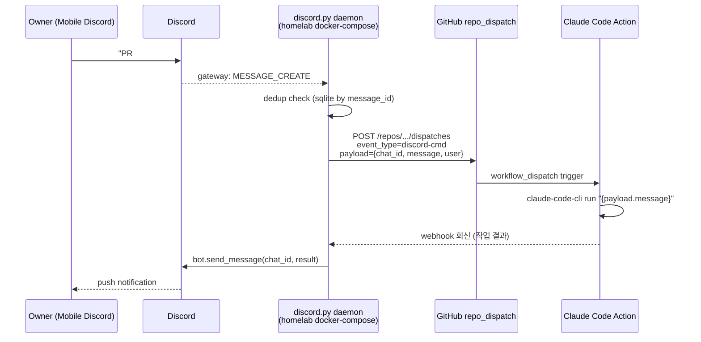

# Discord 실시간 양방향 소통 인프라

## 1) 개요 (What / Why)
- 사용자(=오너)와 백그라운드/원격 Claude 에이전트(plan/be/fe/rev 세션) 간의 **실시간 양방향 소통 채널**을 안정화한다.
- 현재는 `plugin_discord` MCP가 push 알림은 제공하지만, **에이전트가 능동적으로 새 메시지를 수신(폴링/구독)할 표준 방법이 부재**하다.
- 사용자 요청 원문(2026-05-21): *"서로 실시간 양방향 소통하려면 mcp를 쓰는 게 좋겠다. 아니면 다른 방법 찾아봐."*
- 목표: 5개 후보 옵션을 비용/안정성/24-7 가용성 축에서 비교하고, **즉시 / 중기 / 장기** 단계로 권장 경로를 확정한다.
- 대상 액터: 오너 (이동 중 모바일 Discord), 백그라운드 에이전트 (plan/rev), 원격 자동화 (scheduled routine).

## 2) 사용자 시나리오
- **시나리오 1 — maestro active**: 오너가 maestro 세션을 켠 상태에서 Discord로 "PR #181 머지해줘"를 보낸다. maestro 에이전트가 매 호흡(주요 도구 호출 사이)마다 `fetch_messages`를 호출하여 즉시 수신·응답한다.
- **시나리오 2 — maestro idle**: 오너가 노트북을 닫고 외출 중 Discord로 지시를 보낸다. 24/7 데몬이 메시지를 감지하여 GitHub `repo_dispatch` 이벤트로 Claude Code Action을 트리거하고, 작업 결과를 Discord로 회신한다.
- **시나리오 3 — 장기 plan 세션**: plan 세션이 background job으로 도는 동안 오너가 중간 지시를 추가. `/loop 30s` 또는 MCP polling으로 30초 내 반영.

## 3) 요구사항
### 기능 요구사항
- [ ] 5개 후보 옵션에 대한 비교표 + 권장 시나리오 명문화
- [ ] **즉시(이번 주)**: maestro 호흡 끝 `fetch_messages` 컨벤션 + 메모리 `[feedback-discord-polling]` 정착
- [ ] **중기(2주 내)**: `plugin_discord` MCP에 polling 패치 PoC (fork or upstream PR) — `subscribe` 액션 추가 또는 fetch 간격 자동화
- [ ] **장기(1~2개월)**: 사용자 서버(홈서버/VPS)에서 24/7 Discord daemon + GitHub `repo_dispatch` → Claude Code Action 흐름 구축
- [ ] 각 옵션의 **포기 조건(triggering retreat)** 명시 (예: MCP 패치가 upstream 거절 시 자체 MCP 서버로 전환)

### 비기능 요구사항
- 신규 메시지 수신 지연 P50 ≤ 30초, P99 ≤ 2분
- 24/7 옵션 가용성 99% (홈서버 재부팅/네트워크 중단 허용)
- 비용: 월 운영비 $0~5 (홈서버는 기존 자원, VPS 사용 시 t3.nano 수준)
- 보안: Discord bot token, GitHub PAT는 `.env` + 서버 시크릿 관리. 평문 저장 금지. `docs/ai-harness/04-security-policy.md` 준수.
- 멱등성: 동일 message_id 중복 처리 시 작업이 두 번 트리거되지 않도록 dedup 캐시(파일 또는 SQLite).

## 4) 범위 / 비범위
### 포함
- 5개 옵션의 비교 분석 및 단계별 권장
- 옵션 4 (24/7 daemon + GitHub Actions) **아키텍처 상세 설계**
- 옵션 5 (maestro 매 호흡 fetch) 즉시 적용 컨벤션
- dedup / 시크릿 관리 / 관측성 요구사항 명문화

### 제외 (Out of Scope)
- 옵션 4의 실제 구현 PR (별도 spec/PR로 분리)
- Discord 외 채널 (Slack/Telegram) — 별도 spec
- 다중 사용자 권한 분리 (현재 오너 단독)
- 음성 채널 / 영상 통화 통합

## 5) 설계
### 5-1) 도메인 모델
- 도메인 엔티티 변경 없음. 인프라/툴링 레이어 전용.
- 외부 컴포넌트: Discord Gateway WebSocket, GitHub Actions, Claude Code CLI, MCP runtime.

### 5-2) API 엔드포인트
- 없음 (서비스 API 변경 없음). 옵션 4에서 GitHub `repo_dispatch` payload만 정의.

### 5-3) 외부 연동 / 옵션 비교

| # | 옵션 | 비용 | 안정성 | 24/7 | 구현 단계 |
|---|---|---|---|---|---|
| 1 | `plugin_discord` MCP **polling 패치** (subscribe/long-poll 추가) | $0 (upstream PR) | 중 (MCP runtime 의존) | △ (세션 살아있을 때만) | 1) fork → 2) `subscribe` 액션 추가 → 3) upstream PR → 4) 채택까지 fork 사용 |
| 2 | `/loop 30s` 스킬로 fetch_messages 반복 | $0 | 중 (Claude 세션 토큰 소모) | × (세션 종료 시 끊김) | 1) 슬래시 커맨드 1줄. 즉시 가능 |
| 3 | **자체 MCP server** (Discord Gateway WebSocket 직결) | $0 (자작) | 상 (직접 통제) | △ (MCP 호스트 프로세스 살아있을 때) | 1) Python/Node MCP SDK → 2) discord.py 게이트웨이 클라이언트 → 3) 메시지 push as MCP notification |
| 4 | **사용자 서버 bot daemon + GitHub Actions trigger (24/7)** ★권장★ | $0 (홈서버) ~ $5/월 (VPS) | 상 (헬스체크 + auto-restart) | ○ (full 24/7) | 1) discord.py daemon (docker-compose) → 2) GitHub repo_dispatch dispatcher → 3) Claude Code Action workflow → 4) Discord 회신 |
| 5 | maestro 매 호흡 끝 `fetch_messages` (즉시 가능) | $0 | 상 (단순) | × (maestro active만) | 1) 메모리 컨벤션 1건. 즉시 가능 |

> 비교 축 출처: 사용자 메모리 `[feedback-discord-polling] §24/7 옵션` 비교 노트.

### 5-4) 권장 단계
- **즉시(this week)**: **옵션 5** — maestro active 동안은 매 호흡 끝(주요 도구 호출 직전/직후) `fetch_messages` 1회. 비용 0, 효과 즉시.
- **중기(2~4주)**: **옵션 1** PoC. `plugin_discord` MCP fork → `subscribe` 액션 추가 → upstream PR. 거절/지연 시 옵션 3(자체 MCP)으로 전환.
- **장기(1~2개월)**: **옵션 4** 구축. maestro idle/외출 중에도 동작하는 24/7 채널 확보. 옵션 5는 maestro active 시의 보조 채널로 유지.

### 5-5) 옵션 4 상세 아키텍처

**구성 요소:**
- `tools/discord-daemon/` 디렉터리 (실제 채택 경로, 본 spec 초안의 `infra/discord-daemon/` 에서 변경 — `discord-daemon-hosting.md` PR 2 가 `tools/` 하위로 박음)
  - `bot.py` — discord.py 클라이언트, `on_message` 이벤트 처리
  - `dispatcher.py` — GitHub `repo_dispatch` 호출 + dedup SQLite (Phase 2 — Phase 1 은 `bot.py` 단독)
  - `requirements.txt` (Docker 미사용 — NCP VM 직접 systemd 운영, `mobruji-discord-daemon.service`)
  - `.env.example` — `DISCORD_BOT_TOKEN`, `GITHUB_PAT`, `ALLOWED_USER_IDS`, `REPO=mobruji/mobruji`
- `.github/workflows/discord-dispatch.yml` — `on: repo_dispatch: types: [discord-cmd]` → Claude Code Action 호출 → 결과를 webhook으로 daemon에 회신
- 헬스체크: `journalctl -u mobruji-discord-daemon` + `ncp-maestro-resilience.md` 의 wake-stuck 모니터 재사용

**보안:**
- bot token은 daemon 호스트의 `.env` (chmod 600)
- GitHub PAT는 fine-grained, scope = `repo:dispatch` only
- `ALLOWED_USER_IDS` 화이트리스트로 다른 Discord 사용자 명령 차단
- dedup으로 replay 공격 방어

### 5-6) 프론트엔드 화면
- 해당 없음.

## 6) 작업 분할 (예상 PR 리스트)
- [x] **PR A** `docs(infra): maestro 매 호흡 fetch_messages 컨벤션` (즉시, 옵션 5) — `docs/ai-harness/` runbook 패치 + memory `feedback-discord-polling`
- [ ] **PR B** `feat(infra): plugin_discord MCP subscribe PoC` (옵션 1) — fork 저장소에 작업, 본 리포에는 컨벤션 메모만
- [x] **PR C** `feat(infra): discord-daemon 스캐폴딩` (옵션 4 1단계) — `tools/discord-daemon/` 디렉터리 (초안의 `infra/` 에서 변경), `bot.py` (#202), discord-daemon-hosting.md 옵션 A/G 셋업
- [ ] **PR D** `feat(infra): GitHub repo_dispatch dispatcher` (옵션 4 2단계) — `tools/discord-daemon/dispatcher.py` + dedup SQLite (현재 Phase 1 은 bot.py 단독 운영, dispatcher 분리는 Phase 2 후속)
- [ ] **PR E** `feat(infra): Claude Code Action workflow + Discord 회신` (옵션 4 3단계) — `.github/workflows/discord-dispatch.yml`

## 7) 테스트 전략
- **옵션 5**: maestro 세션에서 수동 — Discord 메시지 보내고 30초 내 응답 확인.
- **옵션 1/3**: MCP runtime 로컬 기동 → mock Discord 이벤트 주입 → notification 수신 검증.
- **옵션 4 daemon**: `pytest` + `discord.py`의 `mock_member` 픽스처. `bot.on_message` 단위 테스트 + dispatcher의 GitHub API 호출은 `responses`로 mock.
- **옵션 4 워크플로우**: `act` 로컬 실행 또는 dispatch 이벤트 수동 트리거 후 Discord 회신 수신 확인.
- **E2E**: 외출 시나리오 1회 — 노트북 닫고 모바일 Discord 명령 → 작업 완료 푸시 알림 수신 (수동).

## 8) 오픈 질문

| # | 질문 | 선택지 | 담당/기한 |
|---|---|---|---|
| Q1 | 옵션 4의 호스팅: 홈서버 vs VPS? | (a) 홈서버 (Mac mini 24/7) (b) Oracle Cloud free tier (c) Fly.io | @goohong / 2026-06-04 |
| Q2 | `plugin_discord` MCP fork PoC를 우리 모노레포에 vendoring할까, 외부 fork 저장소 분리? | (a) `vendor/plugin_discord/` (b) 별도 repo `mobruji/plugin-discord-fork` | @goohong / 2026-05-28 |
| Q3 | Claude Code Action 실행 시 비용 한도(분/월) 설정 — 자동 cutoff? | (a) GitHub Actions 분 한도 (b) custom counter in dispatcher (c) cutoff 없음 | @goohong / 2026-06-11 |

## 9) 결정 로그
- 2026-05-21: 초안 작성 (status=draft). 사용자 요청 "mcp 또는 다른 방법" 5개 옵션 비교 + 즉시/중기/장기 단계 권장 확정.
- 2026-05-23 (plan, spec drift cleanup pt2): §5-5 컴포넌트 경로 `infra/discord-daemon/` → `tools/discord-daemon/` 정정 (실제 채택 경로 — `discord-daemon-hosting.md` PR 2 가 `tools/` 하위로 박음). Docker/docker-compose 가정 → NCP VM systemd 직접 운영 (`mobruji-discord-daemon.service`) 으로 정정. §6 PR A/C [x] 완료 표시. PR C 의 디렉터리 경로 정정. Phase 1 (bot.py 단독) vs Phase 2 (dispatcher 분리) 명시.
