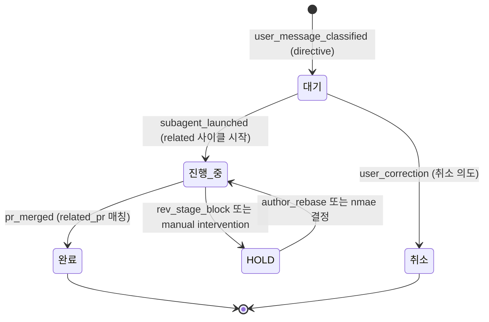

# Event ↔ Action Mapping (작업 체계 v2 — state machine + event hook)

## 1) 개요 (What / Why)

ADR-0019 의 동반 spec. 작업 체계의 critical event 13개를 명시하고, 각 event 가 trigger 해야 할 action chain 을 코드 hook 으로 강제한다.

- **What**: 사용자 메시지 / sub-agent launch / PR 머지 / cycle-status 변경 / clear 직전 / cron tick / watchdog detect / 사용자 정정 등 12 event 의 inventory + 각 event → action list + state machine + failure mode + recovery.
- **Why**: 사용자 정정 (이슈 #1074) — "끝나면 ~하라했지를 기억에의존할게 아니라 체계가 잡혀있어야한다고 봐". agent reasoning state ephemeral. 외부 진실 (jsonl / cycle-status / GitHub) 만이 망각 무관 source-of-truth.

## 2) 사용자 시나리오

- 시나리오 1: 사용자가 directive 메시지를 보낸다 → bot 자동 분류 (directive/query/conversation) → directive 면 forum-post + jsonl 등록 + thread comment 모두 5초 내 자동 (현 ~10분, 사람 의존).
- 시나리오 2: sub-agent 가 PR 머지하면 → directive jsonl status 자동 PATCH + forum-edit + retag + cycle-status set-completed + 다음 사이클 launch trigger 모두 자동 (현 directive_board_sync 5분 race + nmae 망각 가능성).
- 시나리오 3: helper / nmae 가 `/clear` 직전 → directive 대기 0건 자동 check + 핸드오프 메모리 write + cycle-status sanity 자동 (현 메모리 룰 의존, 사고 시 handoff lost).

## 3) 요구사항

### 기능 요구사항
- [ ] 12 event 의 trigger 지점이 code (bot.py / wrapper.sh / GitHub workflow) 에 명시되어 있다.
- [ ] 각 event 의 action chain (1+ action) 이 코드에서 호출된다 — agent prompt rule 만 의존 안 함.
- [ ] State machine (directive lifecycle) 가 enum 으로 명시되어 transition 자동 강제.
- [ ] Failure mode 각각의 detect/recover hook 이 cron 또는 webhook 으로 존재.

### 비기능 요구사항
- 운영 break 0 (단계별 PR 마이그, `work-cycle-refactor.md`).
- 사고 시 wall-clock 정정 5분 → 5초 (event hook = realtime / cron = 5분).
- agent prompt 컨텍스트 추가 부담 0 (메모리 reduce 와 함께 net-zero 목표).

## 4) 범위 / 비범위

### 포함
- 12 event × N action 표 (§5-1)
- State machine (directive lifecycle, §5-2)
- Failure mode + detect/recover (§5-3)
- enum 정의 (directive status, §5-4)

### 제외 (Out of Scope)
- 구현 코드 변경 — 본 spec 머지 후 `work-cycle-refactor.md` 단계 1-5 에서 PR 별 분리 구현.
- be/fe 도메인 event (Like/Bookmark/Rec 등) — 본 spec 은 운영 체계 (작업 사이클 / directive / sub-agent / clear) 만.
- Discord 정중체 / 말투 / 메타 컨벤션 — 메모리 영역 (ADR-0019 §4.1 원칙 3).

## 5) 설계

### 5-1) Event ↔ Action 매핑 (13 event, single source-of-truth)

| # | event | trigger 지점 (코드) | actions (순서대로 code hook 호출) |
|---|---|---|---|
| 1 | `user_message_received` | bot.py `on_message` | (a) `~/.mobruji/helper-queue.jsonl` append `status: pending` (b) `~/.mobruji/last-user-msg-id.txt` write (c) 1초 generic auto-ack — 사용자 메시지에 👀 emoji reaction add (#1175 reaction-only, `BOT_AUTO_ACK_EMOJI` default `👀`) (d) emit event `user_message_classified` (5-2 분류기) |
| 2 | `user_message_classified` | bot.py `on_message` (a) 후 즉시 classifier 호출 — heuristic (LLM 없이): 명령형 동사 / "해줘" / "수정" / "구현" → `directive`. "?" / "왜" / "어떻게" → `query`. 외 → `conversation`. | **directive 면**: (a) `discord-reply.sh --forum-post directive "<title>" "대기" "<body>"` (b) `directive-board.jsonl` append `{ts,message_id,thread_id,title,status:"대기"}` (c) thread comment 첫 줄. **query/conversation 면**: helper turn-start 가 정상 처리 (이벤트 종료). |
| 3 | `subagent_launched` | `tools/agent-launch-wrapper.sh` (이미 강제, #1008) | (a) `cycle-status/update.sh <ws> set-active --title "<title>"` (b) per-cycle channel push (be/fe/rev/plan, #1049) (c) `discord-reply.sh --auto-ack-thread` → `last-launch-thread.txt` write (d) directive jsonl 의 관련 entry `status: "진행 중"` PATCH (related_issue 매칭) |
| 4 | `subagent_completed` | Agent tool 완료 통지 → nmae turn 안 / OR `cycle_idle_watch_loop` 가 in_progress 만료 detect | (a) `cycle-status/update.sh <ws> set-idle --note "<next 후보>"` (b) thread close `--auto-thread "[done]"` (c) DIGEST push 1줄 (nmae-discord-push.sh) (d) **emit event `pr_merge_pending`** (PR 있을 경우, GitHub webhook 으로 대체 trigger) |
| 5 | `pr_merged` | GitHub webhook (`pull_request.closed && merged`) OR `directive_board_sync_loop` polling (현재) | (a) directive jsonl entry `status: "✅ 완료"` PATCH (b) `discord-reply.sh --forum-edit <thread_id>` (status 줄 update) (c) `--forum-retag` (tag "진행 중" → "완료") (d) cycle-status `last_completed` update (e) **emit event `next_cycle_eligible`** (해당 워크트리) |
| 6 | `cycle_status_set_active` | `cycle-status/update.sh ... set-active` | (a) atomic write (b) `validate.sh` 자동 검증 (timestamp sanity) (c) bot.py 가 다음 polling 에서 watchdog idle 분류 제외 (passive) |
| 7 | `cycle_status_set_idle` | `cycle-status/update.sh ... set-idle --note "..."` | (a) note 필수 (`CYCLE_REASON_REQUIRED=1` default) (b) atomic write (c) `validate.sh` (d) **emit event `next_cycle_eligible`** (다음 사이클 후보 launch trigger) |
| 8 | `clear_imminent` | (a) pane log `===CTX:>=95%===` marker — `context_auto_clear_loop` 감지 (b) 사용자 `/clear` 직접 입력 — `clear-pre-hook.sh` 자동 호출 (PR #1066 spec) | (a) `clear-pre-hook.sh` 실행 — directive 대기 0건 check / cycle-status sanity / 핸드오프 메모리 write (b) FAIL 시 `/clear` 차단 (`exit 1`) (c) PASS 시 `/clear` allow + handoff 파일 `project_session_handoff_*.md` 자동 write |
| 9 | `cron_5min_tick` | bot.py asyncio 5분 timer (`asyncio.sleep(300)`) | (a) `digest_loop` 한 사이클 (b) `directive_board_sync_loop` 한 사이클 (현재 5분, PR #1068 rate-limit 가능) (c) `claude_usage_watch_loop` 한 사이클 — 모두 독립 task, 실패 격리 |
| 10 | `watchdog_detect_idle` | `cycle_idle_watch_loop` (5분 polling, in_progress NULL + last_completed > 10분 전) | (a) tmux pane (mobruji:0.0) `[watchdog ...]` inject relaunch prompt (b) DIGEST push 가시화 (c) escalation counter `++` — 3회 연속 시 MOBRUJI_CHANNEL_ID 사용자 push |
| 11 | `watchdog_detect_mismatch` | `directive_board_sync_loop` mismatch detector (jsonl `진행 중` 인데 관련 PR 머지된 entry 발견) | (a) `discord-reply.sh --forum-edit` 자동 PATCH (5분 race window 안에서) (b) #모부르지 alert push (debounce 1h) (c) manual catch-up trigger 옵션 — 사용자가 helper 에 inject 시 helper 가 즉시 sync |
| 12 | `user_correction` | bot.py `on_message` 에서 helper queue 와 무관하게 inject 형식 detect (특정 prefix `nmae:` / `[정정]` / `재시작` 등) | (a) directive 분류 우회 (b) 사용자 의도 직접 처리 — helper LLM turn 으로 raw passthrough (c) 정정 본문은 메모리 갱신 후보 (nmae 가 다음 turn 에 메모리 promote 판단) |
| 13 | `rev_stage1_sla_missed` | bot.py `watchdog_rev_sla_loop` (1분 polling, `rev-sla-metrics.jsonl` scan — `escalated=false` 인 PR 의 elapsed > SLA 목표값 detect) — 출처 spec `rev-sla.md §3-3` | (a) PR 분류 lookup (정규 / hotfix / security / docs) — 분류별 escalation 채널 결정 (정규=DIGEST 1ch, 🔴 critical-public security=DIGEST + 본 채널 + 사용자 reply 3ch, docs=DIGEST 1ch) (b) `discord-reply.sh --digest "⏰ PR #<N> rev 단계 1 SLA 미달성 (<elapsed>m elapsed)"` push (c) `rev-sla-metrics.jsonl` PATCH `escalated=true, escalated_at_iso, escalation_channels` (멱등성 — 동일 PR 중복 push 차단) (d) nmae tmux inject `[rev-sla] PR #<N> 별 rev sub-agent 추가 launch 검토` — 큐 race 해소 trigger (e) 단계 1 통과 시 `completed_iso` 박제 — escalation row preserve (회고 evidence) |

> **참조 코드** (현 시점):
> - bot.py: `on_message` (event 1, 2, 12), 7 loop (event 9, 10, 11, 13)
> - `tools/agent-launch-wrapper.sh`: event 3
> - `tools/cycle-status/update.sh`: event 6, 7
> - `tools/discord-daemon/directive_board_sync.py`: event 5 (polling fallback) + event 11
> - `clear-pre-hook.sh` (PR #1066 spec, 미구현): event 8
> - `watchdog_rev_sla_loop` (rev-sla.md §3-3 박제, bot.py 구현 별 PR): event 13 — nmae-cycle-watchdog.md §5-7 5중 안전망 layer 5

### 5-2) State Machine — directive entry lifecycle



**Transition 강제 hook**:
- 대기 → 진행 중: event 3 (`subagent_launched`) 의 action (d) — directive jsonl PATCH (related_issue 매칭)
- 진행 중 → 완료: event 5 (`pr_merged`) 의 action (a)
- 진행 중 → HOLD: rev 가 `rev e2e fail` 코멘트 + 라벨 시 자동 (별도 rev workflow)
- HOLD → 진행 중: 라벨 `reviewed:claude` 부착 시 자동 (rev-gate workflow)
- 대기 → 취소: event 12 (`user_correction`) — 사용자 명시 시만 (heuristic 자동 X)

### 5-3) Failure Modes — detect + recover

| event 누락 / 실패 | detect | recover |
|---|---|---|
| event 1 `user_message_received` 안 호출 | bot.py systemd 헬스 체크 (`active (running)` ) | systemd restart (`sudo systemctl restart discord-daemon`) — 1초 내 복구 |
| event 2 `user_message_classified` 미실행 (directive 분류 누락) | `directive_register_watch_loop` (신규, cron 5분) — helper-queue.jsonl entry 가 directive-board.jsonl 에 누락된 경우 detect | (a) helper-turn-start 가 backfill — pending queue 의 directive 의도 감지 (b) manual catch-up: helper LLM 이 사용자 메시지 reclassify 후 `--forum-post directive` 호출 |
| event 3 `subagent_launched` 시 cycle-status set-active 누락 | wrapper.sh 실패 — exit code != 0 | wrapper.sh 자체 `set -e` + idempotent — 재실행 안전. nmae 가 wrapper 만 호출하면 자동 catch (#1008 룰) |
| event 4 `subagent_completed` 미감지 (set-idle 누락) | `cycle_idle_watch_loop` — in_progress.started_at > 임계 (STALE_ACTIVE, #1035) detect | tmux inject + DIGEST push (event 10 chain) |
| event 5 `pr_merged` 미감지 | `directive_board_sync_loop` mismatch detector (event 11) — jsonl `진행 중` 인데 PR `merged` GitHub state | 5분 안에 자동 PATCH (event 11 action (a)) |
| event 8 `clear_imminent` 실패 (pre-hook fail) | `clear-pre-hook.sh` `exit 1` | `/clear` 차단됨. 사용자가 사유 확인 후 수동 fix (예: directive 대기 0건 만들고 재시도) |
| event 9 `cron_5min_tick` 실패 (loop crash) | systemd journal `WARNING` — `_loop launched` 후 log 없음 | individual loop 가 `try/except` 격리 — 한 loop crash 가 다른 loop 안 영향. systemd restart 시 모든 loop 재시작 |
| event 10 `watchdog_detect_idle` 후 nmae 무응답 | inject 3회 연속 + in_progress NULL — escalation 임계 | bot.py 가 MOBRUJI_CHANNEL_ID 직접 push (debounce 1h). 사용자가 직접 nmae 정정 inject |
| event 11 `watchdog_detect_mismatch` 자동 PATCH 실패 | `directive_board_sync_loop` log `mismatch detected but PATCH fail` | (a) jsonl 백업 + manual `jq` 정정 (마지막 수단) (b) #모부르지 사용자 알림 |
| event 12 `user_correction` 분류 오인 | helper LLM 이 정정 메시지를 일반 directive 로 처리 | (a) heuristic 보강 (prefix list 확장) (b) 사용자 재정정 시 메모리 반영 |
| event 13 `rev_stage1_sla_missed` 미감지 (loop crash) | systemd journal `WARNING` — `watchdog_rev_sla_loop launched` 후 log 없음 OR `rev-sla-metrics.jsonl` write 실패 | (a) systemd restart (event 9 와 동일 격리 — try/except) (b) jsonl write 실패 시 백업 + manual `jq` 정정 (마지막 수단) (c) escalation 중복 push 시 jsonl `escalated=true` 미PATCH 의심 — read-after-write 검증 강화 |
| event 13 false escalation (단계 1 통과 직전 SLA 도달) | 단계 1 통과 시각 vs escalation push 시각 race — `rev-sla-metrics.jsonl` 의 `completed_iso` 가 `escalated_at_iso` 보다 1분 이내 | (a) escalation row preserve (회고 evidence) (b) DIGEST 후속 push `✅ PR #<N> 단계 1 통과 (escalation 후 <m>m)` — 사용자 가시 정정 (c) SLA 목표값 5분 buffer 검토 (별 spec 회고) |

### 5-4) directive status enum 정의 (free-form drift 종식)

현재 `directive-board.jsonl` status 값 21종 free-form (ADR-0019 §1 audit). 다음 5 값으로 enum 강제:

```typescript
type DirectiveStatus =
  | "대기"        // 등록됨, 사이클 미시작
  | "진행 중"      // subagent_launched 됨, PR 진행
  | "HOLD"        // rev fail 또는 author rebase 대기
  | "완료"        // pr_merged 확인됨
  | "취소"        // user_correction 으로 명시 취소
```

**Enforce 방법**:
- `directive_board_sync_loop` validation step — enum 외 값 detect 시 자동 정규화 (예: `"✅ 완료"` → `"완료"`, `"🔄 진행 중 (PR #1041 MERGEABLE...)"` → `"진행 중"` + 부가 설명은 `note` 필드로 분리)
- 추가 컨텍스트 (PR 번호 / blocker / next step) 는 별 필드 `note` 또는 `related_prs` 로 분리 — status 는 enum 1 값만.
- bot.py 가 `--forum-post directive` 호출 시 status 인자 검증 — enum 외 값 reject.

**spec 별 분리 (후속 PR)**: `docs/features/directive-status-enum.md` — 본 spec 머지 후 단계 1.2 (`directive_board_sync` 정규화) PR 안에서 별도 spec 으로 분리 작성 예정 (담당: be 사이클). 본 ADR-0019 통합 PR 안에 포함하지 않음 — enum 정규화는 마이그 path (현 30 entries 가 free-form drift 21종) 가 별도 작업 단위.

### 5-5) DB 마이그레이션
- 해당 없음 (operating data 만 — `~/.mobruji/*.jsonl`).

### 5-6) 프론트엔드 화면
- 해당 없음.

## 6) 작업 분할 (예상 PR 리스트)

본 spec 머지 후 `work-cycle-refactor.md` 5단계 마이그로 PR 분할 (구현). 본 spec 자체는 정의 / 명세 문서로 단독 머지.

## 7) 테스트 전략

- **단위**: 각 event hook 호출이 잘 되는지 — bot.py 의 `on_message` mock + helper-queue 검증, wrapper.sh 의 cycle-status diff 검증, directive_board_sync 의 mismatch detect 검증.
- **통합**: 사용자 1 directive 메시지 → 5초 내 forum-post + jsonl 등록 + thread comment 모두 자동 (현 ~10분). e2e 테스트로 측정.
- **회귀**: validation 매트릭스 (마이그 단계 4) — 13 event 의 각 hook 이 코드에 존재하는지 자동 검증. event 13 (`rev_stage1_sla_missed`) 는 `watchdog_rev_sla_loop` 본문 구현 별 PR 머지 후 추가 (rev-sla.md §3-3 박제 기준).

## 8) 오픈 질문

| # | 질문 | 선택지 | 담당/기한 |
|---|---|---|---|
| Q1 | `user_message_classified` heuristic 정확도 | (a) heuristic only (false positive 5-10%) (b) LLM 분류 추가 (latency 1-2초 ↑) | nmae / 단계 1 |
| Q2 | event 5 GitHub webhook 도입 시점 | (a) 단계 1 (5초 realtime) (b) 단계 2 (5분 cron 유지) | nmae / 단계 1 |
| Q3 | directive status enum 정규화 시 기존 30 entries 마이그 | (a) 자동 정규화 (best-effort) (b) 수동 보강 후 lock | nmae / 단계 2 |

## 9) 결정 로그

- 2026-05-24: 초안 작성 (status=draft) — plan sub-agent, 사용자 strategic 정정 #1074. ADR-0019 동반 spec.
- 2026-05-29 (plan round 11): event 13 `rev_stage1_sla_missed` 추가 — `rev-sla.md §3-3` `watchdog_rev_sla_loop` 박제와 1:1 매핑. nmae-cycle-watchdog.md §5-7 5중 안전망 layer 5 와 동일 trigger. last_reviewed 2026-05-29.
