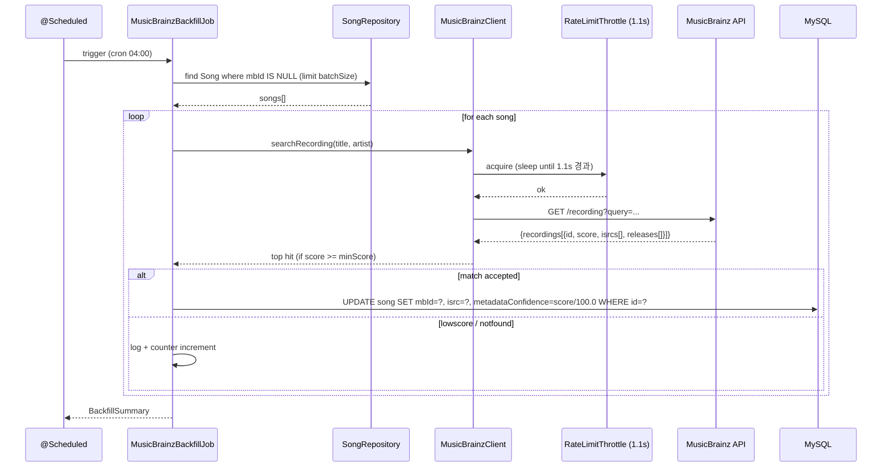

# MusicBrainz 통합 — ISRC/mbid backfill + 메타 보강

## 1) 개요 (What / Why)

- **v0.3 P2 (#68)**. `song-metadata-source.md` Q1 결정 = "수기 시드 + MusicBrainz 보강" 의 미완 부분 (MusicBrainz 보강) 을 본 spec 에서 다룬다.
- **선행 의존**: Spotify Audio Features (`spotify-audio-features-integration.md`, #69) 가 ISRC → Spotify Track ID 매칭으로 동작하기 때문에, **본 spec 의 ISRC backfill 이 완료되어야 Spotify 매칭 정확도가 의미 있다**. `v03-roadmap.md §4-1` 의 권장 순서 #68 → #69 와 일치.
- **MusicBrainz 의 장점** — CC0 (퍼블릭 도메인) 데이터, 영구 저장 OK, attribution 친화적, ISRC / Recording mbid / release year / artist credit 등 메타 풍부, **무료 + 가입 없이 User-Agent 만으로 호출 가능**.
- **MusicBrainz 의 제약** — rate limit 매우 엄격 (anonymous 1 req/s, NAT IP 한도), audio feature (valence/energy/tempo/key) 미제공 — 그 부분은 Spotify (#69) 또는 self-analysis (ADR-0006) 가 담당.
- 액터: 시스템 (배치 backfill 만). 사용자 직접 화면 없음.

## 2) 사용자 시나리오 (시스템 / 운영)

사용자 직접 화면 없음. 시스템·운영 시나리오:

1. **시드 곡 backfill** — 운영자가 admin endpoint 또는 스케줄러로 `MusicBrainzBackfillJob` 실행 → `Song.mbId IS NULL` selective query → MusicBrainz `/ws/2/recording?query=...` 호출 → top hit 의 mbid / ISRC / release-year 를 `Song` 에 영속화 + `metadataConfidence` 갱신.
2. **신곡 추가** — 새 시드 곡 (예: 큐레이션 30 → 100, #71) 추가 시 신곡만 selective backfill. 멱등.
3. **메타 정정** — 매칭 결과 mbid 가 오답으로 판명된 곡은 운영자가 `Song.mbId = NULL, metadataConfidence = 0` 으로 reset → 다음 backfill 사이클에서 재매칭. 또는 mbid 를 수기 지정.
4. **API 장애 / rate limit** — MusicBrainz 5xx 또는 503 (rate limit) 응답 시 해당 곡 skip, 다음 사이클 재시도. 추천 응답 자체에는 영향 없음 (backfill 은 비동기).

## 3) 요구사항

### 기능 요구사항

- [ ] `Song` 엔티티에 `mbId` (VARCHAR(36), nullable, UNIQUE) 컬럼 추가. MusicBrainz Recording UUID 형식 (예: `b9ad642e-b012-41c7-b72a-42cf3437f9d8`). `isrc` 는 PR #204 (V3 마이그레이션) 에서 이미 promote 완료 — 재추가 금지.
- [ ] MusicBrainz REST API client (`com.mobruji.song.external.MusicBrainzClient`) — **User-Agent 헤더 필수** (`mobruji/<version> ( <contact-email> )` 포맷 — MusicBrainz 약관 의무), `/ws/2/recording?query=...&fmt=json` (검색), `/ws/2/recording/{mbid}?inc=isrcs+releases&fmt=json` (상세) 호출.
- [ ] `MusicBrainzBackfillJob` — `@Scheduled` 스케줄러 + admin endpoint 트리거. selective query (`Song.mbId IS NULL` + `Song.metadataConfidence < 1.0` 우선) 로 미처리/저신뢰 곡만 처리. 멱등.
- [ ] **rate limit 준수** — anonymous 호출 한도 **1 req/s** (MusicBrainz 약관 명시). 클라이언트 측 throttle (per-instance) 로 강제. 503 응답 시 지수 backoff (1s → 2s → 4s, 최대 3회), 한도 초과 시 job 전체 중단.
- [ ] **매칭 전략** — 1차로 `(title, artist)` 정규화 (소문자/공백 제거/괄호 내용 제거) 후 MusicBrainz `query` 파라미터로 검색. top hit 의 `score` (MusicBrainz 반환 0~100) 가 임계값 (예: 90) 이상이면 채택, 그 외는 skip + 운영자 수기 확인 큐. 매칭 결과 `score / 100.0` 을 `Song.metadataConfidence` 에 저장.
- [ ] 응답 캐싱 정책 — MusicBrainz 약관상 **영구 저장 OK (CC0)**. 캐시는 `Song.mbId` / `Song.isrc` 컬럼 자체로 충분, 별도 응답 캐시 없음.
- [ ] 관측성 — `mobruji.external.musicbrainz.request` counter (`outcome` 라벨: `success` / `notfound` / `lowscore` / `error` / `ratelimited`), `mobruji.external.musicbrainz.request.duration` timer. `observability-baseline.md §5-3` 표에 등재 (PR A 직전).
- [ ] **결정성 회귀 가드** — `Song.mbId` / `isrc` backfill 전후로 같은 추천 입력 → 결과 셋 비교 가드 (v2 결정성 가드 확장). MusicBrainz 자체는 추천 점수 입력 아니지만 `metadataConfidence` 변동 영향 검증.

### 비기능 요구사항

- **API key 관리** — MusicBrainz 는 **API key 없음**. User-Agent 헤더의 contact email 만 외부화. `musicbrainz.user-agent` placeholder 만 `application.yml`, 실제 값은 환경변수 (`MUSICBRAINZ_CONTACT_EMAIL` 또는 `MUSICBRAINZ_USER_AGENT`) 로 binding.
- **약관 준수** — [MusicBrainz API 약관](https://musicbrainz.org/doc/MusicBrainz_API/Rate_Limiting) (a) **User-Agent 의무** — 누락 시 503, (b) **rate limit 1 req/s anonymous** — 동일 IP/User-Agent 기준, (c) **데이터 CC0** — 영구 저장 / 재배포 가능, attribution 권장 (의무 아님). (d) **5xx 응답 시 즉시 재시도 금지** — backoff 강제.
- **rate limit 강제** — Bucket4j 또는 단순 `Thread.sleep(1100)` (anonymous 한도보다 약간 여유) 로 client 측 throttle. 다중 인스턴스 배포 시 별도 조정 필요 (`§8 Q3` 참조).
- **graceful degradation** — MusicBrainz 장애 시 추천 알고리즘 무관 (input 아님). Spotify (#69) 는 ISRC 없으면 fuzzy fallback 또는 skip — 본 spec 의 backfill 실패가 #69 의 매칭 실패로 전파.
- **결정성** — 같은 곡에 대해 같은 시점 호출은 같은 응답 (MusicBrainz 데이터는 daily snapshot 갱신, 한 사이클 내 일관). 결과 영속화 후에는 외부 호출 무관.
- **관측성** — `observability-baseline.md §5-3` 외부 API 표에 `musicbrainz.*` 추가 (PR A 와 같은 PR 에서 spec 갱신 — 보호 영역 아님).
- **테스트 시 외부 호출 금지** — WireMock 으로 MusicBrainz 응답 fixture. CI 에서 실제 호출 금지 (rate limit 침해 우려).
- **설정 외부화** — User-Agent contact email / rate limit interval / 매칭 score 임계값 / batch size / cron — 모두 `application.yml` 외부화.

## 4) 범위 / 비범위 (중요)

### 포함

- `Song.mbId` 컬럼 신설 + Flyway V7 마이그레이션 + 도메인 모델 §5/§6 갱신 (PR A).
- `MusicBrainzClient` (User-Agent + rate limit throttle + recording search/lookup) + selective backfill job (`@Scheduled` + admin endpoint) + `application.yml` 환경변수 binding + 관측성 카운터 (PR B).
- 매칭 정확도 검증 + 시드 30곡 (현재 시드 규모) backfill 결과 리포트 + Q1~Q5 결정 로그 갱신 (PR C).
- `observability-baseline.md §5-3` 표에 `mobruji.external.musicbrainz.*` 등재 (PR A 와 같은 PR).
- `song-metadata-source.md §9` 결정 로그에 "MusicBrainz 보강 단계 진입" 기록 (PR B 와 같은 PR).

### 제외 (Out of Scope)

- **audio features (valence/energy/key/tempo)** — MusicBrainz 미제공. `spotify-audio-features-integration.md` (#69) 또는 `song-self-analysis-pipeline.md` (ADR-0006) 가 담당.
- **vocal range 자동 추출** — `song-self-analysis-pipeline.md` 담당. MusicBrainz 와 무관.
- **MusicBrainz cover art** — `/ws/2/release/{mbid}/front` Cover Art Archive 는 fe 별 spec. 본 spec 의 backend 작업 머지 후 fe 가 트리거.
- **사용자 기여 (UGC)** — MusicBrainz 자체에 사용자가 수정 제안하는 워크플로우는 별 spec (v0.4+).
- **MusicBrainz Picard 등 클라이언트 도구 통합** — 본 spec 은 REST API 만.
- **AcoustID / Chromaprint 지문 매칭** — 별 spec (vocal range / audio analysis 와 연관). 본 spec 은 텍스트 (title/artist) 매칭만.
- **다중 인스턴스 분산 rate limit** — 단일 인스턴스 가정. 분산 환경 (Redis Bucket4j 등) 은 운영 인프라 결정 후 별 spec.
- **TJ/금영 곡번호 보강** — `song-metadata-source.md §5-3` 에서 거부 (크롤링 리스크). 본 spec 무관.

## 5) 설계

### 5-1) 도메인 모델

- 기존 `Song` 엔티티에 추가:
  - `mbId` — VARCHAR(36), nullable, UNIQUE. MusicBrainz Recording UUID. null → "MusicBrainz 매칭 아직 안됨" 또는 매칭 실패.
  - `metadataSource` enum 에 **신규 값 없음** — `mbId` 갱신만으로는 `metadataSource` 변경 없음. 곡의 1차 source 는 그대로 `MANUAL_SEED` 유지 (큐레이터가 시드 적재한 곡이라는 사실은 불변).
  - `metadataConfidence` 는 PR #204 에서 이미 promote 완료 (DOUBLE, 0~1, default 1.0). MusicBrainz 매칭 결과 `score / 100.0` 을 저장.
- 도메인 모델 §4 유비쿼터스 랭귀지 추가 후보:
  - **mbId (MusicBrainz Recording ID)** — MusicBrainz 의 Recording entity UUID. 한 곡의 한 녹음 (특정 release 의 특정 track) 을 식별. Spotify Track ID 와 1:N 관계 가능 (같은 녹음이 여러 release 에 수록).
- 도메인 모델 §5 엔티티 / §6 ERD 갱신은 PR A 의 같은 PR 에서 수행 (CLAUDE.md §4 도메인 / DDD).

### 5-2) API 엔드포인트

본 spec 은 사용자 노출 API 변경 없음. 내부 admin trigger 만 신설.

| Method | Path | 설명 | 인증 | Req | Res |
|---|---|---|---|---|---|
| POST | /api/v1/admin/songs/musicbrainz-backfill | MusicBrainz backfill job 즉시 트리거 | `X-Admin-Token` (#229 패턴) | (query: `dryRun=true&maxBatch=30&minScore=90`) | `MusicBrainzBackfillResponse` (`processed`, `matched`, `lowScore`, `notFound`, `failed`, `elapsedMs`) |

- selective query: `Song.mbId IS NULL` (1차) → `Song.metadataConfidence < 1.0` (2차, 재검증 후보). `dryRun=true` 시 DB write 없이 매칭 후보만 응답.
- 스케줄러는 별도 endpoint 없이 `@Scheduled` + cron (예: 매일 04:00 KST — Spotify 03:00 직후, ISRC 채워진 직후 #69 가 사용).
- **응답 시간** — rate limit 1 req/s 때문에 30곡 batch = 최소 30초. admin endpoint 는 동기 응답 (timeout 60s) 또는 async (`jobId` 반환 후 별 endpoint 로 조회) — `§8 Q4` 결정.

### 5-3) 외부 연동

| 항목 | 값 |
|---|---|
| API base URL | `https://musicbrainz.org/ws/2` |
| Auth | **없음** (API key 불필요). User-Agent 헤더 필수. |
| User-Agent 포맷 | `mobruji/<version> ( <contact-email> )` — MusicBrainz 약관 명시 |
| recording search | `GET /recording?query=artist:"<artist>" AND recording:"<title>"&fmt=json&limit=5` |
| recording lookup | `GET /recording/{mbid}?inc=isrcs+releases&fmt=json` (상세 — ISRC + release year) |
| rate limit | **anonymous 1 req/s** (per IP+User-Agent). 503 응답 시 backoff. |
| 약관 | [MusicBrainz API Rate Limiting](https://musicbrainz.org/doc/MusicBrainz_API/Rate_Limiting), 데이터 CC0 — 영구 저장 / 재배포 OK, attribution 권장 |

#### 5-3-1) 환경변수 / 설정

```yaml
musicbrainz:
  base-url: https://musicbrainz.org/ws/2
  user-agent: ${MUSICBRAINZ_USER_AGENT:mobruji/0.3 ( ${MUSICBRAINZ_CONTACT_EMAIL:noreply@example.com} )}
  rate-limit:
    interval-ms: 1100   # 1 req/s 보다 약간 여유
    max-retries: 3
    backoff-ms: [1000, 2000, 4000]
  matching:
    min-score: 90        # 0~100, MusicBrainz score 임계값
    search-limit: 5      # top N 후보 중 1위만 채택
  backfill:
    schedule-cron: "0 0 4 * * *"   # 매일 04:00 (Spotify 03:00 직후)
    batch-size: 30                  # 30 곡 = ~33초 (1.1s × 30)
    enabled: ${MUSICBRAINZ_BACKFILL_ENABLED:false}  # 기본 off
```

- **보호 영역**: `application.yml` / `application-prod.yml` 변경 → PR 에 `needs-human-review` 라벨.
- **운영 contact email**: systemd `EnvironmentFile=/etc/mobruji/musicbrainz.env` (chmod 600). `.env.example` 에 placeholder.
- **로컬 개발**: `.env.local` (gitignore). `MUSICBRAINZ_BACKFILL_ENABLED=false` 가 기본 — 로컬 자동 실행 금지, admin endpoint 수동 트리거만. **User-Agent contact email 누락 시 MusicBrainz 가 503 으로 차단하므로 로컬 개발자도 실제 호출하려면 본인 이메일 설정 필수.**
- **boot fail-fast**: `musicbrainz.user-agent` 가 default value (`noreply@example.com`) 일 때 + `MUSICBRAINZ_BACKFILL_ENABLED=true` 인 경우 → 부트 실패 (MusicBrainz 약관 위반 방지). enabled=false 면 client bean 등록 skip — 로컬/CI 친화. (Spotify spec 의 같은 패턴 답습.)

### 5-4) 데이터 흐름



실패 (503 rate limit / 5xx / timeout) 시:
- 503 응답 시 `Retry-After` 헤더 없으면 backoff 1s → 2s → 4s 후 재시도. 3회 모두 실패 시 **job 전체 중단** (rate limit 침해 위험).
- 5xx 또는 timeout 시 곡 단위 skip, `mobruji.external.musicbrainz.request{outcome=error}` 카운터 증가, summary 에 `failed[]` 누적.
- 매칭 score < minScore 시 곡 단위 skip, `outcome=lowscore` 카운터, summary 에 `lowScore[]` 누적. **`mbId` 는 null 유지** — 다음 사이클에서 재시도 가능 (MusicBrainz 데이터 갱신으로 score 가 올라갈 수 있음).
- 매칭 0건 (`recordings: []`) 시 `outcome=notfound`, summary `notFound[]`. 곡명/아티스트 표기 오류 가능성 → 운영자 수기 확인 큐 (`§8 Q5`).

### 5-5) DB 마이그레이션

- **V7**: `song` 테이블에 `mb_id` VARCHAR(36) NULL UNIQUE 컬럼 추가.

```sql
-- V7__song_musicbrainz_id.sql
ALTER TABLE song
    ADD COLUMN mb_id VARCHAR(36) NULL COMMENT 'MusicBrainz Recording UUID',
    ADD CONSTRAINT uk_song_mb_id UNIQUE (mb_id);
```

- 인덱스: `UNIQUE (mb_id)` — 같은 mbid 가 두 Song 에 매칭되는 사고 방지. NULL 은 UNIQUE 제약 무관 (MySQL).
- `isrc` 컬럼은 PR #204 (V3 마이그레이션) 에서 이미 추가 완료 — 본 spec 에서 재추가 금지.
- 마이그레이션 도구: ADR-0009 (Flyway) 준수.
- 보호 영역 (`**/db/migration/**`) → PR A `needs-human-review` 라벨.
- `06-domain-model.md §5 엔티티 / §6 Mermaid ERD` 를 **PR A 와 같은 PR 에서** 갱신 (CLAUDE.md §4 도메인 / DDD).

> **Spotify spec (#69) 과의 마이그레이션 번호 충돌 주의**: `spotify-audio-features-integration.md §5-5` 가 V7 을 예상값으로 적었으나, 본 spec 이 선행이므로 **MusicBrainz 가 V7, Spotify 가 V8** 로 정정 필요. PR A 머지 시점에 Spotify spec §5-5 도 한 줄 수정 (별 PR 또는 PR A 본문에 메모).

### 5-6) 프론트엔드 화면

- 본 spec 범위 아님. MusicBrainz attribution (의무 아님, 권장만) 은 fe 별 spec — Spotify attribution 과 묶어 처리 권장.

### 5-7) 매칭 알고리즘 상세 (PR C 의 검증 포인트)

```
normalize(text):
    1. trim, collapse whitespace
    2. lowercase
    3. remove (...) and [...] (괄호 안 부가설명 제거 — 예: "Title (Remix)" → "title")
    4. remove special chars except alphanumeric/한글/공백
    5. return

searchRecording(title, artist):
    query = `artist:"${normalize(artist)}" AND recording:"${normalize(title)}"`
    resp = mb.get(`/recording?query=${query}&fmt=json&limit=5`)
    candidates = resp.recordings  // [{id, score, isrcs[], releases[]}, ...]
    if candidates.empty: return notfound
    top = candidates[0]  // MusicBrainz 가 score 내림차순 정렬
    if top.score < minScore: return lowscore(top)
    return accepted(top)

accepted(recording):
    isrc = recording.isrcs[0] ?? null  // 첫 ISRC 채택 (recording 당 다수 가능 — release 별)
    return {
      mbId: recording.id,
      isrc: isrc,
      metadataConfidence: recording.score / 100.0,
    }
```

- **매칭 검증 (PR C)** — 시드 30곡 backfill 후, 매칭 결과 mbid 를 MusicBrainz 웹사이트 (https://musicbrainz.org/recording/{mbid}) 에서 운영자가 1차 수기 검토. 오답 비율 측정 → minScore 임계값 튜닝.
- **alias / 한글-영문 표기** — MusicBrainz 는 artist alias / work alias 지원하지만 search query 는 1차 표기만 사용. 한국 가수의 영문 표기 (예: "아이유" vs "IU") 매칭은 score 가 낮아질 수 있음 → `§8 Q2` 결정.

## 6) 작업 분할 (예상 PR 리스트)

분량/리스크 분리를 위해 **3개 PR 권장** — Spotify spec 과 동일한 분할 패턴.

- [ ] **PR A** (be, scope:song, needs-human-review): `Song.mbId` 컬럼 + V7 Flyway 마이그레이션 + `06-domain-model.md §5/§6` 갱신 + `observability-baseline.md §5-3` 표에 `musicbrainz.*` 등재 + Spotify spec §5-5 V7→V8 정정. 기존 데이터는 NULL 로 backfill. 추천 / 점수 산식 영향 없음. E2E 회귀 가드.
- [ ] **PR B** (be, scope:song, needs-human-review): `MusicBrainzClient` (User-Agent + rate limit throttle + recording search/lookup) + `MusicBrainzBackfillJob` (`@Scheduled` + admin endpoint) + `application.yml` 환경변수 binding + 관측성 카운터 (`mobruji.external.musicbrainz.*`) + systemd `EnvironmentFile` 가이드 문서 (`docs/runbooks/musicbrainz-backfill.md` 신규).
- [ ] **PR C** (be, scope:song): 시드 30곡 backfill 1회 실행 + 매칭 결과 리포트 (`docs/runbooks/musicbrainz-backfill-2026-XX.md` 또는 본 spec §9 결정 로그에 표 첨부) + Q1~Q5 결정 갱신 + `song-metadata-source.md §9` 에 "MusicBrainz 보강 단계 진입" 기록.

**의존성**: PR A → PR B → PR C 순서 강제. PR A 머지 없이 PR B 의 backfill 은 영속화할 컬럼이 없어 실패. PR B 머지 없이 PR C 의 검증 불가.

**후속 의존**: 본 spec PR B 머지 후 → `spotify-audio-features-integration.md` PR B 의 ISRC → Spotify Track ID 매칭 정확도 확보. **#68 → #69 의존 그래프 (`v03-roadmap.md §4-1`) 가 본 spec PR B 머지로 해소.**

## 7) 테스트 전략

- **단위 (`MusicBrainzClient`)** — User-Agent 헤더 부착 / rate limit throttle (1.1s 미준수 시 sleep) / 503 시 backoff + 재시도 / 5xx 시 throw / score < minScore 시 lowscore return.
- **단위 (`MusicBrainzBackfillJob`)** — selective query (`mbId IS NULL`) / batch size / 부분 실패 시 summary 반영 / 멱등 (같은 곡 재실행 시 update 1회만).
- **단위 (정규화)** — `normalize("Title (Remix)")` → `"title"`, `normalize("아이유  - 좋은 날")` → 정확한 결과, 빈 문자열 / 특수문자 / 다국어 케이스.
- **통합 (WireMock)** — MusicBrainz `/ws/2/recording?query=...` stub. 200 + score 95 → 수락 / 200 + score 50 → lowscore / 200 + empty → notfound / 503 → backoff 후 200 / 503 3회 → job 중단.
- **결정성 회귀 (E2E)** — 같은 추천 입력 (voiceRange/mood/preferredBpm) → 결과 셋 동일. backfill 전후로 `Song.metadataConfidence` 변경이 추천 점수 입력이 아님을 검증 (현재 결정성 가드 그대로 통과해야 함).
- **E2E (admin endpoint)** — `POST /api/v1/admin/songs/musicbrainz-backfill?dryRun=true` + `X-Admin-Token` → 200 + 매칭 후보 수. 토큰 누락/오류 → 401 (admin gate).
- **rate limit 가드 테스트** — 단위 테스트에서 throttle 가 정확히 1.1s 간격을 강제하는지 검증 (시간 mock 사용). 위반 시 fail.
- **외부 호출 금지** — CI 에서 실제 MusicBrainz 호출 금지 (rate limit 침해 + IP 차단 위험). `MUSICBRAINZ_BACKFILL_ENABLED=false` 디폴트 + WireMock 만.

## 8) 오픈 질문

> 구현 전에 답이 나와야 하는 것들. 해소되면 §9 결정 로그로 이동.

| # | 질문 | 선택지 | 담당/기한 |
|---|---|---|---|
| Q1 | 매칭 score 임계값 (`min-score`) | (a) 90 (보수적, lowscore 비율 높을 수 있음) / (b) 80 (적당) / (c) 70 (적극, 오답 비율 증가) — PR C 시드 30곡 결과로 튜닝 | @goohong / PR C 직전 |
| Q2 | 한국어/영문 표기 매칭 — alias 처리 | (a) 1차 표기만 query (단순, 매칭률 낮을 수 있음) / (b) `/ws/2/artist?query=alias:...` 로 alias 매핑 1단계 추가 / (c) 수기 매핑 테이블 운영 | @goohong / PR B 직전 |
| Q3 | 다중 인스턴스 분산 rate limit | (a) 단일 인스턴스 가정 (현재 운영, 본 spec 도 단일) / (b) Redis Bucket4j (별 spec) / (c) `MUSICBRAINZ_BACKFILL_ENABLED=true` 를 단 한 인스턴스에만 — env 분리 | @goohong / 운영 인프라 결정 후 |
| Q4 | admin endpoint 동기 vs async | (a) 동기 응답 (30곡 ~33s, timeout 60s) / (b) async (`jobId` + 별 조회 endpoint) | @goohong / PR B 직전 |
| Q5 | 매칭 실패 곡 (notfound / lowscore) 수기 확인 워크플로우 | (a) summary 에 곡 리스트만 출력, 운영자가 수기 처리 / (b) `manual_review_queue` 별 테이블 신설 / (c) GitHub Issue 자동 생성 (`gh issue create`) | @goohong / PR B 직전 |
| Q6 | MusicBrainz 미매칭 곡의 Spotify (#69) 처리 | (a) ISRC 없으면 Spotify 도 skip (현 #69 결정) / (b) Spotify search 로 title/artist fuzzy fallback (정확도 낮음) | @goohong / #69 PR B 직전 |
| Q7 | release year 추가 보강 여부 | (a) `Song.releaseYear` 컬럼 추가 + backfill / (b) 본 spec v1 에서는 mbId / ISRC 만, releaseYear 는 별 spec / (c) 도메인 모델 §5 에 이미 `releaseYear` 가 있는지 확인 후 결정 | @goohong / PR A 직전 |
| Q8 | MusicBrainz attribution UI fe spec 신설 시점 | (a) Spotify attribution 과 묶어 한 fe spec / (b) attribution 의무 아니므로 보류 / (c) "Data: MusicBrainz (CC0)" 푸터 한 줄만 fe 추가 | @goohong / fe spec 시점 |

## 9) 결정 로그

> 연대기 순. "YYYY-MM-DD: 결정 / 이유 / 출처(PR 번호 등)"

- **2026-05-22 (plan 30, 본 PR)**: 초안 작성 (status=draft). #68 트래커 등록. 의존 #69 Spotify 의 선행으로 본 spec 우선 (`v03-roadmap.md §4-1` 권장 순서). MusicBrainz 약관 (User-Agent 필수 + rate limit 1 req/s + CC0) 명시. PR A/B/C 분할 (Spotify spec 패턴 답습). 마이그레이션 번호 V7 선점 — Spotify spec §5-5 V7→V8 정정은 PR A 와 같은 PR 에서 처리. self-analysis pivot (ADR-0006/0010) 과의 정합성 명시 — MusicBrainz 범위는 mbId / ISRC / (선택) releaseYear 만, audio features (valence/energy/key/tempo) 는 Spotify (#69) 또는 self-analysis 가 담당.
