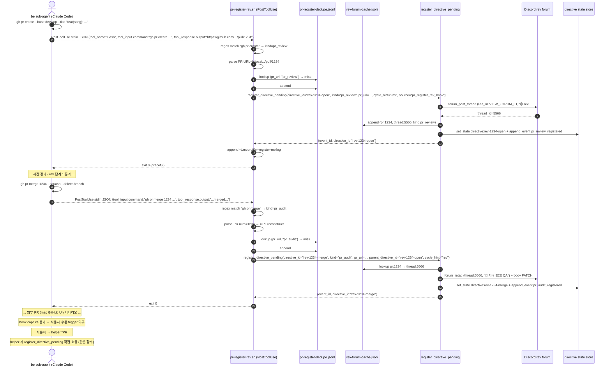

# GitHub PR 이벤트 → rev forum thread 자동화

## 1) 개요 (What / Why)

- 사용자 의도 (#1358 본문 / #1357 평가 결과): "PR 이 올라가면 rev 의 할 일에 자동으로 쌓이고, 그게 forum 형태로 추적 가능해야 한다."
- 현재 상태 (evidence): bot.py 에는 GitHub PR 이벤트를 입력으로 받는 webhook / polling 핸들러가 **자체적으로 존재하지 않습니다**. 머지 시 cycle forum thread 를 ✅ retag 하는 `cycle_thread_complete_on_merge_loop` (bot.py:4476) 만 있고, 이는 **이미 launch 된 cycle thread 가 닫히는 흐름**입니다. 새 PR 이 올라왔을 때 rev forum 에 새 thread 신설 + 1차 review directive 적재 흐름은 없습니다.
- `tools/agent/tools_cycle.py:73-108` `register_directive_pending` 의 state schema 에 `thread_id` 필드는 있으나 등록 시점에는 `None` 으로 박힙니다 — 어디서 thread_id 를 채우는지의 wiring 이 PR open 이벤트와 연결되지 않은 상태입니다.
- 결과: 사용자가 PR 진행 / 후속 회귀 검증을 forum 한 곳에서 추적할 수 없습니다 ("잘 관리 안 됨" 평가).
- 본 spec = **PR 생성·머지를 trigger 한 actor (helper / be / fe / nmae / rev / plan) 가 직접 `register_directive_pending` 을 호출해 rev forum thread 라이프사이클을 끌고 가는 인프라**의 운영 모델 + 구현 방향 박제. 강제 메커니즘은 **각 actor 의 `.claude/settings.json` PostToolUse Bash hook** 단독 (CLAUDE.md §17 메커니즘 단 우선순위 적용 — system prompt < hook < wrapper). 코드 자체는 다음 be / infra 사이클이 본 spec 기반으로 구현합니다.
- **사용자 결정 (2026-05-30, round 19)** — round 17 옵션 A 채택을 **재정정**:
  - **옵션 D 채택** (사용자 제안): actor trigger + PostToolUse Bash hook 단독. PR 생성·머지 명령 (`gh pr create` / `gh pr merge`) 을 친 actor 가 hook 을 통해 `register_directive_pending(cycle=rev, kind=pr_review|pr_audit, pr_url=..., thread_id=None)` 호출 → rev 작업 큐 entry → rev forum thread 신설 (PR open) 또는 단계 전이 (PR merge).
  - **옵션 A 폐기** (HTTP webhook / Cloudflare Tunnel / nginx / aiohttp / HMAC / `GITHUB_WEBHOOK_SECRET` / Q9). 사유: NCP 인바운드 / Cloudflare 의존 운영 부담 회피 + CLAUDE.md §17 강제 메커니즘 일관성 (다른 mobruji 흐름이 모두 hook / wrapper / system prompt 로 강제).
  - **옵션 B 폐기** (polling 5분 + webhook fallback safety net). 사유: 사용자 명시 redirect — polling 자체가 학습 의존 + 항시 부하 + actor trigger 가 자연 멱등 (PR 생성·머지는 actor 가 1회 호출).
  - **fallback** = 사용자 수동 trigger (외부 PR / hook 누락 / agent crash 시). 자동 polling 없음.
  - 상세 §11 결정 로그.

## 2) 사용자 시나리오

- **시나리오 1 (PR open)**: be sub-agent 가 `gh pr create --base develop --title "feat(song): ..."` 호출 → Claude Code PostToolUse hook (`pr-register-rev.sh`) 가 `tool_input.command` 정규식 매칭 + `tool_response.output` 에서 PR URL parse → `register_directive_pending(directive_id="rev-1234-open", kind="pr_review", pr_url=..., cycle_hint="rev")` 호출 → rev 작업 큐 entry 1건 + rev forum 채널 (`PR_REVIEW_FORUM_ID`) 에 새 thread 신설 (제목 `🟡 rev #1234 — feat(song): ...`), 본문 = PR 메타 + rev 1차 review 체크리스트 template + `cycle-forum:` 본문 cross-ref. nmae 가 다음 rev launch 시 본 directive 를 큐 head 로 잡아 rev sub-agent 에 위임.
- **시나리오 2 (PR merge)**: 같은 PR #1234 가 `gh pr merge --squash` 로 develop 머지 → 같은 hook 이 `gh pr merge` 정규식 매칭 → `register_directive_pending(directive_id="rev-1234-merge", kind="pr_audit", pr_url=..., parent_directive_id="rev-1234-open", cycle_hint="rev")` 호출 → 기존 rev thread lookup (`rev-forum-cache.jsonl` 의 `pr_number ↔ thread_id` 매핑) → 같은 thread 에 단계 전이 `🟡 1차 review → 🔵 머지됨 — 사후 E2E QA` retag + 본문 `✅ 1차 review pass` 섹션 + `📋 사후 단계 2 QA 체크리스트` 섹션 PATCH. directive board 에 `kind=pr_audit`, `pr_number=1234`, `parent_thread_id=<같은 thread>` entry append. nmae 가 다음 rev launch 시 단계 2 audit 으로 위임.
- **시나리오 3 (rev sub-agent 작업)**: rev sub-agent 가 큐에서 본 directive 를 받아 단계 1 또는 단계 2 작업 수행 → milestone 마다 같은 thread 에 댓글 stream (`--auto-thread`) + 본문 체크박스 갱신 (`--forum-edit`). 결론은 PR 코멘트 `rev단계1: 🟢/🟡/🔴 ...` + `reviewed:claude` 라벨.
- **시나리오 4 (사용자 forum 회고)**: 사용자가 rev forum sidebar 에서 PR 번호 또는 scope 별 thread filter 가능. 1 PR = 1 rev thread (open ~ post-merge 통합).
- **시나리오 5 (외부 PR / hook 우회)**: 사용자가 mac GitHub Desktop / GitHub UI 로 직접 PR 만들거나 Claude Code 외 환경에서 `gh pr create` 호출 → hook capture 불가 → 사용자가 명시적으로 `📌` 등록 또는 helper 에 "PR #1234 rev 등록해" 명령 → helper 가 `register_directive_pending` 직접 호출. nmae 가 매일 GitHub PR open / merge count vs rev directive entry count cross-check (PR 5 에서 별 검증 loop 검토).

## 3) 요구사항

### 기능 요구사항

#### 3-1. PR open 이벤트 처리 (actor `gh pr create` 호출 시점)

- [ ] PostToolUse hook (`pr-register-rev.sh`) 가 `tool_input.command` 정규식 `^\s*gh\s+pr\s+create\b` 매칭. `tool_response.output` (또는 `tool_output`) 에서 PR URL 추출 (`https://github.com/[^/]+/[^/]+/pull/\d+`). URL parse 실패 시 graceful skip + warning log.
- [ ] 멱등성 가드: `~/.mobruji/pr-register-dedupe.jsonl` 에 `{pr_url, kind, ts}` append-only + 메모리 set (cap 1000). 같은 `(pr_url, kind="pr_review")` 2회 trigger 시 dedupe skip + 200.
- [ ] rev forum 채널 (`PR_REVIEW_FORUM_ID`) 에 새 thread 신설. thread 제목 = `🟡 rev #{pr_num} — {pr_title 첫 60자}`.
- [ ] thread 본문 template:
  ```text
  🔍 **rev 1차 review — PR #{pr_num}**

  💬 PR 정보
  - 제목: {pr_title}
  - 작성자: @{pr_user}
  - scope: {scope label or "(미분류)"}
  - type: {type label}
  - base ← head: {base} ← {head}
  - URL: {pr_url}

  📋 rev 단계 1 체크리스트 (PR 머지 전)
  - [ ] 코드 변경 부합성 (요구사항 vs diff)
  - [ ] 컨벤션 (08-code-conventions.md)
  - [ ] 비기능 (테스트 / 관측성 / 보안)
  - [ ] visual diff (scope:web 한정 — visual-regression-ci.md §3-4)
  - [ ] 결론 코멘트 + `reviewed:claude` 라벨

  ⏭️ 다음 단계
  rev sub-agent launch 대기

  🔖 관련
  - PR: #{pr_num}
  - directive: `{directive_id}`
  ---
  _갱신: {ts} (open 자동 등록)_
  ```
- [ ] tag `🟡 1차 review` 부착 (forum `available_tags` 에 사전 등록 — §10 Q3).
- [ ] `register_directive_pending` 호출 (확장 시그니처 — PR 2-b):
  ```python
  register_directive_pending(
      directive_id="rev-1234-open",
      summary="PR #1234 — feat(song): ...",
      cycle_hint="rev",
      kind="pr_review",               # 신규 키워드 (PR 2-b)
      pr_url="https://github.com/...", # 신규 키워드 (PR 2-b)
      thread_id="<신설 thread snowflake>",  # PR 2-b 에서 wiring 완성
      source="pr_register_rev_hook",
  )
  ```
  결과 jsonl entry schema:
  ```json
  {
    "directive_id": "rev-1234-open",
    "kind": "pr_review",
    "pr_number": 1234,
    "pr_url": "https://github.com/...",
    "thread_id": "<신설 thread snowflake>",
    "assigned_cycle": "rev",
    "status": "pending",
    "created_at": "<ts>",
    "source": "pr_register_rev_hook"
  }
  ```
- [ ] PR 자체에 코멘트 1건 push (Q2=a 유지): `🔍 rev 1차 review thread 신설 — https://discord.com/...`. hook 실행 후 `gh pr comment {pr_num} -b ...` 호출 (graceful — 실패 시 warning).

#### 3-2. PR merge 이벤트 처리 (actor `gh pr merge` 호출 시점)

- [ ] PostToolUse hook 이 `tool_input.command` 정규식 `^\s*gh\s+pr\s+merge\b` 매칭. `tool_response.output` 또는 `tool_input.command` 의 PR 번호 / URL 인자 (`gh pr merge 1234` / `gh pr merge https://...`) 에서 PR URL 추출.
- [ ] 멱등성 가드: 같은 `(pr_url, kind="pr_audit")` 2회 trigger 시 dedupe skip.
- [ ] 같은 PR 번호의 기존 rev thread lookup:
  - 우선순위 1: `~/.mobruji/rev-forum-cache.jsonl` 의 `pr_number ↔ thread_id` 매핑 (open 시점에 박힘).
  - 우선순위 2: PR body 의 `rev-forum: <thread_id>` cross-ref line (PR 작성자가 박은 경우).
  - 우선순위 3: rev forum 채널 검색 (제목 prefix `rev #1234`). 마지막 수단.
  - 우선순위 4: 모두 miss (외부 PR 또는 open hook 누락) → `pr_open_handler` 폴백 호출 후 즉시 단계 전이 처리.
- [ ] 같은 thread 에 단계 전이:
  - tag 변경: `🟡 1차 review` → `🔵 사후 E2E QA` (또는 `✅ 1차 review pass + 🔵 사후 audit` 2-tag 표현, §10 Q5).
  - 본문 PATCH:
    ```text
    ✅ rev 단계 1 결과 *(머지 시점)*
    - reviewed:claude 라벨: {라벨 부착 시각 / "부재"}
    - 결론 코멘트: {🟢/🟡/🔴 코멘트 발견 여부}
    - 머지 시각: {mergedAt}
    - 머지 commit: {sha}

    📋 rev 단계 2 체크리스트 (develop 머지 후 dev 환경)
    - [ ] dev 환경 deploy 반영 확인
    - [ ] e2e 회귀 (변경 영향 범위)
    - [ ] regression label 부착 (`regression:dev` / `rev-post-merge-pass`)

    ⏭️ 다음 단계
    rev sub-agent 단계 2 audit launch 대기
    ```
- [ ] thread 댓글 1건 append (`--auto-thread` 또는 `--forum-comment`): `✅ 머지됨 — 사후 E2E QA 단계 진입 (commit={sha})`.
- [ ] `register_directive_pending` 호출 (단계 2):
  ```python
  register_directive_pending(
      directive_id="rev-1234-merge",
      summary="PR #1234 머지 — 사후 E2E QA",
      cycle_hint="rev",
      kind="pr_audit",                # 신규 키워드 (PR 2-b)
      pr_url="https://github.com/...",
      thread_id="<같은 thread>",       # 기존 cache lookup 결과
      parent_directive_id="rev-1234-open",
      source="pr_register_rev_hook",
  )
  ```
- [ ] 기존 `cycle_thread_complete_on_merge_loop` (cycle forum thread ✅ retag) 와의 관계 — **별 모듈** (rev forum 은 별 채널, cycle forum 은 cycle 별 BE/FE/REV/PLAN 채널). 본 spec 의 rev forum thread 는 cycle forum 의 rev launch thread 와 다름. 둘 다 살아 있음. cross-ref 는 §6-1 모듈 경계 표 참조.

#### 3-3. 멱등성 / state

- [ ] hook 1회 처리 보장: `~/.mobruji/pr-register-dedupe.jsonl` append-only (`pr_url + kind + ts`). 같은 actor 가 실수로 `gh pr create` 두 번 호출하거나 retry 시 dedupe.
- [ ] `register_directive_pending` 의 기존 `duplicate` 분기 (`tools_cycle.py:90-91`) 가 같은 `directive_id` 2회 호출을 자연 차단 — 두 번째 layer 가드.
- [ ] hook 호출 누락 시 (bot.py 재시작 / Claude Code crash / 외부 PR / 사용자 mac UI) — **자동 catchup 없음** (round 19 사용자 결정). 사용자 수동 trigger 의무 (helper 에 명령 또는 `📌` 등록). monitoring 은 §9 nmae digest cross-check.

#### 3-4. 라벨 / scope 필터

- [ ] PR 모든 type / scope 대상 (rev 사이클은 모든 PR 통과 의무 — `feedback-rev-e2e-always`).
- [ ] 단, `type:release` PR 은 단계 1 면제 (`rev-sla.md` SLA 매트릭스) — open thread 는 신설하되 본문 체크리스트 = `면제 (release PR)`.
- [ ] `type:emergency-hotfix` PR 도 단계 1 면제 — 단계 2 만 active (`emergency-hotfix-flow.md`).

### 비기능 요구사항

- **신뢰성**:
  - hook script 실패 시 graceful — `gh pr create` / `gh pr merge` 자체 차단 X (mobruji `helper-tool-progress.sh` 패턴: `trap exit_graceful ERR` + `exit 0`).
  - `register_directive_pending` 호출 실패 시 stderr warning + actor 흐름 계속. 다음 helper turn 또는 nmae digest 가 누락 감지 (§9).
  - Discord 4xx / network 일시 장애 → stderr warning + 재시도 안 함 (사용자 수동 trigger 또는 nmae digest fallback).
- **보안**:
  - 외부 inbound endpoint 부재 (옵션 D = 내부 hook 만). HMAC / TLS / cert / secret 검증 불필요.
  - PR title / body 의 사용자 입력은 forum body 에 그대로 embed 시 mention injection / 큰 mass push risk — `@everyone` / `@here` / `<@&...>` mention escape 의무.
  - hook script 가 stdin JSON parsing 시 jq 사용 — malformed JSON 에 대해 silent skip (graceful).
- **관측성**:
  - hook 발사 시 stderr log `pr-register-rev: PR #1234 kind=pr_review → thread <id> 신설` + (옵션) `~/.mobruji/pr-register-rev.log` append.
  - `register_directive_pending` 호출 결과 (`event_id` / `duplicate`) 를 `~/.mobruji/pr-register-rev.log` 에 박제 — 누락 추적용.
  - nmae digest (선택 PR 5) — 매일 GitHub PR open / merge count vs rev directive entry count cross-check.
- **보존**:
  - rev forum thread = Discord history (archive 정책은 Discord 채널 설정에 의존, 인프라가 자동 삭제 X).
  - `pr-register-dedupe.jsonl` = 1000 entry FIFO truncate (운영 후 조정).
  - `rev-forum-cache.jsonl` = cap 1000 FIFO.

## 4) 범위 / 비범위

### 포함

- actor (helper / be / fe / nmae / rev / plan) 가 `gh pr create` / `gh pr merge` 호출 시 PostToolUse hook 이 rev forum thread 신설 / 단계 전이 + directive 적재.
- 멱등성 가드 (`pr-register-dedupe.jsonl` + `register_directive_pending` 자체 duplicate 분기).
- rev forum thread template + 단계 전이 본문 PATCH.
- 옵션 A / B / C / D 비교 + 옵션 D 채택 사유 (§5).
- 기존 `cycle_thread_complete_on_merge_loop` (cycle forum) 과의 모듈 경계.

### 제외 (Out of Scope)

- rev sub-agent 의 review 코드 자체 (`tools/rev-queue/` 의 큐 처리 알고리즘 변경 X). 본 spec 은 **directive 등록 + thread 신설까지** 만 책임.
- GitHub Actions workflow 의 정책 변경 (`auto-label.yml` / `rev-gate.yml` / `discord-notify.yml` 의 핵심 로직 수정 X).
- nmae 의 큐 정책 변경 — directive 가 적재되면 nmae 가 다음 rev launch 시 queue head 선정. 본 spec 은 등록까지만.
- `cycle_thread_complete_on_merge_loop` (cycle forum thread ✅ retag) 의 폐기 — 별 모듈로 공존 (§6-1).
- PR draft → ready_for_review 이벤트 처리 (옵션 D 에서는 hook 매칭 정규식 확장 시 자연 처리 가능 — §10 Q1 로 보류).
- main base release PR 머지 (§10 Q4 으로 보류 — hook 정규식 같으나 면제 분기 의무).
- review thread 안 사용자 댓글 → 새 directive 등록 흐름 (`cycle-forum-operation.md` PR E §5-6 별 spec scope).
- 외부 PR (mac GitHub Desktop / GitHub UI / Claude Code 외 환경) 자동 capture — 사용자 수동 trigger 의무 (§9 Q10).
- 자동 polling fallback — round 19 사용자 명시 redirect (옵션 B 폐기). nmae digest cross-check 만 (선택 PR 5).

## 5) 설계 — 옵션 비교 + 권고

### 5-1) 옵션 A: HTTP webhook server (bot.py + aiohttp) — **폐기 (round 19 사용자 결정)**

원안 (round 17): bot.py 가 같은 asyncio 이벤트 루프 안 aiohttp app 띄움 (`POST {WEBHOOK_PATH}`). GitHub repo settings → Webhooks 에서 URL 등록. nginx reverse proxy (Let's Encrypt SSL) 또는 Cloudflare Tunnel 로 NCP VM 의 내부 port 를 public HTTPS 로 노출.

**round 19 폐기 사유**:
- NCP 인바운드 / Cloudflare zone 의존 운영 부담 회피 (사용자 결정).
- HMAC secret rotation / TLS cert 만료 monitoring / asyncio loop 충돌 가드 / 외부 endpoint 노출 등 운영 surface 가 옵션 D 대비 과대.
- mobruji 의 다른 강제 메커니즘 (helper-tool-progress.sh / agent-launch-wrapper.sh / cycle-status/update.sh) 이 모두 hook / wrapper / system prompt 로 일관 — 옵션 A 만 외부 endpoint 패턴 = 운영 모델 불일치.
- 같은 효과 (즉시 발사 + 멱등성 자연) 를 옵션 D 가 actor trigger + dedupe jsonl 로 달성.
- 폐기되는 인프라: aiohttp `web.Application()` / `web.AppRunner` / `web.TCPSite` / `X-Hub-Signature-256` HMAC / `X-GitHub-Delivery` UUID dedupe / Cloudflare Tunnel / nginx + Let's Encrypt / `GITHUB_WEBHOOK_SECRET` env / `WEBHOOK_PORT` env / `WEBHOOK_PATH` env / Q9 (nginx vs Cloudflare).

### 5-2) 옵션 B: GitHub polling (bot.py 5분 loop) — **폐기 (round 19 사용자 결정, fallback safety net 도 채택 안 함)**

원안: `gh pr list --state open --search "created:>1h ago"` + `--state merged --search "merged:>1h ago"` 두 query 를 5분 polling.

**round 19 폐기 사유 (사용자 명시 redirect)**:
- polling 자체가 학습 의존 + 항시 부하 (heartbeat / dormant 상태 관리 / `gh` CLI rate limit cross-check 등).
- actor trigger (옵션 D) 가 자연 멱등 — PR 생성·머지는 actor 가 1회 호출하므로 polling 의 "누락 catchup" 가치가 actor 흐름에서는 무의미.
- 외부 PR (mac UI / GitHub Desktop) capture 만이 polling 의 잔여 가치인데, 사용자가 수동 trigger 로 cover 의무 (§9 위험 + §10 Q10).
- fallback safety net 으로도 채택 안 함 — round 17 안의 "옵션 A primary + 옵션 B fallback" 듀얼 stack 부담 회피.
- 폐기되는 인프라: `pr_event_polling_loop_fallback` / `fetch_recent_opened_prs` helper / `PR_EVENT_FALLBACK_POLL_INTERVAL_SECONDS` env / `pr-open-seen.jsonl` / `pr-merge-seen.jsonl` (옵션 D 의 `pr-register-dedupe.jsonl` 가 대체).

### 5-3) 옵션 C: GitHub Actions workflow → bot.py 수신 — **폐기 (기존 round 16 결정 유지)**

워크플로우 → Discord DIGEST 메시지 → bot.py message handler 의 중간 layer 가 fragile + 옵션 D 가 더 직접적.

### 5-4) 옵션 D: actor trigger + PostToolUse Bash hook — **채택 (round 19 사용자 결정)**

PR 생성·머지 명령 (`gh pr create` / `gh pr merge`) 을 친 actor (helper / be / fe / nmae / rev / plan) 가 Claude Code 의 PostToolUse hook 을 통해 `register_directive_pending` 을 호출. 외부 endpoint / polling 없음 — actor 의 도구 호출 자체가 trigger.

#### 5-4-1) 구성 요소

- **hook script**: `tools/discord-daemon/pr-register-rev.sh` (배포 path `~/.mobruji/pr-register-rev.sh` symlink — mobruji 다른 hook script 와 동일 패턴).
  - mobruji 기존 `tools/discord-daemon/helper-tool-progress.sh` (PreToolUse Bash hook, `docs/features/helper-tool-visibility.md`) 의 구조 거울:
    - `set -uo pipefail` + `trap exit_graceful ERR` + `exit 0` 항상 (graceful — hook 실패가 actor 도구 호출 자체 차단 X).
    - stdin JSON read (max 64KB) + jq parsing (jq 미설치 시 silent skip).
    - actor marker 가드 (`MOBRUJI_HOOK_ACTOR` env — helper/be/fe/nmae/rev/plan 모두 허용. helper-tool-progress.sh 는 helper 만이었으나 본 hook 은 모든 actor 허용).
  - 핵심 로직:
    1. stdin JSON 의 `hook_event_name == "PostToolUse"` + `tool_name == "Bash"` 확인.
    2. `tool_input.command` 가 정규식 `^\s*gh\s+pr\s+(create|merge)\b` 매칭 확인. 매칭 안 되면 silent skip.
    3. `tool_response.output` 에서 PR URL parse (`https://github.com/[^/]+/[^/]+/pull/(\d+)`). 없으면 `tool_input.command` 의 인자 (`gh pr merge 1234` / `gh pr merge https://...`) 에서 fallback parse. 둘 다 실패 시 warning + exit 0.
    4. `kind` 결정 — `create` → `pr_review`, `merge` → `pr_audit`.
    5. dedupe lookup (`~/.mobruji/pr-register-dedupe.jsonl`) — 같은 `(pr_url, kind)` hit 시 skip + exit 0.
    6. dedupe append + `register_directive_pending` 호출 (구현 path: §6-2):
       - 옵션 D-1 (권고): bot.py 의 IPC endpoint (Discord 메시지 또는 sqlite events) — actor 가 직접 Python import 어려운 경우.
       - 옵션 D-2 (대안): `python3 -c "from tools.agent.tools_cycle import register_directive_pending; register_directive_pending(...)"` 직접 호출. 단, sub-agent 의 venv / PYTHONPATH 가 actor 마다 다르므로 wrapper 필요.
       - 최종 구현은 PR 2-a 에서 actor cwd / venv 의존성 검토 후 결정 (§10 Q12 신규).
    7. graceful log (`~/.mobruji/pr-register-rev.log` append) + exit 0.
- **`.claude/settings.json` 등록 (per-actor)**: 기존 `PreToolUse` hook 옆에 `PostToolUse` hook 추가:
  ```json
  {
    "hooks": {
      "PreToolUse": [ ... 기존 helper-tool-progress.sh ... ],
      "PostToolUse": [
        {
          "matcher": "Bash",
          "hooks": [
            {
              "type": "command",
              "command": "[ -x $HOME/.mobruji/pr-register-rev.sh ] && $HOME/.mobruji/pr-register-rev.sh || true"
            }
          ]
        }
      ]
    }
  }
  ```
  - 등록 대상 워크트리 / actor: 본진 (mac `mobruji` 워크트리 + helper) + NCP (`mobruji-ncp` 워크트리 + nmae) + sub-agent worktree 4 (`mobruji-be` / `mobruji-fe` / `mobruji-rev` / `mobruji-plan`) — 즉 모든 Claude Code 실행 환경.
  - 강제 메커니즘 (CLAUDE.md §17 메커니즘 단 우선순위 적용):
    - 1차: `tools/agent-launch-wrapper.sh` 가 sub-agent launch 직전 `.claude/settings.json` 의 hook 등록 여부 검증 — 누락 시 graceful warning + auto-patch.
    - 2차: ci 가드 (`.github/workflows/` 의 lint job) 가 `.claude/settings.json` 의 PostToolUse hook 존재 검증 — 누락 PR 차단.
    - 3차: 메모리 [[feedback-pr-register-hook-required]] 박제 (보조 학습).
- **`register_directive_pending` 시그니처 확장 (PR 2-b)**:
  - 현재 (tools_cycle.py:73-108):
    ```python
    def register_directive_pending(
        directive_id: str,
        summary: str,
        *,
        cycle_hint: CycleName | None = None,
    ) -> dict[str, Any]:
    ```
  - 확장 후:
    ```python
    def register_directive_pending(
        directive_id: str,
        summary: str,
        *,
        cycle_hint: CycleName | None = None,
        kind: Literal["user_directive", "pr_review", "pr_audit"] = "user_directive",
        pr_url: str | None = None,
        thread_id: str | None = None,
        parent_directive_id: str | None = None,
        source: str = "user_pushpin",
    ) -> dict[str, Any]:
    ```
  - state schema 에 `kind` / `pr_url` / `parent_directive_id` / `source` 필드 추가. 기존 `thread_id=None` 은 호출자 (hook) 가 thread 신설 후 채움.
  - `kind="pr_review"` / `"pr_audit"` 시 자동:
    - rev forum 채널 (`PR_REVIEW_FORUM_ID`) 에 thread 신설 (open) 또는 lookup + 단계 전이 (merge).
    - thread_id 박은 state set + event append (`pr_review_registered` / `pr_audit_registered`).

#### 5-4-2) 채택 사유

- **CLAUDE.md §17 메커니즘 단 우선순위 일관성**: mobruji 의 모든 강제는 hook / wrapper / system prompt — 옵션 D 가 hook 패턴에 자연.
- **외부 endpoint 0 → 운영 surface 최소**: TLS / cert / inbound port / HMAC / secret rotation 전부 N/A.
- **즉시 발사 + 자연 멱등**: actor 가 PR 명령 호출 시 hook 동기 실행 — latency 0. dedupe jsonl 가 retry 가드.
- **외부 PR capture 제외 (의도적 trade-off)**: mac GitHub Desktop / GitHub UI / Claude Code 외 환경의 PR 은 hook 우회 → 사용자 수동 trigger 의무 (§9 Q10). 이는 옵션 A 의 webhook 도 actor 가 외부에서 PR 만들면 capture 하지만, 사용자 환경에서 PR 만드는 빈도 자체가 낮고 수동 trigger 비용도 낮다는 사용자 판단 ([[feedback-discord-tone-formal]] + [[feedback-autonomous-default]] 메모리 cross-ref).

#### 5-4-3) 단점 / trade-off

- actor `.claude/settings.json` hook 등록 누락 시 silent skip — wrapper / ci 가드로 보강 (§5-4-1 강제 메커니즘).
- 외부 PR (사용자 mac UI / 다른 환경) capture 불가 — 사용자 수동 trigger 의무 + nmae 일일 cross-check digest (선택 PR 5).
- hook script 자체 실패 시 silent (graceful exit 0) — log 박제 + nmae digest 가 alert (§9 위험 + Q11 신규).
- `register_directive_pending` 호출 path 의 actor cwd / venv 의존 — IPC 또는 wrapper 로 추상화 의무 (§10 Q12).

### 5-5) 도메인 모델 영향 (06-domain-model.md §4 신규 용어 후보)

별 commit 으로 도메인 모델 §4 등재 (sub-agent.md 룰: "도메인 용어는 §4 에 먼저 등재"):

- **PR 1차 review thread** (`PrReviewThread`): actor 의 `gh pr create` 호출 시 PostToolUse hook 이 rev forum 채널 (`PR_REVIEW_FORUM_ID`) 에 자동 신설하는 Discord forum thread (snowflake 18-20자리). 1 PR = 1 thread (open ~ post-merge 단계 전이 통합). thread 본문 = §3-1 template + 단계 1/2 체크박스. tag = `🟡 1차 review` → `🔵 사후 E2E QA` 자동 전이. cycle forum thread (`CycleLaunchThreadId`) 와 다른 채널 / 다른 용도. 출처: `pr-webhook-rev-forum.md §3-1·§3-2`.
- **rev PR directive** (`RevPrDirective`): `register_directive_pending(kind="pr_review" | "pr_audit", pr_url=..., thread_id=..., parent_directive_id=...)` 호출로 등록되는 rev 작업 큐 entry. `kind="pr_review"` = 단계 1 (PR open, 머지 전), `kind="pr_audit"` = 단계 2 (머지 후 사후 E2E QA). `parent_directive_id` 가 같은 PR 의 단계 1↔2 link. nmae 가 큐 head 선정 시 우선순위 적용 (§7 PR 4 에서 sub-agent.md 룰 박제). 출처: `pr-webhook-rev-forum.md §5-4·§3-1·§3-2`.
- **PostToolUse hook 가드** (`PostToolUseHookGuard`): actor 의 `.claude/settings.json` 에 등록되는 PostToolUse Bash hook (`pr-register-rev.sh`). `gh pr create` / `gh pr merge` 도구 호출을 감지해 `RevPrDirective` 적재 + `PrReviewThread` 신설 / 단계 전이를 자동 trigger. mobruji 의 `PreToolUseHookGuard` (`helper-tool-progress.sh`, `helper-tool-visibility.md`) 와 거울 패턴. graceful (실패 시 도구 호출 차단 X). 출처: `pr-webhook-rev-forum.md §5-4-1`.
- **PR review forum 캐시** (`PrReviewForumCache`): `~/.mobruji/rev-forum-cache.jsonl` 의 `{pr_number, thread_id, opened_at, kind}` 매핑 entry. PR open hook 시 append, PR merge hook 시 lookup. cap 1000 FIFO. 출처: `pr-webhook-rev-forum.md §3-2`.

### 5-6) Mermaid 시퀀스 (옵션 D 기준)



## 6) 영향 / 구현 방향 (옵션 D 기준)

### 6-1) 모듈 경계 (기존 loop 와의 cross-ref)

| 모듈 | 채널 / 채널 ID env | 대상 thread | trigger | 본 spec 관계 |
|---|---|---|---|---|
| `cycle_thread_complete_on_merge_loop` (기존, bot.py:4476) | cycle forum (BE/FE/REV/PLAN) | `CycleLaunchThreadId` (sub-agent launch 단위) | PR 머지 + body `cycle-forum:` cross-ref | **공존** (Q7=a 사용자 결정 round 17 유지) — 본 spec 변경 X. 같은 PR 머지 이벤트가 본 spec hook + 기존 loop 두 곳을 trigger 하나 다른 thread 갱신. |
| `pr-register-rev.sh` (신규, 옵션 D 단독) | rev forum (`PR_REVIEW_FORUM_ID`) | `PrReviewThread` (PR 단위) | actor 의 `gh pr create` / `gh pr merge` Bash 도구 호출 → PostToolUse hook | 본 spec §3-1 / §3-2 / §5-4 |
| `rev_post_merge_audit_loop` (기존, bot.py:4545) | DIGEST 채널 + tmux inject | tmux pane | PR 머지 (debounce) | **별 모듈** — 본 spec 의 단계 2 directive 가 등록되면 nmae 큐 head 로 반영. 두 흐름 cross-ref 만, 코드 결합 X. |
| `directive_complete_on_merge_loop` (기존) | directive forum | directive thread | PR body `directive:` cross-ref + 머지 | **별 모듈** — 사용자 등록 directive 라이프사이클. 본 spec 의 rev directive 와 별 entry. |
| `helper-tool-progress.sh` (기존, PreToolUse) | helper thread | helper-current-thread | helper Bash 도구 호출 직전 | **별 hook** — 같은 actor `.claude/settings.json` 에 PreToolUse + PostToolUse 두 hook 등록. 도구 호출 1회당 두 script 가 sequential 실행 (graceful). |

폐기된 모듈 (round 19 사용자 결정으로 본 spec 에서 폐기):
- `pr_webhook_handler.py` (옵션 A primary) — 폐기.
- `pr_event_polling_loop_fallback` (옵션 B fallback) — 폐기.

### 6-2) 신규 / 수정 파일

- **`tools/discord-daemon/pr-register-rev.sh` (신규, PR 2-a 의 primary 모듈)**:
  - mobruji `tools/discord-daemon/helper-tool-progress.sh` 패턴 거울 — `set -uo pipefail` + `trap exit_graceful ERR` + jq parsing + graceful exit 0.
  - 입력: stdin JSON (Claude Code PostToolUse hook spec) — `{"hook_event_name":"PostToolUse","tool_name":"Bash","tool_input":{"command":"..."},"tool_response":{"output":"..."}}`.
  - 매칭: `tool_input.command` 가 정규식 `^\s*gh\s+pr\s+(create|merge)\b` 매칭 시만 발사. 그 외 silent skip.
  - actor marker 가드: `MOBRUJI_HOOK_ACTOR` env (`helper` / `nmae` / `be` / `fe` / `rev` / `plan`) 중 1개 — helper-tool-progress.sh 와 달리 6 actor 모두 허용. unset 시 silent skip (defense).
  - 멱등성 store: `~/.mobruji/pr-register-dedupe.jsonl` append-only (`pr_url + kind + ts`) + 메모리 set (cap 1000 FIFO).
  - register 호출: §5-4-1 의 옵션 D-1 (bot.py IPC) 또는 D-2 (Python direct) — 최종 구현 path 는 PR 2-a 에서 결정 (§10 Q12).
- **`tools/discord-daemon/pr-register-rev-deploy.sh` 또는 wrapper (신규)**: hook script 를 mac 본진 + NCP + 4 워크트리 의 `~/.mobruji/` 에 symlink 배포. mobruji 의 기존 `~/.mobruji/discord-reply.sh` symlink 패턴 재사용.
- **`.claude/settings.json` (per-actor 수정, PR 2-a)**:
  - 본진 (`/Users/goohong/workspace/github/mobruji/.claude/settings.json`) — 현재 `helper-tool-progress.sh` PreToolUse 만. PostToolUse Bash matcher 추가.
  - sub-agent worktree 4 (`mobruji-be` / `mobruji-fe` / `mobruji-rev` / `mobruji-plan`) — 같은 PostToolUse hook 추가. 같은 `.claude/settings.json` 또는 글로벌 user-level settings 검토 (§10 Q13).
  - NCP nmae (`/home/mobruji/...`) — 같은 hook 추가.
- **`tools/agent-launch-wrapper.sh` (수정, PR 2-a)**:
  - sub-agent launch 직전 `.claude/settings.json` 에 PostToolUse hook 등록 여부 검증 — 누락 시 graceful warning + auto-patch (강제 메커니즘 1차).
- **`tools/agent/tools_cycle.py:73-108` `register_directive_pending` (수정, PR 2-b)**:
  - 시그니처 확장 — §5-4-1 참조 (`kind` / `pr_url` / `thread_id` / `parent_directive_id` / `source` 키워드).
  - state schema 확장 — `kind` / `pr_url` / `parent_directive_id` / `source` 필드 추가.
  - `kind="pr_review"` / `"pr_audit"` 분기 — rev forum thread 신설 / lookup + 단계 전이 호출 (`discord-reply.sh` 의 forum 모드 재사용).
  - event kind 추가: `pr_review_registered` / `pr_audit_registered` (기존 `directive_registered` 와 별).
- **`tools/discord-daemon/discord-reply.sh` (수정, PR 2-b)**:
  - 신규 mode `--forum-post-rev-thread <pr_num> <pr_title> <body>` (또는 기존 `--forum-post-auto-tag` 재사용).
  - 단계 전이 `--forum-retag <thread_id> rev "사후 audit"` + body PATCH 는 기존 `--forum-edit` 재사용.
- **신규 환경 변수 (`.env` + NCP env)**:
  - `PR_REVIEW_FORUM_ID` — Discord rev forum 채널 snowflake (사용자 manual 신규 채널 신설 — §13). **round 18 정정**: 기존 `REV_FORUM_ID` 와 이름 충돌 (cycle forum rev 채널 — bot.py:787 / 5469 / discord-reply.sh:286 / .env.example:58 / 14-discord-ops.md:274 / rev-qa-protocol.md:406 다수 사용) → 신규 변수명으로 분리.
- **신규 jsonl (런타임 생성)**:
  - `~/.mobruji/pr-register-dedupe.jsonl` — `(pr_url, kind)` 멱등성 (cap 1000 FIFO).
  - `~/.mobruji/rev-forum-cache.jsonl` — `{pr_number, thread_id, opened_at, kind}` 매핑 (cap 1000 FIFO).
  - `~/.mobruji/pr-register-rev.log` — hook 실행 log (graceful 추적, cap 10000 FIFO).
- **테스트**:
  - `tools/discord-daemon/tests/test_pr_register_rev_hook.sh` (신규, PR 2-a) — bash script 단위 (mobruji 기존 `test_forum_modes.sh` / `test_cycle_backlog_upsert.sh` 패턴 거울):
    - `gh pr create` regex 매칭 / `gh pr merge` regex 매칭 / 그 외 명령 skip.
    - PR URL parse (tool_response / tool_input fallback / 둘 다 fail).
    - dedupe (first / duplicate / window FIFO).
    - actor marker 가드 (`MOBRUJI_HOOK_ACTOR` unset / 6 actor 각각).
    - graceful (`register_directive_pending` 실패 시 exit 0).
    - 12~14 case.
  - `tools/agent/tests/test_register_directive_pending.py` (확장, PR 2-b) — `kind` / `pr_url` / `parent_directive_id` / `source` 새 키워드 시그니처 + state schema + event kind 검증.

### 6-3) 비동기 / asyncio loop 충돌 가드

- **폐기**: 옵션 A 의 aiohttp + discord.py 같은 loop 충돌 가드 → 옵션 D 에서는 N/A (aiohttp 자체 폐기).
- 옵션 D 의 hook script 는 actor process 의 별 subprocess 로 실행 — actor 의 Claude Code 흐름과 독립. `register_directive_pending` 호출 path 가 bot.py IPC (옵션 D-1) 면 discord.py asyncio loop 영향 검토 (§10 Q12).

### 6-4) DB / state schema

- 별 RDB 마이그레이션 없음 (jsonl + 기존 sqlite events 만).
- `tools/agent/state.py` event store 에 신규 event kind 등재:
  - `pr_review_registered` (kind=pr_review 시).
  - `pr_audit_registered` (kind=pr_audit 시).
  - 기존 `directive_registered` 와 별 — sub-agent / nmae digest 가 본 흐름 분리 추적 가능.

## 7) 작업 분할 (예상 PR 리스트 — 옵션 D 기준, round 19 재작성)

- [ ] **PR 1 (본 PR, plan)**: 본 Feature Spec (옵션 D 채택 round 19 정정 + round 18 블로커 cleanup) + cross-ref. `06-domain-model.md §4` 신규 용어 3종 등재는 PR 5 분리.
- [ ] **PR 2-a (be / infra cycle)** — hook script + settings.json 등록:
  - 신규 모듈 `tools/discord-daemon/pr-register-rev.sh` (bash, helper-tool-progress.sh 패턴 거울 — graceful exit 0 + jq parsing + actor marker 가드).
  - `tool_input.command` 정규식 매칭 (`^\s*gh\s+pr\s+(create|merge)\b`) + `tool_response.output` PR URL parse + `tool_input.command` fallback parse.
  - `~/.mobruji/pr-register-dedupe.jsonl` (cap 1000 FIFO) + 메모리 set.
  - register 호출 path 결정 (옵션 D-1 IPC vs D-2 Python direct) — §10 Q12 해소 후 1택 구현.
  - `.claude/settings.json` PostToolUse Bash matcher 추가 (본진 + 4 sub-agent worktree + NCP nmae 5개 경로).
  - `tools/agent-launch-wrapper.sh` 가 hook 등록 검증 + graceful warning + auto-patch.
  - `~/.mobruji/pr-register-rev.sh` symlink 배포 (또는 git 추적 path 직접 호출).
  - unit test (`test_pr_register_rev_hook.sh`) — 12~14 case (regex / parse / dedupe / actor marker / graceful).
  - **이 PR 단계에서는 register 호출이 stub log** (PR 2-b 에서 실제 wiring) — hook 인프라만 검증.
- [ ] **PR 2-b (be / infra cycle)** — `register_directive_pending` 시그니처 확장 + thread 신설 wiring:
  - `tools/agent/tools_cycle.py:73-108` `register_directive_pending` 시그니처 확장 (`kind` / `pr_url` / `thread_id` / `parent_directive_id` / `source` 키워드).
  - state schema 확장 (`kind` / `pr_url` / `parent_directive_id` / `source` 필드).
  - `kind="pr_review"` 분기 — rev forum 채널 (`PR_REVIEW_FORUM_ID`) thread 신설 호출 (`discord-reply.sh --forum-post-rev-thread`).
  - `kind="pr_audit"` 분기 — `rev-forum-cache.jsonl` lookup + 단계 전이 (`🟡 → 🔵` retag + body PATCH).
  - event kind 추가 (`pr_review_registered` / `pr_audit_registered`).
  - `type:release` 라벨 → 면제 thread 신설 (Q4=a 유지).
  - `discord-reply.sh` 신규 mode 추가 (`--forum-post-rev-thread`).
  - PR 2-a 의 hook script 가 stub log 에서 실제 호출로 전환.
  - unit test 확장 (`test_register_directive_pending.py`) — 새 키워드 + state schema + event kind.
- [ ] **PR 3 — 폐기 (round 19)**: round 17 안의 fallback polling loop. polling 자체 폐기 (사용자 명시 redirect).
- [ ] **PR 4 (rev / docs cycle)**: rev sub-agent 룰 update (`docs/ai-harness/actors/sub-agent.md §2-rev`) — 새 `kind` 2종 (`pr_review` / `pr_audit`) 의 큐 head 우선순위 박제 (보조 학습, hook 이 1차 강제). PR 2-b 머지 후.
- [ ] **PR 5 (plan / docs cycle)**: `docs/ai-harness/06-domain-model.md §4` 신규 용어 4종 (`PrReviewThread` / `RevPrDirective` / `PostToolUseHookGuard` / `PrReviewForumCache`) 등재. 본 spec 머지 직후 별 plan 사이클. (선택) nmae 일일 cross-check digest 흐름 (외부 PR capture monitoring) 도 동 PR 에 포함 검토.

### 보호 영역 변경 여부

- 보호 영역 변경 여부: ☐ 없음 / ☑ 있음 — 변경 파일과 사유:
  - `.env` (NCP) + `.env.example` — PR 2-a 에서 `PR_REVIEW_FORUM_ID` 추가. (round 19 폐기: `WEBHOOK_PORT` / `WEBHOOK_PATH` / `GITHUB_WEBHOOK_SECRET` / `PR_EVENT_FALLBACK_POLL_INTERVAL_SECONDS` 모두 N/A)
  - `.github/workflows/` — 변경 없음 (옵션 C 폐기 유지). 단, PR 2-a 가 ci 가드 (`.claude/settings.json` 의 PostToolUse hook 존재 검증) 를 lint job 에 추가 — `.github/workflows/lint.yml` 또는 신규 `claude-settings-guard.yml` 신설 검토.

## 8) 테스트 전략 (옵션 D 기준, round 19 재작성)

### 단위 테스트 — PR 2-a (hook script + dedupe + settings.json)

- **regex 매칭** (mobruji 기존 `test_forum_modes.sh` 패턴 거울):
  - `gh pr create --base develop --title "..."` → match, kind=pr_review.
  - `gh pr merge 1234 --squash --delete-branch` → match, kind=pr_audit.
  - `gh pr view 1234` → no match, skip.
  - `git push origin feat/foo` → no match, skip.
  - `gh pr create --draft` → match (draft PR 도 hook 발사, 면제 분기는 PR 2-b 의 `register_directive_pending` 에서).
- **PR URL parse**:
  - `tool_response.output` 에 `https://github.com/.../pull/1234` 포함 → parse 성공.
  - `tool_response.output` 부재 + `tool_input.command` 에 `gh pr merge 1234` → fallback parse (PR 번호 + git remote 로 URL reconstruct).
  - `tool_response.output` 부재 + command 도 인자 없음 → warning + exit 0 (graceful).
- **dedupe**:
  - 첫 `(pr_url, "pr_review")` → 처리 + jsonl append.
  - 같은 `(pr_url, "pr_review")` 재 호출 (actor retry) → skip + exit 0.
  - 같은 PR URL + 다른 kind (`pr_review` vs `pr_audit`) → 둘 다 처리 (단계 1 + 2 별 entry).
  - cap 1000 초과 → FIFO truncate.
- **actor marker 가드**:
  - `MOBRUJI_HOOK_ACTOR` unset → silent skip + exit 0.
  - `MOBRUJI_HOOK_ACTOR=helper` / `=be` / `=fe` / `=nmae` / `=rev` / `=plan` → 처리.
  - `MOBRUJI_HOOK_ACTOR=unknown` → silent skip (defense).
- **graceful**:
  - `register_directive_pending` 호출 실패 (mock raise) → stderr warning + exit 0 (actor 도구 호출 차단 X).
  - jq 미설치 → silent skip + exit 0.
  - stdin 비어있음 → exit 0.

### 단위 테스트 — PR 2-b (`register_directive_pending` 시그니처 확장 + thread 신설)

- 시그니처:
  - `kind="pr_review"` + `pr_url=...` + `thread_id` 박혀서 호출 → state schema 의 `kind` / `pr_url` / `thread_id` 필드 박힘.
  - `kind="pr_audit"` + `parent_directive_id=...` → state 의 `parent_directive_id` 필드 박힘 + event kind=`pr_audit_registered`.
  - `kind` 미지정 (default `"user_directive"`) → 기존 동작 유지 (회귀 가드).
  - `source` 키워드 → state 의 `source` 필드 박힘 (default `"user_pushpin"`).
- thread 신설 path (`kind="pr_review"`):
  - mock `discord-reply.sh --forum-post-rev-thread` 호출 1회 + thread_id 반환 + cache append.
  - `PR_REVIEW_FORUM_ID` env 부재 시 graceful skip + warning log (state 는 박지만 thread_id=None).
  - PR title 60자 초과 → truncate.
  - PR title `@everyone` / `@here` → escape.
  - `type:release` 라벨 → 본문 체크리스트 = "면제" 분기 (Q4=a 유지).
- 단계 전이 path (`kind="pr_audit"`):
  - cache lookup hit → forum-retag (`🟡 → 🔵`) + body PATCH 호출 1회.
  - cache miss + PR body `rev-forum:` cross-ref hit → fallback lookup.
  - cache miss + 모두 miss → 새 thread 신설 (drive-by squash 가드 — PR open hook 누락 시).
- 멱등성:
  - 같은 `directive_id` 재 호출 → duplicate 분기 (기존 동작 유지, 회귀 가드).

### 통합 테스트 (수동, sub-agent worktree 배포 후)

1. **be worktree hook 동작**: be sub-agent worktree 에서 임시 PR (`docs:` 또는 `chore:`) `gh pr create` 호출 → 5초 안에 rev forum 에 thread 신설 확인.
2. **단계 전이**: 같은 PR `gh pr merge --squash` → 5초 안에 같은 thread `🟡 → 🔵` retag + 본문 PATCH 확인.
3. **dedupe**: 같은 PR `gh pr create` 두 번 호출 (실수 retry) → 첫 번째만 처리 + 두 번째 skip 확인 (`pr-register-dedupe.jsonl` 확인).
4. **외부 PR (수동 trigger)**: mac GitHub UI 로 직접 PR 생성 → hook 미발사 확인 → helper 에 "PR #N rev 등록" 명령 → helper 가 `register_directive_pending` 직접 호출 → thread 신설 확인.
5. **graceful**: hook script 강제 chmod -x 또는 jq uninstall 시뮬레이션 → `gh pr create` 자체는 정상 + hook silent skip 확인.
6. **6 actor 별 hook 발사**: helper / nmae / be / fe / rev / plan 각 worktree 에서 `gh pr create` → 6개 모두 hook 발사 + register 호출 확인.

### 회귀 가드

- 기존 `cycle_thread_complete_on_merge_loop` 동작 영향 없음 — 같은 PR 머지가 두 모듈 trigger 하나 갱신 대상 thread / 채널 분리 (Q7=a 공존).
- 기존 `helper-tool-progress.sh` PreToolUse hook 동작 영향 없음 — 같은 `.claude/settings.json` 에 별 matcher / 별 script 등록.
- discord-daemon pytest baseline 대비 신규 fail 0건 — PR 2-a / 2-b 의 unit test 만 추가.
- bot.py boot probe (forum 채널 권한 log) 에 `PR_REVIEW_FORUM_ID` 1개 추가 — 5개 → 6개 forum.

## 9) 위험 (옵션 D 기준, round 19 재작성)

### 9-1) 옵션 D 고유 위험

- **actor `.claude/settings.json` PostToolUse hook 등록 누락**: 6 actor (helper / nmae / be / fe / rev / plan) 중 1개라도 hook 등록 안 됐으면 그 actor 의 PR 명령 = silent skip → 누락. 가드:
  - 1차: `tools/agent-launch-wrapper.sh` 가 sub-agent launch 직전 settings.json 검증 + auto-patch + graceful warning.
  - 2차: `.github/workflows/` 의 lint job 또는 신규 `claude-settings-guard.yml` 이 PR 안 settings.json 의 PostToolUse Bash matcher 존재 검증 → 누락 PR 차단.
  - 3차: 메모리 [[feedback-pr-register-hook-required]] (보조 학습).
- **외부 PR capture 불가**: 사용자 mac GitHub Desktop / GitHub UI / Claude Code 외 환경 (예: 직접 `gh` CLI 호출 in tmux) 에서 PR 만들면 hook 우회 → 누락. 가드:
  - 사용자 수동 trigger 의무 (`📌` 등록 또는 helper 에 "PR #N rev 등록" 명령).
  - (선택, PR 5) nmae 일일 cross-check digest — `gh pr list --state open --limit 50` vs `rev-forum-cache.jsonl` 의 entry → diff 가 있으면 DIGEST 채널 alert.
- **hook script 실패 silent**: graceful exit 0 이라 디버깅 가시성 ↓ (예: `register_directive_pending` 호출 실패 / `discord-reply.sh` 다운 / Discord 4xx). 가드:
  - `~/.mobruji/pr-register-rev.log` append (cap 10000 FIFO) — 사용자 / nmae 가 grep 으로 확인.
  - 실패 누적 N회 시 DIGEST 채널 alert 검토 (§10 Q11).
- **`register_directive_pending` 호출 path 모호**: actor cwd / venv / PYTHONPATH 차이로 옵션 D-1 (IPC) vs D-2 (Python direct) 결정 보류 (§10 Q12). 잘못 결정 시 actor 마다 다른 wrapper 의무 → 운영 복잡.
- **hook script 자체가 timeout / hang**: actor 의 도구 호출이 hook 완료까지 block (Claude Code spec). 가드:
  - `register_directive_pending` 호출 최대 5초 timeout — 초과 시 graceful exit + log.
  - jsonl IO 는 동기 (작음, 5초 안).
- **dedupe jsonl 손상**: malformed JSON line 도착 시 lookup 실패 → 멱등성 깨짐. 가드: line-by-line read + JSON parse 실패 시 skip + log.
- **사용자 환경에서 `gh pr create` retry (실수)**: dedupe jsonl 가 같은 `(pr_url, kind)` 자연 차단 — 안전.

### 9-2) 공통 위험

- **PR open 직후 즉시 merge (drive-by squash)**: 같은 actor 가 `gh pr create` 후 즉시 `gh pr merge` 호출 — hook 두 번 sequential 실행. `rev-forum-cache.jsonl` write → read race 가드: hook 이 sequential subprocess 로 실행되므로 (Claude Code 가 도구 호출 1회당 hook 1회) race 없음. 단, `register_directive_pending` 자체가 같은 sqlite events 접근 — 동시성 검토 (§10 Q12 와 연동).
- **Discord forum 채널 한도**: forum 채널의 thread 보관 한도 (Discord 정책 — 활성 thread 1000, archive 무한) — 1 PR = 1 thread 누적 시 1년 1000 PR 미만 (현 페이스 안 안전). 도달 시 archive 정책 검토.
- **PR title 의 mention injection**: `@everyone` 포함 시 thread 신설 시점 대량 알림. `discord-reply.sh --forum-post-rev-thread` 가 mention escape 의무.
- **`register_directive_pending` 동시성**: 같은 PR 번호로 2 회 호출 시 (race) — 함수 내 `duplicate` 분기가 보장. 안전.
- **rev forum 채널 ID env 부재 시**: `register_directive_pending` 가 `PR_REVIEW_FORUM_ID` 부재 감지 → graceful skip + warning log + state 는 박지만 thread_id=None.

### 9-3) 폐기된 위험 (round 19)

옵션 A / B 폐기로 다음 위험은 N/A:
- public endpoint 노출 / HMAC 우회 / TLS cert 만료 / Cloudflare Tunnel 의존 / `GITHUB_WEBHOOK_SECRET` 누출.
- bot.py asyncio loop 충돌 (aiohttp + discord.py).
- bot.py 재시작 윈도우 + GitHub 24h retry.
- polling false positive dormant→active 전이 / `gh` CLI rate limit / `gh pr list --search "created:>1h ago"` 정확도.

## 10) 오픈 질문 (round 19 재작성)

> 사용자 결정 또는 다음 사이클 의사결정 필요 항목. 해소되면 §11 결정 로그로 이동.
>
> **2026-05-30 round 19 정정**: Q1 / Q6 / Q9 → N/A 또는 재정의 (옵션 A/B 폐기). Q2 / Q3 / Q4 / Q5 / Q7 round 17 결정 유지 (옵션 D 도 적용). Q8 N/A 유지. Q10 / Q11 / Q12 / Q13 신설.

| # | 질문 | 선택지 | 담당 / 기한 |
|---|---|---|---|
| ~~Q1~~ | ~~PR `reopened` 처리~~ | **N/A — 옵션 D 에서는 hook 정규식 `gh pr create` 만 매칭. reopened 는 actor 가 명시적 `gh pr reopen` 호출 시 별 정규식 추가 검토 (PR 2-a)** | N/A — 재정의 |
| Q2 | PR 자체에 코멘트 1건 push (`🔍 rev 1차 review thread 신설 — ...`) | **(a) push — round 17 결정 유지 (옵션 D 도 적용)** | round 17 결정 유지 |
| Q3 | Discord rev forum 의 `available_tags` 사전 등록 4종 | **(a) manual 1회 — round 17 결정 유지** | round 17 결정 유지 |
| Q4 | release PR 의 rev forum 처리 — 면제 thread 신설 | **(a) 면제 thread 신설 — round 17 결정 유지** | round 17 결정 유지 |
| Q5 | rev thread tag 라이프사이클 — 1-tag 전이 | **(a) 1-tag 전이 — round 17 결정 유지** | round 17 결정 유지 |
| ~~Q6~~ | ~~옵션 B vs 옵션 A 최종 선택~~ | **N/A — round 19 옵션 D 채택, A/B 폐기** | N/A |
| Q7 | 공존 vs 폐기: `cycle_thread_complete_on_merge_loop` | **(a) 공존 — round 17 결정 유지** | round 17 결정 유지 |
| ~~Q8~~ | ~~PR open 이벤트의 polling window~~ | **N/A — polling 자체 폐기** | N/A |
| ~~Q9~~ | ~~nginx vs Cloudflare Tunnel~~ | **N/A — 옵션 A 폐기, public endpoint 부재** | N/A |
| **Q10 (신규)** | **외부 PR (mac GitHub UI / Desktop) capture 정책** | **(a) 사용자 수동 trigger 만 (본진 자율 default) / (b) nmae 일일 cross-check digest 추가 (PR 5 검토) / (c) 둘 다** — 본 spec 권고 (c) | @goohong / PR 5 구현 전 |
| **Q11 (신규)** | **hook 실패 silent 시 alert 채널** | **(a) `~/.mobruji/pr-register-rev.log` 만 (수동 grep) / (b) DIGEST 채널 N회 실패 시 push / (c) nmae 직접 status 채널 push** — 본 spec 권고 (b) N=5 | @goohong / PR 2-a 구현 전 |
| **Q12 (신규)** | **`register_directive_pending` 호출 path** | **(a) 옵션 D-1: bot.py IPC (Discord 메시지 또는 sqlite events 직접 write) / (b) 옵션 D-2: Python direct (`python3 -c "from tools.agent.tools_cycle import ..."`)** — 본 spec 권고 (b) Python direct (단, actor venv / PYTHONPATH wrapper 의무) | @goohong / PR 2-a 구현 전 |
| **Q13 (신규)** | **`.claude/settings.json` PostToolUse hook 등록 scope** | **(a) per-worktree (본진 + 4 sub-agent + NCP 5개 경로 각각) / (b) global user-level (`~/.claude/settings.json`) 1회** — 본 spec 권고 (a) (mobruji 의 `PreToolUse helper-tool-progress.sh` 가 per-worktree 패턴) | @goohong / PR 2-a 구현 전 |

## 11) 결정 로그

- **2026-05-30 (round 16)** — 초안 작성 (status=draft). 본 spec scope 박제 + 옵션 A/B/C 비교 + 옵션 B 권고. evidence: #1358 본문, bot.py:4476 `cycle_thread_complete_on_merge_loop` 부재 갭, `tools/agent/tools_cycle.py:97` `thread_id=None` wiring 미완.
- **2026-05-30 (round 17, 사용자 결정)** — 옵션 A 채택 정정. Q1 / Q6 → §11 이동. Q2 / Q3 / Q4 / Q5 / Q7 본진 자율 default. Q8 N/A. Q9 신설. **round 19 에서 일부 폐기 (옵션 A/B 폐기 + Q1 / Q6 / Q9 N/A)** — 단, Q2 / Q3 / Q4 / Q5 / Q7 결정은 옵션 D 에서도 유지.
- **2026-05-30 (round 18, 본진 + rev sub-agent 정정 의무 박제 — 이번 round 19 에 cleanup)**:
  - **`REV_FORUM_ID` env 이름 충돌** — 기존 cycle forum rev 채널과 중복 (bot.py:787/5469 + discord-reply.sh:286 + .env.example:58 + 14-discord-ops.md:274/440 + rev-qa-protocol.md:406/471). **재명명**: `REV_FORUM_ID` → `PR_REVIEW_FORUM_ID` (별 채널). spec 본문 + manual 안내 정정 완료.
  - **dead link** `§14 docs/features/rev-post-merge-audit-loop.md` 부재. 가까운 spec: `rev-qa-protocol.md` (단계 2 audit 흐름 포함). spec §14 References 정정 완료 — `rev-qa-protocol.md` cross-ref + bot.py:4545 `rev_post_merge_audit_loop` 코드만 직접 reference.
- **2026-05-30 (round 19, 사용자 결정)**:
  - **옵션 D 채택** (사용자 제안): actor trigger + PostToolUse Bash hook 단독. PR 생성·머지 명령을 친 actor 가 hook 을 통해 `register_directive_pending(kind=pr_review|pr_audit, ...)` 호출. CLAUDE.md §17 메커니즘 단 우선순위 (system prompt < hook < wrapper) 적용 — hook 강제가 다른 mobruji 흐름 (`helper-tool-progress.sh` PreToolUse 등) 과 일관.
  - **옵션 A 폐기** (HTTP webhook + aiohttp + HMAC + nginx / Cloudflare Tunnel). 사유: NCP 인바운드 / Cloudflare zone 의존 운영 부담 회피 + 운영 surface 최소화 + 같은 효과를 옵션 D 가 actor trigger + dedupe jsonl 로 달성. Q9 N/A.
  - **옵션 B 폐기** (polling 5분 + fallback safety net). 사유: 사용자 명시 redirect — polling 자체가 학습 의존 + 항시 부하 + actor trigger 가 자연 멱등.
  - **fallback** = 사용자 수동 trigger 만 (외부 PR / hook 누락 / agent crash). 자동 polling 0.
  - **`GITHUB_WEBHOOK_SECRET` / `WEBHOOK_PORT` / `WEBHOOK_PATH` / `PR_EVENT_FALLBACK_POLL_INTERVAL_SECONDS` env 전부 폐기**.
  - **신규 env**: `PR_REVIEW_FORUM_ID` (round 18 재명명 결정 + round 19 옵션 D 유지).
  - **Q10 / Q11 / Q12 / Q13 신설** — 옵션 D 의 외부 PR 정책 / hook 실패 alert / register 호출 path / settings.json scope.
  - **Q2 / Q3 / Q4 / Q5 / Q7 결정 유지** — round 17 의 본진 자율 default 그대로 옵션 D 에 적용.

## 12) 자율 결정 (사유)

- **옵션 D 채택 (round 19, 사용자 제안 + 본진 검토)**: CLAUDE.md §17 강제 메커니즘 일관성 — mobruji 의 모든 강제 (helper-tool-progress.sh / agent-launch-wrapper.sh / helper-turn-start.sh / cycle-status/update.sh) 가 hook / wrapper / system prompt 패턴. 옵션 A 의 외부 endpoint 만 outlier. 옵션 D 가 자연.
- **옵션 A 폐기 사유**: 운영 surface (TLS cert / Cloudflare zone / HMAC secret rotation / asyncio loop 충돌) 가 옵션 D 대비 과대. 같은 효과 (즉시 발사 + 멱등성 자연) 를 옵션 D 가 더 simple 하게 달성.
- **옵션 B 폐기 사유 (fallback 도 안 가져감)**: 사용자 명시 redirect. polling 의 항시 가동 부하 + dormant/active 상태 관리 + `gh` CLI rate limit cross-check 부담 회피. fallback 으로도 채택 안 함 — round 17 의 듀얼 stack (옵션 A primary + 옵션 B fallback) 운영 복잡 회피.
- **외부 PR 수동 trigger 의무 (Q10 권고 c)**: 사용자가 mac UI 로 PR 만드는 빈도가 낮음 + nmae digest cross-check 가 보조 monitoring.
- **hook 실패 alert (Q11 권고 b)**: 완전 silent (a) 는 디버깅 가시성 0 → 사용자 가시성 ↑ 필요. nmae 직접 push (c) 는 nmae 부하 ↑ — DIGEST 채널 N회 누적 후 push 가 균형.
- **`register_directive_pending` 호출 path (Q12 권고 b Python direct)**: bot.py IPC (a) 는 Discord 메시지 또는 sqlite write 의 추가 layer — 디버깅 복잡. Python direct (b) 는 actor venv / PYTHONPATH wrapper 의무하나 단순. 단, sub-agent worktree 마다 venv 차이 검증 의무 (PR 2-a evidence).
- **settings.json scope (Q13 권고 a per-worktree)**: mobruji 의 기존 `PreToolUse helper-tool-progress.sh` 가 per-worktree 패턴 (`/Users/goohong/workspace/github/mobruji-plan/.claude/settings.json` 확인). global user-level (b) 는 다른 프로젝트에 leak — 회피.
- **Q2 / Q3 / Q4 / Q5 / Q7 결정 유지 사유**: round 17 의 권고가 옵션 D 에서도 동일하게 valid (옵션과 무관한 운영 정책).
- **rev forum thread = 1 PR 1 thread (단계 전이 통합)**: round 17 권고 유지 — 사용자 회고 시 한 thread 가 PR 전체 라이프사이클 cover 하는 편이 sidebar filter 일관.

## 13) 사용자 확인 필요 (사실 진술, round 19 재정리)

> 다음 2건은 사용자 manual 의무 (옵션 A/B 폐기로 round 17 의 4건에서 2건으로 축소). 본진 자율 불가.

1. **`PR_REVIEW_FORUM_ID` 신규 Discord rev forum 채널 신설** — Discord UI 에서 forum 채널 1개 생성 + 채널 ID 박제 → NCP `.env` + `.env.example` + 4 sub-agent worktree 의 환경 `PR_REVIEW_FORUM_ID` 추가. PR 2-a 머지 전 필요. **round 18 정정**: 기존 `REV_FORUM_ID` (cycle forum rev 채널) 와 다른 채널 — 별 신설.
2. **`available_tags` 4종 manual 등록** — Discord rev forum 채널 settings UI 에서 `🟡 1차 review` / `🔵 사후 E2E QA` / `✅ rev pass` / `❌ rev fail` 4 tag 사전 등록 (Q3=a 유지). 채널 신설과 같이 1회.

**round 19 폐기**:
- `GITHUB_WEBHOOK_SECRET` generate + 박제 — N/A (옵션 A 폐기).
- Q9 결정 (nginx vs Cloudflare Tunnel) + NCP 인바운드 정책 확인 — N/A (옵션 A 폐기).

**신규 (참고, 사용자 인지 의무)**:
- **외부 PR capture 우회 인지**: mac GitHub Desktop / GitHub UI 로 직접 PR 만들면 PostToolUse hook 우회 → 자동 등록 불가. 사용자가 수동으로 `📌` 등록 또는 helper 에 "PR #N rev 등록" 명령 의무 (Q10 권고 c — nmae 일일 cross-check digest 가 보조 monitoring).
- 본 spec 머지 자체는 2건 manual 없이 가능 (draft status).
- Q2 / Q3 / Q4 / Q5 / Q7 본진 자율 default — round 17 결정 유지.

## 14) References

- 이슈 #1358 (본 spec 의 사용자 의도 origin).
- PR #1357 (사용자 평가 — "잘 관리 안 됨" → 본 spec trigger).
- `docs/features/cycle-forum-operation.md` §5-5 — `cycle_thread_complete_on_merge_loop` (cycle forum) 동작 참조. 본 spec 의 rev forum 모듈은 별.
- `docs/features/directive-board-template-and-tags.md` — directive forum 운영 SoT (rev directive entry 의 jsonl schema 참조).
- `docs/features/rev-e2e-3-stages.md` — rev 3 단계 e2e 정의 (단계 1 = PR 머지 전, 단계 2 = develop 머지 후 dev 환경, 단계 3 = release 후 production).
- `docs/features/rev-sla.md` — rev 단계별 SLA 매트릭스. 본 spec 의 hook 즉시 발사가 단계 1 SLA 안인지 cross-ref.
- `docs/features/rev-qa-protocol.md` §5-9 — 단계별 Discord push 정책. 본 spec 의 단계 2 directive 가 nmae 큐 head 로 반영되면 본 protocol 의 audit 흐름 trigger. **round 18 정정**: 기존 `rev-post-merge-audit-loop.md` cross-ref (dead link) 를 본 파일로 대체.
- `docs/features/helper-tool-visibility.md` — `helper-tool-progress.sh` PreToolUse hook spec. 본 spec 의 PostToolUse hook 이 같은 패턴 거울 (graceful exit 0 + jq parsing + actor marker 가드).
- `tools/discord-daemon/helper-tool-progress.sh` — 본 spec 의 `pr-register-rev.sh` 가 거울하는 reference 구현.
- `tools/discord-daemon/bot.py` `cycle_thread_complete_on_merge_loop` (line 4476), `rev_post_merge_audit_loop` (line 4545) — 본 spec 의 단계 2 directive 가 trigger 하는 기존 loop.
- `tools/agent/tools_cycle.py:73-108` `register_directive_pending` — 시그니처 확장 대상 (PR 2-b).
- `tools/agent-launch-wrapper.sh` — sub-agent launch 직전 `.claude/settings.json` PostToolUse hook 등록 검증 + auto-patch (강제 메커니즘 1차).
- `.claude/settings.json` (본진 + 4 sub-agent worktree + NCP 5개 경로) — PostToolUse Bash matcher 추가 대상 (PR 2-a).
- `docs/ai-harness/06-domain-model.md §4` — 신규 용어 4종 등재 (`PrReviewThread` / `RevPrDirective` / `PostToolUseHookGuard` / `PrReviewForumCache`).
- `docs/ai-harness/actors/sub-agent.md §2-rev` — rev sub-agent 룰 update (PR 4) — 새 `kind` 2종 큐 head 우선순위 박제.

**round 19 폐기된 references**:
- `rev-post-merge-audit-loop.md` (dead link) — round 18 정정으로 `rev-qa-protocol.md` 대체.
- aiohttp / Cloudflare Tunnel / Let's Encrypt / nginx / `GITHUB_WEBHOOK_SECRET` 관련 외부 docs — 옵션 A 폐기.
- `.github/workflows/discord-notify.yml` — 옵션 C 폐기.

## 15) 변경 이력

- 2026-05-30 (round 16) — 초안 작성. status=draft.
- 2026-05-30 (round 17) — 옵션 A (HTTP webhook) 채택 정정 (사용자 결정). §1 / §5 / §6 / §7 / §9 / §10 / §11 / §12 / §13 일괄 정정.
- 2026-05-30 (round 18, 본진 + rev sub-agent 정정 의무 박제) — 이번 round 19 에 cleanup. 2건 블로커:
  - `REV_FORUM_ID` env 이름 충돌 → `PR_REVIEW_FORUM_ID` 재명명.
  - `rev-post-merge-audit-loop.md` dead link → `rev-qa-protocol.md` 대체.
- 2026-05-30 (round 19) — **옵션 D (actor trigger + PostToolUse hook) 채택 정정** (사용자 결정 + 본진 검토). 옵션 A / B 폐기. round 18 블로커 cleanup 동시 처리. §1 / §2 / §3-1 / §3-2 / §3-3 / §3 비기능 / §4 / §5 / §6 / §7 / §8 / §9 / §10 / §11 / §12 / §13 / §14 일괄 재작성:
  - §5-1 옵션 A 폐기 표기 + 사유.
  - §5-2 옵션 B 폐기 표기 + 사유 (fallback safety net 도 폐기).
  - §5-3 옵션 C 폐기 유지 (기존 round 16 결정).
  - §5-4 신규: 옵션 D (actor trigger + PostToolUse hook) 본문 + 채택 사유 + trade-off.
  - §5-5 도메인 모델 영향 — 신규 용어 4종 재정리 (`PrReviewThread` / `RevPrDirective` / `PostToolUseHookGuard` / `PrReviewForumCache`).
  - §5-6 Mermaid 시퀀스 옵션 D 기준 재작성.
  - §6-1 모듈 경계 — `pr-register-rev.sh` (hook) + helper-tool-progress.sh (PreToolUse) 와 cross-ref. 폐기 모듈 (`pr_webhook_handler.py` / `pr_event_polling_loop_fallback`) 명시.
  - §6-2 신규 / 수정 파일 — hook script + actor `.claude/settings.json` + `tools_cycle.py:73-108` 시그니처 확장 + agent-launch-wrapper.sh 가드.
  - §6-3 비동기 loop 충돌 가드 — 폐기 (aiohttp 자체 폐기).
  - §7 작업 분할 재작성 — PR 2-a (hook script + settings.json) / 2-b (시그니처 확장 + thread 신설) / 3 폐기 / 4 (rev 룰) / 5 (도메인 모델 §4 + 선택 nmae digest).
  - §8 테스트 전략 — hook script bash test + `register_directive_pending` 확장 test + 통합 test (6 actor 별).
  - §9 위험 — 옵션 D 고유 (settings.json 누락 / 외부 PR / hook 실패 silent / 호출 path 모호 / hook timeout / dedupe 손상). 옵션 A/B 폐기 위험 명시.
  - §10 Q1 / Q6 / Q9 N/A. Q2 / Q3 / Q4 / Q5 / Q7 round 17 결정 유지. Q10 / Q11 / Q12 / Q13 신설.
  - §11 round 18 + round 19 결정 로그 추가.
  - §12 자율 결정 사유 옵션 D 기준 재정리.
  - §13 사용자 manual 4건 → 2건 축소 (옵션 A/B 폐기). 외부 PR capture 우회 인지 신규.
  - §14 References — round 18 dead link cleanup + round 19 폐기 references 명시. helper-tool-visibility.md / helper-tool-progress.sh 신규 cross-ref.
