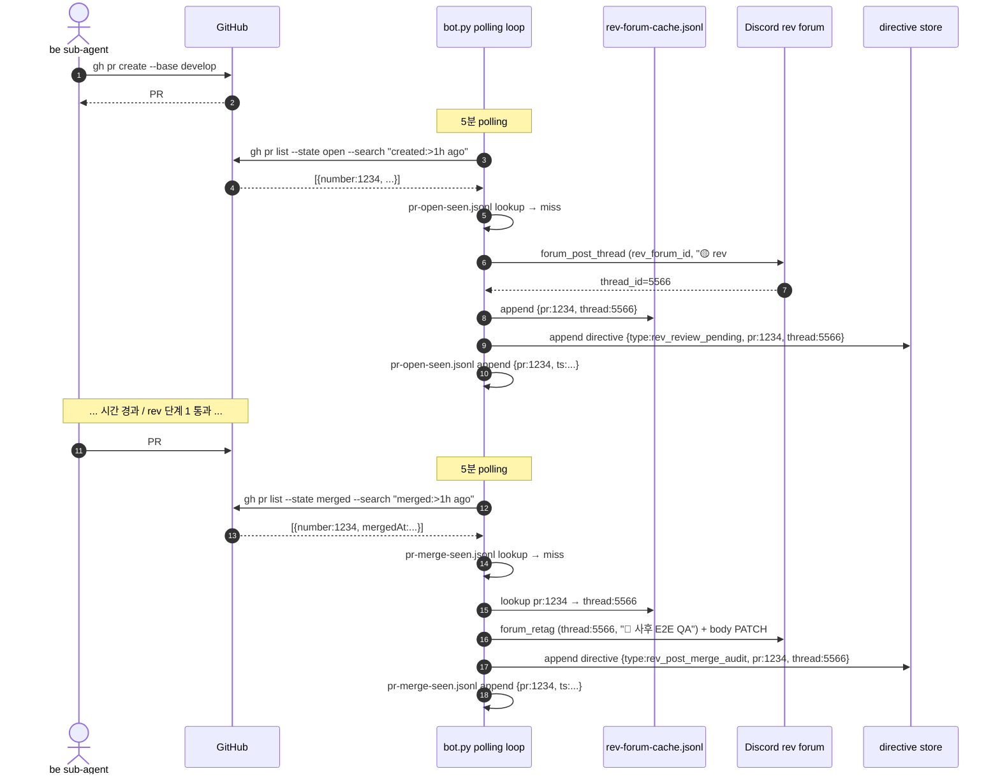

# GitHub PR 이벤트 → rev forum thread 자동화

## 1) 개요 (What / Why)

- 사용자 의도 (#1358 본문 / #1357 평가 결과): "PR 이 올라가면 rev 의 할 일에 자동으로 쌓이고, 그게 forum 형태로 추적 가능해야 한다."
- 현재 상태 (evidence): bot.py 에는 GitHub PR 이벤트를 입력으로 받는 webhook / polling 핸들러가 **자체적으로 존재하지 않습니다**. 머지 시 cycle forum thread 를 ✅ retag 하는 `cycle_thread_complete_on_merge_loop` (bot.py:4476) 만 있고, 이는 **이미 launch 된 cycle thread 가 닫히는 흐름**입니다. 새 PR 이 올라왔을 때 rev forum 에 새 thread 신설 + 1차 review directive 적재 흐름은 없습니다.
- `tools/agent/tools_cycle.py:97` `register_directive_pending` 의 state schema 에 `thread_id` 필드는 있으나 등록 시점에는 `None` 으로 박힙니다 — 어디서 thread_id 를 채우는지의 wiring 이 PR open 이벤트와 연결되지 않은 상태입니다.
- 결과: 사용자가 PR 진행 / 후속 회귀 검증을 forum 한 곳에서 추적할 수 없습니다 ("잘 관리 안 됨" 평가).
- 본 spec = **GitHub PR 이벤트 (`opened` / `closed.merged`) 를 입력으로 받아 rev forum thread 라이프사이클 (신설 → 단계 전이) 을 자동으로 끌고 가는 인프라**의 운영 모델 + 구현 방향 박제. 코드 자체는 다음 be / infra 사이클이 본 spec 기반으로 구현합니다.

## 2) 사용자 시나리오

- **시나리오 1 (PR open)**: be sub-agent 가 `feat(song): ...` PR 을 develop base 로 생성 → 인프라가 5분 안에 (옵션 B) 또는 즉시 (옵션 A) 감지 → rev forum 채널에 신규 thread 신설 (제목 `🟡 rev #1234 — feat(song): ...`), 본문 = PR 메타 + rev 1차 review 체크리스트 template + `cycle-forum:` 본문 cross-ref. directive board jsonl 에 `type=rev_review_pending`, `pr_number=1234`, `thread_id=<신설 thread>` entry 1건 append. nmae 가 다음 rev launch 시 본 directive 를 큐 head 로 잡아 rev sub-agent 에 위임.
- **시나리오 2 (PR merge)**: 같은 PR #1234 가 develop 머지 → 인프라가 같은 PR 에 연결된 기존 rev thread 를 lookup (PR body `rev-forum:` cross-ref 또는 launch cache) → 같은 thread 에 단계 전이 `🟡 1차 review → 🔵 머지됨 — 사후 E2E QA` retag + 본문 `✅ 1차 review pass` 섹션 + `📋 사후 단계 2 QA 체크리스트` 섹션 PATCH. directive board 에 `type=rev_post_merge_audit`, `pr_number=1234`, `parent_thread_id=<같은 thread>` entry append. nmae 가 다음 rev launch 시 단계 2 audit 으로 위임.
- **시나리오 3 (rev sub-agent 작업)**: rev sub-agent 가 큐에서 본 directive 를 받아 단계 1 또는 단계 2 작업 수행 → milestone 마다 같은 thread 에 댓글 stream (`--auto-thread`) + 본문 체크박스 갱신 (`--forum-edit`). 결론은 PR 코멘트 `rev단계1: 🟢/🟡/🔴 ...` + `reviewed:claude` 라벨.
- **시나리오 4 (사용자 forum 회고)**: 사용자가 rev forum sidebar 에서 PR 번호 또는 scope 별 thread filter 가능. 1 PR = 1 rev thread (open ~ post-merge 통합) 또는 1 PR = 2 thread (open / merge 별) 중 선택은 §3 결정.

## 3) 요구사항

### 기능 요구사항

#### 3-1. PR open 이벤트 처리

- [ ] GitHub PR `opened` (+ `reopened` 검토 필요 — §10 Q1) 이벤트를 1 회만 감지합니다 (멱등성). 이미 처리된 PR 번호는 skip.
- [ ] rev forum 채널 (`REV_FORUM_ID`) 에 새 thread 신설. thread 제목 = `🟡 rev #{pr_num} — {pr_title 첫 60자}`.
- [ ] thread 본문 template:
  ```text
  🔍 **rev 1차 review — PR #{pr_num}**

  💬 PR 정보
  - 제목: {pr_title}
  - 작성자: @{pr_user}
  - scope: {scope label or "(미분류)"}
  - type: {type label}
  - base ← head: {base} ← {head}
  - URL: {pr_url}

  📋 rev 단계 1 체크리스트 (PR 머지 전)
  - [ ] 코드 변경 부합성 (요구사항 vs diff)
  - [ ] 컨벤션 (08-code-conventions.md)
  - [ ] 비기능 (테스트 / 관측성 / 보안)
  - [ ] visual diff (scope:web 한정 — visual-regression-ci.md §3-4)
  - [ ] 결론 코멘트 + `reviewed:claude` 라벨

  ⏭️ 다음 단계
  rev sub-agent launch 대기

  🔖 관련
  - PR: #{pr_num}
  - directive: `{directive_id}`
  ---
  _갱신: {ts} (open 자동 등록)_
  ```
- [ ] tag `🟡 1차 review` 부착 (forum `available_tags` 에 사전 등록 — §10 Q3).
- [ ] directive board (`~/.mobruji/directives.jsonl` 또는 `tools/agent/tools_cycle.py` event store) 에 entry 1건 append:
  ```json
  {
    "directive_id": "rev-1234-open",
    "type": "rev_review_pending",
    "pr_number": 1234,
    "pr_url": "https://github.com/...",
    "thread_id": "<신설 thread snowflake>",
    "assigned_cycle": "rev",
    "status": "pending",
    "created_at": "<ts>",
    "source": "pr_open_handler"
  }
  ```
- [ ] PR 자체에 코멘트 1건 push (선택, §10 Q2): `🔍 rev 1차 review thread 신설 — https://discord.com/...`.

#### 3-2. PR merge 이벤트 처리

- [ ] GitHub PR `closed` + `merged=true` 이벤트를 1 회만 감지합니다 (멱등성, base=develop 한정 — release PR `main` 머지는 §10 Q4).
- [ ] 같은 PR 번호의 기존 rev thread lookup:
  - 우선순위 1: `~/.mobruji/rev-forum-cache.jsonl` 의 `pr_number ↔ thread_id` 매핑 (open 시점에 박힘).
  - 우선순위 2: PR body 의 `rev-forum: <thread_id>` cross-ref line (PR 작성자가 박은 경우).
  - 우선순위 3: rev forum 채널 검색 (제목 prefix `rev #1234`). 마지막 수단.
- [ ] 같은 thread 에 단계 전이:
  - tag 변경: `🟡 1차 review` → `🔵 사후 E2E QA` (또는 `✅ 1차 review pass + 🔵 사후 audit` 2-tag 표현, §10 Q5).
  - 본문 PATCH:
    ```text
    ✅ rev 단계 1 결과 *(머지 시점)*
    - reviewed:claude 라벨: {라벨 부착 시각 / "부재"}
    - 결론 코멘트: {🟢/🟡/🔴 코멘트 발견 여부}
    - 머지 시각: {mergedAt}
    - 머지 commit: {sha}

    📋 rev 단계 2 체크리스트 (develop 머지 후 dev 환경)
    - [ ] dev 환경 deploy 반영 확인
    - [ ] e2e 회귀 (변경 영향 범위)
    - [ ] regression label 부착 (`regression:dev` / `rev-post-merge-pass`)

    ⏭️ 다음 단계
    rev sub-agent 단계 2 audit launch 대기
    ```
- [ ] thread 댓글 1건 append (`--auto-thread` 또는 `--forum-comment`): `✅ 머지됨 — 사후 E2E QA 단계 진입 (commit={sha})`.
- [ ] directive board 에 단계 2 entry append:
  ```json
  {
    "directive_id": "rev-1234-merge",
    "type": "rev_post_merge_audit",
    "pr_number": 1234,
    "thread_id": "<같은 thread>",
    "parent_directive_id": "rev-1234-open",
    "assigned_cycle": "rev",
    "status": "pending",
    "created_at": "<ts>",
    "source": "pr_merge_handler"
  }
  ```
- [ ] 기존 `cycle_thread_complete_on_merge_loop` (cycle forum thread ✅ retag) 와의 관계 — **별 모듈** (rev forum 은 별 채널, cycle forum 은 cycle 별 BE/FE/REV/PLAN 채널). 본 spec 의 rev forum thread 는 cycle forum 의 rev launch thread 와 다름. 둘 다 살아 있음. cross-ref 는 §6-1 모듈 경계 표 참조.

#### 3-3. 멱등성 / state

- [ ] PR open 이벤트 1회 처리 보장: `~/.mobruji/pr-open-seen.jsonl` append-only (PR 번호 + open_ts). 5분 polling 시 seen set lookup.
- [ ] PR merge 이벤트 1회 처리 보장: `~/.mobruji/pr-merge-seen.jsonl` 또는 기존 `cycle_thread_complete_on_merge_loop` 패턴의 `seen_prs` cap 200 메모리 set 재사용 + jsonl 백업.
- [ ] bot.py 재시작 시 누락 복구: `gh pr list --state open --search "created:>24h ago"` + `--state merged --search "merged:>24h ago"` 로 last 24h 재 scan. seen jsonl 이 있으므로 중복 발사 없음.

#### 3-4. 라벨 / scope 필터

- [ ] PR 모든 type / scope 대상 (rev 사이클은 모든 PR 통과 의무 — `feedback-rev-e2e-always`).
- [ ] 단, `type:release` PR 은 단계 1 면제 (`rev-sla.md` SLA 매트릭스) — open thread 는 신설하되 본문 체크리스트 = `면제 (release PR)`.
- [ ] `type:emergency-hotfix` PR 도 단계 1 면제 — 단계 2 만 active (`emergency-hotfix-flow.md`).

### 비기능 요구사항

- **신뢰성**:
  - Discord 4xx / token 만료 / network 일시 장애 → stderr warning + 다음 polling iter 재시도. bot.py 흐름 차단 X (기존 `cycle_thread_complete_on_merge_loop` 패턴 재사용).
  - GitHub API rate limit 도달 → exponential backoff (1m → 5m → 15m), polling skip + log.
- **보안**:
  - 옵션 A (HTTP webhook) 채택 시 `X-Hub-Signature-256` HMAC-SHA256 검증 의무 (secret = `GITHUB_WEBHOOK_SECRET` env, `.env` 박제). 검증 실패 시 401 + log.
  - 옵션 B (polling) 채택 시 외부 inbound 부재 — secret 검증 불필요 (`gh` CLI 가 PAT 로 인증).
  - PR body 의 사용자 입력은 forum body 에 그대로 embed 시 mention injection / 큰 mass push risk — `@everyone` / `@here` / `<@&...>` mention escape 의무.
- **관측성**:
  - 각 핸들러 발사 시 `record_loop_heartbeat("pr_open_handler")` / `record_loop_heartbeat("pr_merge_handler")` — 기존 watchdog SoT (`docs/features/nmae-cycle-watchdog.md`) 통합.
  - PR 별 thread 신설 시 logger.info `pr_open_handler: PR #1234 → thread <id> 신설`.
  - `~/.mobruji/rev-forum-cache.jsonl` cap 1000 (FIFO truncate, 기존 cycle launch cache 패턴 재사용).
- **보존**:
  - rev forum thread = Discord history (archive 정책은 Discord 채널 설정에 의존, 인프라가 자동 삭제 X).
  - `pr-open-seen.jsonl` / `pr-merge-seen.jsonl` = 1만 entry 도달 시 30일 이상된 entry 정리 (운영 후 결정).
  - `rev-forum-cache.jsonl` = cap 1000 FIFO.

## 4) 범위 / 비범위

### 포함

- GitHub PR `opened` + `closed.merged` 이벤트를 인프라 (bot.py 또는 workflow) 가 감지해 rev forum thread 신설 / 단계 전이 + directive 적재.
- 멱등성 가드 (`seen.jsonl`).
- rev forum thread template + 단계 전이 본문 PATCH.
- 옵션 A / B / C 비교 + 권고 (§5).
- 기존 `cycle_thread_complete_on_merge_loop` (cycle forum) 과의 모듈 경계.

### 제외 (Out of Scope)

- rev sub-agent 의 review 코드 자체 (`tools/rev-queue/` 의 큐 처리 알고리즘 변경 X). 본 spec 은 **directive 등록 + thread 신설까지** 만 책임.
- GitHub Actions workflow 의 정책 변경 (`auto-label.yml` / `rev-gate.yml` / `discord-notify.yml` 의 핵심 로직 수정 X). 단, **옵션 C 채택 시** `discord-notify.yml` 가 `repository_dispatch` 또는 별 trigger 채널을 추가하는 경량 수정은 검토 대상 (§5-3).
- nmae 의 큐 정책 변경 — directive 가 적재되면 nmae 가 다음 rev launch 시 queue head 선정. 본 spec 은 등록까지만.
- `cycle_thread_complete_on_merge_loop` (cycle forum thread ✅ retag) 의 폐기 — 별 모듈로 공존 (§6-1).
- PR draft → ready_for_review 이벤트 처리 (§10 Q1 으로 보류).
- main base release PR 머지 (§10 Q4 으로 보류).
- review thread 안 사용자 댓글 → 새 directive 등록 흐름 (`cycle-forum-operation.md` PR E §5-6 별 spec scope).

## 5) 설계 — 옵션 비교 + 권고

### 5-1) 옵션 A: HTTP webhook server (bot.py + aiohttp)

bot.py 가 새 aiohttp app 띄움 (`POST /webhook/github`). GitHub repo settings 에서 webhook URL 등록.

- **장점**:
  - 즉시 발사 (latency 0). open ↔ merge 가 같은 PR 에 30초 안에 발생해도 race 없음.
  - 멱등성 자연 (GitHub 가 `X-GitHub-Delivery` UUID 헤더 제공 — seen set 키로 사용).
  - 외부 trigger 가 명시적 — 운영 가시성 ↑.
- **단점**:
  - NCP VM 에 inbound port (443 또는 별 8443 + reverse proxy) 열어야 함. 보안 표면 ↑.
  - 공개 endpoint 필요 — `ngrok` / nginx + Let's Encrypt 인프라 + 도메인. 운영 부담 ↑.
  - bot.py 가 single process — webhook 처리 중 hang 시 cycle 운영 loop 도 영향 (분리하려면 별 process / queue).
  - HMAC 검증 코드 + secret 관리 (`GITHUB_WEBHOOK_SECRET`).
  - bot.py 재시작 시 webhook delivery retry 윈도우 (GitHub 24h 안 retry) 의존.

### 5-2) 옵션 B: GitHub polling (bot.py 5분 loop)

기존 `cycle_thread_complete_on_merge_loop` 의 패턴 재사용 — `gh pr list --state open --base develop --search "created:>1h ago" --json number,url,title,body,headRefName,labels,user` + `--state merged --search "merged:>1h ago"` 두 query 를 5분 polling.

- **장점**:
  - **NCP inbound 인프라 변경 0** — outbound `gh` CLI 호출만. 보안 표면 변화 없음.
  - 기존 `cycle_thread_complete_on_merge_loop` / `rev_post_merge_audit_loop` / `directive_complete_on_merge_loop` 와 동일 패턴 — 재사용 가능한 helper (`fetch_recent_merged_prs_with_body`) 가 이미 있음 (bot.py:4227).
  - 멱등성 = 기존 `seen_prs` set + jsonl 백업 패턴 (cap 200, FIFO).
  - bot.py 재시작 시 last 24h 재 scan 으로 자연 복구.
  - HMAC / secret 운영 부담 0.
- **단점**:
  - 최대 5분 latency (개선 가능: 1분 polling). PR open 직후 30초 안 rev 가 트리거되어야 하는 use case 는 없으므로 허용 가능.
  - `gh` CLI rate limit (PAT 기준 시간당 5000) — 5분 polling × 2 query = 시간당 24 호출, 여유 충분.
  - `gh pr list` 가 `--state open` 의 "최근 created" 결과를 안정적으로 반환하는지 확인 필요 (search 표현식 검증).

### 5-3) 옵션 C: GitHub Actions workflow → bot.py 수신

기존 `discord-notify.yml` 가 PR `opened` / `closed` 이벤트 trigger 중. workflow 가 새 step 으로 (a) Discord 본 채널 DIGEST 메시지 발사 또는 (b) `repository_dispatch` event + bot.py 가 수신.

- **장점**:
  - GitHub Actions 가 webhook 인프라 대행 — NCP inbound 부담 0.
  - workflow 변경만 — bot.py 핵심 polling loop 추가 없음.
- **단점**:
  - 중간 layer 1 추가 (workflow → Discord 메시지 → bot.py message handler) — 디버깅 복잡 ↑.
  - workflow 실행 latency 5~30 초 + Discord API 송신 + bot.py 수신 — 옵션 A 보다 느림 / 옵션 B 와 비슷.
  - bot.py 가 DIGEST 메시지 parsing 로직 추가 필요 — 사용자 일반 메시지와 구분 키 (예: prefix `[GH-EVENT]`) 가 fragile.
  - `discord-notify.yml` 의 graceful skip (DISCORD_WEBHOOK_URL 부재 시) 패턴이 본 흐름과 호환 안 됨 — 별 webhook URL 또는 channel 필요.
  - `repository_dispatch` 채택 시 bot.py 가 `gh api repos/.../dispatches` listener — polling 으로 회귀 (옵션 B 와 같아짐).

### 5-4) 권고: 옵션 B (polling) 우선 채택 + 옵션 A 마이그레이션 path 박제

- **사유**:
  - NCP 운영 환경 (`reference_ncp_ssh_access.md`) 은 현재 inbound port 정책이 보수적 — public webhook endpoint 신설은 별 ADR (보안 영향 분석) 의무.
  - 기존 bot.py 의 `cycle_thread_complete_on_merge_loop` / `rev_post_merge_audit_loop` 가 같은 polling 패턴으로 검증되어 있음 — 코드 재사용 + 회귀 risk ↓.
  - latency 5 분은 rev 사이클 SLA (`rev-sla.md` 단계 1 = 30 분) 안.
  - 옵션 A 의 즉시성이 필요한 use case 가 현재 없음. 미래 `directive_dialogue` 같은 사용자 ↔ PR 양방향 인터랙션 도입 시 옵션 A 마이그레이션 검토.
- **마이그레이션 path (미래)**:
  - 옵션 B 의 핸들러 (`pr_open_handler` / `pr_merge_handler`) 를 thin function 으로 추출 → polling loop / HTTP handler 둘 다 같은 함수 호출.
  - 옵션 A 도입 시 polling loop 는 fallback safety net 으로 유지 (옵션 A 의 webhook retry 윈도우 24h 안 누락 보강).

### 5-5) 도메인 모델 영향 (06-domain-model.md §4 신규 용어 후보)

별 commit 으로 도메인 모델 §4 등재 (sub-agent.md 룰: "도메인 용어는 §4 에 먼저 등재"):

- **PR 1차 review thread** (`PrReviewThread`): GitHub PR `opened` 이벤트 시 rev forum 채널 (`REV_FORUM_ID`) 에 자동 신설되는 Discord forum thread (snowflake 18-20자리). 1 PR = 1 thread (open ~ post-merge 단계 전이 통합). thread 본문 = §3-1 template + 단계 1/2 체크박스. tag = `🟡 1차 review` → `🔵 사후 E2E QA` 자동 전이. cycle forum thread (`CycleLaunchThreadId`) 와 다른 채널 / 다른 용도 — 후자 = sub-agent launch 단위 진행 추적, 전자 = PR 단위 rev review 추적. 출처: `pr-webhook-rev-forum.md §3-1·§3-2`.
- **PR 이벤트 핸들러** (`PrEventHandler`): bot.py 의 PR open / merge 이벤트 감지 + `PrReviewThread` 신설 + directive 적재 모듈. 구현 옵션 B (polling) 채택 — `pr_open_handler` + `pr_merge_handler` 두 함수 + 5 분 polling loop. 멱등성 가드 = `~/.mobruji/pr-open-seen.jsonl` + `~/.mobruji/pr-merge-seen.jsonl`. 출처: `pr-webhook-rev-forum.md §5-2·§5-4`.
- **PR review forum 캐시** (`PrReviewForumCache`): `~/.mobruji/rev-forum-cache.jsonl` 의 `{pr_number, thread_id, opened_at}` 매핑 entry. PR open 시 append, PR merge 시 lookup. cap 1000 FIFO. 출처: `pr-webhook-rev-forum.md §3-2`.

### 5-6) Mermaid 시퀀스



## 6) 영향 / 구현 방향 (옵션 B 기준)

### 6-1) 모듈 경계 (기존 loop 와의 cross-ref)

| 모듈 | 채널 / 채널 ID env | 대상 thread | trigger | 본 spec 관계 |
|---|---|---|---|---|
| `cycle_thread_complete_on_merge_loop` (기존) | cycle forum (BE/FE/REV/PLAN) | `CycleLaunchThreadId` (sub-agent launch 단위) | PR 머지 + body `cycle-forum:` cross-ref | **별 모듈** — 본 spec 변경 X. 같은 PR 머지 이벤트가 두 loop 모두 trigger 하나 다른 thread 갱신. |
| `pr_open_handler` (신규) | rev forum (`REV_FORUM_ID`) | `PrReviewThread` (PR 단위) | PR `opened` | 본 spec §3-1 |
| `pr_merge_handler` (신규) | rev forum (`REV_FORUM_ID`) | 같은 `PrReviewThread` 재사용 | PR `closed.merged` | 본 spec §3-2 |
| `rev_post_merge_audit_loop` (기존, bot.py:4545) | DIGEST 채널 + tmux inject | tmux pane | PR 머지 (debounce) | **별 모듈** — 본 spec 의 단계 2 directive 가 등록되면 nmae 큐 head 로 반영. 두 흐름 cross-ref 만, 코드 결합 X. |
| `directive_complete_on_merge_loop` (기존, PR B) | directive forum | directive thread | PR body `directive:` cross-ref + 머지 | **별 모듈** — 사용자 등록 directive 라이프사이클. 본 spec 의 rev directive 와 별 entry. |

### 6-2) 신규 / 수정 파일

- `tools/discord-daemon/bot.py`:
  - 신규 함수: `pr_open_handler(pr: dict, *, runner, reply_script) -> dict`, `pr_merge_handler(pr: dict, *, runner, reply_script, cache) -> dict`.
  - 신규 loop: `pr_event_polling_loop(*, poll_interval=300, initial_delay=30, fetcher_open=None, fetcher_merged=None)`.
  - 기존 `fetch_recent_merged_prs_with_body` 재사용 + 신규 `fetch_recent_opened_prs(window="1h")` helper.
  - `on_ready` 또는 `setup_hook` 에서 `client.loop.create_task(pr_event_polling_loop())` 등록.
- `tools/discord-daemon/discord-reply.sh`:
  - 신규 mode `--forum-post-rev-thread <pr_num> <pr_title> <body>` (필요 시) 또는 기존 `--forum-post-auto-tag` 재사용.
  - 단계 전이 `--forum-retag <thread_id> rev "사후 audit"` + body PATCH 는 기존 `--forum-edit` 재사용.
- `tools/agent/tools_cycle.py`:
  - `register_directive_pending(directive_id, summary, *, cycle_hint=None, thread_id=None, source=None)` 시그니처에 `thread_id` / `source` 키워드 추가 (현재 함수 시그니처 `thread_id=None` 으로 박혀 있어 wiring 만 채우면 됨).
- 신규 파일:
  - `~/.mobruji/rev-forum-cache.jsonl` (런타임 생성)
  - `~/.mobruji/pr-open-seen.jsonl` / `~/.mobruji/pr-merge-seen.jsonl` (런타임 생성)
- 환경 변수 (`.env` / NCP env):
  - `REV_FORUM_ID` — Discord rev forum 채널 snowflake (기존 `BE_FORUM_ID` 등과 같은 패턴).
  - `PR_EVENT_POLL_INTERVAL_SECONDS` (default 300).
  - 옵션 A 채택 시: `GITHUB_WEBHOOK_SECRET`, `GITHUB_WEBHOOK_PORT` (default 8443).
- 테스트:
  - `tools/agent/tests/test_pr_event_handlers.py` (또는 bot.py 와 같은 위치 `tools/discord-daemon/tests/`) — fetcher mock + reply_script mock + seen jsonl 멱등성 + body template 검증 + 8~12 case.

### 6-3) DB / state schema

별 RDB 마이그레이션 없음 (jsonl 만 신규). 단, `tools/agent/state.py` event store 에 `pr_event_processed` event kind 등재 검토 — sub-agent 가 본 흐름 가시성 위해.

## 7) 작업 분할 (예상 PR 리스트)

- [ ] **PR 1 (본 PR, plan)**: 본 Feature Spec + `06-domain-model.md §4` 신규 용어 3종 (`PrReviewThread` / `PrEventHandler` / `PrReviewForumCache`) 등재 + `cycle-forum-operation.md` 의 cross-ref 보강 (§6-1 모듈 경계 표).
- [ ] **PR 2 (infra, be 또는 infra cycle)**: bot.py `pr_open_handler` + `pr_event_polling_loop` 의 open 절반 구현 + 신규 fetcher + `register_directive_pending` wiring (`thread_id` / `source` 키워드 추가) + 멱등성 jsonl + unit test.
- [ ] **PR 3 (infra)**: bot.py `pr_merge_handler` 단계 전이 + `rev-forum-cache.jsonl` lookup + 본문 PATCH + unit test.
- [ ] **PR 4 (infra, optional)**: rev sub-agent 룰 update (`docs/ai-harness/actors/sub-agent.md §2-rev`) — 새 directive type 2종 (`rev_review_pending` / `rev_post_merge_audit`) 의 큐 head 우선순위.
- [ ] **PR 5 (infra, optional 미래)**: 옵션 A 마이그레이션 — aiohttp webhook server + HMAC 검증 (별 ADR 동반).

### 보호 영역 변경 여부

- 보호 영역 변경 여부: ☐ 없음 / ☑ 있음 — 변경 파일과 사유:
  - `.github/workflows/discord-notify.yml` — **옵션 C 채택 시만** repository_dispatch step 추가. 옵션 B 권고 시 변경 없음.
  - `.env` (NCP) — `REV_FORUM_ID` 추가 (PR 2). 옵션 A 채택 시 `GITHUB_WEBHOOK_SECRET` 추가.

## 8) 테스트 전략

### 단위 테스트 (PR 2 / PR 3)

- `pr_open_handler`:
  - PR 메타 dict mock → 신규 thread 신설 호출 1회 (reply_script mock).
  - 이미 `pr-open-seen.jsonl` 에 있는 PR 번호 → 호출 0회 (멱등).
  - `type:release` 라벨 → 본문 체크리스트 = "면제" 분기.
  - PR title 60자 초과 → truncate.
- `pr_merge_handler`:
  - merge PR 메타 + cache lookup hit → forum-retag + body PATCH 호출 1회.
  - cache miss + PR body `rev-forum:` cross-ref hit → fallback 호출.
  - cache miss + cross-ref 부재 → graceful skip + log warning (rev forum 검색은 별 stretch goal).
  - `pr-merge-seen.jsonl` 에 있는 PR → 호출 0회.
- `fetch_recent_opened_prs`:
  - `gh pr list` mock → JSON list 반환.
  - rate limit (rc!=0) → 빈 list + log warning.

### 통합 테스트 (수동, NCP 배포 후)

1. 임시 PR (`docs:` 또는 `chore:` 사소한 변경) 생성 → 5 분 안에 rev forum 에 thread 신설 확인.
2. 같은 PR 머지 → 5 분 안에 같은 thread 단계 전이 + 본문 PATCH 확인.
3. bot.py 재시작 후 24h 안 생긴 PR 누락 없는지 확인 (`pr-open-seen.jsonl` read).
4. `pr-open-seen.jsonl` 강제 삭제 시나리오 → 재 발사 (중복 thread 신설) 확인 → 재발 방지 hook 검토.

### 회귀 가드

- 기존 `cycle_thread_complete_on_merge_loop` 동작 영향 없음 — 같은 PR 머지가 두 loop trigger 하나 갱신 대상 thread / 채널 분리.
- discord-daemon pytest baseline 대비 신규 fail 0건 — PR 2 / PR 3 의 unit test 만 추가.

## 9) 위험

- **PR open 직후 즉시 merge (drive-by squash)**: 5 분 polling 두 query 가 같은 iter 에서 PR 을 fetch 시 → open handler 가 thread 신설하고 같은 iter 안 merge handler 가 단계 전이. seen jsonl 두 파일이 분리되어 있어 둘 다 발사 OK. order 가드: open handler 가 먼저 실행되도록 같은 loop iter 안 순서 강제.
- **bot.py 재시작 윈도우**: 재시작 사이 PR open 이벤트 누락 → 24h 재 scan window 가 복구. 24h 초과 다운타임 시 누락 — 운영 모니터링 (`record_loop_heartbeat`) 의무.
- **Discord forum 채널 한도**: forum 채널의 thread 보관 한도 (Discord 정책 — 활성 thread 1000, archive 무한) — 1 PR = 1 thread 누적 시 1년 1000 PR 미만 (현 페이스 안 안전). 도달 시 archive 정책 검토.
- **PR title 의 mention injection**: `@everyone` 포함 시 thread 신설 시점 대량 알림. discord-reply.sh 가 mention escape 의무.
- **GitHub API rate limit (PAT 5000/h)**: 5 분 polling × 2 query = 24/h, 다른 loop 합쳐도 < 200/h. 안전.
- **`gh pr list --search "created:>1h ago"` 정확도**: `created:` filter 가 GitHub API 의 `created` 시간을 사용하는지 검증 필요 — last 1h 미만 PR 만 반환되어야 함. 실패 시 last 24h 로 윈도우 확장 + seen jsonl 신뢰.
- **`register_directive_pending` 동시성**: 같은 PR 번호로 2 회 호출 시 (race) — 함수 내 `duplicate` 분기가 보장. 안전.
- **rev forum 채널 ID env 부재 시**: bot.py 가 startup 시 fail-fast 또는 graceful skip — `cycle_thread_complete_on_merge_loop` 의 `reply_script.exists()` 패턴 재사용.

## 10) 오픈 질문

> 사용자 결정 또는 다음 사이클 의사결정 필요 항목. 해소되면 §11 결정 로그로 이동.

| # | 질문 | 선택지 | 담당 / 기한 |
|---|---|---|---|
| Q1 | PR `reopened` 이벤트 처리 — 새 thread 신설 vs 기존 thread retag (🟡 재진입) | (a) 새 thread / (b) 기존 thread retag / (c) 무시 | @goohong / 본 spec 머지 전 |
| Q2 | PR 자체에 코멘트 1건 push (`🔍 rev 1차 review thread 신설 — ...`) — 사용자가 PR 페이지에서 thread 링크 발견 가능 vs PR 코멘트 noise | (a) push / (b) skip / (c) `cycle-forum:` cross-ref 만 박고 코멘트 X | @goohong / PR 2 구현 전 |
| Q3 | Discord rev forum 의 `available_tags` 사전 등록 — `🟡 1차 review` / `🔵 사후 E2E QA` / `✅ rev pass` / `❌ rev fail` 4종 manual 1회 vs bot.py 자동 등록 | (a) manual / (b) bot.py 자동 / (c) 기존 cycle forum tag 재사용 | @goohong / PR 2 머지 전 |
| Q4 | release PR (`develop → main` 머지) 의 rev forum 처리 — 단계 1 면제 + open thread 신설 vs 완전 skip | (a) 면제 thread 신설 / (b) skip | @goohong / PR 2 머지 전 |
| Q5 | rev thread tag 라이프사이클 표현 — 1-tag 전이 (`🟡 → 🔵 → ✅`) vs 2-tag 표현 (`✅ 1차 review pass` + `🔵 사후 audit`) 동시 부착 | (a) 1-tag / (b) 2-tag / (c) tag X + 본문 단계 표시만 | @goohong / PR 2 머지 전 |
| Q6 | 옵션 B (polling) vs 옵션 A (HTTP webhook) 최종 선택 — 본 spec 권고는 B, NCP 환경 inbound 정책 확인 필요 | (a) B 채택 + A 미래 / (b) A 즉시 채택 (인프라 추가) | @goohong / 본 spec 머지 전 |
| Q7 | 폐기 vs 공존: 기존 `cycle_thread_complete_on_merge_loop` 와 본 spec 의 `pr_merge_handler` 가 같은 머지 이벤트를 두 번 처리. cycle forum + rev forum 둘 다 갱신 (공존, 본 spec 권고) vs cycle forum 폐기 (단순화) | (a) 공존 / (b) cycle forum 폐기 (별 ADR) | @goohong / PR 3 머지 전 |
| Q8 | PR open 이벤트의 polling window 1h vs 24h — 짧은 window 가 race 가드 강함 vs bot.py 재시작 후 누락 복구 약함 | (a) 1h (멱등 jsonl 의존) / (b) 24h (재시작 복구 강함) / (c) 1h + 재시작 시 24h 1회 catchup | @goohong / PR 2 구현 전 |

## 11) 결정 로그

- 2026-05-30 — 초안 작성 (status=draft). 본 spec scope 박제 + 옵션 A/B/C 비교 + 옵션 B 권고. evidence: #1358 본문, bot.py:4476 `cycle_thread_complete_on_merge_loop` 부재 갭, `tools/agent/tools_cycle.py:97` `thread_id=None` wiring 미완. plan round 16.

## 12) 자율 결정 (사유)

- **옵션 B 권고 채택**: NCP inbound 인프라 미정 + 기존 polling 패턴 검증됨 + latency 5 분이 rev SLA 30 분 안. 옵션 A 의 즉시성이 필요한 use case 부재. 미래 마이그레이션 path 박제.
- **rev forum thread = 1 PR 1 thread (단계 전이 통합)** (vs 2 thread 분리): 사용자 회고 시 한 thread 가 PR 전체 라이프사이클 cover 하는 편이 sidebar filter 일관. 단계 전이는 본문 PATCH 로 표현.
- **`cycle_thread_complete_on_merge_loop` 폐기 X (공존)**: 두 loop 의 갱신 대상 thread / 채널이 다름 — cycle forum (sub-agent launch 단위) vs rev forum (PR 단위). 폐기는 cycle forum 의 의미를 무력화. Q7 으로 별 결정.

## 13) 사용자 확인 필요 (사실 진술)

- `REV_FORUM_ID` Discord 채널 ID 가 현재 env 에 등재 안 됨 — `.env` 박제 + Discord rev forum 채널 생성 (또는 기존 rev forum 채널 재사용) 필요. PR 2 구현 전 사용자 1회 manual.
- `available_tags` 4종 (`🟡 1차 review` / `🔵 사후 E2E QA` / `✅ rev pass` / `❌ rev fail`) Discord rev forum 채널에 사전 등록 — Discord 채널 settings UI 에서 manual 1회 (Q3 옵션 (a) 채택 시).
- Q1~Q8 8건의 오픈 질문은 본 spec 머지 후 PR 2 구현 전 사용자 답변 의무. 본 spec 머지 자체는 답변 없이 가능 (draft status).

## 14) References

- 이슈 #1358 (본 spec 의 사용자 의도 origin).
- PR #1357 (사용자 평가 — "잘 관리 안 됨" → 본 spec trigger).
- `docs/features/cycle-forum-operation.md` §5-5 — `cycle_thread_complete_on_merge_loop` (cycle forum) 동작 참조. 본 spec 의 rev forum 모듈은 별.
- `docs/features/directive-board-template-and-tags.md` — directive forum 운영 SoT (rev directive entry 의 jsonl schema 참조).
- `docs/features/rev-e2e-3-stages.md` — rev 3 단계 e2e 정의 (단계 1 = PR 머지 전, 단계 2 = develop 머지 후 dev 환경, 단계 3 = release 후 production).
- `docs/features/rev-sla.md` — rev 단계별 SLA 매트릭스. 본 spec 의 polling latency 5 분이 단계 1 SLA 30 분 안인지 cross-ref.
- `docs/features/rev-post-merge-audit-loop.md` (관련, bot.py:4545 `rev_post_merge_audit_loop`) — 본 spec 의 단계 2 directive 가 nmae 큐 head 로 반영되면 본 loop 가 tmux inject + DIGEST.
- `tools/discord-daemon/bot.py` `cycle_thread_complete_on_merge_loop` (line 4476), `fetch_recent_merged_prs_with_body` (line 4227), `DIRECTIVE_COMPLETE_POLL_INTERVAL_DEFAULT` (line 4199) — 본 spec 의 옵션 B 구현 시 재사용.
- `tools/agent/tools_cycle.py:73-108` `register_directive_pending` — `thread_id` / `source` 키워드 wiring 대상.
- `tools/agent-launch-wrapper.sh` `--register-pending` mode (line 110-294) — cycle forum 의 🟡 대기 thread 신설 패턴. 본 spec 의 rev forum thread 신설 흐름 유사 (코드는 별).
- `.github/workflows/discord-notify.yml` — 옵션 C 채택 시 확장 대상. 권고 옵션 B 에서는 무관.
- `docs/ai-harness/06-domain-model.md §4` — 신규 용어 3종 등재 (`PrReviewThread` / `PrEventHandler` / `PrReviewForumCache`).

## 15) 변경 이력

- 2026-05-30 — 초안 작성 (plan round 16). status=draft. PR 본 spec 머지 후 §10 8건 사용자 답변 → status=approved 전환.
