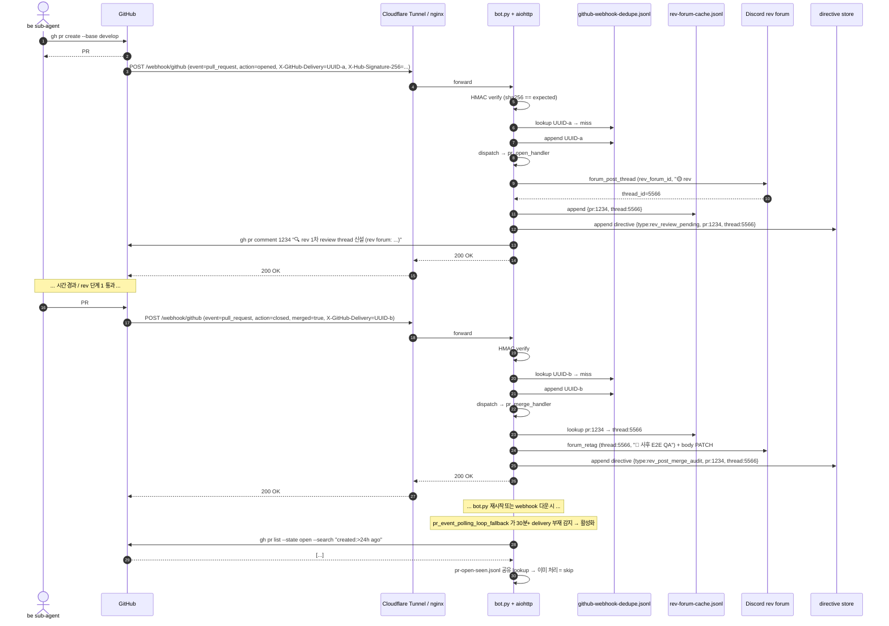

# GitHub PR 이벤트 → rev forum thread 자동화

## 1) 개요 (What / Why)

- 사용자 의도 (#1358 본문 / #1357 평가 결과): "PR 이 올라가면 rev 의 할 일에 자동으로 쌓이고, 그게 forum 형태로 추적 가능해야 한다."
- 현재 상태 (evidence): bot.py 에는 GitHub PR 이벤트를 입력으로 받는 webhook / polling 핸들러가 **자체적으로 존재하지 않습니다**. 머지 시 cycle forum thread 를 ✅ retag 하는 `cycle_thread_complete_on_merge_loop` (bot.py:4476) 만 있고, 이는 **이미 launch 된 cycle thread 가 닫히는 흐름**입니다. 새 PR 이 올라왔을 때 rev forum 에 새 thread 신설 + 1차 review directive 적재 흐름은 없습니다.
- `tools/agent/tools_cycle.py:97` `register_directive_pending` 의 state schema 에 `thread_id` 필드는 있으나 등록 시점에는 `None` 으로 박힙니다 — 어디서 thread_id 를 채우는지의 wiring 이 PR open 이벤트와 연결되지 않은 상태입니다.
- 결과: 사용자가 PR 진행 / 후속 회귀 검증을 forum 한 곳에서 추적할 수 없습니다 ("잘 관리 안 됨" 평가).
- 본 spec = **GitHub PR 이벤트 (`opened` / `closed.merged`) 를 입력으로 받아 rev forum thread 라이프사이클 (신설 → 단계 전이) 을 자동으로 끌고 가는 인프라**의 운영 모델 + 구현 방향 박제. 코드 자체는 다음 be / infra 사이클이 본 spec 기반으로 구현합니다.
- **사용자 결정 (2026-05-30, round 17)**: 옵션 A (HTTP webhook + aiohttp + HMAC + nginx 또는 Cloudflare Tunnel) **즉시 채택**. 옵션 B (polling) 는 마이그레이션 path 가 **아니라** webhook 다운 시 catchup fallback safety net 으로 보존. REV_FORUM_ID 는 신규 Discord rev forum 채널 (사용자 manual 신설). 상세 §11 결정 로그.

## 2) 사용자 시나리오

- **시나리오 1 (PR open)**: be sub-agent 가 `feat(song): ...` PR 을 develop base 로 생성 → 인프라가 5분 안에 (옵션 B) 또는 즉시 (옵션 A) 감지 → rev forum 채널에 신규 thread 신설 (제목 `🟡 rev #1234 — feat(song): ...`), 본문 = PR 메타 + rev 1차 review 체크리스트 template + `cycle-forum:` 본문 cross-ref. directive board jsonl 에 `type=rev_review_pending`, `pr_number=1234`, `thread_id=<신설 thread>` entry 1건 append. nmae 가 다음 rev launch 시 본 directive 를 큐 head 로 잡아 rev sub-agent 에 위임.
- **시나리오 2 (PR merge)**: 같은 PR #1234 가 develop 머지 → 인프라가 같은 PR 에 연결된 기존 rev thread 를 lookup (PR body `rev-forum:` cross-ref 또는 launch cache) → 같은 thread 에 단계 전이 `🟡 1차 review → 🔵 머지됨 — 사후 E2E QA` retag + 본문 `✅ 1차 review pass` 섹션 + `📋 사후 단계 2 QA 체크리스트` 섹션 PATCH. directive board 에 `type=rev_post_merge_audit`, `pr_number=1234`, `parent_thread_id=<같은 thread>` entry append. nmae 가 다음 rev launch 시 단계 2 audit 으로 위임.
- **시나리오 3 (rev sub-agent 작업)**: rev sub-agent 가 큐에서 본 directive 를 받아 단계 1 또는 단계 2 작업 수행 → milestone 마다 같은 thread 에 댓글 stream (`--auto-thread`) + 본문 체크박스 갱신 (`--forum-edit`). 결론은 PR 코멘트 `rev단계1: 🟢/🟡/🔴 ...` + `reviewed:claude` 라벨.
- **시나리오 4 (사용자 forum 회고)**: 사용자가 rev forum sidebar 에서 PR 번호 또는 scope 별 thread filter 가능. 1 PR = 1 rev thread (open ~ post-merge 통합) 또는 1 PR = 2 thread (open / merge 별) 중 선택은 §3 결정.

## 3) 요구사항

### 기능 요구사항

#### 3-1. PR open 이벤트 처리

- [ ] GitHub PR `opened` (+ `reopened` 검토 필요 — §10 Q1) 이벤트를 1 회만 감지합니다 (멱등성). 이미 처리된 PR 번호는 skip.
- [ ] rev forum 채널 (`REV_FORUM_ID`) 에 새 thread 신설. thread 제목 = `🟡 rev #{pr_num} — {pr_title 첫 60자}`.
- [ ] thread 본문 template:
  ```text
  🔍 **rev 1차 review — PR #{pr_num}**

  💬 PR 정보
  - 제목: {pr_title}
  - 작성자: @{pr_user}
  - scope: {scope label or "(미분류)"}
  - type: {type label}
  - base ← head: {base} ← {head}
  - URL: {pr_url}

  📋 rev 단계 1 체크리스트 (PR 머지 전)
  - [ ] 코드 변경 부합성 (요구사항 vs diff)
  - [ ] 컨벤션 (08-code-conventions.md)
  - [ ] 비기능 (테스트 / 관측성 / 보안)
  - [ ] visual diff (scope:web 한정 — visual-regression-ci.md §3-4)
  - [ ] 결론 코멘트 + `reviewed:claude` 라벨

  ⏭️ 다음 단계
  rev sub-agent launch 대기

  🔖 관련
  - PR: #{pr_num}
  - directive: `{directive_id}`
  ---
  _갱신: {ts} (open 자동 등록)_
  ```
- [ ] tag `🟡 1차 review` 부착 (forum `available_tags` 에 사전 등록 — §10 Q3).
- [ ] directive board (`~/.mobruji/directives.jsonl` 또는 `tools/agent/tools_cycle.py` event store) 에 entry 1건 append:
  ```json
  {
    "directive_id": "rev-1234-open",
    "type": "rev_review_pending",
    "pr_number": 1234,
    "pr_url": "https://github.com/...",
    "thread_id": "<신설 thread snowflake>",
    "assigned_cycle": "rev",
    "status": "pending",
    "created_at": "<ts>",
    "source": "pr_open_handler"
  }
  ```
- [ ] PR 자체에 코멘트 1건 push (선택, §10 Q2): `🔍 rev 1차 review thread 신설 — https://discord.com/...`.

#### 3-2. PR merge 이벤트 처리

- [ ] GitHub PR `closed` + `merged=true` 이벤트를 1 회만 감지합니다 (멱등성, base=develop 한정 — release PR `main` 머지는 §10 Q4).
- [ ] 같은 PR 번호의 기존 rev thread lookup:
  - 우선순위 1: `~/.mobruji/rev-forum-cache.jsonl` 의 `pr_number ↔ thread_id` 매핑 (open 시점에 박힘).
  - 우선순위 2: PR body 의 `rev-forum: <thread_id>` cross-ref line (PR 작성자가 박은 경우).
  - 우선순위 3: rev forum 채널 검색 (제목 prefix `rev #1234`). 마지막 수단.
- [ ] 같은 thread 에 단계 전이:
  - tag 변경: `🟡 1차 review` → `🔵 사후 E2E QA` (또는 `✅ 1차 review pass + 🔵 사후 audit` 2-tag 표현, §10 Q5).
  - 본문 PATCH:
    ```text
    ✅ rev 단계 1 결과 *(머지 시점)*
    - reviewed:claude 라벨: {라벨 부착 시각 / "부재"}
    - 결론 코멘트: {🟢/🟡/🔴 코멘트 발견 여부}
    - 머지 시각: {mergedAt}
    - 머지 commit: {sha}

    📋 rev 단계 2 체크리스트 (develop 머지 후 dev 환경)
    - [ ] dev 환경 deploy 반영 확인
    - [ ] e2e 회귀 (변경 영향 범위)
    - [ ] regression label 부착 (`regression:dev` / `rev-post-merge-pass`)

    ⏭️ 다음 단계
    rev sub-agent 단계 2 audit launch 대기
    ```
- [ ] thread 댓글 1건 append (`--auto-thread` 또는 `--forum-comment`): `✅ 머지됨 — 사후 E2E QA 단계 진입 (commit={sha})`.
- [ ] directive board 에 단계 2 entry append:
  ```json
  {
    "directive_id": "rev-1234-merge",
    "type": "rev_post_merge_audit",
    "pr_number": 1234,
    "thread_id": "<같은 thread>",
    "parent_directive_id": "rev-1234-open",
    "assigned_cycle": "rev",
    "status": "pending",
    "created_at": "<ts>",
    "source": "pr_merge_handler"
  }
  ```
- [ ] 기존 `cycle_thread_complete_on_merge_loop` (cycle forum thread ✅ retag) 와의 관계 — **별 모듈** (rev forum 은 별 채널, cycle forum 은 cycle 별 BE/FE/REV/PLAN 채널). 본 spec 의 rev forum thread 는 cycle forum 의 rev launch thread 와 다름. 둘 다 살아 있음. cross-ref 는 §6-1 모듈 경계 표 참조.

#### 3-3. 멱등성 / state

- [ ] PR open 이벤트 1회 처리 보장: `~/.mobruji/pr-open-seen.jsonl` append-only (PR 번호 + open_ts). 5분 polling 시 seen set lookup.
- [ ] PR merge 이벤트 1회 처리 보장: `~/.mobruji/pr-merge-seen.jsonl` 또는 기존 `cycle_thread_complete_on_merge_loop` 패턴의 `seen_prs` cap 200 메모리 set 재사용 + jsonl 백업.
- [ ] bot.py 재시작 시 누락 복구: `gh pr list --state open --search "created:>24h ago"` + `--state merged --search "merged:>24h ago"` 로 last 24h 재 scan. seen jsonl 이 있으므로 중복 발사 없음.

#### 3-4. 라벨 / scope 필터

- [ ] PR 모든 type / scope 대상 (rev 사이클은 모든 PR 통과 의무 — `feedback-rev-e2e-always`).
- [ ] 단, `type:release` PR 은 단계 1 면제 (`rev-sla.md` SLA 매트릭스) — open thread 는 신설하되 본문 체크리스트 = `면제 (release PR)`.
- [ ] `type:emergency-hotfix` PR 도 단계 1 면제 — 단계 2 만 active (`emergency-hotfix-flow.md`).

### 비기능 요구사항

- **신뢰성**:
  - Discord 4xx / token 만료 / network 일시 장애 → stderr warning + 다음 polling iter 재시도. bot.py 흐름 차단 X (기존 `cycle_thread_complete_on_merge_loop` 패턴 재사용).
  - GitHub API rate limit 도달 → exponential backoff (1m → 5m → 15m), polling skip + log.
- **보안**:
  - 옵션 A (HTTP webhook) 채택 시 `X-Hub-Signature-256` HMAC-SHA256 검증 의무 (secret = `GITHUB_WEBHOOK_SECRET` env, `.env` 박제). 검증 실패 시 401 + log.
  - 옵션 B (polling) 채택 시 외부 inbound 부재 — secret 검증 불필요 (`gh` CLI 가 PAT 로 인증).
  - PR body 의 사용자 입력은 forum body 에 그대로 embed 시 mention injection / 큰 mass push risk — `@everyone` / `@here` / `<@&...>` mention escape 의무.
- **관측성**:
  - 각 핸들러 발사 시 `record_loop_heartbeat("pr_open_handler")` / `record_loop_heartbeat("pr_merge_handler")` — 기존 watchdog SoT (`docs/features/nmae-cycle-watchdog.md`) 통합.
  - PR 별 thread 신설 시 logger.info `pr_open_handler: PR #1234 → thread <id> 신설`.
  - `~/.mobruji/rev-forum-cache.jsonl` cap 1000 (FIFO truncate, 기존 cycle launch cache 패턴 재사용).
- **보존**:
  - rev forum thread = Discord history (archive 정책은 Discord 채널 설정에 의존, 인프라가 자동 삭제 X).
  - `pr-open-seen.jsonl` / `pr-merge-seen.jsonl` = 1만 entry 도달 시 30일 이상된 entry 정리 (운영 후 결정).
  - `rev-forum-cache.jsonl` = cap 1000 FIFO.

## 4) 범위 / 비범위

### 포함

- GitHub PR `opened` + `closed.merged` 이벤트를 인프라 (bot.py 또는 workflow) 가 감지해 rev forum thread 신설 / 단계 전이 + directive 적재.
- 멱등성 가드 (`seen.jsonl`).
- rev forum thread template + 단계 전이 본문 PATCH.
- 옵션 A / B / C 비교 + 권고 (§5).
- 기존 `cycle_thread_complete_on_merge_loop` (cycle forum) 과의 모듈 경계.

### 제외 (Out of Scope)

- rev sub-agent 의 review 코드 자체 (`tools/rev-queue/` 의 큐 처리 알고리즘 변경 X). 본 spec 은 **directive 등록 + thread 신설까지** 만 책임.
- GitHub Actions workflow 의 정책 변경 (`auto-label.yml` / `rev-gate.yml` / `discord-notify.yml` 의 핵심 로직 수정 X). 단, **옵션 C 채택 시** `discord-notify.yml` 가 `repository_dispatch` 또는 별 trigger 채널을 추가하는 경량 수정은 검토 대상 (§5-3).
- nmae 의 큐 정책 변경 — directive 가 적재되면 nmae 가 다음 rev launch 시 queue head 선정. 본 spec 은 등록까지만.
- `cycle_thread_complete_on_merge_loop` (cycle forum thread ✅ retag) 의 폐기 — 별 모듈로 공존 (§6-1).
- PR draft → ready_for_review 이벤트 처리 (§10 Q1 으로 보류).
- main base release PR 머지 (§10 Q4 으로 보류).
- review thread 안 사용자 댓글 → 새 directive 등록 흐름 (`cycle-forum-operation.md` PR E §5-6 별 spec scope).

## 5) 설계 — 옵션 비교 + 권고

### 5-1) 옵션 A: HTTP webhook server (bot.py + aiohttp) — **채택 (사용자 결정 2026-05-30)**

bot.py 가 같은 asyncio 이벤트 루프 안 aiohttp app 띄움 (`POST {WEBHOOK_PATH}`). GitHub repo settings → Webhooks 에서 URL 등록. nginx reverse proxy (Let's Encrypt SSL) 또는 Cloudflare Tunnel 로 NCP VM 의 내부 port 를 public HTTPS 로 노출 (§10 Q9 — 사용자 결정 대기).

- **구성 요소**:
  - **aiohttp app**: `tools/discord-daemon/pr_webhook_handler.py` 신규 모듈. `web.Application()` 한 개 — POST `{WEBHOOK_PATH}` (default `/webhook/github`) 라우트 1개.
  - **bot.py mount**: discord.py `client.setup_hook()` 또는 `on_ready()` 안에서 같은 asyncio loop 에 `web.AppRunner(app).setup()` + `web.TCPSite(runner, "0.0.0.0", WEBHOOK_PORT).start()` 호출. 별 process / 별 thread X — single asyncio loop 안 cooperative scheduling (discord.py heartbeat 60s 안에서 webhook 처리 시간이 충분히 짧으므로 race 없음). 검증: PR 2-a 의 통합 테스트 (§8) 에서 webhook 처리 중 discord.py heartbeat miss 가 발생하지 않는지 확인.
  - **포트**: env `WEBHOOK_PORT` (default `8443`). 내부 listen 만 — public 노출은 reverse proxy 가 담당.
  - **경로**: env `WEBHOOK_PATH` (default `/webhook/github`). 추측 어려운 경로 권장 (예: `/webhook/github-{nonce}`) — defense-in-depth, HMAC 이 1차 가드.
- **HMAC 검증 (의무)**:
  - GitHub 가 webhook payload 송신 시 header `X-Hub-Signature-256: sha256=<hex>` 부착 (secret = env `GITHUB_WEBHOOK_SECRET`, GitHub 채널 settings 의 secret 과 같은 값).
  - 핸들러 시작 시 `hmac.compare_digest(expected, received)` 로 timing-safe 검증. 실패 시 `web.Response(status=401)` 반환 + `logger.warning` (rate limit + 출처 IP log — defense).
  - secret 부재 (`GITHUB_WEBHOOK_SECRET` env 미설정) 시 startup fail-fast — webhook handler 등록 skip + `logger.error` (fallback polling loop 만 가동).
- **이벤트 핸들러**:
  - GitHub `X-GitHub-Event: pull_request` + payload `action ∈ {opened, reopened, closed}` 만 처리. 그 외는 200 + skip.
  - `action == "opened"` → `pr_open_handler(payload["pull_request"])` 호출.
  - `action == "reopened"` → Q1 default (b) 기존 thread retag 분기 — `pr_reopen_handler` 호출 (PR 2-b 에서 구현).
  - `action == "closed"` + `payload["pull_request"]["merged"] == true` → `pr_merge_handler` 호출. `merged == false` (close 만) → skip + log.
- **멱등성 (`X-GitHub-Delivery` UUID 기반)**:
  - GitHub 가 각 webhook delivery 마다 unique UUID (`X-GitHub-Delivery` header) 부여. retry 시에도 같은 UUID 재사용.
  - `~/.mobruji/github-webhook-dedupe.jsonl` 에 처리한 UUID + timestamp append. 새 delivery 도착 시 lookup → hit 이면 200 + skip.
  - 24h window FIFO truncate (GitHub retry 윈도우 = 24h). 메모리 set (cap 5000) + jsonl 백업.
  - PR 번호 단위의 `pr-open-seen.jsonl` / `pr-merge-seen.jsonl` 은 옵션 B fallback 과 공유하는 별 가드 (delivery UUID 만으로는 옵션 B 와 cross-validation 불가).
- **공개 노출 path (nginx vs Cloudflare Tunnel)** — §10 Q9 사용자 결정 대기:
  - **nginx + Let's Encrypt**: NCP VM 에 inbound 443 open + nginx reverse proxy → `localhost:WEBHOOK_PORT`. cert 자동 갱신 (`certbot renew` cron). 도메인 신설 또는 기존 NCP 도메인 sub-path. 장점 = 운영 컨트롤 완전, 단점 = inbound port 노출 + cert monitoring 의무.
  - **Cloudflare Tunnel**: NCP VM 에 `cloudflared` daemon → Cloudflare edge 가 inbound 대신 수신 → outbound tunnel 로 VM 에 forward. 장점 = inbound port 노출 0 + Cloudflare WAF / DDoS 가드 무료, 단점 = Cloudflare 의존 + 도메인 Cloudflare zone 의무.
  - 본 spec 권고: **Cloudflare Tunnel** (NCP inbound 정책 보수적 + 운영 부담 ↓). 사용자 redirect 시 nginx 로 정정 가능.
- **장점**:
  - 즉시 발사 (latency 0). open ↔ merge 가 같은 PR 에 30초 안에 발생해도 race 없음.
  - 멱등성 자연 (`X-GitHub-Delivery` UUID).
  - 외부 trigger 가 명시적 — 운영 가시성 ↑.
- **단점 (운영 부담)**:
  - public endpoint 운영 — cert / tunnel / monitoring 의무.
  - bot.py 단일 process — aiohttp 와 discord.py 가 같은 asyncio loop 공유. webhook handler 의 blocking 작업 (예: gh API 호출) 시 discord.py heartbeat 영향 가능 → 모든 외부 호출 `asyncio.to_thread()` 또는 `aiohttp.ClientSession` 으로 비동기화 의무.
  - HMAC secret 관리 (`GITHUB_WEBHOOK_SECRET` rotation 정책 — 6 개월 1회 권고).
  - bot.py 재시작 윈도우 (GitHub 24h retry) 안 다운 시 누락 — fallback polling loop 가 보완 (§5-2 옵션 B 가 fallback safety net 으로 가동).

### 5-2) 옵션 B: GitHub polling (bot.py 5분 loop) — **fallback safety net (옵션 A 다운 시 catchup)**

기존 `cycle_thread_complete_on_merge_loop` 의 패턴 재사용 — `gh pr list --state open --base develop --search "created:>1h ago" --json number,url,title,body,headRefName,labels,user` + `--state merged --search "merged:>1h ago"` 두 query 를 5분 polling.

**역할 (사용자 결정 2026-05-30 후)**: 옵션 A webhook 이 정상 동작 시 polling loop 는 **dormant** (heartbeat 만). webhook handler 가 30분+ 동안 새 delivery 못 받았거나 (`X-GitHub-Delivery` jsonl 의 마지막 timestamp 기준), HMAC 검증 실패가 N회 누적되면 polling loop 가 자율 활성화 → last 24h 재 scan 으로 누락 catchup. webhook 복구 감지 시 dormant 로 복귀. PR 3 에서 구현.

- **장점 (fallback 으로서)**:
  - **NCP inbound 인프라 변경 0** — outbound `gh` CLI 호출만. 보안 표면 변화 없음.
  - 기존 `cycle_thread_complete_on_merge_loop` / `rev_post_merge_audit_loop` / `directive_complete_on_merge_loop` 와 동일 패턴 — 재사용 가능한 helper (`fetch_recent_merged_prs_with_body`) 가 이미 있음 (bot.py:4227).
  - 멱등성 = 기존 `seen_prs` set + jsonl 백업 패턴 (cap 200, FIFO). webhook handler 의 `pr-open-seen.jsonl` / `pr-merge-seen.jsonl` 과 같은 jsonl 공유 — cross-validation.
  - bot.py 재시작 시 last 24h 재 scan 으로 자연 복구.
- **단점 (primary 가 아닌 사유)**:
  - 최대 5분 latency — 옵션 A 0 latency 대비.
  - webhook 이 발사한 처리 결과와의 중복 가드 — `pr-open-seen.jsonl` / `pr-merge-seen.jsonl` 공유로 해결.
  - 항시 가동 시 `gh` CLI rate limit (PAT 기준 시간당 5000) — 5분 polling × 2 query = 시간당 24 호출 (안전). dormant 시 0.

### 5-3) 옵션 C: GitHub Actions workflow → bot.py 수신

기존 `discord-notify.yml` 가 PR `opened` / `closed` 이벤트 trigger 중. workflow 가 새 step 으로 (a) Discord 본 채널 DIGEST 메시지 발사 또는 (b) `repository_dispatch` event + bot.py 가 수신.

- **장점**:
  - GitHub Actions 가 webhook 인프라 대행 — NCP inbound 부담 0.
  - workflow 변경만 — bot.py 핵심 polling loop 추가 없음.
- **단점**:
  - 중간 layer 1 추가 (workflow → Discord 메시지 → bot.py message handler) — 디버깅 복잡 ↑.
  - workflow 실행 latency 5~30 초 + Discord API 송신 + bot.py 수신 — 옵션 A 보다 느림 / 옵션 B 와 비슷.
  - bot.py 가 DIGEST 메시지 parsing 로직 추가 필요 — 사용자 일반 메시지와 구분 키 (예: prefix `[GH-EVENT]`) 가 fragile.
  - `discord-notify.yml` 의 graceful skip (DISCORD_WEBHOOK_URL 부재 시) 패턴이 본 흐름과 호환 안 됨 — 별 webhook URL 또는 channel 필요.
  - `repository_dispatch` 채택 시 bot.py 가 `gh api repos/.../dispatches` listener — polling 으로 회귀 (옵션 B 와 같아짐).

### 5-4) 권고: 옵션 A (HTTP webhook) 채택 + 옵션 B (polling) fallback 보존 — **사용자 결정 2026-05-30**

- **사유 (사용자 결정 반영)**:
  - 즉시성 ↑ — open ↔ merge race 가드 자연 + rev 사이클 launch SLA 단축.
  - 멱등성 보장이 자연 (`X-GitHub-Delivery` UUID).
  - polling loop 의 항시 가동 부하 제거 (dormant 시 0 호출).
  - 운영 부담 (public endpoint / cert / HMAC secret) 은 Cloudflare Tunnel 채택 시 최소화 가능.
- **fallback safety net 으로서 옵션 B**:
  - webhook handler dormant 또는 다운 30분+ 시 자율 활성화 → last 24h 재 scan.
  - webhook 복구 감지 시 dormant 복귀.
  - 핸들러 thin function 추출 — `pr_open_handler` / `pr_merge_handler` / `pr_reopen_handler` 3개 함수는 webhook event handler + polling loop 양쪽이 같은 함수 호출.
  - 같은 `pr-open-seen.jsonl` / `pr-merge-seen.jsonl` 공유 — webhook 이 이미 처리한 PR 을 polling 이 중복 처리하지 않음 + cross-validation.
- **구현 순서 (§7 참조)**:
  - PR 2-a: webhook server + HMAC + dedupe (옵션 A 의 primary path).
  - PR 2-b: `register_directive_pending` thread_id wiring + rev forum thread 신설 + tag PATCH.
  - PR 3: fallback polling loop (옵션 B catchup).

### 5-5) 도메인 모델 영향 (06-domain-model.md §4 신규 용어 후보)

별 commit 으로 도메인 모델 §4 등재 (sub-agent.md 룰: "도메인 용어는 §4 에 먼저 등재"):

- **PR 1차 review thread** (`PrReviewThread`): GitHub PR `opened` 이벤트 시 rev forum 채널 (`REV_FORUM_ID`) 에 자동 신설되는 Discord forum thread (snowflake 18-20자리). 1 PR = 1 thread (open ~ post-merge 단계 전이 통합). thread 본문 = §3-1 template + 단계 1/2 체크박스. tag = `🟡 1차 review` → `🔵 사후 E2E QA` 자동 전이. cycle forum thread (`CycleLaunchThreadId`) 와 다른 채널 / 다른 용도 — 후자 = sub-agent launch 단위 진행 추적, 전자 = PR 단위 rev review 추적. 출처: `pr-webhook-rev-forum.md §3-1·§3-2`.
- **PR 이벤트 핸들러** (`PrEventHandler`): bot.py 의 PR open / merge 이벤트 감지 + `PrReviewThread` 신설 + directive 적재 모듈. 구현 옵션 B (polling) 채택 — `pr_open_handler` + `pr_merge_handler` 두 함수 + 5 분 polling loop. 멱등성 가드 = `~/.mobruji/pr-open-seen.jsonl` + `~/.mobruji/pr-merge-seen.jsonl`. 출처: `pr-webhook-rev-forum.md §5-2·§5-4`.
- **PR review forum 캐시** (`PrReviewForumCache`): `~/.mobruji/rev-forum-cache.jsonl` 의 `{pr_number, thread_id, opened_at}` 매핑 entry. PR open 시 append, PR merge 시 lookup. cap 1000 FIFO. 출처: `pr-webhook-rev-forum.md §3-2`.

### 5-6) Mermaid 시퀀스 (옵션 A 기준)



## 6) 영향 / 구현 방향 (옵션 A 기준)

### 6-1) 모듈 경계 (기존 loop 와의 cross-ref)

| 모듈 | 채널 / 채널 ID env | 대상 thread | trigger | 본 spec 관계 |
|---|---|---|---|---|
| `cycle_thread_complete_on_merge_loop` (기존) | cycle forum (BE/FE/REV/PLAN) | `CycleLaunchThreadId` (sub-agent launch 단위) | PR 머지 + body `cycle-forum:` cross-ref | **공존** (Q7=a 사용자 결정) — 본 spec 변경 X. 같은 PR 머지 이벤트가 두 모듈 모두 trigger 하나 다른 thread 갱신. |
| `pr_webhook_handler` (신규, 옵션 A primary) | rev forum (`REV_FORUM_ID`) | `PrReviewThread` (PR 단위) | GitHub webhook POST `{WEBHOOK_PATH}` (event=pull_request, action ∈ {opened, reopened, closed.merged}) | 본 spec §3-1 / §3-2 / §5-1 |
| `pr_event_polling_loop` (신규, 옵션 B fallback) | rev forum (`REV_FORUM_ID`) | 같은 `PrReviewThread` | dormant → 30분+ webhook 다운 감지 시 5분 polling 활성화 | 본 spec §5-2 / §5-4 (fallback) |
| `rev_post_merge_audit_loop` (기존, bot.py:4545) | DIGEST 채널 + tmux inject | tmux pane | PR 머지 (debounce) | **별 모듈** — 본 spec 의 단계 2 directive 가 등록되면 nmae 큐 head 로 반영. 두 흐름 cross-ref 만, 코드 결합 X. |
| `directive_complete_on_merge_loop` (기존, PR B) | directive forum | directive thread | PR body `directive:` cross-ref + 머지 | **별 모듈** — 사용자 등록 directive 라이프사이클. 본 spec 의 rev directive 와 별 entry. |

### 6-2) 신규 / 수정 파일

- **`tools/discord-daemon/pr_webhook_handler.py` (신규, PR 2-a 의 primary 모듈)**:
  - aiohttp `web.Application()` factory `build_webhook_app(*, hmac_secret, dedupe_store, handlers) -> web.Application`.
  - POST `{WEBHOOK_PATH}` route — HMAC 검증 + dedupe lookup + event dispatch.
  - 핸들러 thin function 3개:
    - `pr_open_handler(pr: dict, *, reply_script, cache, directive_store) -> dict`
    - `pr_reopen_handler(pr: dict, *, reply_script, cache, directive_store) -> dict`  # Q1=b 기존 thread retag
    - `pr_merge_handler(pr: dict, *, reply_script, cache, directive_store) -> dict`
  - 멱등성 store: `GitHubWebhookDedupeStore` (jsonl `~/.mobruji/github-webhook-dedupe.jsonl` + 메모리 set cap 5000, 24h FIFO).
- **`tools/discord-daemon/bot.py` (수정)**:
  - `setup_hook` 또는 `on_ready` 안에서 `web.AppRunner` 시작 — `WEBHOOK_PORT` listen.
  - `record_loop_heartbeat("pr_webhook_handler")` — webhook delivery 1건 처리 시마다.
  - `pr_event_polling_loop_fallback(*, dormant=True, ...)` 신규 — webhook dormant 감지 (`github-webhook-dedupe.jsonl` 의 마지막 timestamp 가 30분+ 과거 + 새 PR 의 존재) 시 활성화. 기존 `fetch_recent_merged_prs_with_body` 재사용 + 신규 `fetch_recent_opened_prs(window="24h")` helper.
- **`tools/discord-daemon/discord-reply.sh` (수정)**:
  - 신규 mode `--forum-post-rev-thread <pr_num> <pr_title> <body>` (또는 기존 `--forum-post-auto-tag` 재사용).
  - 단계 전이 `--forum-retag <thread_id> rev "사후 audit"` + body PATCH 는 기존 `--forum-edit` 재사용.
- **`tools/agent/tools_cycle.py:97` `register_directive_pending` (수정, PR 2-b)**:
  - `register_directive_pending(directive_id, summary, *, cycle_hint=None, thread_id=None, source=None)` — `thread_id` / `source` 키워드 wiring 완성 (현재 함수 시그니처 `thread_id=None` 으로 박혀 있으나 호출자가 채우지 않음). webhook handler 가 thread 신설 직후 thread_id 박아 호출.
- **신규 환경 변수 (`.env` + NCP env)**:
  - `REV_FORUM_ID` — Discord rev forum 채널 snowflake (사용자 manual 신규 채널 신설 — §13).
  - `WEBHOOK_PORT` (default `8443`).
  - `WEBHOOK_PATH` (default `/webhook/github`).
  - `GITHUB_WEBHOOK_SECRET` — GitHub webhook secret (사용자 manual generate — `python -c "import secrets; print(secrets.token_hex(32))"` 권고).
  - `PR_EVENT_FALLBACK_POLL_INTERVAL_SECONDS` (default 300, fallback 활성화 시).
- **신규 jsonl (런타임 생성)**:
  - `~/.mobruji/github-webhook-dedupe.jsonl` — `X-GitHub-Delivery` UUID 멱등성 (24h FIFO).
  - `~/.mobruji/rev-forum-cache.jsonl` — `{pr_number, thread_id, opened_at}` 매핑 (cap 1000 FIFO).
  - `~/.mobruji/pr-open-seen.jsonl` / `~/.mobruji/pr-merge-seen.jsonl` — PR 번호 단위 가드 (webhook + fallback polling 공유).
- **테스트**:
  - `tools/discord-daemon/tests/test_pr_webhook_handler.py` (신규, PR 2-a) — HMAC 검증 (valid / invalid / missing secret) + dedupe (first / duplicate / window 만료) + event dispatch (opened / reopened / closed.merged / closed.unmerged / 그 외 action) + thin handler mock + 12~16 case.
  - `tools/agent/tests/test_register_directive_pending.py` (확장, PR 2-b) — `thread_id` / `source` 키워드 추가 시그니처 + jsonl entry schema 검증.
  - `tools/discord-daemon/tests/test_pr_event_fallback.py` (신규, PR 3) — webhook dormant 감지 + polling 활성화 + webhook 복구 시 dormant 복귀 + 공유 jsonl cross-validation.

### 6-3) bot.py asyncio loop 충돌 가드 (옵션 A 특이사항)

- aiohttp app + discord.py 가 같은 asyncio loop 공유 — webhook handler 안 모든 외부 호출은 비동기화 의무:
  - `gh` CLI 호출 (옵션 B fallback) → `asyncio.create_subprocess_exec(...)` (block X).
  - Discord API 호출 (`reply_script` 호출) → `asyncio.to_thread(subprocess.run, ...)`.
  - jsonl IO (작음, 동기 OK).
- 검증 (PR 2-a 통합 테스트): webhook 처리 시간이 discord.py heartbeat 60s window 안인지 측정.

### 6-4) DB / state schema

별 RDB 마이그레이션 없음 (jsonl 만 신규). 단, `tools/agent/state.py` event store 에 `pr_event_processed` event kind 등재 검토 — sub-agent 가 본 흐름 가시성 위해.

## 7) 작업 분할 (예상 PR 리스트 — 옵션 A 기준)

- [ ] **PR 1 (본 PR, plan)**: 본 Feature Spec (옵션 A 채택 round 17 정정) + cross-ref. `06-domain-model.md §4` 신규 용어 3종 등재는 PR 5 분리.
- [ ] **PR 2-a (be / infra cycle)** — webhook primary path:
  - 신규 모듈 `tools/discord-daemon/pr_webhook_handler.py` (aiohttp `web.Application()` + POST route + HMAC + dedupe store).
  - `bot.py setup_hook` 또는 `on_ready` 안 webhook server mount (같은 asyncio loop).
  - env load (`WEBHOOK_PORT` / `WEBHOOK_PATH` / `GITHUB_WEBHOOK_SECRET`) + fail-fast 가드.
  - `~/.mobruji/github-webhook-dedupe.jsonl` (24h FIFO) + 메모리 set.
  - unit test (`test_pr_webhook_handler.py`) — HMAC / dedupe / event dispatch / 12~16 case.
  - **이 PR 단계에서는 핸들러 내부가 logger.info stub** (PR 2-b 에서 채움) — webhook 인프라만 검증.
- [ ] **PR 2-b (be / infra cycle)** — directive + thread 신설 wiring:
  - `pr_open_handler` / `pr_reopen_handler` / `pr_merge_handler` 본문 구현 — `discord-reply.sh --forum-post-rev-thread` 호출 + `register_directive_pending` 호출.
  - `tools/agent/tools_cycle.py:97` `register_directive_pending` 의 `thread_id` / `source` 키워드 wiring 완성 (현재 sig 는 있으나 호출자가 채우지 않음).
  - `rev-forum-cache.jsonl` open 시 append + merge 시 lookup.
  - `pr-open-seen.jsonl` / `pr-merge-seen.jsonl` PR 번호 단위 가드.
  - thread tag PATCH (`🟡 1차 review` → `🔵 사후 E2E QA` / Q5=a 1-tag 전이).
  - `type:release` 라벨 → 면제 thread 신설 (Q4=a).
  - unit test 확장 (`test_register_directive_pending.py`) — 새 키워드 + jsonl schema.
- [ ] **PR 3 (be / infra cycle)** — fallback polling loop:
  - `pr_event_polling_loop_fallback` 신규 — webhook dormant 감지 (마지막 delivery timestamp 30분+ 과거 + 새 PR 존재) → 활성화, 복구 감지 → dormant.
  - 신규 `fetch_recent_opened_prs(window="24h")` helper.
  - 같은 thin handler (`pr_open_handler` / `pr_merge_handler`) 호출 — webhook 과 같은 함수.
  - `pr-open-seen.jsonl` / `pr-merge-seen.jsonl` 공유로 webhook 처리분 중복 방지.
  - alert push (`record_loop_heartbeat("pr_event_fallback_active")` + DIGEST 채널 1회 push) — fallback 활성화 시 사용자 가시.
  - unit test (`test_pr_event_fallback.py`) — dormant / active 전이 + 공유 jsonl cross-validation.
- [ ] **PR 4 (rev / docs cycle)**: rev sub-agent 룰 update (`docs/ai-harness/actors/sub-agent.md §2-rev`) — 새 directive type 2종 (`rev_review_pending` / `rev_post_merge_audit`) 의 큐 head 우선순위 박제. PR 2-b 머지 후.
- [ ] **PR 5 (plan / docs cycle)**: `docs/ai-harness/06-domain-model.md §4` 신규 용어 3종 (`PrReviewThread` / `PrEventHandler` / `PrReviewForumCache`) 등재. 본 spec 머지 직후 별 plan 사이클.

### 보호 영역 변경 여부

- 보호 영역 변경 여부: ☐ 없음 / ☑ 있음 — 변경 파일과 사유:
  - `.env` (NCP) — PR 2-a 에서 `REV_FORUM_ID` / `WEBHOOK_PORT` / `WEBHOOK_PATH` / `GITHUB_WEBHOOK_SECRET` 추가. PR 3 에서 `PR_EVENT_FALLBACK_POLL_INTERVAL_SECONDS` 추가.
  - `.github/workflows/discord-notify.yml` — 변경 없음 (옵션 A 채택, 옵션 C 폐기).

## 8) 테스트 전략

### 단위 테스트 — PR 2-a (webhook server + HMAC + dedupe)

- **HMAC 검증**:
  - valid signature → 핸들러 dispatch 1회 (mock).
  - invalid signature → 401 + 핸들러 dispatch 0회.
  - missing `X-Hub-Signature-256` header → 401.
  - secret 환경변수 부재 시 startup fail-fast log.
- **dedupe**:
  - 첫 `X-GitHub-Delivery` UUID → 처리 + jsonl append.
  - 같은 UUID 재 도착 (GitHub retry) → skip + 200.
  - 24h 윈도우 만료 UUID → FIFO truncate.
- **event dispatch**:
  - `X-GitHub-Event: pull_request` + action=opened → `pr_open_handler` 호출.
  - action=reopened → `pr_reopen_handler` 호출.
  - action=closed + merged=true → `pr_merge_handler` 호출.
  - action=closed + merged=false → skip + log.
  - action=labeled / edited / 그 외 → skip + 200.
  - `X-GitHub-Event: push` 등 그 외 event → skip + 200.

### 단위 테스트 — PR 2-b (handler 본문 + directive wiring)

- `pr_open_handler`:
  - PR 메타 dict mock → 신규 thread 신설 호출 1회 (reply_script mock) + `register_directive_pending` 호출 1회 (`type=rev_review_pending`, `thread_id` 박혀 있음).
  - 이미 `pr-open-seen.jsonl` 에 있는 PR 번호 → 호출 0회 (멱등).
  - `type:release` 라벨 → 본문 체크리스트 = "면제" 분기 (Q4=a).
  - PR title 60자 초과 → truncate.
  - PR title `@everyone` / `@here` → escape.
- `pr_reopen_handler` (Q1=b):
  - 기존 `rev-forum-cache.jsonl` lookup hit → 기존 thread `🟡 1차 review` retag + 본문 "재진입" 코멘트 append.
  - cache miss → fallback `pr_open_handler` 호출 (새 thread 신설).
- `pr_merge_handler`:
  - merge PR 메타 + cache lookup hit → forum-retag (`🟡 → 🔵`) + body PATCH 호출 1회 + `register_directive_pending` 호출 1회 (`type=rev_post_merge_audit`).
  - cache miss + PR body `rev-forum:` cross-ref hit → fallback.
  - cache miss + cross-ref 부재 + rev forum 검색 hit → fallback.
  - cache miss + 모두 miss → `gh pr view {pr_num}` 으로 PR 메타 재취득 + 새 thread 신설 (drive-by squash 가드, §9-3).
  - `pr-merge-seen.jsonl` 에 있는 PR → 호출 0회.
- `register_directive_pending` (확장):
  - `thread_id` 키워드 전달 시 jsonl entry 의 `thread_id` 필드에 박힘.
  - `source` 키워드 전달 시 jsonl entry 의 `source` 필드에 박힘 (예: `pr_webhook_handler`).
  - 같은 `directive_id` 재 호출 → duplicate 분기 (기존 동작 유지).

### 단위 테스트 — PR 3 (fallback polling)

- `pr_event_polling_loop_fallback`:
  - dormant 시작 → heartbeat 만.
  - webhook delivery 마지막 timestamp 30분+ 과거 AND 새 PR 존재 → active 전이.
  - active 상태 → 5분 polling × 2 query (open + merged last 24h).
  - 같은 PR 이 webhook 처리 후 fallback 활성화 시 `pr-open-seen.jsonl` 공유로 중복 skip.
  - webhook 복구 (새 delivery 도착) 감지 → dormant 복귀.
- `fetch_recent_opened_prs`:
  - `gh pr list` mock → JSON list 반환.
  - rate limit (rc!=0) → 빈 list + log warning.

### 통합 테스트 (수동, NCP 배포 후)

1. **webhook primary path**: 임시 PR (`docs:` 또는 `chore:` 사소한 변경) 생성 → 5초 안에 rev forum 에 thread 신설 확인 (옵션 A latency 0).
2. **단계 전이**: 같은 PR squash merge → 5초 안에 같은 thread `🟡 → 🔵` retag + 본문 PATCH 확인.
3. **HMAC 검증**: `curl -X POST {WEBHOOK_PATH}` 위장 payload (서명 부재) → 401 + log warning 확인.
4. **dedupe**: GitHub Webhooks settings 의 "Redeliver" 버튼으로 같은 UUID 재 발사 → skip + 200 확인.
5. **fallback dormant → active**: bot.py 의 webhook handler 강제 disable + 새 PR 생성 → 30분 이내 fallback active 전이 + last 24h 재 scan 으로 thread 신설 확인.
6. **bot.py 재시작 윈도우**: bot.py 재시작 후 GitHub webhook retry 도착 → 같은 UUID dedupe + 처리 확인.
7. **asyncio loop heartbeat**: webhook 처리 중 discord.py heartbeat 60s miss 발생 X 확인 (`sudo journalctl -u <bot-svc>` "heartbeat" log).

### 회귀 가드

- 기존 `cycle_thread_complete_on_merge_loop` 동작 영향 없음 — 같은 PR 머지가 두 모듈 trigger 하나 갱신 대상 thread / 채널 분리 (Q7=a 공존).
- discord-daemon pytest baseline 대비 신규 fail 0건 — PR 2-a / 2-b / 3 의 unit test 만 추가.
- bot.py boot probe (forum 채널 권한 log) 에 `REV_FORUM_ID` 1개 추가 — 5개 → 6개 forum.

## 9) 위험

### 9-1) 옵션 A (webhook) 고유 위험

- **public endpoint 노출 — HMAC 검증 우회 시도**: `WEBHOOK_PATH` 가 추측 가능 시 attacker 가 payload spoofing 시도. 가드: HMAC-SHA256 timing-safe 검증 + 검증 실패 IP 1분 100회 초과 시 nginx / Cloudflare rate limit 활성화 + `logger.warning` 로 침투 시도 가시화.
- **TLS cert 만료 (nginx 채택 시)**: Let's Encrypt cert 90일 만료. `certbot renew --dry-run` cron 매주 1회 + 만료 7일 전 alert (DIGEST 채널 push). 갱신 실패 시 webhook 다운 → fallback polling 활성화.
- **Cloudflare Tunnel 의존 (Tunnel 채택 시)**: `cloudflared` daemon 다운 시 webhook 다운. systemd `cloudflared.service` watchdog + 다운 30분+ 시 fallback polling.
- **bot.py asyncio loop 충돌**: aiohttp app + discord.py 가 같은 loop 공유. webhook handler 의 blocking 호출 (예: `subprocess.run(...)` sync) → discord.py heartbeat 60s miss → Discord disconnect. 가드: 모든 외부 호출 비동기화 (§6-3) + 통합 테스트.
- **bot.py 재시작 윈도우**: 재시작 동안 GitHub webhook delivery 실패 → GitHub 가 24h 안 retry (재 발사 시 같은 `X-GitHub-Delivery` UUID — dedupe 자연). 24h 초과 다운 시 누락 — fallback polling 의 last 24h 재 scan 이 보강.
- **`GITHUB_WEBHOOK_SECRET` 누출**: env 파일 git commit 사고 시 → secret rotation (GitHub Webhook settings + `.env` 동시 갱신) + `gh secret list` 점검. 운영 룰: 6 개월 1회 정기 rotation.

### 9-2) 옵션 B (fallback polling) 고유 위험

- **fallback dormant → active 전이 false positive**: webhook 정상이지만 새 PR 이 30 분간 없어서 마지막 delivery 가 오래된 경우 → 잘못 활성화 → 중복 처리 (단, `pr-open-seen.jsonl` 가드로 멱등). 가드: dormant 감지 = (마지막 delivery 30분+ 과거) **AND** (새 PR open 이 GitHub 에 존재) 두 조건 동시 만족 시만 활성화.
- **`gh` CLI rate limit (PAT 5000/h)**: fallback active 시 5분 polling × 2 query = 24/h, 다른 loop 합쳐도 < 200/h. dormant 시 0. 안전.
- **`gh pr list --search "created:>1h ago"` 정확도**: `created:` filter 가 GitHub API 의 `created` 시간을 사용하는지 검증 필요. fallback 은 last 24h window 권고 — 정확도보다 누락 0 우선.

### 9-3) 공통 위험

- **PR open 직후 즉시 merge (drive-by squash)**: webhook 두 event 가 1초 안 도착 — `pr_open_handler` 가 thread 신설 후 `pr_merge_handler` 가 단계 전이. `rev-forum-cache.jsonl` write → read race 가드: 같은 asyncio loop 안 순차 처리 (aiohttp 의 single request handler) + open 처리 완료 await 후 merge 처리.
- **Discord forum 채널 한도**: forum 채널의 thread 보관 한도 (Discord 정책 — 활성 thread 1000, archive 무한) — 1 PR = 1 thread 누적 시 1년 1000 PR 미만 (현 페이스 안 안전). 도달 시 archive 정책 검토.
- **PR title 의 mention injection**: `@everyone` 포함 시 thread 신설 시점 대량 알림. discord-reply.sh 가 mention escape 의무.
- **`register_directive_pending` 동시성**: 같은 PR 번호로 2 회 호출 시 (race) — 함수 내 `duplicate` 분기가 보장. 안전.
- **rev forum 채널 ID env 부재 시**: bot.py 가 startup 시 fail-fast 또는 graceful skip — `cycle_thread_complete_on_merge_loop` 의 `reply_script.exists()` 패턴 재사용.
- **GitHub webhook delivery 순서 보장 X**: 같은 PR 의 open 후 merge 가 reverse order 도착 가능 (rare). 가드: `pr_merge_handler` 가 cache lookup 실패 시 폴백 — `gh pr view {pr_num} --json state,mergedAt` 으로 즉시 retrieve + `pr_open_handler` 먼저 실행 후 merge 처리.

## 10) 오픈 질문

> 사용자 결정 또는 다음 사이클 의사결정 필요 항목. 해소되면 §11 결정 로그로 이동.
>
> **2026-05-30 round 17 정정**: Q1 / Q6 사용자 답변 받음 → §11 로 이동. Q2 / Q3 / Q4 / Q5 / Q7 본진 자율 default 채택 (사용자 redirect 시 정정 가능). Q8 N/A (옵션 A 채택). Q9 신설.

| # | 질문 | 선택지 | 담당 / 기한 |
|---|---|---|---|
| ~~Q1~~ | ~~PR `reopened` 처리~~ | **(b) 기존 thread retag 🟡 — 본진 자율 default + 사용자 redirect 가능** | 결정 — §11 |
| Q2 | PR 자체에 코멘트 1건 push (`🔍 rev 1차 review thread 신설 — ...`) — 사용자가 PR 페이지에서 thread 링크 발견 가능 vs PR 코멘트 noise | **(a) push — 본진 자율 default + 사용자 redirect 가능** | @goohong / redirect 가능 |
| Q3 | Discord rev forum 의 `available_tags` 사전 등록 — `🟡 1차 review` / `🔵 사후 E2E QA` / `✅ rev pass` / `❌ rev fail` 4종 manual 1회 vs bot.py 자동 등록 | **(a) manual 1회 (Discord 채널 신설과 같이) — 본진 자율 default** | @goohong / Discord 채널 신설 시 같이 |
| Q4 | release PR (`develop → main` 머지) 의 rev forum 처리 — 단계 1 면제 + open thread 신설 vs 완전 skip | **(a) 면제 thread 신설 (라벨 식별만, 체크리스트 = "면제") — 본진 자율 default** | @goohong / redirect 가능 |
| Q5 | rev thread tag 라이프사이클 표현 — 1-tag 전이 (`🟡 → 🔵 → ✅`) vs 2-tag 표현 (`✅ 1차 review pass` + `🔵 사후 audit`) 동시 부착 | **(a) 1-tag 전이 — 본진 자율 default** | @goohong / redirect 가능 |
| ~~Q6~~ | ~~옵션 B (polling) vs 옵션 A (HTTP webhook) 최종 선택~~ | **(b) 옵션 A 즉시 채택. 옵션 B 는 fallback safety net 으로 보존 — 사용자 결정 2026-05-30** | 결정 — §11 |
| Q7 | 폐기 vs 공존: 기존 `cycle_thread_complete_on_merge_loop` 와 본 spec 의 `pr_merge_handler` 가 같은 머지 이벤트를 두 번 처리 | **(a) 공존 — 본진 자율 default** (별 채널 / 별 thread 의미, cycle forum 폐기는 cycle 의미 무력화) | @goohong / redirect 가능 |
| ~~Q8~~ | ~~PR open 이벤트의 polling window~~ | **N/A — 옵션 A 채택 (webhook 즉시 발사). fallback 은 last 24h 권고** | N/A |
| **Q9 (신규)** | **옵션 A public endpoint 노출 path — nginx reverse proxy + Let's Encrypt vs Cloudflare Tunnel** | **(a) nginx + Let's Encrypt (운영 컨트롤 완전, inbound 443 노출) / (b) Cloudflare Tunnel (inbound 0, Cloudflare 의존)** — 본 spec 권고 (b). NCP 인바운드 정책 확인 의무 | @goohong / PR 2-a 구현 전 |

## 11) 결정 로그

- **2026-05-30 (round 16)** — 초안 작성 (status=draft). 본 spec scope 박제 + 옵션 A/B/C 비교 + 옵션 B 권고. evidence: #1358 본문, bot.py:4476 `cycle_thread_complete_on_merge_loop` 부재 갭, `tools/agent/tools_cycle.py:97` `thread_id=None` wiring 미완.
- **2026-05-30 (round 17, 사용자 결정 반영)**:
  - **Q6 → 옵션 A 채택**: 사용자가 옵션 A (HTTP webhook + aiohttp + HMAC + nginx 또는 Cloudflare Tunnel) 즉시 채택 결정. 옵션 B (polling) 는 마이그레이션 path 가 아니라 webhook 다운 시 catchup fallback safety net 으로 보존. round 16 권고 (B 우선) 정정.
  - **REV_FORUM_ID**: 새 Discord rev forum 채널 신설 (사용자 manual). 기존 cycle forum 재사용 X.
  - **Q1 → (b) 기존 thread retag**: PR `reopened` 시 기존 thread 🟡 retag (본진 자율 default + 사용자 redirect 가능).
  - **Q2 → (a) PR 코멘트 push**: `🔍 rev 1차 review thread 신설 (rev forum: <thread_url>)` 1건 push (본진 자율 default + 사용자 redirect 가능).
  - **Q3 → (a) manual 1회**: `available_tags` 4종 사용자가 Discord 채널 신설 시 같이 등록 (본진 자율 default).
  - **Q4 → (a) 면제 thread 신설**: release PR (`develop → main`) 도 thread 신설하되 본문 체크리스트 = "면제 (release PR)" 라벨 식별만 (본진 자율 default + 사용자 redirect 가능).
  - **Q5 → (a) 1-tag 전이**: `🟡 → 🔵 → ✅` 단일 tag 전이 (본진 자율 default + 사용자 redirect 가능).
  - **Q7 → (a) 공존**: `cycle_thread_complete_on_merge_loop` + 본 spec `pr_merge_handler` 공존. 두 모듈의 갱신 대상 thread / 채널 분리 (cycle forum = launch 단위 / rev forum = PR 단위).
  - **Q8 → N/A**: 옵션 A 채택으로 polling window 무관. fallback 활성화 시만 last 24h 권고.
  - **Q9 신설**: nginx + Let's Encrypt vs Cloudflare Tunnel — 본 spec 권고 Cloudflare Tunnel. NCP 인바운드 정책 확인 의무 — 사용자 결정 대기.

## 12) 자율 결정 (사유)

- **Q6 권고 변경 (round 16 B → round 17 A 채택)**: 사용자 redirect — 즉시성 ↑ + 멱등성 자연 (`X-GitHub-Delivery` UUID) + polling 항시 가동 부하 제거. 옵션 B 는 fallback safety net 으로 보존 (webhook 다운 시 last 24h catchup).
- **rev forum thread = 1 PR 1 thread (단계 전이 통합)** (vs 2 thread 분리): 사용자 회고 시 한 thread 가 PR 전체 라이프사이클 cover 하는 편이 sidebar filter 일관. 단계 전이는 본문 PATCH 로 표현.
- **Q1 default (b) 기존 thread retag**: 새 thread 신설은 같은 PR 의 라이프사이클을 분리 — sidebar 회고가 깨짐. retag 이 일관.
- **Q2 default (a) PR 코멘트 push**: 사용자가 PR 페이지에서 rev thread 발견 가능 — discovery latency ↓. 사용자 redirect 시 cycle-forum cross-ref 만으로 정정.
- **Q3 default (a) manual 1회**: Discord forum 채널 신설 자체가 사용자 manual — 같은 작업 흐름에 tag 추가 1회는 운영 부담 미미. bot.py 자동 등록 (Discord API `available_tags` PATCH) 은 가능하나 추가 코드 + 사용자 확인 흐름 복잡.
- **Q4 default (a) 면제 thread 신설**: release PR 도 라벨 식별을 위한 thread 1개 신설 — 회고 시 release 시점 식별 가능. skip 은 release 추적 안 됨.
- **Q5 default (a) 1-tag 전이**: 2-tag 동시 부착은 tag 의미 충돌 (예: `✅ pass` + `🔵 audit` 같이 — pass 인지 audit 인지 헷갈림). 1-tag 전이가 단순.
- **Q7 default (a) 공존**: cycle forum 폐기는 cycle launch 단위 추적 의미 무력화. 두 모듈 갱신 대상이 다름 — 같은 머지 이벤트가 두 thread 갱신 OK.
- **Q9 권고 (b) Cloudflare Tunnel**: NCP 인바운드 정책이 보수적 + inbound port 노출 0 + Cloudflare WAF / DDoS 가드 무료. nginx + Let's Encrypt 는 cert monitoring 운영 부담 ↑.

## 13) 사용자 확인 필요 (사실 진술)

> 다음 4건은 사용자 manual 의무. 본진 자율 불가.

1. **`REV_FORUM_ID` 신규 Discord rev forum 채널 신설** — Discord UI 에서 forum 채널 1개 생성 + 채널 ID 박제 → NCP `.env` `REV_FORUM_ID` 추가. PR 2-a 머지 전 필요.
2. **`available_tags` 4종 manual 등록** — Discord rev forum 채널 settings UI 에서 `🟡 1차 review` / `🔵 사후 E2E QA` / `✅ rev pass` / `❌ rev fail` 4 tag 사전 등록 (Q3=a). 채널 신설과 같이 1회.
3. **`GITHUB_WEBHOOK_SECRET` generate + 박제** — `python -c "import secrets; print(secrets.token_hex(32))"` 또는 동등 명령으로 64자 hex secret 생성 → (a) GitHub repo Settings → Webhooks → Add webhook 의 Secret 필드 박제, (b) NCP `.env` `GITHUB_WEBHOOK_SECRET` 추가. PR 2-a 머지 전 필요.
4. **Q9 결정 (nginx vs Cloudflare Tunnel) + NCP 인바운드 정책 확인** — Cloudflare Tunnel 권고. nginx 채택 시 NCP VM 인바운드 443 open 의무. PR 2-a 구현 전 사용자 결정.

추가 (참고):

- 본 spec 머지 자체는 4건 manual 없이 가능 (draft status).
- Q2 / Q4 / Q5 / Q7 본진 자율 default 채택 — 사용자 redirect 시 정정 (§11 / §12 사유 참조).

## 14) References

- 이슈 #1358 (본 spec 의 사용자 의도 origin).
- PR #1357 (사용자 평가 — "잘 관리 안 됨" → 본 spec trigger).
- `docs/features/cycle-forum-operation.md` §5-5 — `cycle_thread_complete_on_merge_loop` (cycle forum) 동작 참조. 본 spec 의 rev forum 모듈은 별.
- `docs/features/directive-board-template-and-tags.md` — directive forum 운영 SoT (rev directive entry 의 jsonl schema 참조).
- `docs/features/rev-e2e-3-stages.md` — rev 3 단계 e2e 정의 (단계 1 = PR 머지 전, 단계 2 = develop 머지 후 dev 환경, 단계 3 = release 후 production).
- `docs/features/rev-sla.md` — rev 단계별 SLA 매트릭스. 본 spec 의 polling latency 5 분이 단계 1 SLA 30 분 안인지 cross-ref.
- `docs/features/rev-post-merge-audit-loop.md` (관련, bot.py:4545 `rev_post_merge_audit_loop`) — 본 spec 의 단계 2 directive 가 nmae 큐 head 로 반영되면 본 loop 가 tmux inject + DIGEST.
- `tools/discord-daemon/bot.py` `cycle_thread_complete_on_merge_loop` (line 4476), `fetch_recent_merged_prs_with_body` (line 4227), `DIRECTIVE_COMPLETE_POLL_INTERVAL_DEFAULT` (line 4199) — 본 spec 의 옵션 B 구현 시 재사용.
- `tools/agent/tools_cycle.py:73-108` `register_directive_pending` — `thread_id` / `source` 키워드 wiring 대상.
- `tools/agent-launch-wrapper.sh` `--register-pending` mode (line 110-294) — cycle forum 의 🟡 대기 thread 신설 패턴. 본 spec 의 rev forum thread 신설 흐름 유사 (코드는 별).
- `.github/workflows/discord-notify.yml` — 옵션 C 채택 시 확장 대상. 권고 옵션 B 에서는 무관.
- `docs/ai-harness/06-domain-model.md §4` — 신규 용어 3종 등재 (`PrReviewThread` / `PrEventHandler` / `PrReviewForumCache`).

## 15) 변경 이력

- 2026-05-30 (round 16) — 초안 작성. status=draft. PR 본 spec 머지 후 §10 8건 사용자 답변 → status=approved 전환.
- 2026-05-30 (round 17) — **옵션 A (HTTP webhook) 채택 정정** (사용자 결정). §1 / §5-1 / §5-2 / §5-4 / §5-6 / §6 / §7 / §9 / §10 / §11 / §12 / §13 일괄 정정:
  - 옵션 A 본문 확장 — aiohttp + HMAC + nginx vs Cloudflare Tunnel 비교.
  - 옵션 B → fallback safety net 으로 재명명 (webhook 다운 30분+ 시 catchup).
  - §6 모듈 경계 / 신규 파일 (`pr_webhook_handler.py` 신설) / asyncio loop 충돌 가드 추가.
  - §7 작업 분할 재작성 — PR 2-a (webhook server) / 2-b (directive + thread wiring) / 3 (fallback) / 4 (rev 룰) / 5 (도메인 모델 §4).
  - §9 위험 옵션 A 고유 (public endpoint / TLS cert / asyncio loop) + 공통 보강.
  - §10 Q1 / Q6 결정 → §11 이동. Q2 / Q3 / Q4 / Q5 / Q7 본진 자율 default + redirect 가능 표기. Q8 N/A. Q9 신설 (nginx vs Cloudflare Tunnel).
  - §11 round 17 결정 로그 + §12 자율 결정 사유 + §13 사용자 manual 4건 박제.
  - §5-6 Mermaid 시퀀스 옵션 A 기준 재작성 + fallback 흐름 추가.
