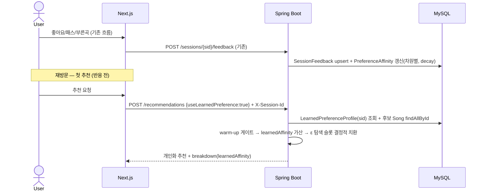

# 사용자 선호 학습 — 세션 누적 선호 기반 추천 개인화

## 1) 개요 (What / Why)

- 추천 피드백 루프(`recommendation-feedback-loop.md`, #1486/#1489)는 **한 세션 안에서** 스와이프 반응을 `next` 호출마다 즉석 재계산하는 **휘발성** `SessionPreferenceProfile` 까지 설계했다. 누적·영속되는 학습은 없어, 같은 익명 사용자가 같은 sessionId 로 재방문해도 **첫 추천은 매번 백지(콜드)에서 시작**한다.
- 반대편의 회원 `UserProfile`(선호 장르/분위기 영속, #1491)은 **v0.4 계정 시스템(#243) 선행**이라, 비로그인 익명 사용자에게는 개인화 baseline 이 존재하지 않는다. 즉 "휘발성 즉석 재정렬"과 "v0.4 명시 선호" 사이에 **익명 사용자용 누적 학습** 공백이 있다.
- 본 spec 은 그 공백을 메운다: **익명 sessionId 단위로 장르·분위기·아티스트 affinity 를 implicit 신호(좋아요/패스/부른곡 시드/추천 노출)로 누적 학습**(`LearnedPreferenceProfile`)해, sessionId 수명(180일, ADR-0013) 동안 **재방문 첫 요청부터** 추천 랭킹을 개인화한다. 신호가 충분히 쌓이기 전(콜드스타트)에는 기여 0(하위호환), 충분히 쌓인 뒤에도 탐색(ε) 비율을 남겨 필터 버블을 막는다.
- 액터: 익명 sessionId 기반 비로그인 사용자(ADR-0011 / ADR-0013). 본 spec 은 **plan-side 설계만** — 코드 구현은 비범위(별도 be/fe 사이클).
- 로드맵 위치: `docs/roadmap/overnight-2026-06-02.md` W2-P-B(부른곡 기반)·W3-공통(중복 회피)의 **다음 지평**. 피드백 루프가 "이번 세션 즉석 신호"라면 본 spec 은 "sessionId 수명 동안 학습된 prior".

### 1-1) 세 선호 자산의 위치 (AS-IS 지형)

| 자산 | 시간 지평 | 영속 | 차원 | 적용 시점 | 출처 |
|---|---|---|---|---|---|
| `SessionPreferenceProfile`(피드백 루프) | 한 세션 내 즉석 | ✗(매 `next` 재계산) | 음역대/분위기/BPM 좌표 | `next` 호출 1회 | recommendation-feedback-loop.md |
| **`LearnedPreferenceProfile`(본 spec)** | **sessionId 수명(≤180일)** | **✓(영속 누적)** | **장르/분위기/아티스트 affinity** | **재방문 포함 모든 추천 baseline** | **본 spec** |
| `UserProfile`(회원 선호) | 영구(계정) | ✓ | 명시 선호 장르/분위기 | v0.4 회원 추천 prefill | user-authentication-and-profile.md(#1491) |

→ 셋은 **합성**된다. 본 spec 의 학습 prior(baseline) 위에 피드백 루프의 즉석 신호가 세션 내에서 재정렬을 얹고, v0.4 계정 전환 시 학습 프로필이 `UserProfile` 의 seed 가 된다(§5-7).

## 2) 사용자 시나리오

1. **재방문 개인화**: 사용자가 지난주 발라드·잔잔한 곡에 좋아요를 여러 번 남겼다. 오늘 같은 브라우저(같은 sessionId)로 다시 들어와 **아무 반응을 하기 전 첫 추천**부터, 발라드·잔잔 성향 곡이 상위에 배치된다(명시 입력은 그대로 존중).
2. **점진 학습**: 처음 들어온 사용자는 개인화 신호가 없어 기존 음역대/분위기 입력 추천을 그대로 받는다(콜드스타트). 좋아요·패스·부른곡을 쌓을수록 warm-up 임계를 넘겨 학습 prior 가 점점 강하게 반영된다.
3. **탐색으로 버블 회피**: 학습이 무르익어도 매 덱의 일정 비율(ε)은 학습과 무관한 다양한 곡으로 채워, 취향이 한쪽으로 고착되지 않고 새 신호를 계속 모은다.
4. **투명성·통제**: 사용자가 "내 선호" 화면에서 학습된 장르/분위기/아티스트 상위 affinity 를 확인하고, 원하면 **초기화**하거나 **학습 끄기(opt-out)** 를 누른다. 끄면 즉시 학습·반영이 멈추고 기존 입력 기반 추천으로 돌아간다.

## 3) 요구사항

### 기능 요구사항

- [ ] **선호 누적 학습**: implicit 신호(좋아요 +, 패스 −, 부른곡 시드 +, 추천 노출 약 +)를 장르/분위기/아티스트 차원별 affinity 로 누적한다. songId당 신호가 아니라 **곡 메타에서 차원 키를 풀어** 누적(예: 좋아요한 곡의 장르=발라드 → GENRE:발라드 affinity ↑).
- [ ] **시간 감쇠**: 오래된 신호일수록 가중 ↓(취향 변화 추종). 감쇠 함수는 §8 Q3.
- [ ] **학습 적합도 신호**: 추천 시 후보 곡의 장르/분위기/아티스트와 프로필 top affinity 의 가중 일치도 `learnedAffinity`(0~1)를 `ScoreBreakdown` 에 더해 랭킹에 가산한다.
- [ ] **warm-up 게이트**: 누적 양성 신호 < 임계 N(초안 5)이면 `learnedAffinity` 기여 0(중립) — 단발 신호 과적합 방지 + 콜드스타트 하위호환.
- [ ] **탐색(ε) 비율**: 학습이 warm 이어도 결과 덱의 ε(초안 0.2) 비율은 학습 비반영 다양성 슬롯으로 채운다(필터 버블·신호 정체 방지). 결정성 유지(§비기능).
- [ ] **콜드스타트 폴백**: 신호 0건/임계 미달이면 기존 음역대·분위기 추천과 **동일 결과**(하위호환).
- [ ] **투명성 조회**: 세션의 학습된 차원별 top affinity 를 조회하는 endpoint.
- [ ] **통제(초기화/opt-out)**: 학습 프로필 초기화 + 학습 on/off 토글 endpoint. off 면 학습·반영 모두 중단.
- [ ] **신규/변경 엔드포인트 성공 E2E**(RestAssured) — 조회·초기화·학습 반영.

### 비기능 요구사항

- **결정성 보존**: 같은 (sessionId, 프로필 스냅샷, 후보 집합) → 같은 결과. 학습 프로필은 **저장된 입력**으로 취급해 `SeedDeriver` 시드 계약에 프로필 버전/요약을 포함, ε 탐색 슬롯도 seed 파생 jitter 로 결정적 선택. 룰 단일 진실: `recommendation-algorithm-v1.md §3 비기능 결정성`.
- **성능**: 프로필 조회는 sessionId 인덱스 1쿼리. 추천 시 affinity 적용은 후보 메타 in-memory 매칭(추가 DB 왕복 없음). 프로필 갱신은 신호 발생 시 upsert 1쿼리(또는 비동기 집계 — §8 Q5). 결합 추천 p95/p99 임계 유지(단일 진실 `recommendation-p95-regression-guard.md §5-3`, 직접 숫자 갱신 금지).
- **프라이버시**(핵심 — §5-8 상세): sessionId 외 식별자 미저장. **집계 affinity 가중만 영속**(원문 음성·음역대 원문·곡별 raw 이벤트 로그 중복 저장 금지 — 기존 `SessionFeedback`/`Recommendation` 행에서 파생). 학습 **초기화·opt-out 제공**. ADR-0013 sessionId revoke(TTL/회전/머지) 시 cascade-delete. 로그/응답에 sessionId 원문 노출 금지(`04-security-policy.md §3`).
- **인증**: 프로필 조회·초기화·설정 endpoint 는 **session-bound**(ADR-0011, `SessionAuthGuard`) — path/body sessionId vs `X-Session-Id` 일치, 불일치/누락 401, 상수시간 비교.
- **관측성**: `recommendation.preference.profile.updated`(dimension 라벨), `recommendation.next.with_learned_pref`(warm/cold 라벨), `recommendation.preference.opt_out` 카운터(`observability-baseline.md §5-3` 등재).
- **레이어**: 학습 프로필은 `recommendation` context 소유. Song aggregate 는 ID-only 참조(ADR-0005 §A-7), 계층 단방향(ADR-0008).

## 4) 범위 / 비범위 (중요)

### 포함

- 익명 sessionId 단위 **영속 학습 프로필**(장르/분위기/아티스트 affinity) 스키마 + 갱신 규칙.
- implicit 신호 누적 + 시간 감쇠 + warm-up 게이트.
- 추천 랭킹에 `learnedAffinity` 가산 + 탐색(ε) 비율.
- 콜드스타트 하위호환 폴백.
- 투명성 조회 + 초기화/opt-out 통제 + 프라이버시 설계.

### 제외 (Out of Scope)

- **세션 내 즉석 스와이프 재정렬** — `recommendation-feedback-loop.md`(#1486/#1489) 가 소유. 본 spec 은 그 **위에 얹는 누적 prior** 만 다루며, 즉석 신호와의 합성 규칙만 명시(§5-3).
- **크로스-sessionId / 크로스-디바이스 개인화** — sessionId 경계를 넘는 식별·연결은 하지 않는다(프라이버시). 다기기 공유는 ADR-0013 회전/페어링 트랙·v0.4 계정에 위임.
- **회원 명시 선호(`UserProfile`)** — v0.4 계정(#243/#1491) 트랙. 본 spec 은 익명 implicit 학습만. 계정 전환 시 seed 제공(§5-7)만 설계.
- **임베딩/협업 필터링/온라인 ML 튜닝** — affinity 는 hand-tuned 카운트·감쇠 집계. 임베딩 유사도·자동 가중 튜닝은 v0.4+.
- **트렌딩(사회적 신호) 혼합** — `trending-recommendation.md` 조회 전용 한정 유지. 본 spec 은 개인 신호만.
- **신규 곡 메타 수집** — 장르/분위기/아티스트는 기존 `Song` 메타 사용. 메타 부재 곡은 해당 차원 신호 미생성(graceful).

## 5) 설계

### 5-1) 도메인 모델

- **신규(`recommendation` context, 설계 단계)**
  - `LearnedPreferenceProfile` — 익명 sessionId 단위 영속·누적 선호. 차원별(GENRE/MOOD/ARTIST) `PreferenceAffinity` 집합 + 학습 on/off 설정 + 누적 신호 카운트.
  - `PreferenceAffinity` — `(dimension∈{GENRE,MOOD,ARTIST}, key, weight 0~1, signalCount, updatedAt)`. 시간 감쇠 후 정규화. 영속 행(`preference_affinity`).
  - `PreferenceSignal` — 학습 갱신 implicit 이벤트(LIKE +, PASS −, SEED +, IMPRESSION 약 +). 기존 `SessionFeedback`·`Recommendation` 행에서 **파생** — 별도 raw 이벤트 테이블 신설 없음(§5-5, 프라이버시).
  - `learnedAffinity` — `ScoreBreakdown` raw 신호(0~1, 가산). warm-up 미달·opt-out·콜드면 0.
- **유비쿼터스 랭귀지**(06-domain-model.md §4 — 본 PR 등재 완료): "선호 학습 프로필(LearnedPreferenceProfile)", "선호 affinity(PreferenceAffinity)", "선호 신호(PreferenceSignal)", "학습 적합도(learnedAffinity)".
- 기존 자산 재사용: 신호 입력은 `SessionFeedback`(좋아요/패스)·`Recommendation`(노출)·부른곡 시드(`SeedSongProfiler`). 곡→차원 키는 기존 `Song`(장르/분위기/아티스트) 메타.

### 5-2) API 엔드포인트

| Method | Path | 설명 | 인증 | Req | Res |
|---|---|---|---|---|---|
| GET | /api/v1/sessions/{sessionId}/preference-profile | 학습된 차원별 top affinity 조회(투명성) | session-bound | (query: dimension?, limit?) | `LearnedPreferenceResponse` |
| DELETE | /api/v1/sessions/{sessionId}/preference-profile | 학습 프로필 초기화(affinity 전체 삭제) | session-bound | — | 204 |
| PATCH | /api/v1/sessions/{sessionId}/preference-profile/setting | 학습 on/off 토글(opt-out) | session-bound | `PreferenceLearningSettingRequest` `{enabled}` | `PreferenceLearningSettingResponse` `{enabled}` |
| POST | /api/v1/recommendations(및 /next) | (확장) 학습 prior 결합 추천 | session-bound | 기존 + `useLearnedPreference: boolean?`(warm 시 기본 true) | 기존 + breakdown 에 `learnedAffinity` |

- 신호 **수집 전용 endpoint 는 두지 않는다** — 학습은 기존 좋아요/패스/추천 흐름에서 파생 갱신(중복 입력·중복 저장 회피).
- 추천 endpoint 는 기존 입력을 **유지**(하위호환). `useLearnedPreference=false` 또는 opt-out 또는 warm-up 미달이면 학습 기여 0.
- 모든 신규 endpoint session-bound(ADR-0011). 상수시간 비교, 401 통일.

### 5-3) 학습·결합 로직

1. **신호 적재**: 좋아요/패스/부른곡 시드/추천 노출 발생 시, 해당 곡 메타에서 (장르, 분위기, 아티스트) 키를 풀어 차원별 affinity 를 갱신.
   - 좋아요·시드: `weight += w_signal · decay(now)`; 패스: `weight -= w_pass · decay(now)`; 노출: 약한 +(과노출 억제). 차원별 정규화 0~1.
   - 신호별 계수 `w_signal`/`w_pass`/`w_impression` 초안은 `application.yml` 단일 진실(§8 Q2, spec 미러).
2. **warm-up 게이트**: 누적 양성 신호 < N(초안 5) → `learnedAffinity` 기여 0(콜드/단발 과적합 방지).
3. **후보 점수 가산**: 후보 곡의 (장르/분위기/아티스트)와 프로필 top affinity 의 가중 일치도 = `learnedAffinity`(0~1). `total += w_learned · learnedAffinity`(초안 `w_learned=0.2`, §8 Q1).
4. **즉석 신호와 합성**(피드백 루프): 같은 세션에서 `SessionPreferenceProfile`(즉석)도 있으면, 학습 prior 는 baseline, 즉석은 단기 보정으로 **합산**(둘 다 raw 0~1, 가중치 독립). 충돌 시 즉석(최신성)이 더 강한 단기 가중.
5. **탐색(ε)**: 결과 덱 상위 K 중 ε·K 슬롯은 학습 비반영 다양성 후보(장르 분산 최대화)로 결정적 치환 — seed 파생 jitter 로 같은 입력 → 같은 탐색 선택(결정성 유지).
6. **opt-out**: `enabled=false` 면 1~5 전부 우회(신호 적재·반영 중단).

### 5-4) 외부 연동

- 없음. 장르/분위기/아티스트는 기존 `Song`(song context) 메타 내부 호출.

### 5-5) DB 마이그레이션

- 신규 테이블 `learned_preference_profile`: `(id PK, session_id, learning_enabled BOOL, positive_signal_count INT, updated_at)`, `UNIQUE (session_id)`.
- 신규 테이블 `preference_affinity`: `(id PK, profile_id FK, dimension VARCHAR, affinity_key VARCHAR, weight DOUBLE, signal_count INT, updated_at)`, `UNIQUE (profile_id, dimension, affinity_key)`, `INDEX (profile_id, dimension)`.
- **raw 신호 이벤트 테이블은 신설하지 않는다** — 신호는 기존 `session_feedback`/`recommendation` 행에서 파생(프라이버시 + 중복 저장 회피).
- ADR-0013 cascade-delete 대상에 `learned_preference_profile`·`preference_affinity` 추가(sessionId revoke 시 함께 삭제) — `anonymous-session-lifecycle.md` 삭제 대상 표 갱신 동반.
- 마이그레이션 도구 ADR-0009. `06-domain-model.md` §5 엔티티 + §6 ERD 를 구현 PR 과 **같은 PR** 에서 갱신.

### 5-6) 프론트엔드 화면 (계약만)

- "내 선호" 패널: `GET /preference-profile` 로 차원별 top affinity 표시(투명성). "초기화"(DELETE) + "학습 끄기"(PATCH setting) 버튼.
- 추천 호출 시 `useLearnedPreference` + sessionId 전달. 상태 관리 React Query(ADR-0004) — `useLearnedPreference`, `useResetPreference`, `usePreferenceSetting` 훅.
- 개인화 가시 신호(선택): 카드에 "내 취향 반영" 배지(explainability F4 `recommendation-explainability.md` 와 연계 — `learnedAffinity` 사유 슬롯).

### 5-7) v0.4 계정 전환 (seed 제공)

- 익명 학습 프로필은 계정 전환(#243, `anonymous-to-account-conversion.md`) 시 owner sessionId→userId 로 치환되며, 명시 `UserProfile` 선호의 **초기 seed** 로 합쳐질 수 있다(implicit 학습 → 명시 선호 부트스트랩). 충돌·우선순위 규칙은 해당 전환 spec 에 위임(본 spec 은 seed 제공 가능성만 명시).

### 5-8) 프라이버시 설계 (별도 강조)

- **수집 최소화**: 영속은 **집계 affinity 가중만**. 원문 음성·음역대 원문·곡별 raw 이벤트 로그를 본 기능 위해 신규 저장하지 않음(기존 행 파생).
- **사용자 통제**: 학습 내용 **조회(투명성)** + **초기화** + **opt-out(끄기)** 3종 모두 제공. off 면 신호 적재·반영 중단.
- **수명·삭제**: ADR-0013 sessionId 수명(180일 inactive) + revoke/회전/머지 시 cascade-delete. sessionId 경계 밖 식별 금지.
- **노출 금지**: sessionId 원문·affinity 를 로그/예외/타 세션에 노출 금지(`04-security-policy.md §3`). 조회는 본인 session-bound 만.
- **민감도 인지**: 장르/아티스트 취향은 기호 추론 소지 → 집계 전용·본인 조회·언제든 초기화로 데이터 최소·투명·통제 원칙 충족.

## 6) 작업 분할 (예상 PR 리스트)

- [x] **PR A** (plan, #1568): Feature Spec draft + `06-domain-model.md §4` 용어 4종 등재.
- [ ] **PR B** (be, scope:recommendation): `LearnedPreferenceProfile`·`PreferenceAffinity` 엔티티 + 마이그레이션 + 신호 파생 갱신(좋아요/패스/시드/노출 훅) + E2E. §5/§6 도메인 문서 갱신.
- [ ] **PR C** (be, scope:recommendation): `learnedAffinity` 신호 + warm-up 게이트 + 추천 결합 + ε 탐색 + 결정성 회귀 가드. 가중치/감쇠 ADR(§8 Q2) 동반.
- [ ] **PR D** (be, scope:recommendation): 조회/초기화/opt-out endpoint + SessionAuthGuard + E2E.
- [ ] **PR E** (fe, scope:web): "내 선호" 패널 + `useLearnedPreference` 전환 + 초기화/끄기 UI.
- [ ] **PR F** (infra, optional): 관측성 카운터 등록.
- [ ] **PR G** (plan): `anonymous-session-lifecycle.md` cascade-delete 대상에 신규 2 테이블 반영.

### 보호 영역 변경 여부 (필수 명시)

- 보호 영역 변경 여부: ☑ 있음 — 구현 PR 한정(본 plan PR 은 docs only):
  - `backend/.../db/migration/*` — `learned_preference_profile`·`preference_affinity` 테이블 신설(PR B).
  - `backend/.../application*.yml` — `recommendation.weights.learned-affinity` + 신호 계수/감쇠/warm-up N/ε 추가(PR C).
  - rev 사이클은 마이그레이션·가중치·결정성 변경에 추가 신중도(결정성 회귀 가드 / 환경별 회귀) 권고.

## 7) 테스트 전략

- **단위**: affinity 누적(좋아요 ↑ / 패스 ↓ / 차원별 정규화), 시간 감쇠(오래된 신호 가중 ↓), warm-up 게이트(신호 < N → learnedAffinity 0), 콜드스타트(0 신호 → 기존 추천 동일), opt-out(off → 미반영·미적재).
- **단위(결정성)**: 같은 (프로필 스냅샷, 입력) → 같은 1위 score + 같은 ε 탐색 선택 / 프로필 다르면 결과 셋 다름.
- **통합(JPA slice)**: `preference_affinity` unique upsert(차원·키 중복 갱신) 검증.
- **E2E(RestAssured, 신규 endpoint 필수)**:
  - 좋아요 누적 → `GET /preference-profile` 에 해당 장르/분위기 affinity 노출.
  - warm 상태 추천 → 학습 affinity 근접 곡 상위 / 콜드(신호 0) 추천 → 기존과 동일(하위호환 회귀 가드).
  - 초기화(DELETE) → affinity 0건 → 추천 콜드 폴백 복귀.
  - opt-out(PATCH false) → 이후 신호 미적재 + 추천 미반영.
  - 인증: `X-Session-Id` 불일치/누락 401, 타 세션 affinity 미노출.
- **회귀 가드**: p95/p99(k6, `recommendation-p95-regression-guard.md`). 학습 결합 후 임계 유지.

## 8) 오픈 질문

> 구현 전에 답이 나와야 하는 것들. 해소되면 §9 결정 로그로 이동.

| # | 질문 | 선택지 | 담당/기한 |
|---|---|---|---|
| Q1 | `w_learned`(학습 가중치) 기본값 | (a) 0.2(초안) / (b) 즉석 신호(preferenceFit)보다 낮게 0.15 / (c) A/B 후 확정 | @mobruji-maestro / PR C |
| Q2 | 결합·감쇠를 ADR 로 형식화할지 | (a) 신규 ADR(`preference-learning-signal`) / (b) 본 spec §9 결정 로그로 충분 | @mobruji-maestro / PR C |
| Q3 | 시간 감쇠 함수 | (a) 지수(시간 기반 half-life) / (b) 선형(신호 수 역순) / (c) 감쇠 없음(단순 누적) | @mobruji-maestro / PR C |
| Q4 | warm-up 임계 N · 탐색 ε 기본값 | (a) N=5 / ε=0.2(초안) / (b) N=3 / ε=0.3 / (c) A/B | @mobruji-maestro / PR C |
| Q5 | affinity 갱신 시점 | (a) 신호 발생 시 동기 upsert / (b) 비동기 배치 재집계(부하↓·즉시성↓) | @mobruji-maestro / PR B |
| Q6 | 추천 노출(IMPRESSION) 신호 포함 여부 | (a) 약한 + 포함(과노출 억제 캡) / (b) 좋아요/패스/시드만(노출 제외) | @mobruji-maestro / PR C |
| Q7 | 아티스트 차원 포함 범위 | (a) 장르/분위기/아티스트 3차원 / (b) 1차는 장르/분위기만, 아티스트는 후속 | @mobruji-maestro / PR B |
| Q8 | 학습 기본 on/off | (a) 기본 on + 명시 opt-out / (b) 기본 off + 명시 opt-in(프라이버시 보수) | @mobruji-maestro / PR D |

## 9) 결정 로그

- **2026-06-03**: 초안 작성(status=draft). 출처: 지시 `roadmap-pref-plan`("피드백 루프 후속"). 세 선호 자산(휘발성 `SessionPreferenceProfile` / 본 spec 영속 `LearnedPreferenceProfile` / v0.4 `UserProfile`)의 공백 진단 후, **익명 sessionId 단위 장르·분위기·아티스트 누적 학습**으로 재방문 baseline 을 개인화하는 설계. 콜드스타트 = warm-up 임계(N) 미달 시 기여 0(하위호환) + 탐색 ε 로 필터 버블 회피. 프라이버시 = 집계 affinity 전용 영속·원문/raw 이벤트 중복 저장 금지·조회/초기화/opt-out 3종 통제·ADR-0013 cascade. 즉석 신호(피드백 루프)와는 baseline+단기보정 합성. 비범위: 크로스-sessionId 개인화·임베딩/협업필터·온라인 ML 튜닝·트렌딩 혼합·v0.4 회원 명시 선호. 가중치/감쇠/임계/ADR 형식화는 §8 Q1~Q8 로 구현(PR B/C/D) 시 확정.
