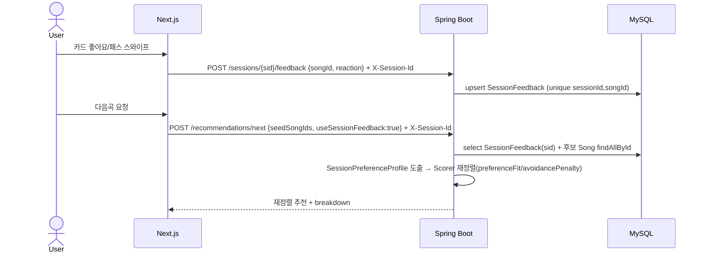

# 추천 피드백 루프 — 스와이프 반응 기반 다음곡 신호

## 1) 개요 (What / Why)

- 페르소나 **P-B(부른곡 기반 추천)** 의 핵심 설계다. 듣는 음악 ≠ 부르는 음악이라 노래방에서 "뭐 부르지?" 가 막히는 사용자에게, **방금 부른/넘긴 반응을 다음 추천 신호로 즉시 환류**시켜 한 곡씩 정밀해지는 선곡 경험을 준다.
- 현재(2026-06-03) 부른곡 기반 모드(#1486)와 쇼츠식 스와이프 UX(#1489)는 각각 머지됐으나 **둘을 잇는 신호 루프가 stateless·휘발성**이다. 스와이프 좋아요/패스는 클라이언트 localStorage(`web/store/swipeReactions.ts`)에만 남고, `POST /api/v1/recommendations/next` 에 매 요청 `seedSongIds`(좋아요)·`excludeSongIds`(패스) 평면 리스트로만 전달된다. 서버는 누적 선호를 알지 못한다.
- 본 spec 은 (1) **부른곡 시드 + 세션 피드백을 하나의 선호 신호로 결합**하는 전략, (2) 피드백 **저장 스키마**, (3) 추천 점수에 **가중 반영하는 로직**, (4) 신호가 없는 **콜드스타트 처리**를 설계한다. 액터는 익명 sessionId 기반 비로그인 사용자(ADR-0011 / ADR-0013).
- 로드맵 위치: `docs/roadmap/overnight-2026-06-02.md` W2-P-B + W3-공통(세션 내 중복 회피). 이 spec 은 그 두 항목의 plan-side 명세이며 구현은 별도 사이클.

### 1-1) 현행 흐름과 결함 (AS-IS)

| 자산 | 현재 동작 | 결함 |
|---|---|---|
| 스와이프 반응 (#1489) | `useSwipeReactionsStore` — songId당 like/pass 1건, localStorage 영속, 상한 200 | 클라이언트 휘발(브라우저/기기 교체 시 소실), 서버 미인지 |
| 부른곡 모드 (#1486) | `POST /recommendations/next` — `seedSongIds`(최소 1)·`excludeSongIds`. `SeedSongProfiler` 가 시드에서 음역대·분위기·BPM 도출, 시드 자체 결과 제외 | stateless — 같은 세션에서 반응이 쌓여도 매 요청 평면 리스트 재전달뿐, **선호 강도/최신성 가중 없음** |
| Like / Bookmark (`feedback`) | 영속 toggle (`recommendation-history-and-feedback.md`) | **v0.2 추천 가중치 비영향** — 명시적으로 시그널 수집만 |

→ 세 자산이 "긍정/부정 신호를 모은다" 는 같은 목적을 가지면서도 서로 연결되지 않아, P-B 의 "넘긴 반응이 다음 추천을 바꾼다" 약속이 클라이언트 단순 필터(seed=좋아요 / exclude=패스) 수준에 머문다.

## 2) 사용자 시나리오

1. **스와이프로 좁혀가기**: 사용자가 추천 덱에서 곡을 한 장씩 넘긴다. "이 노래 좋아요"(like) 3곡, "패스"(pass) 5곡을 거치면, 다음 카드부터 좋아요한 곡들과 음역대·분위기가 가까운 곡이 앞쪽으로, 패스한 곡과 비슷한 곡은 뒤로 밀린다.
2. **부른곡 + 즉석 반응 결합**: 사용자가 "방금 〈좋은날〉을 불렀어요" 로 시드를 넣고(#1486), 스와이프하며 좋아요/패스를 더한다. 다음곡 추천은 **시드(부른 곡) 신호 + 세션 누적 반응**을 합쳐 재정렬된다.
3. **세션 내 중복 회피**(W3-공통): 이미 추천받았거나 패스한 곡은 같은 세션 동안 다시 카드에 뜨지 않는다.
4. **콜드스타트**: 시드도 반응도 없는 첫 진입 — 기존 음역대/분위기 입력 기반 추천(`POST /recommendations`)으로 시작하고, 첫 스와이프부터 신호가 누적된다.

## 3) 요구사항

### 기능 요구사항

- [ ] **세션 피드백 영속**: 스와이프 like/pass 반응을 서버에 sessionId 단위로 저장한다. songId당 최신 반응 1건(재스와이프 시 덮어쓰기), 삽입 순서 보존.
- [ ] **결합 신호 도출**: `next` 추천 시 (a) 부른곡 시드 프로필(`SeedSongProfiler`) + (b) 세션 누적 좋아요 곡 프로필 + (c) 패스 곡 회피 신호를 합산해 후보 점수를 재정렬한다.
- [ ] **선호 가중**: 좋아요한 곡과 음역대·분위기·BPM 이 가까운 후보에 가산(`preferenceFit`), 패스한 곡과 가까운 후보에 감산(`avoidancePenalty`). 둘 다 0~1 정규화 후 가중치 적용.
- [ ] **최신성 감쇠**: 최근 반응일수록 가중 ↑(세션 후반 취향 변화 반영). 선형 또는 지수 감쇠 중 §8 Q3 에서 확정.
- [ ] **중복 회피**: 세션에서 이미 추천된/패스한 곡은 후보에서 제외(기존 `excludeSongIds` 패턴 서버측 확장).
- [ ] **콜드스타트 폴백**: 시드·반응 0건이면 가중 신호 기여 0(중립) — 기존 음역대/분위기 추천과 동일 결과(하위호환).
- [ ] **신규/변경 엔드포인트 성공 E2E** (RestAssured) — 반응 기록 + 결합 추천.

### 비기능 요구사항

- **결정성 보존**: 같은 (sessionId, 시드, 반응 집합) → 같은 결과. `SeedDeriver` 시드 계약에 반응 신호 입력을 포함해 `recommendation-algorithm-v1.md §3 비기능 결정성` 룰을 따른다.
- **성능**: 반응 기록 toggle p95 < 100ms(DB write 1회). 결합 추천 p95 200ms / p99 400ms 유지 — 임계 단일 진실은 `recommendation-p95-regression-guard.md §5-3`(직접 숫자 갱신 금지). 세션 반응 조회는 인덱스 1쿼리 + 후보 곡 메타 `findAllById` 1쿼리(N+1 회피).
- **프라이버시**: sessionId 외 식별자 미저장. 로그/응답에 sessionId 원문·음역대 원문 노출 금지(`04-security-policy.md §3`). 반응 저장은 (sessionId, songId, reaction) 만.
- **인증**: 반응 기록·조회 endpoint 는 **session-bound**(ADR-0011, `SessionAuthGuard`) — body/path sessionId vs `X-Session-Id` 일치 검증, 불일치/누락 401.
- **TTL 정합**: 세션 반응은 ADR-0013 sessionId revoke(TTL/회전/머지) 시 cascade-delete 대상.
- **관측성**: `recommendation.feedback.reaction.recorded`(reaction 라벨 like/pass), `recommendation.next.with_feedback` 카운터(`observability-baseline.md §5-3` 등재).
- **레이어**: 반응 신호는 `recommendation` context 가 소유. Song aggregate 는 ID-only 참조(ADR-0005 §A-7). 계층 단방향(ADR-0008).

## 4) 범위 / 비범위 (중요)

### 포함

- 스와이프 like/pass 반응의 **서버 영속 스키마** + 기록/조회 API.
- `next` 추천에 세션 피드백 + 부른곡 시드를 결합한 **재정렬 가중 신호**(`preferenceFit` / `avoidancePenalty`).
- 최신성 감쇠 + 세션 내 중복 회피.
- 콜드스타트(신호 0건) 하위호환 폴백.

### 제외 (Out of Scope)

- **장기/크로스세션 개인화 모델** — sessionId 만료(180일, ADR-0013) 너머의 누적 학습, 임베딩 기반 협업 필터링은 v0.4+(계정 시스템 #243 선행).
- **Like / Bookmark(`feedback` context)를 추천 가중에 직접 편입** — 본 spec 은 **스와이프 세션 반응**만 신호화한다. Like/Bookmark 의 가중치 도입은 `recommendation-history-and-feedback.md §4` 가 예고한 별도 v0.3+ ADR 트랙으로 둔다(Q5 참조).
- **트렌딩(사회적 신호)과의 혼합** — `trending-recommendation.md` 가 조회 전용으로 한정한 결정 유지. 본 spec 은 개인 세션 신호만.
- **온라인 가중치 자동 튜닝(ML)** — hand-tuned 가중치 고정. 자동 조정은 v0.4+.
- **fe 스와이프 UX/애니메이션** — #1489 에서 완료. 본 spec 은 서버 신호 + fe API 연동 계약만.

## 5) 설계

### 5-1) 도메인 모델

- **신규(`recommendation` context, 설계 단계)**
  - `SessionFeedback` — 세션 스와이프 반응 1건. `(id PK, sessionId, songId, reaction(LIKE|PASS), createdAt)`. Unique `(sessionId, songId)`(songId당 최신 1건 — 재스와이프 시 upsert). Index `(sessionId, createdAt)`.
  - `SessionPreferenceProfile` — 값 객체(비영속). 세션 반응 + 부른곡 시드를 합쳐 도출한 음역대·분위기·BPM 선호 중심 + 회피 집합. `next` 추천 시점 1회 계산.
  - `FeedbackSignal` — `ScoreBreakdown` 에 추가될 raw 신호 2종: `preferenceFit`(좋아요 프로필 근접도 0~1), `avoidancePenalty`(패스 프로필 근접도 0~1, 점수에서 감산).
- **유비쿼터스 랭귀지**(06-domain-model.md §4 갱신 — 본 PR): "스와이프 반응(SwipeReaction/SessionFeedback)", "세션 선호 프로필(SessionPreferenceProfile)", "선호 적합도(preferenceFit)" / "회피 패널티(avoidancePenalty)".
- 기존 자산 재사용: `SeedSongProfiler`(#1486) 가 시드 프로필 도출을 이미 담당 — 본 spec 은 그 입력에 세션 좋아요 곡을 합치고, 패스 곡으로 회피 프로필을 만든다.

### 5-2) API 엔드포인트

| Method | Path | 설명 | 인증 | Req | Res |
|---|---|---|---|---|---|
| POST | /api/v1/sessions/{sessionId}/feedback | 스와이프 반응 기록(upsert) | session-bound | `FeedbackRecordRequest` `{songId, reaction}` | `FeedbackRecordResponse` `{songId, reaction}` |
| GET | /api/v1/sessions/{sessionId}/feedback | 세션 반응 목록(최신순) | session-bound | (query: page,size) | `Page<SessionFeedbackResponse>` |
| POST | /api/v1/recommendations/next | (확장) 부른곡 + **세션 피드백 결합** 다음곡 추천 | session-bound | `NextRecommendationRequest`(기존) + `useSessionFeedback: boolean?`(기본 true) | `RecommendationResponse`(기존 + breakdown 에 `preferenceFit`/`avoidancePenalty`) |

- `POST /feedback` 는 toggle 이 아니라 **upsert**(최신 reaction 으로 덮어쓰기) — like→pass 전환도 한 번의 POST 로. (Like/Bookmark 의 toggle 패턴과 다른 이유: 스와이프는 "현재 상태 설정" 의미, §9 결정 로그)
- `next` 는 기존 `seedSongIds`/`excludeSongIds` 평면 입력을 **유지**(하위호환). `useSessionFeedback=true`(기본)면 서버가 저장된 세션 반응을 추가 신호로 결합. fe 는 점진적으로 평면 입력 → 서버 신호로 이전(§5-6).
- 모든 endpoint session-bound(§ADR-0011 매핑: POST=body/path, GET=path). 상수시간 비교, 401 통일.

### 5-3) 결합·가중 로직

1. **입력 수집**: `next` 요청 시 (a) `seedSongIds`(부른 곡) + (b) 세션의 `LIKE` 반응 곡 = **선호 집합**, (c) 세션의 `PASS` 반응 곡 + `excludeSongIds` = **회피/제외 집합**.
2. **프로필 도출**(`SessionPreferenceProfile`):
   - 선호 중심 = `SeedSongProfiler` 로 선호 집합의 음역대·(energy,brightness)분위기·BPM 가중 평균(최신성 감쇠 가중).
   - 회피 프로필 = 패스 곡들의 같은 좌표 집합.
3. **후보 점수 재정렬**: 기존 `RecommendationScorer` 신호(rangeFit/moodMatch/tempoMatch 등)에 더해
   - `preferenceFit` = 후보와 선호 중심의 정규화 근접도(0~1).
   - `avoidancePenalty` = 후보와 가장 가까운 패스 곡의 근접도(0~1) → **감산**.
   - `total += w_pref · preferenceFit − w_avoid · avoidancePenalty`. 가중치 초안 `w_pref=0.25`, `w_avoid=0.2`(§8 Q1, `application.yml` 단일 진실 — 본 spec 미러).
4. **중복 회피**: 제외 집합 전부 후보에서 drop(서버측, 이미 추천/패스/부른 곡).
5. **최신성 감쇠**: 반응 i 의 가중 = `decay(now − reaction_i.createdAt)`. 함수형은 §8 Q3.

### 5-4) 외부 연동

- 없음. Song 메타·audio features 는 기존 song/recommendation context 내부 호출.

### 5-5) DB 마이그레이션

- 신규 테이블 `session_feedback`: `(id PK, session_id, song_id, reaction VARCHAR, created_at)`, `UNIQUE (session_id, song_id)`, `INDEX (session_id, created_at)`. 마이그레이션 도구 ADR-0009.
- ADR-0013 cascade-delete 대상에 `session_feedback` 추가(sessionId revoke 시 함께 삭제) — `anonymous-session-lifecycle.md` 삭제 대상 표 갱신 동반.
- `06-domain-model.md` §5 엔티티 + §6 ERD 를 구현 PR 과 **같은 PR** 에서 갱신.

### 5-6) 프론트엔드 화면 (계약만)

- `web/store/swipeReactions.ts`(localStorage)는 오프라인/낙관적 업데이트 캐시로 유지하되, 반응 발생 시 `POST /sessions/{sid}/feedback` 도 호출(서버가 신뢰 출처). 충돌 시 서버 우선.
- `next` 호출 시 `useSessionFeedback:true` + sessionId 전달. 기존 평면 `seedSongIds`/`excludeSongIds` 는 한시 병행 후 제거(점진 이전).
- 상태 관리 React Query(ADR-0004) — `useRecordFeedback`, `useSessionFeedback` 훅.

## 6) 작업 분할 (예상 PR 리스트)

- [ ] **PR A** (plan, 본 PR): Feature Spec draft + `06-domain-model.md §4` 유비쿼터스 랭귀지 후보어 등재.
- [ ] **PR B** (be, scope:recommendation): `SessionFeedback` 엔티티 + 마이그레이션 + 기록/조회 API + SessionAuthGuard + E2E. §5/§6 도메인 문서 갱신.
- [ ] **PR C** (be, scope:recommendation): `SessionPreferenceProfile` 도출 + `RecommendationScorer` 에 `preferenceFit`/`avoidancePenalty` + `next` 결합 + 결정성 회귀 가드. 가중치 ADR(§8 Q2) 동반.
- [ ] **PR D** (fe, scope:web): 스와이프 반응 서버 기록 연동 + `next` `useSessionFeedback` 전환. localStorage 폴백 유지.
- [ ] **PR E** (infra, optional): 관측성 카운터 등록.
- [ ] **PR F** (plan): `anonymous-session-lifecycle.md` cascade-delete 대상에 `session_feedback` 반영.

### 보호 영역 변경 여부 (필수 명시)

- 보호 영역 변경 여부: ☑ 있음 — 구현 PR 한정(본 plan PR 은 docs only):
  - `backend/.../db/migration/*` — `session_feedback` 테이블 신설(PR B).
  - `backend/.../application*.yml` — `recommendation.weights.preference-fit` / `avoidance-penalty` 가중치 추가(PR C).
  - rev 사이클은 마이그레이션·가중치 변경에 추가 신중도(결정성 회귀 가드 / 환경별 회귀) 권고.

## 7) 테스트 전략

- **단위**: `SessionPreferenceProfile` 도출(선호/회피 집합 분리, 최신성 감쇠), `preferenceFit`/`avoidancePenalty` 경계값(동일 곡=1.0, 무관=0.0), 콜드스타트(신호 0 → 기여 0).
- **단위(결정성)**: 같은 (시드, 반응) → 같은 1위 score / 반응 다르면 결과 셋 다름.
- **통합(JPA slice)**: `session_feedback` unique upsert(재스와이프 덮어쓰기) 검증.
- **E2E(RestAssured, 신규 endpoint 필수)**:
  - 반응 기록(like) → 조회 노출 → like→pass 재기록 → 최신 반응 회신.
  - `next` 시드 + 세션 like 곡 → 결과에 like 프로필 근접 곡 상위 / pass 곡 비근접 곡 강등.
  - 콜드스타트: 반응 0건 `next` → 기존 추천과 동일(하위호환 회귀 가드).
  - 인증: `X-Session-Id` 불일치/누락 401, 타 세션 반응 미노출.
- **회귀 가드**: p95/p99(k6, `recommendation-p95-regression-guard.md`). 결합 신호 추가 후 임계 유지.

## 8) 오픈 질문

| # | 질문 | 선택지 | 담당/기한 |
|---|---|---|---|
| Q1 | `w_pref`/`w_avoid` 가중치 기본값 | (a) pref 0.25 / avoid 0.2 (초안) / (b) 대칭 0.2/0.2 / (c) A/B 후 확정 | @mobruji-maestro / PR C |
| Q2 | 결합 가중 도입을 ADR 로 형식화할지 | (a) 신규 ADR(`recommendation-feedback-signal`) / (b) 본 spec §9 결정 로그로 충분 | @mobruji-maestro / PR C |
| Q3 | 최신성 감쇠 함수 | (a) 선형(반응 수 역순) / (b) 지수(시간 기반) / (c) 감쇠 없음(균등) | @mobruji-maestro / PR C |
| Q4 | 패스 신호 강도 | (a) avoidancePenalty 감산 / (b) hard exclude(완전 제외)만 / (c) 둘 다(가까우면 감산, 동일 곡 제외) | @mobruji-maestro / PR C |
| Q5 | Like/Bookmark(`feedback`) 신호와 통합할지 | (a) 본 spec 은 스와이프 세션 반응만, Like/Bookmark 는 별도 v0.3+ ADR / (b) 통합 단일 신호 | @mobruji-maestro / 후속 |
| Q6 | `next` 외 기본 추천(`POST /recommendations`)에도 세션 피드백 결합할지 | (a) `next` 한정 / (b) 기본 추천도 opt-in | @mobruji-maestro / PR C |

## 9) 결정 로그

- **2026-06-03**: 초안 작성(status=draft). 출처: 지시 `roadmap-feedback-loop-plan`(W2-P-B). 현행 AS-IS(스와이프 localStorage 휘발 / `next` stateless / Like·Bookmark 가중 비영향) 진단 후, 스와이프 세션 반응을 서버 영속화해 `SessionPreferenceProfile` 로 결합하는 루프 설계. 스코프 한정: **스와이프 세션 반응만 신호화**(Like/Bookmark 가중 편입·트렌딩 혼합·ML 자동 튜닝·크로스세션 개인화는 비범위). 반응 기록은 toggle 아닌 **upsert**(현재 상태 설정 의미). 콜드스타트는 신호 기여 0 으로 기존 추천 하위호환. 가중치/감쇠/ADR 형식화는 §8 Q1~Q4 로 구현(PR C) 시 확정.
