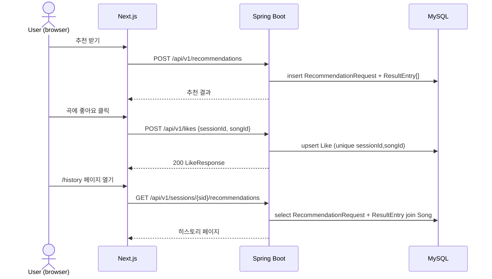

# 추천 히스토리 백엔드 동기화 & 좋아요/북마크 피드백

## 1) 개요 (What / Why)

- 현재(fe 사이클 13, #135 이후) 추천 히스토리는 **브라우저 zustand persist**로만 보존된다. 다른 기기/브라우저에서 동일한 히스토리를 볼 수 없고, localStorage가 비워지면 영구 소실된다.
- 본 기능은 (1) 추천 결과를 **백엔드에 영속화**하고 (2) 사용자가 곡에 대해 **좋아요/북마크** 액션을 남길 수 있게 한다.
- 좋아요/북마크는 v0.3+ 추천 알고리즘(ML 시그널) 입력으로 사용된다. **v0.2 단계에서는 추천 가중치에 영향을 주지 않는다.**
- 액터: 익명 sessionId 기반의 비로그인 사용자. (CLAUDE.md / 04-security-policy.md "익명 세션" 룰 적용)
- 로드맵 위치: **plan 4 roadmap §1-6 (v0.2 P2 후보)**.

## 2) 사용자 시나리오

1. **추천 → 액션**: 사용자가 음역대를 입력해 추천을 받고, 마음에 드는 곡에 좋아요를 누르거나 북마크에 담는다.
2. **다기기 히스토리 조회**: 모바일 브라우저에서 좋아요를 남긴 사용자가 PC 브라우저에서 동일한 sessionId로 접속해 `/history` 페이지에서 동일한 데이터를 본다.
   - (선결 조건) sessionId가 두 디바이스 간 공유되는 메커니즘은 본 spec 범위 외 (Q4 참조).
3. **(v0.3+) 피드백 기반 추천**: 사용자가 좋아요를 누른 곡들의 특성(난이도 분포, 장르)이 다음 추천 결과의 가중치 조정 입력으로 사용된다. — 본 spec에서는 데이터 수집까지만.

## 3) 요구사항

### 기능 요구사항

- [ ] **Like 도메인**: sessionId 단위로 Song에 좋아요를 토글할 수 있다. (`Like(id, sessionId, songId, createdAt)`)
- [ ] **Bookmark 도메인**: sessionId 단위로 Song을 북마크에 담을 수 있다. (`Bookmark(id, sessionId, songId, createdAt)`)
- [ ] `POST /api/v1/likes` — 좋아요 생성 (멱등: 같은 (session, song) 중복 요청은 200 OK + 기존 리소스)
- [ ] `DELETE /api/v1/likes` — 좋아요 취소 (body: `{sessionId, songId}` 또는 path: `/api/v1/likes/{songId}?sessionId=...` — §8 Q5)
- [ ] `POST /api/v1/bookmarks`, `DELETE /api/v1/bookmarks` — 동일 패턴
- [ ] `GET /api/v1/sessions/{sessionId}/likes` — 해당 세션의 좋아요 목록 (Song 페이로드 join)
- [ ] `GET /api/v1/sessions/{sessionId}/bookmarks` — 동일 패턴
- [ ] **추천 히스토리 백엔드 영속화**: `RecommendationRequest`(기존)에 더해 응답 결과(추천된 곡 리스트)를 `RecommendationResultEntry`로 저장한다.
- [ ] `GET /api/v1/sessions/{sessionId}/recommendations` — 해당 세션의 추천 요청 + 결과 목록 (최신순, 페이지네이션)
- [ ] **fe 통합**: SongCard에 좋아요 버튼 추가, `/history` 페이지는 backend 우선, fallback으로 localStorage 사용.

### 비기능 요구사항

- **결정성 유지**: 좋아요/북마크는 **v0.2 추천 알고리즘 출력에 영향을 주지 않는다**. 시그널 수집만 한다. (v0.3+에서 명시적 ADR로 도입)
- **성능**: 좋아요 토글 p95 < 100ms (DB write 1회), 히스토리 GET p95 < 200ms (페이지당 20건 join 기준).
- **프라이버시**: sessionId 외 식별자(IP/UA 등)는 저장하지 않는다. 04-security-policy.md 준수. 로그에 sessionId 원문 노출 금지(해시 또는 prefix 마스킹).
- **관측성**: `like.created`, `like.deleted`, `bookmark.created`, `recommendation.persisted` 카운터 metric 노출.
- **ArchUnit**: `com.mobruji.recommendation.*` 패키지 경계, repository → service → controller 단방향 유지. ADR-0008 준수.
- **레이어 의존**: Like/Bookmark는 Recommendation context에 속하되, Song aggregate 참조는 ID-only (ADR-0005 §A-7 권장).

## 4) 범위 / 비범위 (중요)

### 포함

- Like / Bookmark 엔티티 + CRUD API
- 추천 히스토리(요청+결과) 백엔드 영속화 및 조회 API
- fe SongCard 좋아요 버튼, `/history` 페이지 backend 우선 전환

### 제외 (Out of Scope)

- **ML 가중치 조정 / 좋아요 기반 추천 알고리즘** — v0.3+ 별도 ADR + spec.
- **소셜 기능**: 친구의 좋아요 보기, 인기 곡 랭킹 노출, 공유 링크 — 향후 별도 spec.
- **로그인 / 계정 시스템** — sessionId 기반만. 계정 전환·머지는 v0.4+.
- **좋아요/북마크 정렬·필터·태깅** — 단순 시간순만.
- **댓글, 별점(rating 1~5)** — 본 spec은 binary action만.

## 5) 설계

### 5-1) 도메인 모델

- **신규 엔티티(Recommendation context)**
  - `Like` — `(id PK, sessionId, songId, createdAt)`. Unique constraint: `(sessionId, songId)`.
  - `Bookmark` — `(id PK, sessionId, songId, createdAt)`. Unique constraint: `(sessionId, songId)`.
  - `RecommendationResultEntry` — `(id PK, recommendationRequestId FK, songId, rank, score, createdAt)`. 한 요청 ↔ N개 결과.
- **유비쿼터스 랭귀지 추가어** (06-domain-model.md §4 갱신 필요, PR B에서)
  - "좋아요(Like)": 사용자가 곡에 대해 긍정 시그널을 남긴 행위. **v0.2에서는 추천 가중치 비영향**.
  - "북마크(Bookmark)": 사용자가 곡을 다시 찾고 싶어 별도 큐에 담은 행위. (Q1에서 Like와의 차이 확정)
  - "추천 결과 항목(RecommendationResultEntry)": 단일 추천 요청에 대한 응답 곡 1건 + rank/score.

### 5-2) API 엔드포인트

| Method | Path                                              | 설명                       | 인증     | Req                              | Res                                       |
|--------|---------------------------------------------------|----------------------------|----------|----------------------------------|-------------------------------------------|
| POST   | /api/v1/likes                                     | 좋아요 생성(멱등)          | sessionId | `LikeCreateRequest`             | `LikeResponse`                            |
| DELETE | /api/v1/likes                                     | 좋아요 취소                | sessionId | `LikeDeleteRequest`             | 204 No Content                            |
| GET    | /api/v1/sessions/{sessionId}/likes                | 세션의 좋아요 목록         | sessionId | (query: page, size)              | `Page<LikeWithSongResponse>`             |
| POST   | /api/v1/bookmarks                                 | 북마크 생성(멱등)          | sessionId | `BookmarkCreateRequest`         | `BookmarkResponse`                        |
| DELETE | /api/v1/bookmarks                                 | 북마크 제거                | sessionId | `BookmarkDeleteRequest`         | 204 No Content                            |
| GET    | /api/v1/sessions/{sessionId}/bookmarks            | 세션의 북마크 목록         | sessionId | (query: page, size)              | `Page<BookmarkWithSongResponse>`         |
| GET    | /api/v1/sessions/{sessionId}/recommendations      | 세션의 추천 히스토리       | sessionId | (query: page, size)              | `Page<RecommendationHistoryResponse>`    |

- 인증: 별도 토큰 없이 sessionId(쿠키 또는 헤더 `X-Session-Id`) 검증만. 추후 인증 ADR이 도입되면 갱신.
- DTO 명명: CLAUDE.md 8) 코드 컨벤션 — API별 분리, 리스트 응답 변수명 `responses`.

### 5-3) 외부 연동

- 없음. (Song 메타데이터는 기존 song context 내부 호출)

### 5-4) 데이터 흐름

### 5-5) DB 마이그레이션

- 신규 테이블: `likes`, `bookmarks`, `recommendation_result_entry`.
- `likes`, `bookmarks`: `UNIQUE (session_id, song_id)`, `INDEX (session_id, created_at DESC)`.
- `recommendation_result_entry`: `FK recommendation_request_id`, `INDEX (recommendation_request_id, rank)`.
- 마이그레이션 도구: ADR-0009 준수.
- `06-domain-model.md` §5 엔티티 / §6 ERD를 **PR B와 같은 PR에서** 갱신.

### 5-6) 프론트엔드 화면

- **SongCard** (`web/src/components/song/SongCard.tsx`): 우상단 하트 아이콘(Like) + 북마크 아이콘. 비동기 토글, 낙관적 업데이트.
- **`/history`**: 기존 zustand persist를 **backend 응답 우선**으로 전환. backend 실패/오프라인일 때만 localStorage fallback. (PR D)
- **`/likes`, `/bookmarks`** 별도 페이지는 v0.2에서 만들지 않음 — `/history` 내 탭으로만 (Q2).
- 상태 관리: React Query (ADR-0004) — `useLikes(sessionId)`, `useBookmarks(sessionId)`, `useRecommendationHistory(sessionId)` 훅.

## 6) 작업 분할 (예상 PR 리스트)

- [x] **PR A** (본 PR, #161): Feature Spec 초안 작성, `06-domain-model.md` §4 유비쿼터스 랭귀지 후보어 메모.
- [ ] **PR B** (be, scope:recommendation): `Like`, `Bookmark` 엔티티 + CRUD API + E2E. 06-domain-model.md §4/§5/§6 갱신.
- [ ] **PR C** (be, scope:recommendation): `RecommendationResultEntry` 추가 + 추천 응답 저장 로직 + `GET /api/v1/sessions/{sid}/recommendations` API.
- [ ] **PR D** (fe, scope:web): SongCard 좋아요/북마크 버튼 + `/history` backend 우선 전환.
- [ ] **PR E** (optional, scope:infra): 관측성 metric — `like.created` 등 카운터 등록.

> PR 사이즈 가이드(03-quality-gates §PR 사이즈)에 따라 PR B는 Like만, Bookmark는 별도 PR로 쪼갤 수 있다. 구현 시 판단.

## 7) 테스트 전략

- **단위 테스트**: `LikeService`, `BookmarkService`, `RecommendationHistoryService` — 중복 생성 멱등성, 존재하지 않는 songId 404, 다른 session의 like 삭제 시도 시 403/404.
- **통합 테스트(JPA slice)**: Unique constraint 위반 시 동작 검증.
- **E2E (RestAssured, 신규 엔드포인트 필수)**: 07-testing-guide §E2E 필수 룰.
  - 좋아요 생성 → 조회 → 삭제 → 재조회(빈 목록) 성공 케이스.
  - 북마크 동일 시나리오.
  - 추천 요청 → `GET /sessions/{sid}/recommendations`에 방금 요청이 노출되는지.
- **fe 테스트**: SongCard 좋아요 버튼 클릭 → React Query mutation 호출, 낙관적 업데이트 검증. `/history` backend mock 성공/실패 fallback.
- **a11y**: 좋아요 버튼 `aria-pressed`, 스크린 리더 라벨 ("좋아요", "좋아요 취소").
- **회귀 가드**: 기존 `/history` zustand 동작이 backend 비활성 시에도 깨지지 않을 것.

## 8) 오픈 질문

> 구현 전에 답이 나와야 하는 것들. 해소되면 §9 결정 로그로 이동.

| #  | 질문 | 선택지 | 담당/기한 |
|----|------|--------|-----------|
| Q1 | 좋아요와 북마크의 의미 분리 | (a) 좋아요=가중치 시그널(v0.3+), 북마크=사용자 큐 — **분리 유지** / (b) 통합해 단일 액션으로 / (c) 좋아요만 두고 북마크 제거 | @goohong / 2026-06-04 |
| Q2 | 좋아요/북마크 전용 페이지 분리 여부 | (a) `/history` 내부 탭만 / (b) `/likes`, `/bookmarks` 별도 라우트 | @goohong / 2026-06-04 |
| Q3 | 추천 결과 영속화 범위 | (a) 모든 추천 결과 곡 전체 저장 / (b) 사용자가 액션(like/bookmark/play)한 곡만 / (c) 상위 N개(예: rank ≤ 10)만 | @goohong / 2026-06-04 |
| Q4 | 익명 sessionId 다기기 공유 메커니즘 | (a) QR 페어링 / (b) URL 토큰 / (c) v0.2에서는 단일 디바이스 한정으로 두고 spec에서 제외 | @goohong / 2026-06-11 |
| Q5 | 익명 sessionId 만료 정책 | (a) 무기한 / (b) 30일 미접속 시 만료 + 데이터 soft delete / (c) 90일 | @goohong / 2026-06-11 |
| Q6 | DELETE API의 식별자 전달 방식 | (a) `DELETE /api/v1/likes` body / (b) `DELETE /api/v1/likes/{songId}?sessionId=...` path+query | @goohong / 2026-06-04 |

## 9) 결정 로그

- **2026-05-21**: Feature Spec 초안 작성 (status=draft). 출처: plan 15 (#160 / PR #161). v0.2 추천 알고리즘 출력에는 좋아요/북마크가 영향을 주지 않음을 명시(가중치 도입은 v0.3+ 별도 ADR로 다룸).
