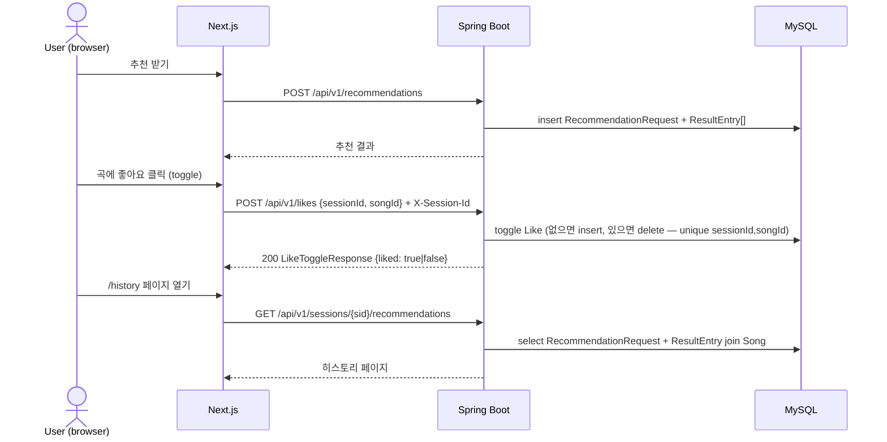

# 추천 히스토리 백엔드 동기화 & 좋아요/북마크 피드백

## 1) 개요 (What / Why)

- 현재(fe 사이클 13, #135 이후) 추천 히스토리는 **브라우저 zustand persist**로만 보존된다. 다른 기기/브라우저에서 동일한 히스토리를 볼 수 없고, localStorage가 비워지면 영구 소실된다.
- 본 기능은 (1) 추천 결과를 **백엔드에 영속화**하고 (2) 사용자가 곡에 대해 **좋아요/북마크** 액션을 남길 수 있게 한다.
- 좋아요/북마크는 v0.3+ 추천 알고리즘(ML 시그널) 입력으로 사용된다. **v0.2 단계에서는 추천 가중치에 영향을 주지 않는다.**
- 액터: 익명 sessionId 기반의 비로그인 사용자. (CLAUDE.md / 04-security-policy.md "익명 세션" 룰 적용)
- 로드맵 위치: **plan 4 roadmap §1-6 (v0.2 P2 후보)**.

## 2) 사용자 시나리오

1. **추천 → 액션**: 사용자가 음역대를 입력해 추천을 받고, 마음에 드는 곡에 좋아요를 누르거나 북마크에 담는다.
2. **다기기 히스토리 조회**: 모바일 브라우저에서 좋아요를 남긴 사용자가 PC 브라우저에서 동일한 sessionId로 접속해 `/history` 페이지에서 동일한 데이터를 본다.
   - (선결 조건) sessionId가 두 디바이스 간 공유되는 메커니즘은 본 spec 범위 외 (Q4 참조).
3. **(v0.3+) 피드백 기반 추천**: 사용자가 좋아요를 누른 곡들의 특성(난이도 분포, 장르)이 다음 추천 결과의 가중치 조정 입력으로 사용된다. — 본 spec에서는 데이터 수집까지만.

## 3) 요구사항

### 기능 요구사항

- [x] **Like 도메인**: sessionId 단위로 Song에 좋아요를 토글할 수 있다. (`Like(id, sessionId, songId, createdAt)`) 구현: `com.mobruji.feedback.domain.Like` + `LikeRepository` (PR #185).
- [x] **Bookmark 도메인**: sessionId 단위로 Song을 북마크에 담을 수 있다. (`Bookmark(id, sessionId, songId, createdAt)`) 구현: `com.mobruji.feedback.domain.Bookmark` + `BookmarkRepository` (PR #185).
- [x] `POST /api/v1/likes` — **좋아요 toggle** (body: `{sessionId, songId}`). 같은 (session, song) 재호출 시 좋아요 상태가 토글(생성 ↔ 취소). 응답: `{liked: boolean}`. 구현: be PR #185 (`LikeController.toggle()`), 인증 게이트 #429 (closes #258). **DELETE endpoint 는 코드 미존재** — 별 DELETE 대신 단일 POST toggle 채택. (§9 결정 로그 2026-05-23, ~~Q6~~ closed)
- [x] `POST /api/v1/bookmarks` — 동일 toggle 패턴 (`BookmarkController.toggle()`), 응답 `{bookmarked: boolean}`.
- [x] `GET /api/v1/sessions/{sessionId}/likes` — 해당 세션의 좋아요 목록 (Song 페이로드 join). 구현: `LikeController.list()` (PR #305).
- [x] `GET /api/v1/sessions/{sessionId}/bookmarks` — 동일 패턴. 구현: `BookmarkController.list()` (PR #305).
- [x] **추천 히스토리 백엔드 영속화**: `RecommendationRequest`(기존)에 더해 응답 결과(추천된 곡 리스트)를 영속 저장한다. spec 용어 `RecommendationResultEntry` 는 코드 상 기존 엔티티 `com.mobruji.recommendation.domain.Recommendation`(테이블 `recommendation`) 에 매핑됨 — V1 부터 (id, recommendation_request_id, song_id, score, match_reason, rank_position, created_at) 컬럼 전부 존재. (구현: PR #237)
- [x] `GET /api/v1/sessions/{sessionId}/recommendation-history` — 해당 세션의 추천 요청 + 결과 목록 (최신순). 페이지네이션은 응답 wrapper `RecommendationHistoryListResponse` 로 향후 추가 가능하도록 여지를 둔다. (구현: PR #237. spec 표의 `/recommendations` 경로 명을 voice-range-progress 의 `/voice-range-history` 와 일관되게 `/recommendation-history` 로 확정.)
- [ ] **fe 통합**: SongCard에 좋아요 버튼 추가, `/history` 페이지는 backend 우선, fallback으로 localStorage 사용.
- [x] **session-bound 인증** (§5-2-1): 모든 like/bookmark/history endpoint 에 path/body sessionId vs `X-Session-Id` 헤더 일치 검증. 누락/blank/불일치 모두 401. 사양 출처: ADR-0011. 구현 상태: recommendation-history GET (#244) / likes·bookmarks GET (#305) / likes·bookmarks **POST toggle** (#429, closes #258) 적용 완료.

### 비기능 요구사항

- **결정성 유지**: 좋아요/북마크는 **v0.2 추천 알고리즘 출력에 영향을 주지 않는다**. 시그널 수집만 한다. (v0.3+에서 명시적 ADR로 도입)
- **성능**: 좋아요 토글 p95 < 100ms (DB write 1회), 히스토리 GET p95 < 200ms (페이지당 20건 join 기준).
- **프라이버시**: sessionId 외 식별자(IP/UA 등)는 저장하지 않는다. 04-security-policy.md 준수. 로그에 sessionId 원문 노출 금지(해시 또는 prefix 마스킹).
- **관측성**: `like.created`, `like.deleted`, `bookmark.created`, `recommendation.persisted` 카운터 metric 노출.
- **ArchUnit**: `com.mobruji.recommendation.*` 패키지 경계, repository → service → controller 단방향 유지. ADR-0008 준수.
- **레이어 의존**: Like/Bookmark는 Recommendation context에 속하되, Song aggregate 참조는 ID-only (ADR-0005 §A-7 권장).

## 4) 범위 / 비범위 (중요)

### 포함

- Like / Bookmark 엔티티 + CRUD API
- 추천 히스토리(요청+결과) 백엔드 영속화 및 조회 API
- fe SongCard 좋아요 버튼, `/history` 페이지 backend 우선 전환

### 제외 (Out of Scope)

- **ML 가중치 조정 / 좋아요 기반 추천 알고리즘** — v0.3+ 별도 ADR + spec.
- **소셜 기능**: 친구의 좋아요 보기, 인기 곡 랭킹 노출, 공유 링크 — 향후 별도 spec.
- **로그인 / 계정 시스템** — sessionId 기반만. 계정 전환·머지는 v0.4+.
- **좋아요/북마크 정렬·필터·태깅** — 단순 시간순만.
- **댓글, 별점(rating 1~5)** — 본 spec은 binary action만.

## 5) 설계

### 5-1) 도메인 모델

- **신규 엔티티(Recommendation context)**
  - `Like` — `(id PK, sessionId, songId, createdAt)`. Unique constraint: `(sessionId, songId)`.
  - `Bookmark` — `(id PK, sessionId, songId, createdAt)`. Unique constraint: `(sessionId, songId)`.
  - `RecommendationResultEntry` — spec 용어. **PR C 구현 시점(2026-05-21)** 기존 엔티티 `com.mobruji.recommendation.domain.Recommendation`(테이블 `recommendation`) 가 이미 동일 schema(`id PK, recommendation_request_id, song_id, rank_position, score, match_reason, created_at`) 를 가지므로 별도 엔티티/테이블 신설 없이 기존 엔티티에 매핑하여 의미를 부여한다. 한 요청 ↔ N개 결과.
- **유비쿼터스 랭귀지 추가어** (06-domain-model.md §4 갱신 필요, PR B에서)
  - "좋아요(Like)": 사용자가 곡에 대해 긍정 시그널을 남긴 행위. **v0.2에서는 추천 가중치 비영향**.
  - "북마크(Bookmark)": 사용자가 곡을 다시 찾고 싶어 별도 큐에 담은 행위. (Q1에서 Like와의 차이 확정)
  - "추천 결과 항목(RecommendationResultEntry)": 단일 추천 요청에 대한 응답 곡 1건 + rank/score.

### 5-2) API 엔드포인트

| Method | Path                                              | 설명                                  | 인증                                                  | Req                              | Res                                       |
|--------|---------------------------------------------------|---------------------------------------|-------------------------------------------------------|----------------------------------|-------------------------------------------|
| POST   | /api/v1/likes                                     | 좋아요 **toggle** (생성 ↔ 취소)        | session-bound (§5-2-1)                                | `LikeToggleRequest` `{sessionId, songId}` | `LikeToggleResponse` `{liked: boolean}`   |
| GET    | /api/v1/sessions/{sessionId}/likes                | 세션의 좋아요 목록                    | session-bound (§5-2-1)                                | (query: page, size)              | `Page<LikeWithSongResponse>`              |
| POST   | /api/v1/bookmarks                                 | 북마크 **toggle** (생성 ↔ 제거)        | session-bound (§5-2-1)                                | `BookmarkToggleRequest` `{sessionId, songId}` | `BookmarkToggleResponse` `{bookmarked: boolean}` |
| GET    | /api/v1/sessions/{sessionId}/bookmarks            | 세션의 북마크 목록                    | session-bound (§5-2-1)                                | (query: page, size)              | `Page<BookmarkWithSongResponse>`          |
| GET    | /api/v1/sessions/{sessionId}/recommendation-history | 세션의 추천 히스토리                  | session-bound (§5-2-1) — `X-Session-Id` 헤더 = path   | (v0.2: 무페이징, 최신순 전체)    | `RecommendationHistoryListResponse`       |

- **DELETE endpoint 미존재** — like/bookmark 모두 단일 POST toggle 패턴. 클라이언트는 같은 (session, song) 쌍으로 POST 재호출하여 상태를 토글한다. 응답 body 의 `liked` / `bookmarked` boolean 으로 현재 상태를 회신한다 (200 OK). 결정 출처: be PR #185 / §9 결정 로그 2026-05-23. Q6 (DELETE 식별자 전달 방식) 는 본 결정으로 N/A 처리.
- 인증: 본 spec 의 모든 endpoint 는 **session-bound endpoint** (§5-2-1) 로 분류한다. 사양 출처: ADR-0011, 구현 패턴: `com.mobruji.auth.SessionAuthGuard` (recommendation-history #244 / like·bookmark GET #305 / like·bookmark POST toggle #429 — closes #258 모두 적용 완료).
- DTO 명명: CLAUDE.md 8) 코드 컨벤션 — API별 분리, 리스트 응답 변수명 `responses`.

#### 5-2-1) 인증/인가 (session-bound)

본 spec 의 모든 endpoint 는 **session-bound endpoint** 분류에 속한다. 정책 출처는 **ADR-0011 — Session-Bound Endpoint 인증 정책** (§Decision "적용 범위 (HTTP method 별 매핑 규칙)" 절은 POST/PUT/PATCH/DELETE 도 본 ADR 의 적용 대상임을 명시), 구현은 `com.mobruji.auth.SessionAuthGuard`. 적용 완료: recommendation-history GET #244 / like·bookmark GET #305 / like·bookmark POST toggle #429 (closes #258).

- 호출자는 path/body/query 의 `sessionId` 와 동일한 sessionId 를 **호출자 자신이 보유함**을 증명해야 한다 (= "본인 sessionId 의 like/bookmark/추천 히스토리만 본인이 조회·수정 가능").
- 증명 방식:
  - 클라이언트는 `X-Session-Id` 헤더(또는 동등한 cookie — fe 결정에 위임)로 자신의 sessionId 를 함께 전달한다.
  - 서버는 다음 매핑으로 인가한다 (ADR-0011 §Decision "적용 범위" 절 그대로):

    | Endpoint | sessionId 위치 | 검증 대상 |
    |---|---|---|
    | `GET /api/v1/sessions/{sessionId}/likes` | path | path vs header |
    | `GET /api/v1/sessions/{sessionId}/bookmarks` | path | path vs header |
    | `GET /api/v1/sessions/{sessionId}/recommendation-history` | path | path vs header |
    | `POST /api/v1/likes` (toggle) | body `{sessionId, songId}` | body vs header |
    | `POST /api/v1/bookmarks` (toggle) | body `{sessionId, songId}` | body vs header |

> DELETE 행은 의도적으로 부재한다. 단일 POST toggle 패턴 채택으로 DELETE endpoint 가 코드에 존재하지 않는다 (§5-2 표 주석, §9 결정 로그 2026-05-23).

  - 상수시간 비교: `MessageDigest.isEqual(byte[], byte[])` — string `.equals()` 금지 (timing attack 회피, admin gate #229 와 동일 패턴).
- 상태 코드 매핑 (ADR-0011 §Decision 에 따라 401 통일):
  - `X-Session-Id` 헤더 누락 / blank → **401 Unauthorized** ("missing session id")
  - 헤더와 path/body/query sessionId 불일치 → **401 Unauthorized** ("session id mismatch") — 403 이 아닌 이유는 ADR-0011 §Alternatives (D)
  - 정상 → **200/201** (해당 sessionId 의 리소스가 0건이어도 빈 배열/페이지 반환, 404 아님). POST toggle 케이스 (같은 (session, song) 재호출) 는 200 + `{liked|bookmarked: boolean}` (상태 회신).
- 로그 정책: sessionId 원문은 로그/예외 메시지/응답에 노출하지 않는다. 디버깅용으로는 prefix 8 자만 노출. `04-security-policy.md §3` 준수.
- admin 인증(#229 — `X-Admin-Token`)과는 **별 트랙**이다. 한 endpoint 가 두 인증을 동시에 요구하지 않는다.
- 향후 정식 인증(Spring Security 도입) 시에는 본 절을 ADR-0011 후속 결정으로 대체한다.

### 5-3) 외부 연동

- 없음. (Song 메타데이터는 기존 song context 내부 호출)

### 5-4) 데이터 흐름

### 5-5) DB 마이그레이션

- 신규 테이블: `likes`, `bookmarks` (PR B). `RecommendationResultEntry` 는 PR C 구현 시점에 기존 `recommendation` 테이블이 동일 schema 를 가지므로 별도 테이블 신설 없이 매핑. (V6 는 history 조회용 보조 인덱스 `ix_recommendation_request_session_created` 만 추가)
- `likes`, `bookmarks`: `UNIQUE (session_id, song_id)`, `INDEX (session_id, created_at DESC)`.
- 기존 `recommendation`: V1 에 `INDEX (recommendation_request_id, rank_position)` 보유. 추가 변경 없음.
- 마이그레이션 도구: ADR-0009 준수.
- `06-domain-model.md` §5 엔티티 / §6 ERD를 **PR B와 같은 PR에서** 갱신.

### 5-6) 프론트엔드 화면

- **SongCard** (`web/src/components/song/SongCard.tsx`): 우상단 하트 아이콘(Like) + 북마크 아이콘. 비동기 토글, 낙관적 업데이트.
- **`/history`**: 기존 zustand persist를 **backend 응답 우선**으로 전환. backend 실패/오프라인일 때만 localStorage fallback. (PR D)
- **`/likes`, `/bookmarks`** 별도 페이지는 v0.2에서 만들지 않음 — `/history` 내 탭으로만 (Q2).
- 상태 관리: React Query (ADR-0004) — `useLikes(sessionId)`, `useBookmarks(sessionId)`, `useRecommendationHistory(sessionId)` 훅.

## 6) 작업 분할 (예상 PR 리스트)

- [x] **PR A** (본 PR, #161): Feature Spec 초안 작성, `06-domain-model.md` §4 유비쿼터스 랭귀지 후보어 메모.
- [x] **PR B** (be, scope:recommendation, #185): `Like`, `Bookmark` 엔티티 + POST toggle / GET list API + E2E. 06-domain-model.md §4/§5/§6 갱신.
- [x] **PR C** (be, scope:recommendation, #237): `RecommendationResultEntry` 영속화(기존 `Recommendation` 엔티티에 매핑 — 신설 없음) + `GET /api/v1/sessions/{sid}/recommendation-history` API + V6 보조 인덱스.
- [ ] **PR D** (fe, scope:web): SongCard 좋아요/북마크 버튼 + `/history` backend 우선 전환.
- [ ] **PR E** (optional, scope:infra): 관측성 metric — `like.created` 등 카운터 등록.
- [x] **PR F** (be, scope:recommendation, ADR-0011 후속): like/bookmark POST toggle / GET endpoint 에 session-bound 인증 게이트 적용 (§5-2-1). recommendation-history GET (#244) → like·bookmark GET (#305) → like·bookmark POST toggle (#429, closes #258) 순으로 적용 완료. 동일 `SessionAuthGuard` 컴포넌트 재사용. 검증 매핑: GET → path, POST → body. **DELETE 는 코드 미존재 — 단일 POST toggle 패턴 채택** (§5-2 표 / §9 결정 로그 2026-05-23).
  - 완료 내역: #305 (GET likes/bookmarks 에 `SessionAuthGuard` + `LikeWithSongResponse`/`BookmarkWithSongResponse` Song join + offset 페이지네이션) + #429 (POST toggle 에 body sessionId vs X-Session-Id 헤더 검증, negative E2E 케이스 4건 추가).

> PR 사이즈 가이드(03-quality-gates §PR 사이즈)에 따라 PR B는 Like만, Bookmark는 별도 PR로 쪼갤 수 있다. 구현 시 판단.

## 7) 테스트 전략

- **단위 테스트**: `LikeService`, `BookmarkService`, `RecommendationHistoryService` — 중복 생성 멱등성, 존재하지 않는 songId 404, 다른 session의 like 삭제 시도 시 403/404.
- **통합 테스트(JPA slice)**: Unique constraint 위반 시 동작 검증.
- **E2E (RestAssured, 신규 엔드포인트 필수)**: 07-testing-guide §E2E 필수 룰.
  - 좋아요 생성 → 조회 → 삭제 → 재조회(빈 목록) 성공 케이스.
  - 북마크 동일 시나리오.
  - 추천 요청 → `GET /sessions/{sid}/recommendations`에 방금 요청이 노출되는지.
- **fe 테스트**: SongCard 좋아요 버튼 클릭 → React Query mutation 호출, 낙관적 업데이트 검증. `/history` backend mock 성공/실패 fallback.
- **a11y**: 좋아요 버튼 `aria-pressed`, 스크린 리더 라벨 ("좋아요", "좋아요 취소").
- **회귀 가드**: 기존 `/history` zustand 동작이 backend 비활성 시에도 깨지지 않을 것.
- **인증 E2E (§5-2-1, ADR-0011)** — 적용 완료 PR: #244 (history GET), #305 (likes/bookmarks GET), #429 (likes/bookmarks POST toggle):
  - given: sessionId=`A` 가 곡에 좋아요 1건 + sessionId=`B` 는 좋아요 0건
  - case 1: `GET /sessions/A/likes` + `X-Session-Id: A` → 200, 1건
  - case 2: `GET /sessions/A/likes` + `X-Session-Id: B` → 401, 응답에 sessionId 원문 미노출
  - case 3: `GET /sessions/A/likes` (헤더 없음) → 401
  - case 4: `POST /likes` body sessionId=`A` + `X-Session-Id: B` → 401, DB 미생성 (#429 negative case)
  - case 5: `GET /sessions/A/recommendation-history` + `X-Session-Id: A` → 200, 빈 배열 (404 아님)
  - case 6 (toggle 회귀): `POST /likes` body `{A, songX}` + `X-Session-Id: A` 2회 호출 → 1회차 `{liked: true}` + 2회차 `{liked: false}` (단일 endpoint 로 토글 검증, DELETE 부재 회귀 가드)

## 8) 오픈 질문

> 구현 전에 답이 나와야 하는 것들. 해소되면 §9 결정 로그로 이동.

| #  | 질문 | 선택지 | 담당/기한 |
|----|------|--------|-----------|
| Q1 | 좋아요와 북마크의 의미 분리 | (a) 좋아요=가중치 시그널(v0.3+), 북마크=사용자 큐 — **분리 유지** / (b) 통합해 단일 액션으로 / (c) 좋아요만 두고 북마크 제거 | @goohong / 2026-06-04 |
| Q2 | 좋아요/북마크 전용 페이지 분리 여부 | (a) `/history` 내부 탭만 / (b) `/likes`, `/bookmarks` 별도 라우트 | @goohong / 2026-06-04 |
| Q3 | 추천 결과 영속화 범위 | (a) 모든 추천 결과 곡 전체 저장 / (b) 사용자가 액션(like/bookmark/play)한 곡만 / (c) 상위 N개(예: rank ≤ 10)만 | @goohong / 2026-06-04 |
| Q4 | 익명 sessionId 다기기 공유 메커니즘 | (a) QR 페어링 / (b) URL 토큰 / (c) v0.2에서는 단일 디바이스 한정으로 두고 spec에서 제외 | @goohong / 2026-06-11 |
| ~~Q5~~ | ~~익명 sessionId 만료 정책~~ | ~~(a) 무기한 / (b) 30일 미접속 시 만료 + 데이터 soft delete / (c) 90일~~ | **closed 2026-05-22 by ADR-0013**: 180일 inactive sliding window + cascade-delete (default), 사용자 트리거 회전 endpoint 추가. like/bookmark 도 sessionId revoke 시 함께 물리 삭제. 구현 spec: `docs/features/anonymous-session-lifecycle.md`. |
| ~~Q6~~ | ~~DELETE API의 식별자 전달 방식~~ | ~~(a) body / (b) path+query~~ | **closed 2026-05-23** (plan, spec-drift-cleanup-pt1): DELETE endpoint 자체를 두지 않고 **단일 POST toggle** 채택 (be PR #185 / #429). §5-2 표·§5-2-1 매핑·§5-4 시퀀스 동기화. Q6 자체가 N/A. |
| Q7 | `POST /api/v1/recommendations` (persistence-write) 에도 session-bound 게이트 적용? | (a) 적용 (body sessionId 위조 차단, 타인 sessionId 로 위조 추천 inject 방지) / (b) 미적용 (request 자체는 익명 OK, 다른 sessionId 의 데이터 누설은 아님 — ADR-0011 적용 범위 §Decision 의 "반대 사례" 참조) | @goohong / 2026-06-04 |

## 9) 결정 로그

- **2026-05-23 (plan, spec-drift-cleanup-pt1)**: **like/bookmark 단일 POST toggle 패턴으로 spec drift 정합** — §5-2 표에서 `DELETE /likes` / `DELETE /bookmarks` 행 제거, POST 의 의미를 "생성(멱등)" → "toggle (생성 ↔ 취소)" 로 갱신, 응답 DTO 도 `LikeResponse` / `BookmarkResponse` (평면 entity) → `LikeToggleResponse` / `BookmarkToggleResponse` `{liked|bookmarked: boolean}` 으로 정정. §3 기능 요구사항 / §5-2-1 매핑 표 / §5-4 시퀀스 / §6 PR F / §7 E2E case 4 + case 6 (toggle 회귀) / §8 Q6 (closed N/A) 동기화. 실제 코드 (be PR #185, #305, #429 closes #258) 와 1:1 정합. drift 발견: rev 22 (#429 본문 "drift 노트") / 본진 등록.
- **2026-05-21**: Feature Spec 초안 작성 (status=draft). 출처: plan 15 (#160 / PR #161). v0.2 추천 알고리즘 출력에는 좋아요/북마크가 영향을 주지 않음을 명시(가중치 도입은 v0.3+ 별도 ADR로 다룸).
- **2026-05-21 (PR C, #237)**: spec 용어 `RecommendationResultEntry` 는 PR C 구현 시점 기존 엔티티 `Recommendation`(테이블 `recommendation`) 가 동일 schema 를 가지므로 신설 없이 매핑. history 엔드포인트 경로는 voice-range-progress 와 일관성 위해 `/recommendation-history` 로 확정 (spec 표의 `/recommendations` 보다 의도 명확). V6 는 `recommendation_request(session_id, created_at)` 보조 인덱스 추가만 수행 (보호 영역 → needs-human-review).
- **2026-05-22 (be 27, #244 closes #238)**: `recommendation-history` GET endpoint 에 `X-Session-Id` 헤더 인증 게이트 추가. `SessionAuthGuard` (admin gate #229 와 동일 상수시간 비교 패턴) 가 path sessionId 와 헤더 값을 비교, 누락/blank/불일치 모두 401. like/bookmark/POST 계열 인증 게이트는 후속 PR F 로 분리.
- **2026-05-22 (plan 27, ADR-0011 영속화)**: session-bound 인증 정책을 ADR-0011 로 형식화 (정책 출처를 spec 본문에서 ADR 로 이동). §5-2-1 에 상세 절 추가, 상태 코드 매핑 401 통일(#244 구현 정합), admin 트랙(#229)과 별 트랙임을 명시. 후속 like/bookmark endpoint 도 본 ADR 패턴 강제.
- **2026-05-22 (plan 29)**: §5-2-1 에 endpoint × sessionId 위치 매핑 표 추가 (GET=path, POST=body, DELETE=body 우선/없으면 query). ADR-0011 §Decision 에 "적용 범위 (HTTP method 별 매핑 규칙)" 절을 추가해 like/bookmark POST/DELETE 가 본 ADR 의 적용 대상임을 명문화. PR F 항목에 검증 매핑 + E2E case 1~5 작업 범위 추가. Q7 신설 — `POST /api/v1/recommendations` (persistence-write) 의 적용 여부 결정 대기. 후속 구현 이슈 **#261** 등록 (`feat(feedback): like/bookmark POST endpoints SessionAuthGuard 적용 — ADR-0011 후속`).
- **2026-05-22 (plan 33, ADR-0013 cross-ref)**: Q5 (익명 sessionId 만료 정책) 를 ADR-0013 (`sessionid-ttl-rotation`) 로 닫음. 180일 inactive sliding window + cascade-delete default + 사용자 트리거 회전 endpoint. like/bookmark 도 sessionId revoke 시 cascade-delete 대상. v0.4 계정 시스템(#243) 머지 시 sessionId → user_id owner 치환. 구현 가이드: `docs/features/anonymous-session-lifecycle.md`.
- **2026-05-22 (be 30, PR F 부분 — #256)**: `GET /api/v1/sessions/{id}/likes`, `/bookmarks` 에 `SessionAuthGuard` 적용 + 응답을 `Page<LikeWithSongResponse>`/`Page<BookmarkWithSongResponse>` 형태(Song join + offset 페이지네이션 wrapper)로 확정. fe `/likes`, `/bookmarks` 가시 페이지의 N+1 회피 + 응답 안정성 확보. POST/DELETE 계열 SessionAuthGuard 는 body sessionId 검증 패턴이 별도라 후속 #261 잔여. 기존 `LikeResponse`/`BookmarkResponse` 평면 DTO 는 사용처 없어 삭제 (배포 전 호환성: fe 아직 미사용).
