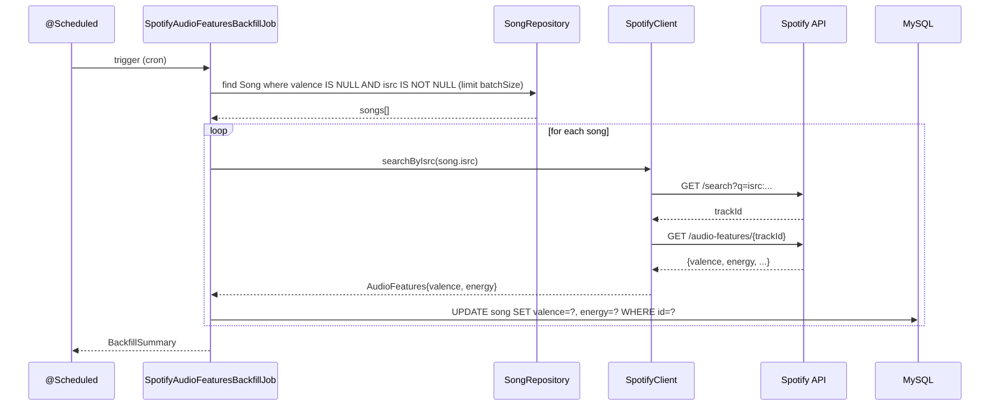

# Spotify Audio Features 통합 — mood signal (valence/energy) 보강

## 1) 개요 (What / Why)

- **v0.3 P2 (#69)**. `recommendation-algorithm-v2.md` 의 `w_popularityPrior` 신호는 현재 빈 신호 0 으로 고정 — `Song.popularityPrior` 데이터가 없어 추천 점수에 의미 기여 없음. Spotify Audio Features 의 `valence` (긍정성) / `energy` (격렬함) 를 보강해 **`moodMatch` 신호의 정밀도를 올린다**.
- **self-analysis pivot ([[project-self-analysis-pivot]], ADR-0006/0010) 과의 관계 명확화** — vocal range / key / tempo 는 `song-self-analysis-pipeline` 가 자체 추출하는 것이 결정 (외부 API 제공 안 함 또는 약관 제약). **본 spec 의 Spotify 범위는 self-analysis 가 제공하지 못하는 `valence`/`energy` 두 audio feature 만으로 한정** — key / tempo / loudness 등 self-analysis 가 채우는 필드는 Spotify 에서 가져오지 않는다. **중복·충돌 방지가 본 spec 의 핵심 안전장치.**
- 액터: 시스템 (배치 backfill) + 추천 알고리즘 (요청 시 `Song.valence`/`Song.energy` read).
- 의존: **#68 MusicBrainz** 가 먼저 ISRC 를 채워야 Spotify ISRC → Spotify Track ID 매칭 정확도가 확보된다 (`v03-roadmap.md §4 의존성 그래프`).

## 2) 사용자 시나리오 (시스템 / 운영)

사용자 직접 화면 없음. 시스템·운영 시나리오:

1. **시드 곡 backfill** — 운영자가 명령 또는 스케줄러로 `SpotifyAudioFeaturesBackfillJob` 실행 → ISRC 있는 곡들에 대해 Spotify `/v1/audio-features/{id}` 호출 → `Song.valence` / `Song.energy` 갱신.
2. **추천 요청** — 사용자가 `POST /api/v1/recommendations` 호출. `RecommendationScorer.moodMatch(song, request)` 가 `Song.valence`/`Song.energy` + `request.mood` 매핑 vector 와의 거리로 정밀 산정.
3. **신곡 추가** — 새 시드 곡 추가 시 selective backfill 로 신규 곡만 처리 (기존 `AudioAnalysisScheduledBackfill` 와 동일 selective query 패턴, ADR-0006/0010 후속 #226 와 정합).
4. **API 장애 graceful degradation** — Spotify 가 5xx 또는 rate-limit 응답 시 해당 곡은 skip + `metadataConfidence` 조정 없음 (이전 값 유지). 추천 알고리즘은 `valence`/`energy` null 인 곡에 대해 `moodMatch` fallback 신호 0.5 (중립) 사용 — 결정성 유지.

## 3) 요구사항

### 기능 요구사항

- [ ] `Song` 엔티티에 `valence` (DOUBLE, 0.0~1.0, nullable), `energy` (DOUBLE, 0.0~1.0, nullable) 필드 추가. Spotify 정의 그대로.
- [ ] Spotify Web API client (`com.mobruji.song.external.SpotifyClient`) — OAuth 2.0 **Client Credentials Flow** 로 access token 발급, `/v1/audio-features/{id}` 호출, `/v1/search` 로 ISRC → Spotify Track ID 매칭 (또는 `/v1/tracks?ids=...` batch 50건 한도).
- [ ] `SpotifyAudioFeaturesBackfillJob` — 스케줄러 또는 admin 트리거. selective query (`Song.valence IS NULL AND Song.isrc IS NOT NULL`) 로 미처리 곡만 처리. 멱등.
- [ ] Spotify rate limit 준수 — 응답 헤더 `Retry-After` 존중, 지수 backoff (1s → 2s → 4s, 최대 3회), 한도 초과 시 job skip + 다음 사이클 재시도.
- [ ] 응답 캐싱 정책 — Spotify 약관상 audio-features 는 **장기 저장 가능 (영구 보관 OK)** 으로 약관 §IV.2.a.iv 가 명시. 캐시 영속화는 `Song.valence`/`energy` 컬럼 자체로 충분, 별도 응답 캐시 없음.
- [ ] **추천 알고리즘 w4 활성화** — `RecommendationProperties.weights.moodMatch` 또는 `valenceEnergyMatch` 신호로 통합. 산식은 §5-7 + 결정 Q3. 가중치 변경은 별도 ADR (`0017-recommendation-mood-signal-source.md` — `v03-roadmap.md §4-1` 권장).
- [ ] **결정성 회귀 가드** — `Song.valence`/`energy` backfill 전후로 같은 추천 입력 → 결과 셋 비교 가드 (v2 결정성 가드 확장).
- [ ] 관측성 — `mobruji.external.spotify.request` counter (`outcome` 라벨), `mobruji.external.spotify.request.duration` timer (already specified in `observability-baseline.md §5-3` table).

### 비기능 요구사항

- **API key 관리** — `spotify.client-id` / `spotify.client-secret` 는 환경변수 (`SPOTIFY_CLIENT_ID` / `SPOTIFY_CLIENT_SECRET`) 로 binding. **`application.yml` 의 placeholder 만 보호 영역** (CLAUDE.md §4 AI 보호 영역 — `**/application*.yml`). 실제 값은 systemd `EnvironmentFile=` (운영) / `.env.local` (로컬) — 모두 git ignore.
- **약관 준수** — Spotify Developer Terms (2025-05) §IV: (a) attribution 의무 — Spotify 로고/링크 노출은 fe 에서 처리 (별 spec), (b) **`audio-features` 데이터는 derivative work 영속화 가능**, (c) **30일 1M requests 무료 한도** — 100 곡 시드면 1회 호출 100건 + 토큰 갱신 1건/시간 < 무료 한도.
- **rate limit** — `429 Too Many Requests` 응답 `Retry-After` 헤더 존중, 미설정 시 60s wait. job 단위 최대 60s 누적 대기 후 skip.
- **graceful degradation** — Spotify 장애 시 추천 알고리즘은 `valence`/`energy` null 곡에 대해 fallback 0.5 (중립). 추천 응답 자체는 200, fe 영향 없음.
- **결정성** — `RecommendationScorer` 의 mood signal 산식은 hash 가 아닌 deterministic 수치 거리 (`1 - euclidean_distance(songVec, moodVec)` 형태). 같은 입력 → 같은 결과.
- **관측성** — `observability-baseline.md §5-3` 표의 `mobruji.external.spotify.request` / `request.duration` 카운터 노출. 알림 규칙 (§5-6 외부 API 에러율 ≥5/min) 자동 적용.
- **테스트 시 외부 호출 금지** — WireMock 으로 Spotify 응답 fixture, CI 에서 실제 토큰 사용 금지.

## 4) 범위 / 비범위 (중요)

### 포함

- `Song.valence` / `Song.energy` 컬럼 신설 + Flyway 마이그레이션 (PR A).
- `SpotifyClient` (OAuth Client Credentials + audio-features endpoint + ISRC → Track ID 매칭) + selective backfill job (PR B).
- 추천 알고리즘 mood signal 산식 갱신 + 가중치 ADR + 결정성 회귀 가드 (PR C).
- 환경변수 binding + systemd `EnvironmentFile` 가이드 (PR B 의 application.yml 일부, needs-human-review).
- 관측성 카운터/timer 등록 — `observability-baseline.md §5-3` 표는 이미 명시, 본 spec PR B 에서 코드 등록만.

### 제외 (Out of Scope)

- **vocal range / key / tempo 자동 추출** — `song-self-analysis-pipeline` 가 담당. Spotify 의 `key` / `tempo` / `time_signature` 필드는 **본 spec 에서 사용하지 않는다** (self-analysis 결과와 충돌 / 중복 회피).
- **Spotify Track Preview 30s audio** — ADR-0006 에서 거부 (vocal range 추정에 부적합). 본 spec 도 audio binary 는 다루지 않는다.
- **Spotify recommendation API (`/v1/recommendations`)** — 우리 자체 추천 알고리즘 (`recommendation-algorithm-v2`) 을 그대로 유지. Spotify 의 recommendation 결과를 우리 응답에 섞지 않는다.
- **fe Spotify attribution UI** — Spotify Developer Terms §IV.2.a.i attribution (로고 + "Powered by Spotify" 링크) 노출은 fe 별 spec.
- **사용자 Spotify 로그인 / Authorization Code Flow** — 본 spec 은 server-to-server Client Credentials 만. 사용자 계정 연동은 v0.4+.
- **ML embedding 거리 기반 추천** — `recommendation-algorithm-v2.md §4 제외` 와 동일하게 v3+ spec.
- **다른 audio features (`danceability` / `loudness` / `acousticness` / `instrumentalness` / `liveness` / `speechiness`)** — 1차에서는 `valence`/`energy` 두 차원만. 추가 차원은 추천 정밀도 측정 후 별 spec.

## 5) 설계

### 5-1) 도메인 모델

- 기존 `Song` 엔티티에 추가:
  - `valence` — DOUBLE, 0.0~1.0, nullable. Spotify 정의: "musical positiveness". null → "측정 안됨" 또는 Spotify ID 없음.
  - `energy` — DOUBLE, 0.0~1.0, nullable. Spotify 정의: "perceptual measure of intensity and activity".
  - `metadataSource` enum 에 **신규 값 없음** — `valence`/`energy` 갱신만으로는 `metadataSource` 변경 없음 (이전 source 유지). 곡의 1차 source 는 그대로 `MANUAL_SEED` / `AUDIO_ANALYSIS` 유지.
- 도메인 모델 §4 유비쿼터스 랭귀지 추가 후보:
  - **valence (긍정성)** — Spotify 정의에 따른 0.0 (sad/depressed) ~ 1.0 (happy/cheerful) 척도. 본 spec 의 mood signal 입력.
  - **energy (격렬도)** — 0.0 (calm) ~ 1.0 (intense/loud) 척도. 본 spec 의 mood signal 입력.
- 도메인 모델 §5 엔티티 / §6 ERD 갱신은 PR A 의 같은 PR 에서 수행 (CLAUDE.md §4 도메인 / DDD).

### 5-2) API 엔드포인트

본 spec 은 사용자 노출 API 변경 없음. 내부 admin trigger 만 신설.

| Method | Path | 설명 | 인증 | Req | Res |
|---|---|---|---|---|---|
| POST | /api/v1/admin/songs/spotify-backfill | Spotify audio-features backfill job 즉시 트리거 | `X-Admin-Token` (#229 패턴) | (query: `dryRun=true&maxBatch=50`) | `SpotifyBackfillResponse` (`processed`, `succeeded`, `skipped`, `failed`, `elapsedMs`) |

- selective query: `Song.valence IS NULL AND Song.isrc IS NOT NULL`. `dryRun=true` 시 DB write 없이 처리 곡 수만 응답.
- 스케줄러는 별도 endpoint 없이 `@Scheduled` + cron (예: 매일 03:00 KST). cron 표현식은 `application.yml` 외부화.

### 5-3) 외부 연동

| 항목 | 값 |
|---|---|
| API base URL | `https://api.spotify.com/v1` |
| Auth | OAuth 2.0 Client Credentials (`POST https://accounts.spotify.com/api/token`, body `grant_type=client_credentials`, Basic Auth `client_id:client_secret`) |
| Token TTL | 3600 초 (1 시간). client side cache, 만료 5분 전 갱신. |
| audio-features endpoint | `GET /audio-features/{id}` (단건) 또는 `GET /audio-features?ids=id1,id2,...` (batch 100건 한도) |
| ISRC 매칭 | `GET /search?q=isrc:US12345&type=track&limit=1` → `tracks.items[0].id` |
| rate limit | 30일 sliding window 1M requests (Free tier). `429` 응답 `Retry-After` 헤더 존중. |
| 약관 | Spotify Developer Terms — audio-features 영구 저장 OK, attribution 의무 (fe 별 spec) |

#### 5-3-1) 환경변수 / 설정

```yaml
spotify:
  client-id: ${SPOTIFY_CLIENT_ID}
  client-secret: ${SPOTIFY_CLIENT_SECRET}
  base-url: https://api.spotify.com/v1
  token-url: https://accounts.spotify.com/api/token
  rate-limit:
    max-retries: 3
    backoff-ms: [1000, 2000, 4000]
  backfill:
    schedule-cron: "0 0 3 * * *"   # 매일 03:00
    batch-size: 50
    enabled: ${SPOTIFY_BACKFILL_ENABLED:false}  # 기본 off, 운영에서만 true
```

- **보호 영역**: `application.yml` / `application-prod.yml` 변경 → PR 에 `needs-human-review` 라벨.
- **운영 시크릿**: systemd `EnvironmentFile=/etc/mobruji/spotify.env` (chmod 600). `.env.example` 에 placeholder 만 commit.
- **로컬 개발**: `.env.local` (gitignore). `SPOTIFY_BACKFILL_ENABLED=false` 가 기본 — 로컬에서는 backfill 자동 실행 금지, admin endpoint 수동 트리거만.
- **boot fail-fast**: `spotify.client-id` / `client-secret` 누락 시 **`SPOTIFY_BACKFILL_ENABLED=true` 인 경우에만** 부트 실패. false 면 client bean 등록 skip — 로컬/CI 친화. (CLAUDE.md §4 "application.yml 바인딩 설정 값은 부트 fail-fast 목적으로 유지" 예외 적용.)

### 5-4) 데이터 흐름



실패 (404 ISRC not found / 5xx / timeout) 시:
- 곡 단위 skip, `mobruji.external.spotify.request{outcome=error|notfound|ratelimited}` 카운터 증가.
- summary 에 `failed[]` 누적, job 자체는 계속.
- `429` rate limit 응답 시 `Retry-After` 만큼 sleep 후 1회 재시도, 두번째 429 면 job 전체 중단 (다음 사이클 재시도).

### 5-5) DB 마이그레이션

- **V7 (예상 다음 번호 — Flyway 실제 번호는 PR 시점 확정)**: `song` 테이블에 `valence` DOUBLE NULL, `energy` DOUBLE NULL 컬럼 추가.
- 인덱스: 없음 — `valence`/`energy` 는 추천 점수 in-memory 계산에만 사용, 인덱스 효익 없음.
- 마이그레이션 도구: ADR-0009 (Flyway) 준수.
- 보호 영역 (`**/db/migration/**`) → PR A `needs-human-review` 라벨.
- `06-domain-model.md §5 엔티티 / §6 Mermaid ERD` 를 **PR A 와 같은 PR 에서** 갱신 (CLAUDE.md §4 도메인 / DDD).

### 5-6) 프론트엔드 화면

- 본 spec 범위 아님. Spotify attribution UI (로고/링크) 는 fe 별 spec — 본 spec 의 backend 작업이 머지된 후 fe 가 트리거.

### 5-7) 추천 알고리즘 mood signal 산식 (PR C)

`recommendation-algorithm-v2.md` 의 `moodBpm` 매핑과 병행하여, **mood → (valence, energy) vector** 매핑을 도입한다.

```
moodVector = {
  "신남":   (valence=0.85, energy=0.85),
  "잔잔":   (valence=0.50, energy=0.20),
  "감성":   (valence=0.35, energy=0.40),
  "신나는": (valence=0.80, energy=0.80),  // alias 처리
  ...
}

moodMatch(song, request) =
  if song.valence == null || song.energy == null:
    0.5  // 중립 fallback (graceful degradation)
  else if request.mood not in moodVector:
    0.5  // mood 미입력 또는 매핑 없음
  else:
    target = moodVector[request.mood]
    distance = sqrt((song.valence - target.valence)^2 + (song.energy - target.energy)^2)
    1.0 - min(distance / sqrt(2), 1.0)   // 0~1 정규화 (sqrt(2) = 최대 거리)
```

가중치 변경 (현 `moodMatch=0.2`, `popularityPrior=0.05` 에서 — `recommendation-algorithm-v2.md §5-2`) 는 **별 ADR 신설** (`0017-recommendation-mood-signal-source.md` — ADR-0013 은 sessionid-ttl-rotation 점유로 0017 슬롯 재할당). 본 spec 은 산식 + 컬럼만 도입하고, 가중치 활성화는 별 PR + ADR.

## 6) 작업 분할 (예상 PR 리스트)

분량/리스크 분리를 위해 **3개 PR 권장** (v03-roadmap §4 "2 PR (M+M)" 예상보다 1개 늘림 — 마이그레이션과 외부 API client 를 분리해 보호 영역 review 부담 분산).

- [ ] **PR A** (be, scope:song, needs-human-review): `Song` 엔티티 `valence`/`energy` 컬럼 + V7 Flyway 마이그레이션 + `06-domain-model.md §5/§6` 갱신. 기존 데이터는 NULL 로 backfill 됨. 추천 산식 변경 없음 (NULL → 0.5 중립 — 이전 동작 유지). E2E 회귀 가드.
- [ ] **PR B** (be, scope:song, needs-human-review): `SpotifyClient` (OAuth + audio-features + ISRC search) + `SpotifyAudioFeaturesBackfillJob` (`@Scheduled` + admin endpoint) + `application.yml` 환경변수 binding + 관측성 카운터 (`mobruji.external.spotify.*`). systemd `EnvironmentFile` 가이드 문서 (`docs/ai-harness/10-observability.md` 또는 신규 `docs/runbooks/spotify-backfill.md`).
- [ ] **PR C** (be, scope:recommendation): `RecommendationScorer.moodMatch(song, request)` 산식을 `Song.valence`/`energy` + mood vector 거리 기반으로 갱신. 가중치 조정 + ADR-0017 (`0017-recommendation-mood-signal-source.md`) 신설. 결정성 회귀 가드 확장. `recommendation-algorithm-v2.md §3 / §5` 갱신 (또는 v3 spec 으로 분리 — §8 Q5).

**의존성**: PR A → PR B → PR C 순서 권장. PR A 머지 없이 PR B 의 backfill 은 영속화할 컬럼이 없어 실패. PR B 머지 없이 PR C 는 영속 데이터가 없어 거의 모든 곡이 fallback 0.5 만 반환 (의미 없음).

**선행 의존**: **#68 MusicBrainz ISRC backfill 완료 후 본 spec 의 PR B 가 실효성 있음**. ISRC 없는 곡은 Spotify 매칭 자체가 어려움 (title/artist fuzzy 매칭은 정확도 낮음 — 본 spec 에서 제외).

## 7) 테스트 전략

- **단위 (`SpotifyClient`)** — OAuth 토큰 발급 / 만료 5분 전 갱신 / 401 시 토큰 강제 갱신 후 1회 재시도 / 429 시 `Retry-After` 존중 / 404 시 null 반환.
- **단위 (`SpotifyAudioFeaturesBackfillJob`)** — selective query / batch size / 부분 실패 시 summary 반영 / 멱등 (같은 곡 재실행 시 update 1회만).
- **단위 (`RecommendationScorer.moodMatch`)** — vector 거리 산식 경계값 (동일=1.0, 최대거리=0.0, 중간=0.5±ε), null → 0.5, mood 미매핑 → 0.5.
- **통합 (WireMock)** — Spotify `/api/token` + `/v1/audio-features/{id}` + `/v1/search` stub. 401 → 토큰 갱신 → 200 시나리오 / 429 → 60s wait 후 200 / 500 → skip.
- **결정성 회귀 (E2E)** — 같은 추천 입력 (voiceRange/mood/preferredBpm) 두 번 → 결과 셋 동일. valence/energy backfill 전후 비교는 별 가드 (backfill 전 = 모두 null = 모두 0.5, backfill 후 = 곡별 산정 — 결과 순서 변화 검증).
- **E2E (admin endpoint)** — `POST /api/v1/admin/songs/spotify-backfill?dryRun=true` + `X-Admin-Token` → 200 + 처리 곡 수. 토큰 누락/오류 → 401 (admin gate).
- **인증 E2E** — admin endpoint 만 — `X-Admin-Token` 누락 / 불일치 → 401. session-bound 게이트 무관.
- **외부 호출 금지** — CI 에서 실제 Spotify token 사용 금지. `SPOTIFY_BACKFILL_ENABLED=false` 디폴트 + WireMock 만.

## 8) 오픈 질문

> 구현 전에 답이 나와야 하는 것들. 해소되면 §9 결정 로그로 이동.

| # | 질문 | 선택지 | 담당/기한 |
|---|---|---|---|
| Q1 | mood → (valence, energy) vector 매핑 기본값 | (a) §5-7 표 그대로 / (b) 운영 데이터 수집 후 통계로 재조정 / (c) UI A/B 테스트로 결정 | @goohong / PR C 직전 |
| Q2 | ISRC 매칭 정확도 검증 — Spotify search 결과가 진짜 같은 곡인지 보증 어떻게 | (a) ISRC 일치만 신뢰 / (b) artist 이름 normalized 매칭 추가 검증 / (c) 매칭 결과를 운영자가 수동 승인 | @goohong / PR B 직전 |
| Q3 | mood signal 가중치 활성화 시점 | (a) PR C 머지 즉시 (현 `moodMatch=0.2` 유지, 산식만 변경) / (b) 별도 ADR-0017 머지 후 점진 활성화 (`0.05` → `0.2` step) / (c) feature flag 로 on/off | @goohong / PR C 직전 |
| Q4 | Spotify 매칭 실패 곡 (ISRC 없음 또는 ISRC 검색 0건) 처리 | (a) `valence`/`energy` null 유지 / (b) `metadataConfidence` 감점 / (c) `metadataSource = EXTERNAL_API_FAILED` 신규 enum 값 | @goohong / PR B 직전 |
| Q5 | 추천 알고리즘 spec 갱신 vs 분리 | (a) `recommendation-algorithm-v2.md` 본문 갱신 / (b) `recommendation-algorithm-v3.md` 신설 (v3 = audio-features 기반 mood signal 활성화) | @goohong / PR C 직전 |
| Q6 | `valence`/`energy` 외 추가 audio feature (`danceability` 등) 도입 시점 | (a) 본 spec v1 → 두 차원만 / (b) PR C 직후 곧바로 6차원 확장 / (c) 운영 데이터 1개월 누적 후 효과 측정 | @goohong / 2026-07-01 |
| Q7 | Spotify attribution UI (로고/링크) fe spec 신설 시점 | (a) PR B 머지와 동기 / (b) 별 사이클 fe spec / (c) backend 만으로 약관 위반 아닌지 법무 확인 후 결정 | @goohong / PR B 머지 직전 |

## 9) 결정 로그

> 연대기 순.

- **2026-05-22 (plan 29, 본 PR)**: 초안 작성 (status=draft). #69 트래커 등록. self-analysis pivot (ADR-0006/0010) 과의 정합성 명시 — Spotify 범위는 `valence`/`energy` 두 차원만, key/tempo 는 self-analysis 가 담당, vocal range 는 외부 API 제공 안 함 (변경 없음). 의존 #68 MusicBrainz ISRC backfill 선행 (`v03-roadmap.md §4-1`). 가중치 변경은 별 ADR (당시 0013 슬롯 예약, plan 33 이후 0017 슬롯으로 재할당) 신설 권장. observability counter 는 `observability-baseline.md §5-3` 표에 이미 등재 — 본 spec PR B 에서 코드 등록만.
