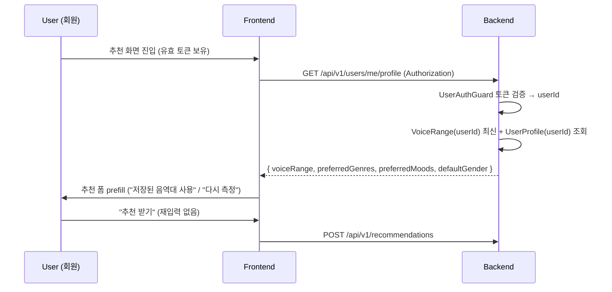

# 사용자 인증 메커니즘 + 영속 프로필 (소셜/이메일 + 음역대·선호 영속)

## 1) 개요 (What / Why)

- 현재(v0.3) mobruji 는 **회원 개념이 없다**. 음역대는 추천 요청마다 다시 전달하고, 좋아요/북마크/추천 히스토리는 익명 `sessionId` 위에서만 영속된다 (ADR-0011 session-bound 인증 + ADR-0013 sessionId TTL/회전). 디바이스를 바꾸거나 쿠키를 지우면 모든 데이터가 사라진다.
- 본 spec 은 **인증 메커니즘(authentication mechanism)** 과 **영속 사용자 프로필(persistent user profile)** 의 단일 진실(SoT)이다. 즉 "어떻게 로그인/회원가입을 처리하고, 무엇을 영속하는가" 를 다룬다. 대상 액터: 비회원 사용자, 회원 사용자, be(인증 인프라/엔티티), fe(로그인 UI/프로필 prefill), infra(OAuth client/시크릿 운영).
- **issue #1491 의 핵심 가치**: 재방문 사용자가 음역대·선호를 **다시 입력하지 않아도** 추천 흐름에 진입하도록, 음역대 + 선호(장르/분위기)를 회원 프로필로 영속한다.
- **경계 (중복 방지 — 본 spec 의 단일 진실 범위)**:
  - 본 spec = **HOW**: 인증 토큰/세션 방식, OAuth 콜백/redirect 보안, `User` 엔티티 + 프로필 영속 스키마, 게스트→회원 단계적 도입.
  - `anonymous-to-account-conversion.md` = **WHEN/WHY + 머지**: 비회원/회원 기능 매트릭스, 전환 트리거(좋아요/북마크 모달), `sessionId → user_id` 데이터 머지 알고리즘·충돌 케이스. **머지 알고리즘은 그 spec + ADR-0013 §D-4 가 SoT** — 본 spec 은 참조만 하고 재명세하지 않는다.
  - 두 spec 은 같은 v0.4 계정 시스템(#243)의 두 측면이며, 모든 정책 충돌 시 위 경계로 SoT 를 판정한다.

## 2) 사용자 시나리오

- **(S1) 재방문 회원, 재입력 없음**: 회원 A 가 한 달 만에 재접속 → 로그인(또는 유효 토큰 보유) → 추천 화면 진입 시 **저장된 음역대(`lowMidi`/`highMidi`)와 선호(장르/분위기)가 자동 prefill** → 사용자는 "추천 받기" 만 누른다. (issue #1491 핵심 가치)
- **(S2) 비회원 첫 진입, 인증 벽 없음**: 비회원 B 가 처음 접속 → 음역 측정 → 추천 → 결과 확인까지 **로그인 화면 전혀 없음** (`anonymous-to-account-conversion.md` S1 정책 그대로). 본 spec 의 인증은 게스트 흐름을 막지 않는다.
- **(S3) 소셜 로그인으로 첫 회원 전환**: 비회원 B 가 좋아요 클릭 → 로그인 모달 → "카카오로 로그인" → OAuth 동의 → 콜백 → `User` upsert + 토큰 발급 + (현재 sessionId 의 음역대/히스토리 머지) → 좋아요 반영. **OAuth 첫 로그인 시 계정 자동 생성** (별도 회원가입 단계 없음).
- **(S4) 이메일 회원가입**: 사용자 C 가 이메일/비밀번호로 가입 → 인증 메일 → 인증 완료 후 로그인 가능. 이메일은 OAuth 대비 후순위(§8 Q1, `anonymous-to-account-conversion.md` Q1 과 동일 결정 따름).
- **(S5) 토큰 만료**: 회원 A 의 access token 만료 → refresh token 으로 silent 재발급(성공 시 무중단) → refresh 도 만료면 로그아웃 + 다음 보호 액션 시 로그인 모달.
- **(S6) 프로필 수동 갱신**: 회원이 마이페이지에서 선호 장르/분위기를 수정 → 다음 추천부터 반영. 음역대는 재측정 흐름(voice-range)으로 갱신되며 측정 시 프로필에도 반영(시계열은 `VoiceRangeSnapshot` 그대로).

## 3) 요구사항

### 기능 요구사항

#### A) 인증 메커니즘
- [ ] Spring Security 정식 도입 — ADR-0011 의 임시 `SessionAuthGuard` 게이트를 **보완**하되 즉시 대체하지 않는다(게스트 흐름은 sessionId 인증 유지). 회원 전용 보호 endpoint 만 신규 토큰 인증.
- [ ] 소셜 로그인 2종(카카오/구글) — OAuth 2.0 Authorization Code Flow. provider 콜백에서 `User` upsert(`provider` + `providerUserId` unique).
- [ ] 이메일 회원가입/로그인 — 비밀번호 해시(BCrypt/Argon2 — §8 Q2) + 이메일 인증. OAuth 보다 후순위.
- [ ] 토큰 기반 세션 — 발급/검증/갱신/무효화(로그아웃). 방식(JWT vs server-side session) 은 §8 Q3 = `anonymous-to-account-conversion.md` Q2 와 단일 결정(별 ADR).
- [ ] 회원 전용 endpoint 게이트 — `UserAuthGuard`(신설). 미인증 호출 시 401. 게스트 endpoint 는 기존 `SessionAuthGuard` 유지(두 가드 공존, 한 endpoint 가 둘 다 요구하지 않음 — ADR-0011 트랙 분리 원칙 계승).

#### B) 영속 사용자 프로필 (issue #1491 핵심)
- [ ] `User` 엔티티 — 인증 식별(`provider`/`providerUserId`/`email`) + 표시(`displayName`).
- [ ] `UserProfile` — 재방문 prefill 을 위한 선호 영속. 필드: 선호 장르(다중), 선호 분위기(다중), 기본 성별(추천 입력용, nullable). **음역대는 별도 영속하지 않고** 기존 `VoiceRange`(현재값)/`VoiceRangeSnapshot`(시계열)을 `userId` owner 로 재사용한다(머지 후 owner 치환 — `anonymous-to-account-conversion.md` §3-D).
- [ ] prefill API — 회원이 추천 화면 진입 시 `GET /api/v1/users/me/profile` 로 음역대(VoiceRange) + 선호(UserProfile)를 한 번에 조회, fe 가 추천 폼에 채운다.
- [ ] 선호 갱신 — `PUT /api/v1/users/me/profile` 로 장르/분위기/성별 수정.
- [ ] **재입력 불필요 보장**: 회원의 마지막 음역대가 존재하면 추천 폼은 측정 단계를 건너뛸 수 있어야 한다(fe 가 "저장된 음역대 사용" / "다시 측정" 선택지 제공).

#### C) 게스트 → 회원 단계적 도입 (호환 유지)
- [ ] **단계 0 (현 상태 유지)**: 모든 게스트 흐름(음역 측정/추천/히스토리)이 sessionId 로 그대로 동작. 본 spec 도입이 게스트 기능을 깨지 않는다(회귀 가드).
- [ ] **단계 1 (인증 인프라)**: Spring Security + `User`/`UserProfile` 엔티티 + 토큰 발급. 게스트 endpoint 무영향.
- [ ] **단계 2 (로그인/회원가입 UI + 프로필 prefill)**: 로그인 모달/페이지 + 프로필 조회/prefill. `anonymous-to-account-conversion.md` PR C/D 와 정렬.
- [ ] **단계 3 (머지)**: 로그인 시 sessionId 데이터 owner 치환 — `anonymous-to-account-conversion.md` §3-D 알고리즘 호출(본 spec 재명세 X).
- [ ] **단계 4 (디바이스 동기화)**: 회원 데이터 user-scope 조회 — `anonymous-to-account-conversion.md` PR F.
- [ ] 각 단계는 독립 배포 가능하며 이전 단계 미완 시에도 게스트 흐름은 항상 동작한다.

### 비기능 요구사항
- **보안 (issue #1491 "보안/시크릿 신중")**:
  - OAuth client id/secret, JWT/세션 secret, 토큰 만료 시간 모두 `application.yml` 외부화 + 환경변수 주입. **하드코딩 금지** (`04-security-policy.md`). 보호 영역 변경(§6).
  - OAuth `redirect_uri` 화이트리스트 — 운영/dev 정확 일치만 허용(open redirect 차단). `state` 파라미터로 CSRF 방지, 콜백에서 `state` 검증.
  - 비밀번호는 평문 저장 금지(해시 only). 토큰/시크릿/비밀번호/sessionId 원문은 로그/예외/응답에 노출 금지(prefix 마스킹만 — ADR-0011 계승).
  - access token short-lived + refresh token 분리. refresh 토큰은 HttpOnly + Secure cookie 권장(XSS 토큰 탈취 방어) — 최종은 §8 Q3 ADR.
  - 시크릿 회귀 방지는 `secret-scanning-hook.md` 의 pre-commit + CI 스캔 게이트로 강제.
- **결정성**: 인증 도입이 추천 점수 산식에 영향 없음(프로필 prefill 은 입력 편의이지 알고리즘 변경 아님). 회귀 가드.
- **응답시간**: 토큰 검증 p95 ≤ 5ms(in-memory/JWT 서명 검증). 프로필 prefill 조회 p95 ≤ 100ms. 로그인+머지 통합 p95 ≤ 500ms(`anonymous-to-account-conversion.md` §3 그대로).
- **관측성**: `mobruji.account.login{provider}`, `mobruji.account.signup{provider}`, `mobruji.auth.token.refresh`, `mobruji.auth.token.rejected{reason}` 카운터 신설(`observability-baseline.md §5-3` 표 동반 갱신). 머지 카운터(`mobruji.session.merged`)는 `anonymous-to-account-conversion.md` SoT.
- **개인정보**: OAuth 수집 범위 최소화(§8 Q5) — sub/email/displayName 외 프로필 미수집. 음역대·선호는 서비스 기능 데이터로 사용자 본인만 조회.

## 4) 범위 / 비범위 (중요)

### 포함
- 인증 메커니즘(Spring Security 도입 형태, 토큰 발급/검증/갱신/무효화, `UserAuthGuard`).
- 소셜(카카오/구글) OAuth 콜백 + redirect 보안 사양.
- 이메일 회원가입/로그인 골격(상세 메일 인프라는 별 ADR).
- `User` + `UserProfile` 엔티티 설계 + `06-domain-model.md` 갱신.
- 영속 프로필 조회/갱신 + 추천 폼 prefill 흐름.
- 게스트→회원 단계적 도입(호환 유지) 로드맵.

### 제외 (Out of Scope)
- **전환 트리거 정책 / 비회원·회원 기능 매트릭스 / 머지 알고리즘** — `anonymous-to-account-conversion.md` SoT. 본 spec 은 참조만.
- **토큰 방식 최종 결정(JWT vs session)** — 별 ADR(§8 Q3 = `anonymous-to-account-conversion.md` Q2 단일 결정).
- **이메일 발송 인프라(SES/SendGrid/Resend)** — 이메일 활성화 시 별 ADR(`anonymous-to-account-conversion.md` PR H).
- **계정 탈퇴 / 비밀번호 재설정 / 이메일 변경** — v0.4 P2~P3 별 spec.
- **2FA / passkey / SSO / 소셜 친구** — v0.5+.
- **OAuth provider 개발자 콘솔 등록 절차** — 운영 런북(별 문서 또는 인프라 PR).

## 5) 설계

### 5-1) 도메인 모델

신규 엔티티 2개(`User`, `UserProfile`) + 기존 sessionId-bound 엔티티 owner 확장(`anonymous-to-account-conversion.md` §5-1 의 dual-column 권장안 계승 — 본 spec 은 owner 확장 방식을 재결정하지 않는다).

```
User
├─ userId           : BIGINT, PK, AUTO_INCREMENT
├─ provider         : VARCHAR(16) NOT NULL  (KAKAO / GOOGLE / EMAIL)  enum OAuthProvider
├─ providerUserId   : VARCHAR(128) NOT NULL  (OAuth sub / 이메일이면 email)
├─ email            : VARCHAR(255) NULL  (provider=EMAIL 이면 NOT NULL)
├─ passwordHash     : VARCHAR(255) NULL  (provider=EMAIL 한정, BCrypt/Argon2)
├─ displayName      : VARCHAR(64)  NULL
├─ emailVerified    : BOOLEAN NOT NULL DEFAULT false  (EMAIL 인증 상태)
├─ createdAt        : TIMESTAMP NOT NULL
├─ lastLoginAt      : TIMESTAMP NULL
├─ revokedAt        : TIMESTAMP NULL  (탈퇴 — v0.4 후속)
└─ UNIQUE (provider, providerUserId)

UserProfile   (User 1:1, prefill 용 선호 영속)
├─ userId            : BIGINT, PK, FK → User.userId
├─ preferredGenres   : 다중 (별 join table user_preferred_genre 또는 @ElementCollection)
├─ preferredMoods    : 다중 enum Mood (user_preferred_mood)
├─ defaultGender     : VARCHAR(8) NULL  (추천 입력 편의, nullable)
├─ updatedAt         : TIMESTAMP NOT NULL
```

- **음역대는 UserProfile 에 중복 저장하지 않는다** — 기존 `VoiceRange`(현재값)/`VoiceRangeSnapshot`(시계열)을 `userId` owner 로 재사용. prefill 은 user 의 최신 `VoiceRange` 1건을 읽는다(머지 후 owner=userId).
- `06-domain-model.md` 갱신 항목(본 PR 동반):
  - §4-1 유비쿼터스 랭귀지: `User`, `OAuthProvider`, `UserProfile`, `사용자 프로필(선호)` 등재. (`AccountMerge` 는 이미 등재됨 — 변경 없음.)
  - §5 엔티티: `User`, `UserProfile` 행 추가.
  - §6 Mermaid ERD: `User`/`UserProfile` 노드 + sessionId-bound 엔티티의 user owner 표기 cross-ref.
  - (§7 오픈 이슈는 손대지 않음 — `feedback_domain_model_section_7` 룰. 단, D4 "회원가입 필수 vs 익명 시작" 은 본 spec + `anonymous-to-account-conversion.md` 로 해소 방향이 정해졌음을 §9 결정 로그에 기록.)

### 5-2) API 엔드포인트

> OAuth/이메일/로그아웃/me endpoint 는 `anonymous-to-account-conversion.md` §5-2 와 **동일 표면** — 중복 정의를 피하기 위해 본 표는 인증 메커니즘 + 프로필 관점의 **신규/보강 항목만** 명시한다.

| Method | Path | 설명 | 인증 | Req | Res |
|---|---|---|---|---|---|
| GET | `/api/v1/users/me/profile` | 음역대(VoiceRange) + 선호(UserProfile) prefill 조회 | 회원 | — | `{ voiceRange: {lowMidi, highMidi, sourceMethod}?, preferredGenres[], preferredMoods[], defaultGender? }` |
| PUT | `/api/v1/users/me/profile` | 선호(장르/분위기/성별) 갱신 | 회원 | `{ preferredGenres[], preferredMoods[], defaultGender? }` | 200 + 갱신본 |
| POST | `/api/v1/auth/token/refresh` | refresh 토큰으로 access 재발급 | refresh 토큰 | refresh(cookie/body) | `{ accessToken, expiresIn }` |

- OAuth login/callback, email signup/login, logout, me 는 `anonymous-to-account-conversion.md` §5-2 SoT. 본 spec 구현 PR 은 그 표를 따른다.
- 회원 전용 endpoint 는 `UserAuthGuard` 적용. 게스트 endpoint(`/sessions/{id}/*`)는 `SessionAuthGuard` 유지.

### 5-3) 외부 연동
- **카카오 OAuth** (kauth.kakao.com) / **구글 OAuth** (Google Cloud Console) — client id/secret 운영·dev 분리, `redirect_uri` 화이트리스트 정확 일치. `state` CSRF 검증.
- **이메일 메일 발송** — 별 ADR(SES/SendGrid/Resend). 활성화 전까지 이메일 가입 비활성.
- 실패 처리: OAuth code 교환 실패 / provider 응답 이상 → fe 토스트("로그인에 실패했습니다") + 흐름 유지. `external-api-fallback.md` 의 타임아웃/재시도 패턴 준용.

### 5-4) 데이터 흐름 / 시퀀스 (재방문 prefill — 본 spec 고유 흐름)



- 로그인 + sessionId 머지 시퀀스는 `anonymous-to-account-conversion.md §5-4` SoT.

### 5-5) DB 마이그레이션 (Flyway)

```
V<next>__create_user.sql            -- anonymous-to-account-conversion.md §5-5 와 동일 (User). 중복 생성 금지 — 두 spec 중 먼저 머지되는 PR 이 소유, 다른 spec 은 참조.
V<next+1>__create_user_profile.sql  -- UserProfile + user_preferred_genre / user_preferred_mood
V<next+2>__add_user_id_to_owned_entities.sql  -- anonymous-to-account-conversion.md §5-5 SoT (voice_range 등 6개 테이블 user_id 컬럼)
```

- **마이그레이션 SoT 충돌 방지**: `create_user` + `add_user_id` 마이그레이션은 `anonymous-to-account-conversion.md` §5-5 가 SoT. 본 spec 은 `create_user_profile` 만 신규로 소유한다. 구현 시 두 spec 의 PR 순서를 nmae 가 조정(머지 알고리즘 PR 보다 엔티티 PR 선행).
- 보호 영역(Flyway migration + application.yml + build.gradle) — §6 참조.

### 5-6) 프론트엔드 화면
- 로그인 모달/페이지/OAuth 콜백 라우트 / `useAuth` hook / auth store 는 `anonymous-to-account-conversion.md §5-6` SoT.
- 본 spec 고유 fe 작업:
  - **추천 폼 prefill** — 회원이면 `GET /users/me/profile` 로 음역대/선호 채움. "저장된 음역대 사용" vs "다시 측정" 토글.
  - **마이페이지 프로필 편집** — 선호 장르/분위기/성별 수정(`PUT /users/me/profile`).
  - **토큰 갱신 interceptor** — access 만료(401) 시 refresh 자동 호출 → 실패 시 로그아웃 + 로그인 모달.

## 6) 작업 분할 (예상 PR 리스트)

> 본 spec(PR 0)은 plan 트랙. 구현은 v0.4. `anonymous-to-account-conversion.md` PR A~I 와 **상호 보완** — 아래는 본 spec 이 추가로 소유하는 작업(프로필 영속/prefill/토큰 갱신)만. 인증 인프라/머지/모달은 그 spec PR 이 SoT.

- [ ] **PR 0 (현 PR, plan)**: 본 spec 신설 + `06-domain-model.md` §4·§5·§6 갱신(`User`/`UserProfile`) + `anonymous-to-account-conversion.md` 에 본 spec cross-ref 1줄 추가 + #1491 본문에 spec 링크.
- [ ] **PR P1 (be, v0.4)**: `UserProfile` 엔티티 + `V<next+1>__create_user_profile.sql`. (`User` 엔티티는 `anonymous-to-account-conversion.md` PR B 가 SoT — 선행 의존.)
- [ ] **PR P2 (be, v0.4)**: `GET/PUT /api/v1/users/me/profile` endpoint + `UserAuthGuard` 적용 + 프로필 prefill 응답 DTO. prefill 카운터/관측성.
- [ ] **PR P3 (fe, v0.4)**: 추천 폼 prefill(저장된 음역대/선호 자동 채움 + "다시 측정" 토글).
- [ ] **PR P4 (fe, v0.4)**: 마이페이지 프로필 편집 + 토큰 갱신 interceptor.
- [ ] **PR P5 (plan/ADR, v0.4)**: 토큰 방식(JWT vs session) ADR — `anonymous-to-account-conversion.md` Q2 와 단일 결정. 인증 인프라 PR(그 spec PR A) 착수 직전.

### 보호 영역 변경 여부 (필수 명시)

- 보호 영역 변경 여부: ☑ 있음 (구현 PR 단계 — 본 plan PR 0 자체는 docs only, 변경 없음)
  - `**/db/migration/**` — `create_user_profile.sql` 신규(PR P1).
  - `**/application*.yml` — OAuth client/secret, 토큰 secret/만료 외부화(인증 인프라 PR, `anonymous-to-account-conversion.md` PR A SoT).
  - `backend/build.gradle` — Spring Security / OAuth client / 토큰 라이브러리 의존성 추가(인증 인프라 PR).
  - rev 사이클이 위 PR 들에 추가 신중도(환경별 회귀 / 시크릿 스캔) 가중.

## 7) 테스트 전략
- **단위**: `UserAuthGuard` 토큰 검증/만료 거부 / refresh 재발급. `UserProfile` 도메인 불변식(선호 다중 정규화 nullable→[]). prefill 조회 — VoiceRange 없는 회원이면 voiceRange=null.
- **통합**: `create_user_profile` 마이그레이션 정합성. `GET/PUT /users/me/profile` — 토큰 없으면 401, 본인 프로필만 조회/수정. OAuth 콜백 mock → User upsert.
- **E2E (RestAssured, 신규 endpoint 필수)**: 로그인 → `GET /users/me/profile` prefill 성공(음역대+선호 반환) → `PUT` 갱신 → 재조회 반영. 비회원 호출 401.
- **fe**: 추천 폼 prefill 렌더(저장된 음역대 표시 / "다시 측정" 토글). 토큰 만료 시 refresh interceptor 동작. 마이페이지 선호 편집 저장.
- **회귀 가드**: 인증 도입 전후 게스트 흐름(음역 측정/추천/히스토리) E2E 동일 통과 — 단계적 도입 §3-C 검증.
- mock 전략: OAuth provider 는 콜백 endpoint mock(provider 응답 stub), 이메일 발송은 no-op stub.

## 8) 오픈 질문

| # | 질문 | 선택지 | 담당/기한 |
|---|---|---|---|
| Q1 | OAuth provider 우선순위 + 이메일 활성화 시점 | (a) 카카오+구글 우선, 이메일 v0.4 후순위(default, `anonymous-to-account-conversion.md` Q1 정렬) / (b) 셋 다 동시 / (c) 이메일 먼저 | @goohong / 인증 인프라 PR |
| Q2 | 이메일 비밀번호 해시 알고리즘 | (a) BCrypt(Spring 기본) / (b) Argon2id(권장) | @goohong / 이메일 PR |
| Q3 | 토큰 방식 (= `anonymous-to-account-conversion.md` Q2 단일 결정) | (a) JWT(Bearer) + refresh cookie / (b) server-side session cookie / (c) hybrid | @goohong / PR P5 ADR |
| Q4 | 프로필 음역대 prefill 신뢰도 — 마지막 측정이 오래됐을 때 | (a) 무조건 prefill + "다시 측정" 토글(default) / (b) N일 경과 시 재측정 권장 배너 / (c) 항상 재측정 | @goohong / PR P3 |
| Q5 | OAuth 수집 범위 | (a) 최소(sub/email) / (b) email+displayName(default) / (c) profile 전체 | @goohong / 인증 인프라 PR |
| Q6 | `UserProfile.defaultGender` 도입 여부 — 현재 추천에 gender 입력 미영속 | (a) nullable 컬럼 선반영(default) / (b) 추천이 gender 를 정식 입력으로 채택할 때 도입 | @goohong / PR P1 |

## 9) 결정 로그
- **2026-06-03 (plan, 본 PR / #1491)**: 초안 작성 (status=draft).
  - **경계 결정**: 인증 **메커니즘 + 영속 프로필** = 본 spec SoT. **전환 정책 + 머지 알고리즘** = `anonymous-to-account-conversion.md` SoT. 두 spec cross-ref 로 중복·드리프트 방지.
  - **영속 프로필 결정(#1491 핵심)**: 재방문 재입력 제거를 위해 `UserProfile`(선호 장르/분위기/성별) 신규 + 음역대는 기존 `VoiceRange`/`VoiceRangeSnapshot` 을 user owner 로 재사용(중복 저장 안 함). prefill = `GET /users/me/profile`.
  - **단계적 도입**: 게스트 흐름 무중단(단계 0) → 인증 인프라(1) → 로그인 UI+prefill(2) → 머지(3) → 디바이스 동기화(4). 각 단계 독립 배포, 게스트는 항상 동작.
  - **보안**: 시크릿 외부화 + OAuth redirect 화이트리스트 + state CSRF + 비밀번호 해시 + 토큰 마스킹 로깅 + secret-scanning 게이트.
  - **마이그레이션 SoT 분리**: `create_user`/`add_user_id` 는 `anonymous-to-account-conversion.md`, `create_user_profile` 는 본 spec 소유. nmae 가 PR 순서 조정.
  - **`06-domain-model.md` §7 D4 방향**: "회원가입 필수 vs 익명 시작" 은 본 spec + 정책 spec 으로 **익명 1순위 + 가치 지점 전환** 방향 확정(§7 표 자체는 canonical 이라 미편집).
